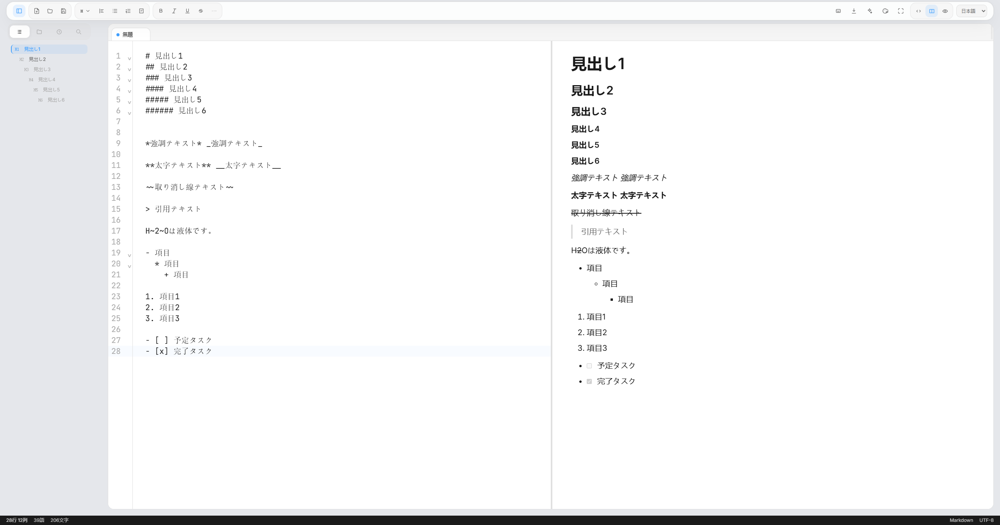

# no.1-markdown-editor
No.1 Markdown Editor, Free Forever

Project mission and execution principles are defined in `AGENTS.md`.

## Screen

## Install

Install latest package from [releases](https://github.com/engchina/no.1-markdown-editor/releases).

- No.1.Markdown.Editor_x.x.x_x64-setup.exe
- No.1.Markdown.Editor_x.x.x_x64_en-US.msi

## Development

- Run `npm install` in each OS environment before invoking Tauri. The `@tauri-apps/cli` package uses platform-specific optional dependencies, so reusing `node_modules` between Windows, WSL/Linux, and macOS can break the native binding.
- Run `npm run dev` to start the desktop app in Tauri dev mode. Frontend edits hot-reload through Vite, and `src-tauri` changes restart the Rust app automatically.
- Run `npm run dev:web` if you only need the browser-based Vite preview.
- Run `npm run package:win` on Windows.
- Run `npm run package:mac` on macOS.
- Run `npm run test:ai:smoke` to exercise command palette AI execution, sidebar AI entry, selection bubble flows, explicit `@note` / `@heading` / `@search` mention resolution, structured workspace note attachments, inline ghost text continuation, AI provenance markers, settings fallback, request cancellation, apply paths including `Insert Under Heading` and `New Note`, undo behavior, and source/split/preview/focus/WYSIWYG mode compatibility against a built local preview.
- Run `npm run test:ai:integration:smoke` to run the main AI integration smoke plus the keyboard-only AI smoke in one pass against a built local preview.
- Run `npm run test:ai:i18n:smoke` to verify the AI-related UI labels and layout in English, Japanese, and Chinese against a built local preview.
- Run `npm run test:ai:keyboard:smoke` to verify the keyboard-only `Ctrl/Cmd+J -> Run -> Apply` path, streamed draft preview isolation before apply, and editor focus return against a built local preview.
- Run `npm run test:ai:manual:qa:capture` to regenerate the locale/mode QA artifact set under `output/playwright/ai-manual-qa/`.

## AI Composer

Current AI support is desktop-first and still in progress.

- Open the composer with `Ctrl/Cmd+J`.
- Use the selection bubble for quick actions when text is selected.
- Type `/ai`, `/continue`, `/translate`, `/rewrite`, or `/summarize` in the editor to open AI actions from slash autocomplete.
- Use the prompt library cards in the AI Composer or sidebar AI tab to reuse common AI prompt starters.
- Use `Insert Under Heading` from the AI prompt library or command palette when you want AI output to land at the end of the current heading section.
- Use `New Note` as an AI output target, or from the command palette/prompt library, when the result should become a separate draft note instead of mutating the current document.
- Use explicit prompt mentions like `@note`, `@heading`, and `@search(query)` when you want to attach a visible extra note, heading section, or search result set to the AI request.
- Use the `Workspace Context` section in the AI Composer to attach the current note or search for other notes without typing the `@note(...)` token manually.
- Use the `Workspace Run` template or `AI: Workspace Run` command when you want AI to draft a coordinated multi-note execution plan with per-note draft tasks.
- Use `Run Agent` when you want the reviewed workspace plan to execute sequentially with visible session metrics, per-task logs, phase summaries, and an explicit stop control.
- When a `create-note` task produces a draft that a later task explicitly depends on, the later update task now continues on that same draft automatically as long as the draft has not been manually diverged.
- Workspace tasks that are only waiting on earlier tasks now show an explicit waiting state instead of blending into the generic review bucket.
- Dependency cycles are now detected explicitly, and the agent now reports a stalled phase when every remaining task is only waiting on other workflow prerequisites.
- Phase order is now validated before execution, so a task that depends on a later phase is surfaced as a plan issue instead of failing halfway through the run.
- Restarting `Run Agent` now preserves tasks already marked done, so you can manually unblock the remaining plan and then continue from the unfinished tasks instead of replaying the entire run.
- Completed task cards and resumed agent logs now distinguish between manual applies, draft-open completions, and tasks finished by the agent, while the top-level metrics stay aggregated at `By Agent / Manual`.
- Related-history retrieval and workspace handoff now prefer AI runs that actually produced workspace execution activity, not just similar prompt text.
- Use `Session Details` in the AI sidebar to review persisted document AI runs, pin important ones, tune retention, export or import history archives, save named collections or saved views, assign collection-level retrieval policies, apply saved-view retrieval presets, run saved-view automation explicitly or on apply, search semantically related runs across other documents, optionally re-rank visible candidates with your configured provider, preview the outbound payload in detail, filter or compare recent provider ranking audit entries that now travel with history archives, inspect audit insights, replay prior audit contexts, export audit reports, hand the strongest related notes directly into a `Workspace Run` draft, and resolve ambiguous workspace execution targets before running them.
- Use the workspace task cards to explicitly execute note updates or open per-note draft files one by one.
- Use `AI: Ghost Text Continuation` from the command palette when you want a short inline continuation preview at the cursor. Accept it with `Tab` or dismiss it with `Escape`.
- AI-inserted content now gets a provenance marker in the editor so generated inserts stay identifiable while you keep editing.
- Configure the provider from the appearance/settings panel.

### Current provider support

- OpenAI-compatible `chat/completions` endpoint
- Base URL
- Model
- API key
- Optional project header

### Security and environment notes

- API keys are stored through the desktop keyring integration, not in the persisted frontend settings store.
- Desktop-only provider configuration is currently required for real AI requests.
- `npm run dev:web` can render the UI, but it should be treated as a fallback environment for AI because desktop secret storage and desktop request execution are not available there.

### Current AI feature status

Implemented now:

- Composer overlay
- Sidebar AI tab
- Selection bubble quick actions
- Command palette AI commands
- Slash-triggered AI commands
- Prompt/template library
- Insert Under Heading flow
- New Note flow
- Explicit `@note` / `@heading` / `@search` context mentions
- Structured multi-file context note picker
- Reviewable workspace run draft tasks
- Controlled workspace note execution actions
- Autonomous workspace agent execution with session status and logs
- Workspace task dependency sequencing and prerequisite gating
- Phase-aware workspace task grouping and phase-by-phase agent sequencing
- Direct draft handoff from `create-note` tasks into dependent `update-note` tasks when the tracked draft has not drifted
- Explicit cycle detection and stalled-phase reporting for workspace task orchestration
- Sidebar session history with recent runs, cross-document retrieval, and prompt reuse
- AI history persistence across restarts with path/draft thread continuity
- History retention presets, pinned runs, and stronger local semantic related-history retrieval
- AI history export/import workflows
- Named history collections and saved views
- Saved-view-driven retrieval presets
- Optional provider-backed reranking for visible history results
- Provider-backed retrieval settings, usage controls, and explicit cost/privacy budgeting
- Collection-specific retrieval policies
- Richer provider payload preview and local usage audit trail
- Exportable provider audit records through history archives
- Audit filtering and compare workflows
- Audit insights and context replay workflows
- Exportable audit reports
- Direct history-to-workspace handoff from current views and saved views
- Workspace-run preflight and conflict simulation
- Saved-view-triggered automation on apply plus explicit automation runs
- Stronger target-resolution confidence for workspace execution
- User-resolvable workspace target disambiguation
- Optional ghost text continuation
- Authorship / provenance markers for AI-inserted content
- Keyboard-only open/run/apply smoke coverage
- Per-document thread identity
- Streamed draft preview in the composer
- Draft / Markdown-aware Diff / Explain result views
- Replace / At Cursor / Insert Below / New Note apply flows
- Frontend cancel flow plus desktop request cancellation

Future enhancements outside the current integration scope:

- Broader saved-view automation policies, deeper audit analytics/reporting, and more adaptive workflow planning beyond the current phase-aware dependency model
