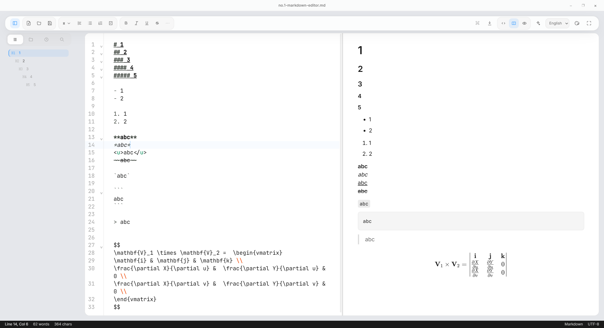

# No.1 Markdown Editor

A cross-platform desktop Markdown workbench for source-first writing, split preview, WYSIWYG cleanup, and export fidelity.

Project mission and execution principles are defined in `AGENTS.md`.

## Why This Editor Exists

Markdown writers often have to choose between two bad defaults:

- a clean writing experience that hides too much source detail
- a developer-heavy toolchain that treats writing like an IDE side task

`No.1 Markdown Editor` is built to keep both sides in one place: trustworthy Markdown source, fast structure-aware editing, accurate preview, and desktop export that keeps the document intact.

## What This Editor Is

- A desktop Markdown editor for long-form notes, documentation, and structured writing.
- A writing workflow that spans `Source`, `Split`, `Preview`, `Focus`, and `WYSIWYG`.
- A Markdown-native workspace with outline, search, and project integrity surfaces built specifically for linked Markdown notes.
- A cross-platform app for `Windows`, `macOS`, and `Linux`.
- A multilingual editor for `Japanese`, `English`, and `Chinese`.

## What This Editor Is Not

- Not a generic IDE.
- Not an always-open AI chat workspace.
- Not an autonomous agent shell.
- Not a terminal-first or plugin-marketplace-first workbench.

## Core Editing Strengths

- Markdown semantics first: headings, lists, tables, math, Mermaid, footnotes, and source-preserving formatting behavior.
- Multiple editing modes: source editing, side-by-side preview, full preview, focus mode, and WYSIWYG cleanup.
- Export fidelity: rendered output, clipboard HTML, and export flows stay aligned with the Markdown source.
- Desktop reliability: local files, cross-note navigation, project-scale structure, and quality checks stay close to the writing surface.

## Editing Modes

- `Source`: direct Markdown editing with structural shortcuts and precise source control.
- `Split`: source and rendered preview side by side for immediate verification.
- `Preview`: reading surface for rendered Markdown, Mermaid, math, and linked assets.
- `Focus`: reduced chrome for uninterrupted drafting.
- `WYSIWYG`: inline helpers for cleanup-heavy tasks such as tables, footnotes, and math blocks.

### Split Workspace

The editor, outline, and rendered preview stay visible together so structure and output can be checked while writing.

### Markdown Semantics

Headings, emphasis, lists, blockquotes, code, and math stay aligned between source and rendered output.

## Markdown-Native Workspace Surfaces

`No.1 Markdown Editor` is not just a single-note editor with a file tree. It now includes project surfaces that help maintain a real Markdown workspace without turning the product into a generic IDE shell.

- `Links`: inspect outgoing links, backlinks, unlinked mentions, broken references, jump to the right note or heading, and repair common broken note links directly from the sidebar.
- `Inspect`: keep asset integrity and document health together in one place so the sidebar stays lean. Review local images and attachments, detect missing or orphaned files, surface broken links, duplicate headings, missing alt text, unresolved footnotes, front matter issues, and publish warnings, then apply safe fixes before returning to writing.

The important product rule is the same across these workspace surfaces: inspect, jump, fix, and get back to the document.

## AI, Kept Editor-First

AI is part of the editor action system, not the center of the product story.

- Stable default AI surface:
  - `Ctrl/Cmd+J` composer
  - selection bubble actions
  - command-palette AI actions
  - explicit context chips
  - `Draft / Diff / Apply`
  - single-step undo on apply
- Experimental / advanced AI surface:
  - workspace run
  - multi-note automation
  - phase-aware orchestration
  - broader audit and workflow automation

Advanced automation stays subordinate to the writing surface by default. The public AI scope is described in `docs/ai-integration-spec.md`.

## Current Priorities

Current product-alignment work is tracked in `docs/product-priority-checklist.md`.

## Release Notes

- User-facing change history lives in `CHANGELOG.md`.
- The next public release summary draft lives in `docs/release-notes-draft.md`.

## Install

Install latest package from [releases](https://github.com/engchina/no.1-markdown-editor/releases).

- Windows x64 installer and MSI
- macOS universal desktop bundle
- Linux x64 desktop bundle

## Development

- Run `npm install` in each OS environment before invoking Tauri. The `@tauri-apps/cli` package uses platform-specific optional dependencies, so reusing `node_modules` between Windows, WSL/Linux, and macOS can break the native binding.
- Run `npm run dev` to start the desktop app in Tauri dev mode. Frontend edits hot-reload through Vite, and `src-tauri` changes restart the Rust app automatically.
- Run `npm run dev:web` if you only need the browser-based Vite preview.
- Run `npm run package:win` on Windows.
- Run `npm run package:mac` on macOS.
- Run `npm run test:ai:smoke` to exercise command palette AI execution, sidebar AI entry, selection bubble flows, inline ghost text continuation, AI provenance markers, settings fallback, request cancellation, apply paths including `New Note`, undo behavior, and source/split/preview/focus/WYSIWYG mode compatibility against a built local preview.
- Run `npm run test:ai:integration:smoke` to run the main AI integration smoke plus the keyboard-only AI smoke in one pass against a built local preview.
- Run `npm run test:ai:i18n:smoke` to verify the AI-related UI labels and layout in English, Japanese, and Chinese against a built local preview.
- Run `npm run test:ai:keyboard:smoke` to verify the keyboard-only `Ctrl/Cmd+J -> Run -> Apply` path, streamed draft preview isolation before apply, and editor focus return against a built local preview.
- Run `npm run test:ai:manual:qa:capture` to regenerate the locale/mode QA artifact set under `output/playwright/ai-manual-qa/`.
- Run `npm run test:source:smoke` to verify source-editor ordinary typing, `Enter`, `Delete`, plain-text paste, and AI Apply keep the viewport near the active cursor instead of snapping back to the top.

## Release

GitHub release automation is defined in `.github/workflows/release.yml`.

- Run `npm run release:prepare -- 0.19.3` to sync `package.json`, `src-tauri/tauri.conf.json`, `src-tauri/Cargo.toml`, and promote `CHANGELOG.md` `## Unreleased` into a dated `## 0.19.3 - YYYY-MM-DD` section before tagging.
- Run `npm run release:validate` after bumping the release version to confirm `package.json`, `src-tauri/tauri.conf.json`, `src-tauri/Cargo.toml`, and `CHANGELOG.md` are ready for the same tag, and that the release changelog section no longer contains scaffold comment placeholders. Use `npm run release:validate -- 0.19.3` if you want to validate an explicit target before committing the version bump.
- Run `npm run release:notes:preview -- 0.19.3` to print the GitHub release body locally before pushing `v0.19.3`.
- After the release is published, run `npm run release:draft:advance -- 0.19.3` to reset `docs/release-notes-draft.md` and normalize `CHANGELOG.md` `## Unreleased` into the next-cycle suggested scaffold after `v0.19.3`.
- Keep the version aligned in `package.json`, `src-tauri/tauri.conf.json`, and `src-tauri/Cargo.toml`.
- Create and push a version tag such as `v0.14.0`. The workflow fails early if the tag does not match the app version.
- Pushing the tag builds Windows x64, a single universal macOS release bundle for both Apple Silicon and Intel Macs, and Linux x64 release bundles on GitHub-hosted runners and uploads them to GitHub Releases automatically.

For macOS builds:

- The workflow uses `--target universal-apple-darwin --no-sign`, so one package covers both Apple Silicon and Intel Macs.
- This is intended for local development and direct downloads when Apple signing certificates are not available.
- Unsigned macOS downloads will still show the usual Gatekeeper / Privacy & Security prompts on end-user machines.

Windows installers are still built unsigned by default. If you want SmartScreen-friendly production releases, add a Windows code-signing configuration separately.
