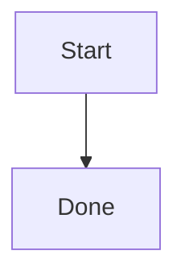
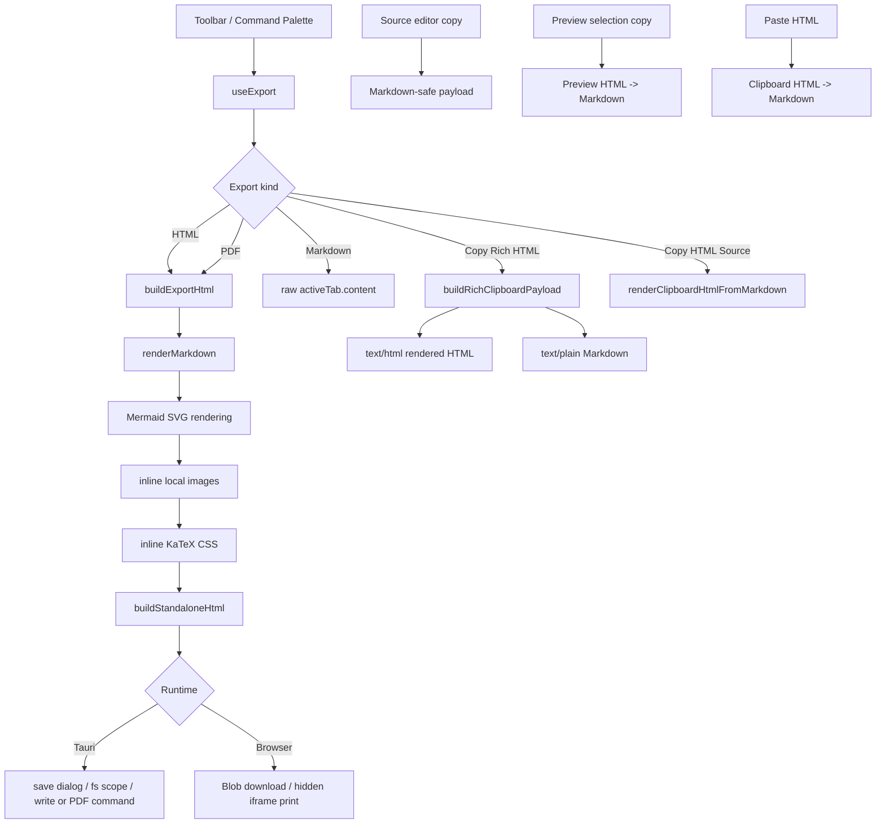

# No.1 Markdown Editor の Export / Clipboard を解説する: Markdown を壊さず HTML、PDF、コピー、貼り付けへつなぐ

## 先に結論

`No.1 Markdown Editor` の Export / Clipboard は、単に `innerHTML` を保存したり、`navigator.clipboard.writeText()` に文字列を渡したりするだけの機能ではありません。

ここがかなり大事です。

**Markdown source を唯一の真実として残しながら、用途ごとに「Markdown のまま渡す」「rendered HTML として渡す」「standalone HTML として書き出す」「HTML から Markdown に戻す」を明確に分けています。**

たとえば、同じ Markdown でも操作によって出力は変わります。

````md
# Title

This is **bold** and [link](https://example.com).



| Name | Score |
| --- | ---: |
| Alice | 98 |
````

この document に対して、Export / Clipboard は次のように振る舞います。

| 操作 | 出力の考え方 |
| --- | --- |
| HTML export | Markdown を render し、standalone HTML に包んで保存する |
| PDF export | HTML export と同じ HTML を PDF backend / browser print に渡す |
| Markdown export | raw Markdown source をそのまま保存する |
| Copy Rich HTML | `text/html` は rendered HTML、`text/plain` は Markdown source にする |
| Copy HTML Source | rendered HTML source を plain text としてコピーする |
| Source editor copy | Markdown として安全な clipboard payload を作る |
| Preview selection copy | Preview DOM selection を Markdown に戻してコピーする |
| HTML paste | clipboard HTML を Markdown に変換して source に挿入する |

つまり、この実装の基本方針はこうです。

```txt
Markdown source は壊さない
書き出しは Preview と同じ rendering pipeline を使う
clipboard では text/plain と text/html の意味を分ける
Preview からコピーしても Markdown として戻せる
Web / Desktop の差は adapter に閉じ込める
```

この記事では、この Export / Clipboard 実装をコードで分解します。

## この記事で分かること

- Export menu が何を呼び分けているのか
- HTML / PDF / Markdown export の違い
- なぜ export は Preview DOM をそのまま保存しないのか
- Mermaid、math、local image を export に含める方法
- Tauri desktop と browser で export path を分ける理由
- PDF export が silent backend と browser print fallback を持つ理由
- rich clipboard で `text/html` と `text/plain` を両方渡す設計
- Copy Rich HTML と Copy HTML Source を分ける理由
- Source editor copy / Preview copy を Markdown-safe にする方法
- HTML paste を Markdown に戻す変換 pipeline
- collapsed `<details>`、画像 paste、CRLF、table alignment まで含めた細部
- テストで Export / Clipboard の UX contract をどう守っているのか

## 対象読者

- Markdown editor の export / clipboard を作りたい方
- `navigator.clipboard` と fallback の設計に悩んでいる方
- Markdown と rendered HTML の round-trip を扱いたい方
- Tauri / browser の両方で HTML / PDF export を実装したい方
- Preview からコピーしても Markdown source を壊したくない方
- Typora / Obsidian / VS Code Markdown に近い document workflow を作りたい方

## まず、ユーザー体験

ユーザーから見ると、Export / Clipboard は toolbar の Export button から使います。

Export menu には次の操作があります。

| Menu item | 目的 |
| --- | --- |
| HTML として書き出し | standalone HTML file を作る |
| PDF として書き出し | PDF file を作る |
| Markdown を書き出し | Markdown source を file として保存する |
| リッチ HTML をコピー | rendered HTML を rich clipboard に入れる |
| HTML ソースをコピー | rendered HTML source を plain text としてコピーする |

ここで重要なのは、`リッチ HTML をコピー` と `HTML ソースをコピー` が別の操作になっていることです。

前者は Notion、Google Docs、mail editor のような rich text target に貼り付けるためのものです。
後者は HTML source をそのまま code として貼りたいときのものです。

```txt
Copy Rich HTML:
  text/html   -> rendered HTML
  text/plain  -> Markdown source

Copy HTML Source:
  text/plain  -> rendered HTML source
```

同じ「コピー」でも、ユーザーが次にどこへ貼るかで正解が変わります。

## 全体像

ざっくり図にすると、こうなります。



中心は `src/hooks/useExport.ts` です。

ただし Export / Clipboard は 1 ファイルだけで完結していません。

- `useExport.ts`: HTML / PDF / Markdown export、rich HTML copy、HTML source copy
- `clipboardHtml.ts`: clipboard payload 作成、rich clipboard write
- `clipboard.ts`: clipboard data / async clipboard の読み取り fallback
- `pasteHtml.ts`: clipboard HTML を Markdown に変換する parser / serializer
- `previewClipboard.ts`: Preview selection を Markdown に戻す helper
- `exportLocalImages.ts`: export 時の local image 解決
- `markdown.ts` / `markdownShared.ts`: Markdown rendering と standalone HTML
- `CodeMirrorEditor.tsx`: source editor copy / cut / paste
- `MarkdownPreview.tsx`: Preview selection copy、code block copy
- `exportStatus.ts`: export running / success の status store

この分割により、export、copy、paste は同じ Markdown rendering を共有しながら、それぞれの UX に合わせた出力を持てます。

## 1. Export の入口は `useExport`

Export 系の操作は `useExport()` に集約されています。

```ts
export function useExport() {
  const activeTab = useActiveTab()

  const exportHtml = useCallback(async () => {
    // ...
  }, [activeTab])

  const exportPdf = useCallback(async () => {
    // ...
  }, [activeTab])

  const exportMarkdown = useCallback(async () => {
    // ...
  }, [activeTab])

  const copyAsHtml = useCallback(async () => {
    // ...
  }, [activeTab])

  const copyHtmlSource = useCallback(async () => {
    // ...
  }, [activeTab])

  return { exportHtml, exportPdf, exportMarkdown, copyAsHtml, copyHtmlSource }
}
```

UI component は「HTML を書き出す」「PDF を書き出す」という intent だけを呼びます。

実際に browser download にするのか、Tauri の save dialog にするのか、clipboard fallback を使うのかは `useExport()` の中に閉じ込めています。

## 2. file name は Markdown extension を外して sanitize する

export では、active tab の名前から base name を作ります。

```ts
function sanitizeBaseName(name: string): string {
  const trimmed = (name ?? '').toString().trim()
  const withoutExt = trimmed.replace(/\.(md|markdown|mdx)$/i, '')
  const sanitized = withoutExt.replace(/[\\/:*?"<>|]/g, '_').replace(/\s+/g, ' ').trim()
  return sanitized || 'Untitled'
}
```

ここでやっていることはシンプルです。

```txt
README.md      -> README
draft.mdx      -> draft
bad:name?.md   -> bad_name_
空文字          -> Untitled
```

Windows、macOS、Linux で file name の扱いは違います。
少なくとも明らかに危険な文字は export file name に入れません。

## 3. HTML / PDF は同じ `buildExportHtml()` を通る

HTML export と PDF export は、まず同じ HTML を作ります。

```ts
async function buildExportHtml(
  markdown: string,
  title: string,
  documentPath: string | null,
  mermaidTheme: 'default' | 'dark' = 'default'
) {
  const { buildStandaloneHtml, containsLikelyMath, renderMarkdown } = await import('../lib/markdown')

  let bodyHtml = await renderMarkdown(markdown)
  // Mermaid / images / math

  return {
    bodyHtml,
    fullHtml: buildStandaloneHtml(title, bodyHtml, { inlineKatexCss }),
  }
}
```

PDF は「別の PDF 用 renderer」を持っていません。

まず Markdown を HTML に render し、その HTML を PDF backend や browser print に渡します。

これにより、HTML export と PDF export の見た目が大きくズレにくくなります。

## 4. Export は Preview DOM を保存しない

ここは重要です。

Export は、画面に出ている Preview DOM をそのまま保存していません。

理由は明確です。

```txt
Preview DOM:
  UI 用の button や lazy rendering state が混ざる
  local image placeholder が含まれることがある
  Mermaid の pending shell が残ることがある
  theme / interaction 用 attribute が含まれる

Export HTML:
  Markdown source から render し直す
  Mermaid を SVG にする
  local image を export 用に解決する
  standalone CSS を入れる
  print 用 CSS を入れる
```

Preview は editor 内の表示 surface です。
Export は外へ持ち出す artifact です。

この 2 つを分けることで、画面上の UI state が export file に漏れないようにしています。

## 5. Markdown rendering は共有 pipeline を使う

HTML body は `renderMarkdown()` で作ります。

```ts
let bodyHtml = await renderMarkdown(markdown)
```

この renderer は Preview、Clipboard、Export の土台です。

つまり、heading、GFM table、task list、footnote、math、syntax highlight などの Markdown behavior は、できるだけ同じ path を通ります。

Export だけ別の Markdown parser を使うと、Preview では見えていたものが HTML export で崩れる、という事故が起きやすくなります。

## 6. Mermaid block は SVG に変換してから export する

Markdown の render 結果に Mermaid block が含まれている場合、Export では Mermaid を SVG に変換します。

```ts
if (bodyHtml.includes('language-mermaid')) {
  const { renderMermaidInHtml } = await import('../lib/mermaid')
  bodyHtml = await renderMermaidInHtml(bodyHtml, mermaidTheme)
}
```

ここでは `language-mermaid` を cheap な判定として使っています。

Mermaid を常に import すると export path が重くなります。
Mermaid block があるときだけ renderer を読み込むことで、普通の Markdown export を軽く保てます。

## 7. Mermaid theme は clipboard でも export でも見る

Copy Rich HTML / Copy HTML Source では、現在の document theme から Mermaid theme を決めます。

```ts
const mermaidTheme = document.documentElement.classList.contains('dark') ? 'dark' : 'default'
const payload = await buildRichClipboardPayload(activeTab.content, mermaidTheme)
```

Mermaid は CSS だけで完全に theme を切り替えられるわけではありません。

SVG generation の時点で theme を渡す必要があります。

そのため、clipboard に入れる HTML でも、現在の dark / light theme を見て Mermaid SVG を作ります。

## 8. local image は export 用に解決する

Markdown に local image がある場合、HTML file を別の場所に持っていくと画像が切れる可能性があります。

そのため、Export では local image を解決します。

```ts
if (bodyHtml.includes('` を blindly に書き換えるわけではありません。

```ts
if (!isLocalPreviewImageSource(source, documentPath)) {
  return ''
}

const key = buildLocalPreviewImageKey(source, documentPath)
if (!localImages.has(key)) {
  localImages.set(key, source)
}
```

やっていることは次の通りです。

```txt
local image だけ対象にする
documentPath を使って相対 path を解決する
同じ画像は 1 回だけ resolve する
resolve できない画像は元の src のまま残す
attribute は escape して書き戻す
```

Export では「絶対に全部 data URI にする」より、「解決できる local image は self-contained に近づけ、失敗しても HTML を壊さない」方針です。

## 9. math があるときだけ KaTeX CSS を inline する

Math がある場合、HTML export は KaTeX の CSS も考える必要があります。

```ts
const inlineKatexCss =
  containsLikelyMath(markdown) && bodyHtml.includes('class="katex"')
    ? await (await import('../lib/katexInlineCss')).getInlineKatexCss()
    : undefined
```

ここでも lazy import です。

Math がない document で KaTeX CSS を毎回読み込む必要はありません。

判定は 2 段階です。

```txt
Markdown source に math らしい記法がある
render 結果に class="katex" がある
```

これにより、誤検知で大きい CSS を入れる可能性を下げています。

## 10. standalone HTML は document として完結させる

最後に `buildStandaloneHtml()` で full HTML にします。

```ts
return {
  bodyHtml,
  fullHtml: buildStandaloneHtml(title, bodyHtml, { inlineKatexCss }),
}
```

standalone HTML には次のような style が入ります。

- prose typography
- heading spacing
- code block style
- syntax highlight color
- blockquote
- table alignment
- image max-width
- details / summary
- list marker
- footnote
- front matter
- `@page`
- `@media print`

つまり、HTML export は fragment ではありません。

単独で browser に開ける document として出します。

## 11. table alignment は export でも維持する

GFM table の alignment は、render 結果に `align` attribute として残ります。

standalone HTML 側にも alignment rule を入れています。

```css
th[align="left"], td[align="left"] { text-align: left; }
th[align="center"], td[align="center"] { text-align: center; }
th[align="right"], td[align="right"] { text-align: right; }
```

table は business document でよく使われます。

Preview では右寄せだった numeric column が、HTML export や PDF export で左寄せになると、document としての信頼感が落ちます。

そのため、table alignment は test でも守っています。

## 12. HTML export: Tauri では save dialog、browser では Blob download

HTML export は runtime によって path が分かれます。

Desktop では Tauri の save dialog を使います。

```ts
const { save } = await import('@tauri-apps/plugin-dialog')
const { writeTextFile } = await import('@tauri-apps/plugin-fs')
const path = await save({
  filters: [{ name: 'HTML', extensions: ['html'] }],
  defaultPath: fileName,
})
```

保存先が決まったら、filesystem access を確認してから書き込みます。

```ts
await runWithExportStatus('html', async () => {
  await ensureFsPathAccess(path)
  await writeTextFile(path, fullHtml)
})
```

Browser では file system に直接書けないため、Blob download にします。

```ts
const url = URL.createObjectURL(new Blob([fullHtml], { type: 'text/html' }))
anchor.href = url
anchor.download = fileName
anchor.click()
```

同じ `exportHtml()` でも、platform capability に応じて実行方法を分けています。

## 13. PDF export は HTML export と同じ HTML を使う

PDF export もまず `buildExportHtml()` を呼びます。

```ts
const baseName = sanitizeBaseName(activeTab.name)
const { fullHtml } = await buildExportHtml(activeTab.content, baseName, activeTab.path, 'default')
```

PDF の source は Markdown ではなく、rendered standalone HTML です。

これにより、PDF は Preview / HTML export と同じ Markdown rendering の上に作れます。

## 14. Desktop PDF は native command に渡す

Tauri desktop では、PDF export は native command に渡します。

```ts
await runWithExportStatus('pdf', async () => {
  await ensureFsPathAccess(targetPath)
  await invoke('export_pdf_to_file', { html: fullHtml, outputPath: targetPath })
})
```

ここでも順番が重要です。

```txt
save dialog で target path を選ぶ
filesystem scope を確保する
native PDF command を呼ぶ
```

Desktop app では、silent PDF export ができるほうが自然です。

毎回 OS の print dialog を開くより、ユーザーが選んだ path に直接 PDF を出せるほうが document tool として扱いやすくなります。

## 15. native PDF 失敗時は詳しい notice を出す

native PDF export に失敗した場合、system print に自動 fallback しません。

```ts
} catch (nativeError) {
  const reason = getErrorMessage(nativeError) || i18n.t('notices.exportPdfErrorReasonFallback')
  console.error('Silent PDF export failed:', nativeError)
  pushErrorNotice('notices.exportPdfErrorTitle', 'notices.exportPdfErrorMessage', {
    values: { reason },
    timeoutMs: 12_000,
  })
  return
}
```

これは UX として大事です。

ユーザーは「PDF file を保存する」つもりで操作しています。
そこで急に print dialog が開くと、意図しない workflow に飛ばされます。

失敗したら失敗理由を出す。
別の手段を勝手に始めない。

このほうが desktop tool として予測可能です。

## 16. Browser PDF は hidden iframe で print する

Browser では native PDF command が使えません。

そのため、standalone HTML を hidden iframe に書き込み、browser print を呼びます。

```ts
frameDocument.open()
frameDocument.write(html)
frameDocument.close()
```

iframe が load したら、font と image を待ちます。

```ts
await waitForPrintableAssets(frameDocument)
printWindow.focus()
printWindow.print()
```

PDF / print は asset の読み込み timing に影響されます。

画像がまだ読み込まれていない状態で `print()` を呼ぶと、PDF に画像が出ない可能性があります。

## 17. printable asset は最大 4 秒待つ

`waitForPrintableAssets()` は font と image を待ちます。

```ts
const fontsReady =
  (frameDocument as Document & { fonts?: { ready?: Promise<unknown> } }).fonts?.ready ??
  Promise.resolve()

const images = Array.from(frameDocument.images)
```

ただし、永遠には待ちません。

```ts
await Promise.race([
  Promise.all([fontsReady, ...imagesReady]),
  new Promise((resolve) => setTimeout(resolve, 4000)),
])
```

これは現実的な tradeoff です。

```txt
短すぎる:
  画像や font が PDF に入らない

長すぎる:
  export が止まったように見える

最大 4 秒:
  できるだけ待つが、workflow は止めない
```

## 18. Markdown export は raw source をそのまま保存する

Markdown export は render しません。

```ts
await writeTextFile(path, activeTab.content)
```

Browser でも同じです。

```ts
downloadBlob(new Blob([activeTab.content], { type: 'text/markdown' }), fileName)
```

これは当然に見えますが、重要です。

Markdown export で Preview HTML や normalized Markdown を出すと、ユーザーが書いた source が変わってしまいます。

この editor では Markdown source が唯一の真実なので、Markdown export は raw content を出します。

## 19. Export status は shared store で扱う

Export 中の status は Zustand store で管理します。

```ts
export type ExportActivityKind = 'html' | 'pdf' | 'markdown'

export interface ExportActivity {
  kind: ExportActivityKind
  phase: 'running' | 'success'
  updatedAt: number
}
```

export task は `runWithExportStatus()` で包みます。

```ts
const { startExport, finishExportSuccess, clearExportStatus } = useExportStatusStore.getState()
startExport(kind)

try {
  const result = await task()
  finishExportSuccess(kind)
  return result
} catch (error) {
  clearExportStatus()
  throw error
}
```

これにより、HTML / PDF / Markdown export は同じ status lifecycle を持ちます。

```txt
running -> success
error   -> clear
```

UI 側では status bar に「HTML を書き出し中...」「PDF を書き出しました」のような状態を出せます。

## 20. Copy Rich HTML は rendered HTML と Markdown を同時に入れる

Rich HTML copy は `buildRichClipboardPayload()` を使います。

```ts
export async function buildRichClipboardPayload(
  markdown: string,
  mermaidTheme: 'default' | 'dark' = 'default'
): Promise<ClipboardPayload> {
  const plainText = normalizeClipboardPlainText(markdown)
  return {
    plainText,
    html: await renderClipboardHtmlFromMarkdown(plainText, mermaidTheme),
  }
}
```

payload は 2 種類の表現を持ちます。

```ts
export interface ClipboardPayload {
  plainText: string
  html: string
}
```

ここが重要です。

```txt
text/html:
  rich text target 用の rendered HTML

text/plain:
  plain text target 用の Markdown source
```

たとえば Google Docs に貼るなら HTML が使われます。
terminal や plain text editor に貼るなら Markdown が使われます。

## 21. Rich clipboard は `ClipboardItem` を使う

modern browser では `ClipboardItem` に `text/html` と `text/plain` を両方入れます。

```ts
await navigator.clipboard.write([
  new ClipboardItem({
    'text/html': new Blob([payload.html], { type: 'text/html' }),
    'text/plain': new Blob([payload.plainText], { type: 'text/plain' }),
  }),
])
```

この設計により、貼り付け先が自分で最適な format を選べます。

Markdown editor に貼れば plain text が使われ、rich editor に貼れば HTML が使われる。
それが clipboard の本来の強みです。

## 22. Clipboard API が弱い環境では fallback する

`copyAsHtml()` は rich clipboard が使えない場合も考えています。

```ts
if (typeof navigator.clipboard?.write === 'function' && typeof ClipboardItem !== 'undefined') {
  await writeClipboardPayload(payload)
  copied = true
} else {
  await navigator.clipboard.writeText(payload.html)
  copied = true
}
```

さらに失敗した場合は hidden textarea と `execCommand('copy')` に落とします。

```ts
const textarea = document.createElement('textarea')
textarea.value = payload.html
textarea.setAttribute('readonly', 'true')
textarea.style.position = 'fixed'
textarea.style.opacity = '0'
document.body.appendChild(textarea)
textarea.select()
copied = document.execCommand('copy')
document.body.removeChild(textarea)
```

clipboard は browser / permission / focus state に左右されます。

そのため、1 つの API に賭けずに fallback を持っています。

## 23. Copy Rich HTML と Copy HTML Source は分ける

`copyAsHtml()` と `copyHtmlSource()` は別の command です。

```ts
const copyAsHtml = useCallback(async () => {
  const payload = await buildRichClipboardPayload(activeTab.content, mermaidTheme)
  await writeClipboardPayload(payload)
}, [activeTab])
```

```ts
const copyHtmlSource = useCallback(async () => {
  const html = await renderClipboardHtmlFromMarkdown(activeTab.content, mermaidTheme)
  const copied = await copyPlainTextToClipboard(html)
}, [activeTab])
```

違いはこうです。

```txt
Copy Rich HTML:
  rich clipboard に text/html と text/plain を入れる
  貼り付け先が rich HTML として扱える

Copy HTML Source:
  rendered HTML source を plain text として入れる
  code block や CMS に HTML source として貼れる
```

この 2 つを 1 つの button にまとめると、ユーザーが期待する貼り付け結果が毎回変わってしまいます。

だから明示的に分けています。

## 24. Copy success message も意味を分ける

copy 成功時の notice も分けています。

```ts
pushSuccessNotice('notices.copyHtmlSuccessTitle', 'notices.copyHtmlSuccessMessage')
```

```ts
pushSuccessNotice('notices.copyHtmlSourceSuccessTitle', 'notices.copyHtmlSourceSuccessMessage')
```

日本語 locale では、menu label も command label も別です。

```json
{
  "copyRichHtml": "リッチ HTML をコピー",
  "copyHtmlSource": "HTML ソースをコピー"
}
```

Clipboard の操作は結果が見えにくいです。

そのため、UI copy でも「何をコピーしたか」を曖昧にしないようにしています。

## 25. Source editor copy は Markdown-safe payload にする

Source editor で選択範囲をコピーした場合、rich HTML にはしません。

```ts
const markdownText = view.state.sliceDoc(selection.from, selection.to)
const payload = buildMarkdownSafeClipboardPayload(markdownText)
const fallbackCopied = writeClipboardEventPayload(event, payload)
```

`buildMarkdownSafeClipboardPayload()` は、Markdown を render しません。

```ts
export function buildMarkdownSafeClipboardPayload(markdown: string): ClipboardPayload {
  const plainText = normalizeClipboardPlainText(markdown)
  return {
    plainText,
    html: buildPlainTextClipboardHtml(plainText),
  }
}
```

ここでの `text/html` は、rendered Markdown ではありません。

Markdown text を paragraph / `<br />` として HTML escaped したものです。

```ts
export function buildPlainTextClipboardHtml(text: string): string {
  return normalizeClipboardPlainText(text)
    .split(/\n{2,}/)
    .map((paragraph) => `<p>${escapeHtml(paragraph).replace(/\n/g, '<br />')}</p>`)
    .join('')
}
```

つまり、Source editor で `# Title` をコピーして rich editor に貼っても、勝手に heading に変換しません。

Source editor の copy は、source をコピーする操作です。

## 26. cut も同じ Markdown-safe path を通る

Source editor の cut も copy と同じ payload を使います。

```ts
const handleCut = (event: ClipboardEvent) => {
  void handleCopyOrCut(event, 'cut')
}
```

clipboard への書き込みが成功したあとで selection を削除します。

```ts
const applyCut = () => {
  view.dispatch({
    changes: { from: selection.from, to: selection.to, insert: '' },
    selection: { anchor: selection.from },
  })
}
```

cut は「削除」も含むため、clipboard write の成否と document change の順番が重要です。

## 27. Preview selection copy は document-level で拾う

Preview で selection をコピーする場合、Preview container が常に focus を持つとは限りません。

そのため、copy event は document level で intercept します。

```ts
// Preview selections do not reliably focus the preview container, so intercept copy at the document level.
document.addEventListener('copy', onCopy)
```

handler では、selection が Preview 内にあるかを見ます。

```ts
const selection = window.getSelection()
const fragment = extractPreviewSelectionFragment(selection, preview)
if (!fragment) return
```

Preview は rendered HTML ですが、コピー結果は Markdown に戻します。

```ts
const markdownText = convertPreviewSelectionHtmlToMarkdown(fragment.html, fragment.plainText)
const payload = buildMarkdownSafeClipboardPayload(markdownText)
```

これは Markdown editor としてかなり重要な UX です。

Preview を読んでいるときに選択してコピーしても、別の Markdown editor に貼れる形で戻せます。

## 28. Preview selection は HTML fragment を clone して扱う

Preview selection は `Range.cloneContents()` で fragment を作ります。

```ts
const copyRange = expandPreviewSelectionRangeForClosedDetails(range, preview)
const container = preview.ownerDocument.createElement('div')
container.append(copyRange.cloneContents())

return {
  html: container.innerHTML,
  plainText: selection.toString(),
}
```

そして、その HTML fragment を Markdown に変換します。

```ts
export function convertPreviewSelectionHtmlToMarkdown(selectionHtml: string, plainText: string): string {
  const normalizedPlainText = normalizeClipboardPlainText(plainText)
  return convertClipboardHtmlToMarkdown(selectionHtml, normalizedPlainText) ?? normalizedPlainText
}
```

変換に失敗した場合は plain text に fallback します。

Clipboard では「完璧に変換できないなら何もコピーしない」より、「少なくとも選択 text はコピーできる」ほうが自然です。

## 29. closed `<details>` の selection は body も含める

Preview 上で閉じた `<details>` の summary を選択した場合、そのまま clone すると body が落ちることがあります。

そのため、selection が closed details の summary に触れている場合は range を details 全体へ広げます。

```ts
export function shouldExpandClosedDetailsSelection(range: Range, details: HTMLDetailsElement): boolean {
  if (details.open) return false

  const summary = details.querySelector<HTMLElement>(':scope > summary')
  if (!summary) return false

  try {
    return range.intersectsNode(summary)
  } catch {
    return false
  }
}
```

これにより、Preview から details をコピーしても次のような Markdown に戻せます。

````md
<details>
<summary>営業フォロー候補の顧客</summary>

本文...

```sql
SELECT CUSTOMER_NAME
FROM V_CUSTOMER_360;
```

</details>
````

見えている summary だけをコピーしたつもりでも、document block としての意味を落とさないようにしています。

## 30. Preview の code block copy は raw code をコピーする

Preview の code block には copy button が付きます。

```ts
const code = pre.querySelector('code')
const text = (code ?? pre).innerText
void navigator.clipboard.writeText(text).then(() => {
  btn.textContent = doneLabel
})
```

ここでは Markdown に戻しません。

Code block の copy button は「この code をコピーする」操作です。

そのため、fence や language marker ではなく、code body の text を clipboard に入れます。

同じ Preview 内の copy でも、selection copy と code copy で意味が違います。

## 31. Clipboard read は `getData` だけに依存しない

Paste 側では、clipboard data の読み取りも fallback を持ちます。

```ts
export async function readClipboardStringBestEffort(
  data: ClipboardDataLike | null | undefined,
  mimeType: string,
  clipboardApi?: ClipboardApiLike | null
): Promise<string> {
  const directValue = await readClipboardString(data, normalizedMimeType)
  if (directValue) return directValue

  if (normalizedMimeType === 'text/plain') {
    const plainText = await readClipboardApiText(clipboardApi)
    if (plainText) return plainText
  }

  const clipboardApiValue = await readClipboardApiString(clipboardApi, normalizedMimeType)
  if (clipboardApiValue) return clipboardApiValue

  return ''
}
```

見る順番はこうです。

```txt
ClipboardEvent.clipboardData.getData()
DataTransferItem.getAsString()
navigator.clipboard.readText()
navigator.clipboard.read()
```

Clipboard は platform と browser によって空に見えることがあります。

そのため、event data と async clipboard API の両方を best-effort で使います。

## 32. Paste は capture phase で拾う

Source editor の paste handler は capture phase で登録します。

```ts
container.addEventListener('paste', handlePaste, true)
```

理由は、CodeMirror 側の bubbling handler が先に plain text として処理してしまう前に、HTML clipboard を見たいからです。

```txt
capture phase:
  text/html を読めるうちに処理する

bubbling phase:
  editor の default paste が plain text を挿入する可能性がある
```

HTML paste を Markdown に変換するには、clipboard HTML を先に確保する必要があります。

## 33. HTML paste は Markdown に変換して挿入する

paste handler は、まず HTML があるかを見ます。

```ts
const hasHtml = clipboardHasType(clipboardData, 'text/html')

if (hasHtml) {
  const html = await readClipboardStringBestEffort(clipboardData, 'text/html', clipboardApi)
  const plainText = await readClipboardStringBestEffort(clipboardData, 'text/plain', clipboardApi)
  const markdownText = convertClipboardHtmlToMarkdown(html, plainText)
  if (markdownText) {
    replaceSelectionWithMarkdown(activeView, markdownText)
    return
  }
}
```

ここで document に入るのは HTML ではありません。

HTML を Markdown に変換し、Markdown source として挿入します。

Markdown editor なので、paste の最終結果も Markdown source です。

## 34. HTML paste converter は UI chrome を捨てる

Web page からコピーすると、本文以外の UI が clipboard HTML に混ざります。

そのため、converter は不要な tag を落とします。

```ts
const SKIPPED_TAGS = new Set([
  'head',
  'meta',
  'link',
  'script',
  'style',
  'noscript',
  'title',
  'button',
  'template',
  'dialog',
  'iframe',
  'object',
  'embed',
  'canvas',
])
```

ただし、Qiita の link-card iframe のように、iframe でも意味のあるものは復元します。

```ts
function recoverQiitaLinkCardIframe(attributes: Record<string, string>): ClipboardHtmlAstNode | null {
  const src = sanitizeUrl(attributes.src)
  if (!/^(?:https?:)?\/\/qiita\.com\/embed-contents\/link-card(?:[/?#]|$)/i.test(src)) return null

  const href = extractQiitaLinkCardTarget(attributes['data-content'])
  if (!href) return null

  return {
    type: 'element',
    tagName: 'a',
    attributes: { href },
    children: [{ type: 'text', textContent: href, children: [] }],
  }
}
```

「捨てる」と「意味として回収する」を分けているのがポイントです。

## 35. HTML paste は semantic tag を Markdown に戻す

`pasteHtml.ts` は、semantic HTML を Markdown に変換します。

```ts
case 'h1':
case 'h2':
case 'h3':
case 'h4':
case 'h5':
case 'h6': {
  const level = Number(node.tagName.slice(1))
  const content = serializeInlineChildren(node.children, context).trim()
  return content ? `${'#'.repeat(level)} ${content}` : ''
}
```

inline tag も扱います。

```ts
case 'strong':
  return wrapInline('**', serializeInlineChildren(node.children, context).trim())
case 'em':
  return wrapInline('*', serializeInlineChildren(node.children, context).trim())
case 'mark':
  return wrapInline('==', serializeInlineChildren(node.children, context).trim())
case 'code':
  return wrapCodeSpan(extractTextContent(node, { preserveWhitespace: true }).trim())
```

task list、table alignment、footnote、details も変換対象です。

これは「HTML を貼れる editor」ではなく、「HTML clipboard を Markdown source として吸収できる editor」です。

## 36. plain text のほうが良い場合は plain text を優先する

Clipboard HTML は、貼り付け元によっては壊れた構造や余計な wrapper を持ちます。

そのため、converter は常に HTML を優先するわけではありません。

```ts
if (shouldPreferPlainText(root, normalizedPlainText)) {
  return normalizedPlainText || convertedMarkdown
}
```

plain text が明らかに Markdown source に見える場合は、plain text を優先します。

```ts
function looksLikeMarkdownSource(text: string): boolean {
  return (
    /(^|\n)\s*#{1,6}\s+\S/.test(text) ||
    /!\[[^\]]*]\([^)]+\)/.test(text) ||
    /\[[^\]]+]\([^)]+\)/.test(text) ||
    /(^|\n)\s*[-*+]\s+\S/.test(text) ||
    /(^|\n)\s*\d+\.\s+\S/.test(text) ||
    /(^|\n)\s*>\s+\S/.test(text) ||
    /(^|\n)```/.test(text)
  )
}
```

たとえば Markdown code block を Qiita からコピーした場合、HTML の syntax-highlight span より plain text の Markdown source のほうが正しいことがあります。

## 37. collapsed `<details>` paste では notice を出す

Web browser は、閉じた `<details>` をコピーしたときに body を clipboard に含めないことがあります。

その場合、editor は検出して notice を出します。

```ts
const collapsedDetailsOmittedBody =
  /<details\b/i.test(html) && hasCollapsedDetailsWithOmittedBody(html)

if (collapsedDetailsOmittedBody) {
  pushInfoNotice('notices.collapsedDetailsPasteTitle', 'notices.collapsedDetailsPasteMessage')
}
```

これはユーザーの操作ミスではなく、browser clipboard の制約です。

そのため、黙って summary だけ貼るのではなく、「本文が含まれていない」ことを知らせます。

## 38. image paste は Markdown image reference にする

Clipboard item に image file が含まれている場合は、Markdown image syntax に変換します。

```ts
const imageFiles = Array.from(items)
  .filter((item) => item.type.startsWith('image/'))
  .map((item) => item.getAsFile())
  .filter((file): file is File => file !== null)
```

Desktop では file として保存し、その path を Markdown にします。

```ts
if (isTauri) {
  const persistence = await getTauriFilePersistence()

  if (activeTabPath) {
    return persistImageFilesAsMarkdown(files, activeTabPath, persistence)
  }

  if (activeTabId) {
    return persistDraftImageFilesAsMarkdown(files, activeTabId, persistence)
  }
}
```

Web では data URI の Markdown image として fallback できます。

ここでも document に入るのは image binary ではなく、Markdown source です。

## 39. CRLF は LF に normalize してから挿入する

Windows clipboard は `\r\n` を返すことがあります。

CodeMirror の internal text representation は `\r` を落として扱うため、挿入 length の計算がズレる可能性があります。

そのため、paste text は先に normalize します。

```ts
function replaceSelectionWithMarkdown(view: EditorView, markdownText: string): void {
  const normalizedText = markdownText.replace(/\r\n?/g, '\n')
  const selection = view.state.selection.main
  const insertion = prepareMarkdownInsertion(normalizedText, view.state.sliceDoc(selection.to))
  // ...
}
```

これは小さいですが、Windows support では重要です。

clipboard text の length と CodeMirror doc の length がズレると、selection が document range 外になって `RangeError` が起きる可能性があります。

## 40. soft line break 設定は export / clipboard に漏らさない

Preview には「soft line break を視覚的に改行として表示する」設定があります。

ただし、それは Preview の表示設定です。

Export / Clipboard の Markdown semantics には漏らしません。

```txt
Markdown source:
  Line 1
  Line 2

soft break:
  paragraph 内の whitespace

hard break:
  backslash newline / trailing spaces / Shift+Enter marker
```

test でも、Preview、rich clipboard、standalone export、WYSIWYG inline rendering で line break contract を揃えています。

「見た目の設定」と「Markdown の意味」を分けることが、document editor では重要です。

## 41. hard break は Preview / Clipboard / Export で揃える

source に hard break がある場合、rich clipboard と standalone export でも `<br>` になります。

```ts
const clipboard = await buildRichClipboardPayload(markdown)
const standaloneHtml = buildStandaloneHtml('Doc', previewHtml)

assert.match(clipboard.html, /<p>Line 1<br\s*\/?>\s*Line 2<\/p>/)
assert.match(standaloneHtml, /<p>Line 1<br\s*\/?>\s*Line 2<\/p>/)
```

一方で、普通の soft line break は `<br>` にしません。

```ts
assert.doesNotMatch(clipboard.html, /<br\s*\/?>/)
assert.doesNotMatch(standaloneHtml, /<br\s*\/?>/)
```

ここは Markdown compatibility の要点です。

Markdown editor では、visual line break と semantic hard break を混ぜると、export や clipboard で予想外の結果になります。

## 42. Preview image placeholder は copy で元 source に戻す

Preview では、local image や external image に placeholder / rewritten URL が入ることがあります。

Preview selection copy では、placeholder の `src` ではなく元の Markdown source に近い URL を使います。

```ts
const previewSource =
  sanitizeUrl(attributes['data-local-src']) ||
  sanitizeUrl(attributes['data-external-src']) ||
  sanitizeUrl(attributes['data-external-fallback-src'])
```

これにより、Preview から画像を含む範囲をコピーしたときも、次のような Markdown に戻せます。

```md


```

Preview の安全表示や lazy loading の都合を、clipboard result に漏らさないための処理です。

## 43. Command Palette からも Export / Clipboard を呼べる

Export 操作は toolbar だけではありません。

Command Palette にも export category として登録されています。

```ts
{
  id: 'export.html',
  label: t('commands.exportHtml'),
  icon: '🌐',
  category: 'export',
  action: () => {
    void exportHtml()
  },
}
```

Copy Rich HTML と Copy HTML Source も別 command です。

```ts
{
  id: 'export.copyHtml',
  label: t('commands.copyRichHtml'),
  icon: '📋',
  category: 'export',
  action: () => {
    void copyAsHtml()
  },
}
```

```ts
{
  id: 'export.copyHtmlSource',
  label: t('commands.copyHtmlSource'),
  icon: '<>',
  category: 'export',
  action: () => {
    void copyHtmlSource()
  },
}
```

Markdown editor は keyboard-first な tool です。

Export / Clipboard のような document workflow も Command Palette から触れるべきです。

## 44. Toolbar menu は copy の一時状態も持つ

Toolbar の Export menu では、copy が成功した item に短時間 `コピーしました` を出します。

```ts
const [copiedItem, setCopiedItem] = useState<'rich-html' | 'html-source' | null>(null)

const markCopied = (item: 'rich-html' | 'html-source') => {
  setCopiedItem(item)
  setTimeout(() => setCopiedItem(null), 1500)
}
```

Clipboard 操作は file export と違って、目に見える artifact がすぐには出ません。

そのため、menu item 自体に短い feedback を返しています。

## 45. sanitize schema は Export / Clipboard の安全性にも効く

Markdown renderer では `rehype-sanitize` の schema を拡張しています。

```ts
export const sanitizeSchema = {
  ...defaultSchema,
  tagNames: Array.from(new Set([...(defaultSchema.tagNames ?? []), 'details', 'mark', 'section', 'sub', 'summary', 'sup', 'u'])),
  attributes: {
    ...defaultSchema.attributes,
    '*': [...(defaultSchema.attributes?.['*'] ?? []), 'className', 'class'],
    'details': ['open', 'className', 'class'],
    'summary': ['className', 'class'],
    'a': [...(defaultSchema.attributes?.a ?? []), 'dataFootnoteRef', 'dataFootnoteBackref', 'ariaDescribedby', 'ariaLabel'],
  },
}
```

Export / Clipboard は外へ出す機能なので、rendered HTML の安全性が重要です。

ただし、Markdown editor として必要な tag まで落とすと、details、highlight、subscript、superscript、footnote が壊れます。

そのため、必要な Markdown 表現は許可しつつ、dangerous HTML は sanitizer に通します。

## 46. Front matter も standalone HTML に含める

Markdown の front matter は、rendering で HTML にできます。

```ts
export function buildFrontMatterHtml(meta: FrontMatterMeta): string {
  if (Object.keys(meta).length === 0) return ''

  const rows = Object.entries(meta)
    .map(
      ([key, value]) =>
        `<tr><td class="fm-key">${escapeHtml(key)}</td><td class="fm-val">${escapeHtml(value)}</td></tr>`
    )
    .join('')

  return `<div class="front-matter"><table>${rows}</table></div>`
}
```

ここでも key / value は escape しています。

Export では「見た目として front matter を読める」ことと、「HTML として安全に出す」ことを両立させています。

## 47. テスト: Copy Rich HTML と HTML Source の違いを守る

`tests/export-copy-html-wiring.test.ts` では、Copy Rich HTML が rich clipboard path を通ることを確認しています。

```ts
assert.match(source, /const payload = await buildRichClipboardPayload\(activeTab\.content, mermaidTheme\)/)
assert.match(source, /await writeClipboardPayload\(payload\)/)
assert.match(source, /await navigator\.clipboard\.writeText\(payload\.html\)/)
assert.doesNotMatch(source, /buildMarkdownSafeClipboardPayload/)
```

一方で、Copy HTML Source は rendered HTML source を plain text としてコピーします。

```ts
assert.match(source, /const html = await renderClipboardHtmlFromMarkdown\(activeTab\.content, mermaidTheme\)/)
assert.match(source, /const copied = await copyPlainTextToClipboard\(html\)/)
```

「リッチ HTML」と「HTML source」が混ざる regression を防いでいます。

## 48. テスト: local image export を守る

`tests/export-local-images.test.ts` では、local image の解決を確認しています。

```ts
assert.match(exportedHtml, /src="data:image\/png;base64,abc"/)
assert.match(exportedHtml, /src="https:\/\/example\.com\/remote\.png"/)
```

duplicate path は 1 回だけ resolve します。

```ts
assert.deepEqual(calls, ['./images/hero.png'])
assert.equal((exportedHtml.match(/src="data:image\/png;base64,abc"/g) ?? []).length, 2)
```

unresolved local image は元のままです。

```ts
assert.match(exportedHtml, /src="file:\/\/\/C:\/docs\/hero\.png"/)
```

Export は「成功した部分だけ安全に改善し、失敗した部分は壊さない」ことを test で守っています。

## 49. テスト: Preview copy は Markdown-safe にする

`tests/preview-copy-wiring.test.ts` では、Preview selection copy が Markdown-safe path を通ることを確認しています。

```ts
assert.match(source, /document\.addEventListener\('copy', onCopy\)/)
assert.match(source, /extractPreviewSelectionFragment\(selection, preview\)/)
assert.match(source, /convertPreviewSelectionHtmlToMarkdown\(fragment\.html, fragment\.plainText\)/)
assert.match(source, /const payload = buildMarkdownSafeClipboardPayload\(markdownText\)/)
assert.doesNotMatch(source, /buildRichClipboardPayload/)
```

Preview copy は rich HTML copy ではありません。

Preview から選択したものを、Markdown として再利用できるようにするための copy です。

## 50. テスト: HTML paste の変換品質を守る

`tests/paste-html.test.ts` では、HTML clipboard を Markdown に戻す contract を広く守っています。

たとえば semantic inline tag、task list、footnote、table alignment です。

```ts
assert.match(markdown, /<u>Underline<\/u>/)
assert.match(markdown, /==highlight==/)
assert.match(markdown, /- \[ ] list syntax required/)
assert.match(markdown, /- \[x] completed/)
assert.match(markdown, /\| :--- \| :---: \| ---: \|/)
assert.match(markdown, /\[\^1]: Here is the \*text\* of the first \*\*footnote\*\*\./)
```

Qiita-style の code frame も test しています。

```ts
assert.equal(
  markdown,
  [
    '<details open>',
    '<summary>こちらをクリックして表示</summary>',
    '',
    '```json',
    '{',
    '  "Version": "2012-10-17",',
    '```',
    '',
    '</details>',
  ].join('\n')
)
```

Clipboard paste は実際の Web page 由来のノイズを受けます。

そのため、unit test でも現実の HTML copy に近い形を入れています。

## 51. テスト: PDF export の silent backend を守る

`tests/export-pdf-silent-wiring.test.ts` では、PDF export が native command を呼ぶことを確認しています。

```ts
assert.match(
  source,
  /await invoke\('export_pdf_to_file', \{ html: fullHtml, outputPath: targetPath \}\)/,
)
```

また、失敗時に system print へ自動 fallback しないことも確認します。

```ts
assert.doesNotMatch(source, /falling back to system print/)
assert.doesNotMatch(source, /silent_pdf_unsupported_platform/)
```

PDF export は user workflow に直結するので、ここは仕様として固定しています。

## 52. テスト: StatusBar の export state を守る

`tests/export-statusbar.test.ts` では、export status store の transition を確認しています。

```ts
store.clearExportStatus()
store.startExport('html')
assert.equal(useExportStatusStore.getState().activity?.kind, 'html')
assert.equal(useExportStatusStore.getState().activity?.phase, 'running')

store.finishExportSuccess('markdown')
assert.equal(useExportStatusStore.getState().activity?.kind, 'markdown')
assert.equal(useExportStatusStore.getState().activity?.phase, 'success')
```

HTML / PDF / Markdown の label が English / Japanese / Chinese にあることも確認しています。

Export は file operation なので、進行状態と localization は UX の一部です。

## 実装の要点

### 1. Markdown source を唯一の真実にする

Markdown export、Source editor copy、paste result は、最終的に Markdown source として扱います。

rendered HTML は出力形式の 1 つであり、source of truth ではありません。

### 2. Export は Preview DOM ではなく rendering pipeline から作る

HTML / PDF export は Markdown source から render し直します。

Mermaid、local image、math CSS、standalone style、print CSS を export 用に整えます。

### 3. Clipboard は用途ごとに payload を変える

Copy Rich HTML は `text/html` と `text/plain` を両方持ちます。

Source copy / Preview copy は Markdown-safe payload を作ります。

Copy HTML Source は rendered HTML source を plain text としてコピーします。

### 4. Paste は HTML を Markdown に戻す

Clipboard HTML はそのまま document に入れません。

heading、list、table、footnote、details、code block、image を Markdown に serialize して挿入します。

### 5. platform 差は adapter に閉じ込める

Desktop では Tauri save dialog / filesystem / native PDF command を使います。

Browser では Blob download / hidden iframe print / Clipboard API fallback を使います。

UI は同じ intent を呼び、runtime 差は implementation 側で吸収します。

## この記事の要点を 3 行でまとめると

1. Export は Preview DOM を保存するのではなく、Markdown source から HTML を render し直し、Mermaid、math、local image、print CSS まで含めて外へ持ち出せる artifact にしています。
2. Clipboard は `text/html` と `text/plain` の意味を分け、Copy Rich HTML、Copy HTML Source、Source copy、Preview copy を別々の UX contract として扱っています。
3. Paste は clipboard HTML を Markdown に戻し、details、footnote、table alignment、image、CRLF、fallback まで含めて Markdown source を壊さない workflow にしています。

## 参考実装

- Export hook: `src/hooks/useExport.ts`
- Clipboard payload helpers: `src/lib/clipboardHtml.ts`
- Clipboard read helpers: `src/lib/clipboard.ts`
- HTML paste converter: `src/lib/pasteHtml.ts`
- Preview clipboard helpers: `src/lib/previewClipboard.ts`
- Local image export: `src/lib/exportLocalImages.ts`
- Markdown renderer / standalone HTML: `src/lib/markdown.ts`, `src/lib/markdownShared.ts`
- Source editor copy / paste wiring: `src/components/Editor/CodeMirrorEditor.tsx`
- Preview copy / code copy wiring: `src/components/Preview/MarkdownPreview.tsx`
- Export status store: `src/store/exportStatus.ts`
- Toolbar Export menu: `src/components/Toolbar/Toolbar.tsx`
- Command registry: `src/hooks/useCommands.ts`
- Tests: `tests/export-copy-html-wiring.test.ts`, `tests/export-local-images.test.ts`, `tests/clipboard-html.test.ts`, `tests/clipboard.test.ts`, `tests/preview-copy-wiring.test.ts`, `tests/preview-clipboard.test.ts`, `tests/editor-copy-wiring.test.ts`, `tests/editor-paste-event.test.ts`, `tests/paste-html.test.ts`, `tests/export-statusbar.test.ts`, `tests/export-pdf-silent-wiring.test.ts`, `tests/table-alignment.test.ts`, `tests/line-break-integration.test.ts`
