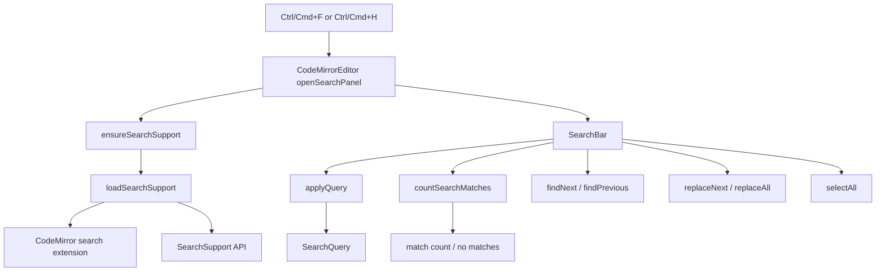

# No.1 Markdown Editor の Find / Replace を解説する: 独自 SearchBar と CodeMirror search をつなぐ

## 先に結論

`No.1 Markdown Editor` の Find / Replace は、画面上の検索バーをすべて自前で作りながら、検索エンジン自体は CodeMirror 6 の `@codemirror/search` に任せています。

ここが大事です。

検索 UI はアプリの見た目や操作感に合わせたい。
でも、エディター本文の検索、ハイライト、次へ移動、前へ移動、置換、全選択は CodeMirror の document state と selection に深く関係します。

そのため、この実装では次のように分担しています。

1. `SearchBar`: Find / Replace の UI、入力状態、件数表示、ボタン操作を持つ
2. `CodeMirrorEditor`: `Ctrl/Cmd+F`、`Ctrl/Cmd+H`、開閉状態、lazy load を管理する
3. `loadSearchSupport()`: CodeMirror の search extension と操作 API をまとめる
4. `countSearchMatches()`: UI に出す match count を軽く計算する
5. tests: UI の構造、ショートカット、検索件数の仕様を守る

つまり、これは単なる `<input>` と `String.prototype.indexOf()` ではありません。

**React の独自 SearchBar、CodeMirror の SearchQuery、lazy loaded extension、キーボードショートカット、i18n、アクセシビリティ、レスポンシブ CSS をつないだ Find / Replace 設計**です。

この記事では、その実装をコードで分解します。

## この記事で分かること

- Find と Replace がどのショートカットで開くのか
- なぜ UI は独自実装で、検索処理は CodeMirror に任せているのか
- `@codemirror/search` を lazy load している理由
- 検索オプション `Aa` / `W` / `.*` の意味
- match count と no matches 表示をどう作っているのか
- 1 件置換と全置換の挙動
- 選択範囲を検索語として初期入力する仕組み
- SearchBar を keyboard accessible にするための細部
- テストでこの UI をどう守っているのか

## 対象読者

- React で editor 内検索 UI を作りたい方
- CodeMirror 6 の search extension を独自 UI から使いたい方
- Markdown editor の Find / Replace をプロダクト品質で作りたい方
- 検索欄、置換欄、match count、regex、whole word まで含めて設計したい方
- keyboard-first な編集 UI を作りたい方

## まず、ユーザー体験

`No.1 Markdown Editor` では、検索と置換は次の操作で開きます。

| 操作 | Windows / Linux | macOS |
| --- | --- | --- |
| Find を開く | `Ctrl+F` | `⌘F` |
| Replace を開く | `Ctrl+H` | `⌘H` |
| 次の一致へ | `Enter` / `Ctrl+G` / `F3` | `Enter` / `⌘G` / `F3` |
| 前の一致へ | `Shift+Enter` / `Ctrl+Shift+G` / `Shift+F3` | `Shift+Enter` / `⌘⇧G` / `⇧F3` |
| 閉じる | `Escape` | `Escape` |

Find を開くと、エディター上部に検索バーが出ます。

Replace として開くと、検索行の下に置換行も表示されます。

検索バーには次の機能があります。

- 検索語の入力
- 一致件数の表示
- 一致がないときの invalid 表示
- 大文字小文字を区別
- 単語単位
- 正規表現
- 前へ / 次へ移動
- すべて選択
- 置換欄の表示 / 非表示
- 1 件置換
- 全置換
- `Escape` で閉じる

Markdown editor では、検索はかなり頻繁に使います。

だからこそ、単に動くだけでなく、今何件見つかっているのか、現在の検索条件は何か、置換操作が安全に実行できる状態なのかを、画面上ですぐ判断できる必要があります。

## 全体像

ざっくり図にすると、こうなります。



ポイントは、UI と検索エンジンを分けていることです。

`SearchBar` は見た目と操作を持ちます。
一方で、本文上の検索結果、ハイライト、selection、置換は CodeMirror 側に寄せています。

この分担がかなり実践的です。

## 1. Find / Replace を開く入口

Find / Replace を開く処理は `src/components/Editor/CodeMirrorEditor.tsx` にあります。

```tsx
useEffect(() => {
  const onKeyDown = (event: KeyboardEvent) => {
    if (matchesPrimaryShortcut(event, { key: 'f' })) {
      event.preventDefault()
      openSearchPanel(false)
      return
    }
    if (matchesPrimaryShortcut(event, { key: 'h' })) {
      event.preventDefault()
      openSearchPanel(true)
      return
    }
    if (event.key === 'Escape' && searchOpen) {
      event.preventDefault()
      setSearchOpen(false)
    }
  }

  const onSearchRequested = (event: Event) => {
    const detail = (event as CustomEvent).detail as { replace: boolean }
    openSearchPanel(detail.replace)
  }

  document.addEventListener('keydown', onKeyDown)
  document.addEventListener('editor:search', onSearchRequested)
  return () => {
    document.removeEventListener('keydown', onKeyDown)
    document.removeEventListener('editor:search', onSearchRequested)
  }
}, [openSearchPanel, searchOpen])
```

ここでは 2 つの入口を持っています。

1. keyboard shortcut から開く
2. command registry から `editor:search` event で開く

`Ctrl/Cmd+F` は Find。
`Ctrl/Cmd+H` は Replace。

この違いは `openSearchPanel(false)` / `openSearchPanel(true)` の boolean で渡しています。

```tsx
const openSearchPanel = useCallback(
  (replace: boolean) => {
    setSearchOpen(true)
    setSearchReplace(replace)
    setSearchLoading(true)
    void ensureSearchSupport().finally(() => setSearchLoading(false))
  },
  [ensureSearchSupport]
)
```

ここで `searchReplace` に `true` を入れると、`SearchBar` が最初から置換欄を表示します。

## 2. Search extension は lazy load する

検索機能は `ensureSearchSupport()` で読み込みます。

```tsx
const ensureSearchSupport = useCallback(async () => {
  if (searchSupport) return searchSupport

  searchPromiseRef.current ??= loadSearchSupport().then((support) => {
    setSearchSupport(support)
    return support
  })

  return searchPromiseRef.current
}, [searchSupport])
```

ここで `loadSearchSupport()` を最初から読み込まず、Find / Replace を使うタイミングで読み込んでいます。

Markdown editor は起動直後にエディター本体をすぐ使えることが重要です。
検索は重要な機能ですが、初回描画の critical path に置く必要はありません。

そのため、検索機能は lazy load します。

さらに `searchPromiseRef.current ??=` によって、同時に複数回呼ばれても import は 1 回にまとまります。

この小さな制御で、連打や複数入口からの呼び出しにも強くなります。

## 3. CodeMirror の search extension を compartment に差し込む

`CodeMirrorEditor` の extension list には、検索用の compartment があります。

```tsx
searchCompartmentRef.current.of(searchSupport?.extensions ?? [])
```

検索機能がまだ読み込まれていないときは空配列です。

読み込み後は次の effect で差し替えます。

```tsx
useEffect(() => {
  reconfigure(searchCompartmentRef.current, searchSupport?.extensions ?? [])
}, [reconfigure, searchSupport])
```

ここも大事です。

CodeMirror は extension を組み合わせて editor behavior を作ります。
検索機能を後から読み込むなら、editor を作り直すのではなく、compartment を reconfigure するほうが自然です。

これにより、検索機能を lazy load しつつ、既存の `EditorView` を保ったまま検索 extension を追加できます。

## 4. CodeMirror 標準パネルは隠して、独自 SearchBar を使う

`loadSearchSupport()` の中心は `src/components/Editor/optionalFeatures.ts` にあります。

```ts
export async function loadSearchSupport(): Promise<SearchSupport> {
  searchSupportPromise ??= (async () => {
    const search = await import('@codemirror/search')

    const createHiddenPanel = () => {
      const dom = document.createElement('div')
      dom.setAttribute('aria-hidden', 'true')
      dom.style.position = 'absolute'
      dom.style.width = '0'
      dom.style.height = '0'
      dom.style.overflow = 'hidden'
      dom.style.pointerEvents = 'none'
      dom.style.opacity = '0'
      return { dom }
    }

    return {
      extensions: [
        search.search({
          top: true,
          createPanel: createHiddenPanel,
        }),
        search.highlightSelectionMatches(),
      ],
      // ...
    }
  })()

  return searchSupportPromise
}
```

`@codemirror/search` には標準の検索パネルがあります。

でも、このアプリでは独自の `SearchBar` を使いたいので、CodeMirror の panel DOM は `createHiddenPanel()` で非表示にしています。

ここが面白いところです。

UI は隠す。
でも search extension 自体は使う。

つまり、

- 検索状態
- 検索結果のハイライト
- find next / previous
- replace next / all
- select matches

は CodeMirror に任せながら、ユーザーに見せる UI だけ React 側で作っています。

この分け方は、プロダクトの見た目と editor engine の安定性を両立できます。

## 5. SearchSupport API で React と CodeMirror をつなぐ

`SearchBar` は CodeMirror の `@codemirror/search` を直接 import していません。

代わりに `SearchSupport` という API を受け取ります。

```ts
export interface SearchSupport {
  extensions: Extension[]
  applyQuery: (view: EditorView, options: SearchOptions) => void
  readQuery: (view: EditorView) => SearchQuerySnapshot
  openPanel: (view: EditorView) => void
  closePanel: (view: EditorView) => void
  findNext: (view: EditorView) => void
  findPrevious: (view: EditorView) => void
  replaceNext: (view: EditorView, options: SearchOptions) => void
  replaceAll: (view: EditorView, options: SearchOptions) => void
  selectAll: (view: EditorView) => void
}
```

この interface があることで、React 側は「CodeMirror search の具体的な実装」を知りすぎなくて済みます。

`SearchBar` はこう考えるだけです。

- query を適用する
- query を読む
- 次へ行く
- 前へ行く
- 1 件置換する
- 全置換する
- すべて選択する

一方で、実際に `SearchQuery` を作ったり、`search.setSearchQuery` を dispatch したりするのは `loadSearchSupport()` 側です。

## 6. SearchQuery を作る

検索条件は `SearchQuery` にまとめます。

```ts
const createQuery = (options: SearchOptions) =>
  new search.SearchQuery({
    search: options.search,
    caseSensitive: options.caseSensitive,
    regexp: options.regexp,
    wholeWord: options.wholeWord,
    replace: options.replace ?? '',
  })
```

持っている条件は次です。

| Option | UI | 意味 |
| --- | --- | --- |
| `caseSensitive` | `Aa` | 大文字小文字を区別する |
| `wholeWord` | `W` | 単語単位で検索する |
| `regexp` | `.*` | 正規表現として検索する |
| `replace` | replace input | 置換後の文字列 |

検索バーの UI 表示と CodeMirror の `SearchQuery` が同じ option を共有しているので、表示と実際の検索条件がズレにくくなります。

## 7. SearchBar の state

`src/components/Search/SearchBar.tsx` は、検索 UI に必要な状態を持っています。

```tsx
const [findText, setFindText] = useState('')
const [replaceText, setReplaceText] = useState('')
const [caseSensitive, setCaseSensitive] = useState(false)
const [useRegex, setUseRegex] = useState(false)
const [wholeWord, setWholeWord] = useState(false)
const [matchCount, setMatchCount] = useState<string>('')
const [hasNoMatches, setHasNoMatches] = useState(false)
const [hasReplace, setHasReplace] = useState(showReplace)
```

UI として必要なものはほぼここに集まっています。

- `findText`: 検索語
- `replaceText`: 置換後の文字列
- `caseSensitive`: 大文字小文字
- `useRegex`: 正規表現
- `wholeWord`: 単語単位
- `matchCount`: `3 件一致` のような表示
- `hasNoMatches`: 一致なしの invalid 表示
- `hasReplace`: 置換行を出すかどうか

ここで `showReplace` をそのまま使わず、内部 state の `hasReplace` に入れているのがポイントです。

```tsx
useEffect(() => {
  setHasReplace(showReplace)
}, [showReplace])
```

`Ctrl/Cmd+H` で開いたときは置換欄を表示します。
その後、ユーザーは SearchBar 内のボタンで置換欄を隠したり、再表示したりできます。

つまり、開いた入口の意図と、開いた後の UI 操作を分けています。

## 8. 開いたら検索欄に focus する

検索 UI は keyboard-first であるべきです。

開いた直後に検索欄へ focus し、既存の文字列を select します。

```tsx
useEffect(() => {
  if (loading) return
  findRef.current?.focus()
  findRef.current?.select()
}, [loading])
```

これにより、`Ctrl/Cmd+F` を押した直後にそのまま検索語を入力できます。

すでに検索語が入っている場合も、選択状態になるので上書きしやすいです。

検索 UI では、この「開いたらすぐ打てる」がかなり重要です。

## 9. 選択範囲を検索語として初期入力する

検索バーを開いたとき、現在の CodeMirror query と選択範囲を読み取ります。

```tsx
useEffect(() => {
  if (!editorView || !searchSupport) return

  const query = searchSupport.readQuery(editorView)
  const selection = editorView.state.selection.main
  const selectedText =
    selection.empty || selection.from === selection.to ? '' : editorView.state.sliceDoc(selection.from, selection.to)

  setCaseSensitive(query.caseSensitive)
  setUseRegex(query.regexp)
  setWholeWord(query.wholeWord)
  setReplaceText(query.replace)
  setFindText(query.search || selectedText)
}, [editorView, searchSupport])
```

ここで `query.search || selectedText` としているのが実用的です。

すでに検索 query があれば、それを復元します。
query がなければ、現在の選択範囲を検索語として使います。

たとえば文中の `ResizableDivider` を選択して `Ctrl/Cmd+F` を押すと、その文字列が検索欄に入ります。

これは editor では自然に期待される挙動です。

## 10. 入力するたびに query を適用する

検索語が変わると `runSearch()` を呼びます。

```tsx
useEffect(() => {
  runSearch(findText)
}, [findText, runSearch])
```

`runSearch()` は、CodeMirror に query を渡しつつ、UI 用の件数も計算します。

```tsx
const runSearch = useCallback(
  (find: string, opts?: { cs?: boolean; re?: boolean; ww?: boolean }) => {
    if (!editorView || !searchSupport) return

    const cs = opts?.cs ?? caseSensitive
    const re = opts?.re ?? useRegex
    const ww = opts?.ww ?? wholeWord

    if (!find) {
      searchSupport.applyQuery(editorView, {
        search: '',
        caseSensitive: cs,
        regexp: re,
        wholeWord: ww,
        replace: replaceText,
      })
      setMatchCount('')
      setHasNoMatches(false)
      return
    }

    searchSupport.applyQuery(editorView, {
      search: find,
      caseSensitive: cs,
      regexp: re,
      wholeWord: ww,
      replace: replaceText,
    })

    const count = countSearchMatches(editorView.state.doc.toString(), find, {
      caseSensitive: cs,
      regexp: re,
      wholeWord: ww,
    })
    setHasNoMatches(count === 0)
    setMatchCount(count === 0 ? t('search.noMatches') : t('search.matches', { count }))
  },
  [caseSensitive, editorView, replaceText, searchSupport, t, useRegex, wholeWord]
)
```

やっていることは 2 つです。

1. CodeMirror の検索状態を更新する
2. UI に出す match count を更新する

検索語が空なら、件数表示も invalid 表示も消します。

検索語がある場合は、`searchSupport.applyQuery()` で CodeMirror に query を入れます。

そのうえで `countSearchMatches()` で件数を数えます。

## 11. match count は UI 用に軽く数える

件数表示は `src/lib/search.ts` の `countSearchMatches()` で計算しています。

```ts
export function countSearchMatches(
  doc: string,
  search: string,
  options: CountSearchMatchesOptions = {}
): number {
  if (!search) return 0

  const caseSensitive = options.caseSensitive ?? false
  const regexp = options.regexp ?? false
  const wholeWord = options.wholeWord ?? false

  if (regexp || wholeWord) {
    try {
      const source = regexp ? search : `\\b${escapeRegex(search)}\\b`
      const flags = caseSensitive ? 'g' : 'gi'
      const matches = doc.match(new RegExp(source, flags))
      return matches?.length ?? 0
    } catch {
      return 0
    }
  }

  const needle = caseSensitive ? search : search.toLowerCase()
  const haystack = caseSensitive ? doc : doc.toLowerCase()
  const step = Math.max(needle.length, 1)

  let count = 0
  let position = 0

  while ((position = haystack.indexOf(needle, position)) !== -1) {
    count += 1
    position += step
  }

  return count
}
```

ここで大事なのは、CodeMirror の検索機能そのものを置き換えていないことです。

これは UI に `3 件一致` のような数字を出すための軽い count です。

通常検索では `indexOf()` で非重複 match を数えます。

```ts
const step = Math.max(needle.length, 1)
position += step
```

たとえば `aaaa` から `aa` を検索した場合、結果は 2 件です。

正規表現や whole word の場合は `RegExp` を使います。
不正な正規表現なら `catch` して 0 件にします。

```ts
try {
  const source = regexp ? search : `\\b${escapeRegex(search)}\\b`
  const flags = caseSensitive ? 'g' : 'gi'
  const matches = doc.match(new RegExp(source, flags))
  return matches?.length ?? 0
} catch {
  return 0
}
```

検索 UI で不正な regex を入力しただけでアプリが落ちるのは最悪です。
ここで安全に 0 件扱いにしているのは大事です。

## 12. 一致なしを UI で表現する

`SearchBar` は一致がないときに `hasNoMatches` を `true` にします。

```tsx
setHasNoMatches(count === 0)
setMatchCount(count === 0 ? t('search.noMatches') : t('search.matches', { count }))
```

JSX 側では field に invalid class を付けます。

```tsx
<div className={`search-bar__field${hasNoMatches ? ' search-bar__field--invalid' : ''}`}>
```

CSS はこうです。

```css
.search-bar__field--invalid {
  border-color: color-mix(in srgb, #ef4444 62%, var(--border));
}

.search-bar__match-count--empty {
  border-color: color-mix(in srgb, #ef4444 32%, var(--border));
  background: color-mix(in srgb, #ef4444 9%, var(--bg-primary));
  color: #ef4444;
}
```

検索結果がないときに、ただ何も起きない UI は分かりにくいです。

この実装では、

- 検索 field の border
- match count badge
- `一致がありません` の文言

で状態を伝えます。

## 13. オプション toggle は `aria-pressed` を持つ

検索オプションは 3 つあります。

```tsx
<button
  type="button"
  className="search-bar__toggle"
  aria-pressed={caseSensitive}
  onClick={() => toggleOpt('cs')}
  title={t('search.caseSensitive')}
>
  Aa
</button>
```

`Aa` は大文字小文字。
`W` は whole word。
`.*` は regex。

それぞれ `aria-pressed` を持っています。

```tsx
aria-pressed={caseSensitive}
aria-pressed={wholeWord}
aria-pressed={useRegex}
```

これは見た目だけの toggle にしないためです。

支援技術にも「このボタンは押された状態か」を伝えられます。

CSS でも `aria-pressed='true'` を使って active 表示を作ります。

```css
.search-bar__toggle[aria-pressed='true'] {
  background: color-mix(in srgb, var(--accent) 14%, var(--bg-primary));
  color: var(--accent);
  box-shadow: inset 0 0 0 1px color-mix(in srgb, var(--accent) 30%, transparent);
}
```

UI state と accessibility state を同じ属性で扱うのがきれいです。

## 14. Enter / Shift+Enter で移動する

検索欄の keydown はこうです。

```tsx
const onKeyDown = useCallback(
  (event: React.KeyboardEvent<HTMLInputElement>) => {
    if (!editorView || !searchSupport) {
      if (event.key === 'Escape') onClose()
      return
    }

    if (event.key === 'Enter') {
      event.preventDefault()
      if (event.shiftKey) {
        searchSupport.findPrevious(editorView)
      } else {
        searchSupport.findNext(editorView)
      }
    } else if (event.key === 'Escape') {
      onClose()
    }
  },
  [editorView, onClose, searchSupport]
)
```

検索欄では、

- `Enter`: 次へ
- `Shift+Enter`: 前へ
- `Escape`: 閉じる

です。

この操作は、多くの editor や browser search に近いので自然です。

また、前へ / 次へボタンも同じ API に流れます。

```tsx
onClick={() => editorView && searchSupport.findPrevious(editorView)}
onClick={() => editorView && searchSupport.findNext(editorView)}
```

keyboard と button が別実装になっていないのがポイントです。

## 15. CodeMirror keymap でも次へ / 前へを扱う

検索欄の中だけでなく、editor 側の keymap でも検索移動を扱います。

```ts
keymap.of([
  {
    key: 'F3',
    run: (view) => {
      runSearchCommand(view, search.findNext)
      return true
    },
    shift: (view) => {
      runSearchCommand(view, search.findPrevious)
      return true
    },
    scope: 'editor search-panel',
    preventDefault: true,
  },
  {
    key: 'Mod-g',
    run: (view) => {
      runSearchCommand(view, search.findNext)
      return true
    },
    shift: (view) => {
      runSearchCommand(view, search.findPrevious)
      return true
    },
    scope: 'editor search-panel',
    preventDefault: true,
  },
])
```

これにより、

- `F3`
- `Shift+F3`
- `Ctrl/Cmd+G`
- `Ctrl/Cmd+Shift+G`

でも検索移動できます。

`scope: 'editor search-panel'` を指定しているので、editor と search panel の両方で効くようにしています。

## 16. query が無効なら検索バーを開く

CodeMirror keymap から検索移動するときは、現在の query が有効か確認しています。

```ts
const hasValidQuery = (view: EditorView) => readQuery(view).valid

const runSearchCommand = (view: EditorView, command: (view: EditorView) => boolean): void => {
  if (!hasValidQuery(view)) {
    dispatchSearchEvent('editor:search')
    return
  }
  command(view)
}
```

検索 query がない状態で `F3` や `Ctrl/Cmd+G` を押した場合、いきなり何もしないのではなく、検索バーを開きます。

これはかなり実用的です。

「検索移動したい」というユーザー意図を、Find UI を開く動きに変換できます。

## 17. 置換は Replace row に分ける

置換欄は `hasReplace` が true のときだけ表示します。

```tsx
{hasReplace && (
  <div className="search-bar__row search-bar__row--replace">
    <label className="search-bar__label" htmlFor={replaceInputId}>
      {t('search.replace')}
    </label>
    <div className="search-bar__field">
      <AppIcon name="replace" size={15} className="search-bar__field-icon" />
      <input
        id={replaceInputId}
        type="text"
        value={replaceText}
        onChange={(event) => setReplaceText(event.target.value)}
        onKeyDown={(event) => {
          if (event.key === 'Enter') {
            event.preventDefault()
            replaceOne()
            return
          }
          if (event.key === 'Escape') onClose()
        }}
        placeholder={t('search.replacePlaceholder')}
        className="search-bar__input"
      />
    </div>
  </div>
)}
```

Find と Replace を同じ行に詰め込みすぎないのが良いところです。

検索条件や移動ボタンは 1 行目。
置換文字列と置換 action は 2 行目。

こう分けると、検索だけ使いたいときはコンパクト。
置換したいときだけ、必要な UI が増えます。

## 18. 置換欄で Enter を押すと 1 件置換する

置換 input では `Enter` が `replaceOne()` に割り当てられています。

```tsx
onKeyDown={(event) => {
  if (event.key === 'Enter') {
    event.preventDefault()
    replaceOne()
    return
  }
  if (event.key === 'Escape') onClose()
}}
```

置換欄に focus があるとき、ユーザーの関心は「この置換文字列で置換すること」です。

なので `Enter` で 1 件置換できるのは自然です。

検索欄の `Enter` は次へ。
置換欄の `Enter` は置換。

focus している field によって意味を変えています。

## 19. 1 件置換の流れ

`SearchBar` 側の `replaceOne()` はこうです。

```tsx
const replaceOne = useCallback(() => {
  if (!editorView || !searchSupport || !findText) return

  searchSupport.replaceNext(editorView, {
    search: findText,
    caseSensitive,
    regexp: useRegex,
    wholeWord,
    replace: replaceText,
  })
  runSearch(findText)
}, [caseSensitive, editorView, findText, replaceText, runSearch, searchSupport, useRegex, wholeWord])
```

`SearchSupport` 側ではこう処理します。

```ts
replaceNext(view, options) {
  view.dispatch({ effects: search.setSearchQuery.of(createQuery(options)) })
  if (!hasValidQuery(view)) {
    dispatchSearchEvent('editor:search', true)
    return
  }
  if (!selectionMatchesQuery(view)) {
    search.findNext(view)
  }
  search.replaceNext(view)
}
```

ここがかなり大事です。

現在の selection が検索 query と一致していない場合、まず `findNext()` します。
その後 `replaceNext()` します。

つまり、ユーザーがまだ match を選択していない状態でも、最初の対象を探してから置換できます。

```txt
query を適用
  -> query が無効なら replace UI を開く
  -> 現在 selection が match でなければ findNext
  -> replaceNext
```

この挙動により、「置換ボタンを押したのに何も起きない」という感じを減らせます。

## 20. 現在 selection が match か確認する

selection の確認は `selectionMatchesQuery()` で行います。

```ts
const selectionMatchesQuery = (view: EditorView): boolean => {
  const query = search.getSearchQuery(view.state)
  if (!query.valid) return false

  const selection = view.state.selection.main
  if (selection.empty) return false

  const match = query.getCursor(view.state, selection.from, selection.to).next()
  return !match.done && match.value.from === selection.from && match.value.to === selection.to
}
```

単に selection があるだけでは不十分です。

その selection が現在の query と完全に一致しているかを見ています。

ここを雑にすると、ユーザーがたまたま選択していた別の文字列を置換してしまう可能性があります。

検索 query と selection の一致を確認してから置換するのは、editor の安全性として重要です。

## 21. 全置換の流れ

全置換は `replaceEveryMatch()` から始まります。

```tsx
const replaceEveryMatch = useCallback(() => {
  if (!editorView || !searchSupport || !findText) return

  searchSupport.replaceAll(editorView, {
    search: findText,
    caseSensitive,
    regexp: useRegex,
    wholeWord,
    replace: replaceText,
  })
  runSearch(findText)
}, [caseSensitive, editorView, findText, replaceText, runSearch, searchSupport, useRegex, wholeWord])
```

`SearchSupport` 側はこうです。

```ts
replaceAll(view, options) {
  view.dispatch({ effects: search.setSearchQuery.of(createQuery(options)) })
  if (!hasValidQuery(view)) {
    dispatchSearchEvent('editor:search', true)
    return
  }
  search.replaceAll(view)
}
```

まず query を適用し、query が valid なら CodeMirror の `replaceAll()` を呼びます。

全置換は document 全体に影響する操作です。

だからこそ、検索語が空なら button を disabled にしています。

```tsx
<button
  type="button"
  disabled={!findText}
  onClick={replaceEveryMatch}
  className="search-bar__text-button search-bar__text-button--primary"
>
  {t('search.replaceAll')}
</button>
```

UI 側で実行できない状態を作ることで、危険な操作を減らしています。

## 22. Select All は CodeMirror の selectMatches に任せる

検索バーには `すべて` ボタンがあります。

```tsx
<button
  type="button"
  disabled={!findText}
  onClick={() => editorView && searchSupport.selectAll(editorView)}
  className="search-bar__text-button"
  title={t('search.selectAll')}
>
  {t('search.selectAll')}
</button>
```

実装は `selectAll()` です。

```ts
selectAll(view) {
  if (!hasValidQuery(view)) {
    dispatchSearchEvent('editor:search')
    return
  }
  search.selectMatches(view)
}
```

ここも CodeMirror に任せています。

複数 selection は editor の状態と深く関係します。
React 側で位置を計算して selection を作るより、CodeMirror の `selectMatches()` を使うほうが安全です。

## 23. 検索バーの開閉と CodeMirror panel を同期する

検索バーが開いているかどうかは React state です。

でも CodeMirror search extension 側にも panel の open / close があります。

そのため、`searchOpen` と `searchSupport` が変わったら同期します。

```tsx
useEffect(() => {
  const view = viewRef.current
  if (!view || !searchSupport) return

  if (searchOpen) {
    searchSupport.openPanel(view)
  } else {
    searchSupport.closePanel(view)
  }
}, [searchOpen, searchSupport])
```

CodeMirror の panel DOM は hidden ですが、search extension の内部状態としては panel を開閉しています。

この同期をしておくことで、CodeMirror search keymap や search state と React UI の状態がズレにくくなります。

## 24. SearchBar の layout

CSS では、SearchBar は editor の上部に固定的に入る細い panel として作っています。

```css
.search-bar {
  container-type: inline-size;
  display: flex;
  flex-shrink: 0;
  flex-direction: column;
  gap: 8px;
  padding: 10px 12px;
  border-bottom: 1px solid color-mix(in srgb, var(--border) 88%, transparent);
}

.search-bar__row {
  display: grid;
  grid-template-columns: 66px minmax(180px, 1fr) auto;
  align-items: center;
  gap: 10px;
  min-width: 0;
}
```

1 行は 3 カラムです。

1. label
2. input field
3. controls

```txt
検索 | [ input + match count ] | [ Aa W .* ][↑ ↓][すべて][置換][x]
置換 | [ replace input     ] | [置換][すべて]
```

検索バーは editor の横幅に強く影響されます。

split view、sidebar、zoom、window size によって横幅が変わるので、CSS 側では container query も使っています。

```css
@container (max-width: 760px) {
  .search-bar__row {
    grid-template-columns: 1fr;
    gap: 6px;
  }

  .search-bar__controls,
  .search-bar__replace-actions {
    min-width: 0;
    flex-wrap: wrap;
    justify-content: flex-start;
    gap: 6px;
  }
}
```

狭いときは label / field / controls を無理に 1 行へ詰めず、縦に逃がします。

これは editor UI ではかなり大事です。

検索 UI が横幅不足で崩れると、本文を書く領域まで使いにくくなります。

## 25. i18n

SearchBar の文言は i18n に入っています。

日本語ではこうです。

```json
{
  "search": {
    "find": "検索",
    "replace": "置換",
    "loading": "検索機能を読み込み中...",
    "searchPlaceholder": "検索...",
    "replacePlaceholder": "次に置換...",
    "caseSensitive": "大文字小文字を区別",
    "wholeWord": "単語単位",
    "useRegex": "正規表現を使用",
    "previous": "前へ (Shift+Enter)",
    "next": "次へ (Enter)",
    "showReplace": "置換",
    "hideReplace": "隠す",
    "close": "閉じる (Esc)",
    "noMatches": "一致がありません",
    "matches": "{{count}} 件一致",
    "selectAll": "すべて",
    "replaceOne": "置換",
    "replaceAll": "すべて"
  }
}
```

ここで良いのは、tooltip や placeholder だけでなく、match count も i18n にしていることです。

```tsx
setMatchCount(count === 0 ? t('search.noMatches') : t('search.matches', { count }))
```

このプロジェクトは日本語、英語、中国語をサポートしています。

検索 UI は頻繁に触るので、細かい文言まで翻訳対象にしておく価値があります。

## 26. テストで守っていること

この Find / Replace は複数のテストで守られています。

### SearchBar UI

`tests/search-bar-ui.test.ts` では、検索欄と置換欄が label と input を持つことを確認しています。

```ts
test('search bar exposes labeled fields and grouped editor controls', async () => {
  const source = await readFile(new URL('../src/components/Search/SearchBar.tsx', import.meta.url), 'utf8')

  assert.match(source, /<label className="search-bar__label" htmlFor=\{findInputId\}/)
  assert.match(source, /<input[\s\S]*id=\{findInputId\}[\s\S]*className="search-bar__input"/)
  assert.match(source, /<label className="search-bar__label" htmlFor=\{replaceInputId\}/)
  assert.match(source, /<input[\s\S]*id=\{replaceInputId\}[\s\S]*className="search-bar__input"/)
  assert.match(source, /aria-pressed=\{caseSensitive\}/)
  assert.match(source, /aria-pressed=\{wholeWord\}/)
  assert.match(source, /aria-pressed=\{useRegex\}/)
})
```

守っているのは見た目の pixel perfect ではありません。

- Find input に label があること
- Replace input に label があること
- option toggle が `aria-pressed` を持つこと
- 前へ / 次へボタンがあること

こういう「操作の契約」をテストしています。

### SearchBar CSS

同じテストで CSS も確認しています。

```ts
test('search bar styles define compact focus, disabled, and responsive states', async () => {
  const css = await readFile(new URL('../src/global.css', import.meta.url), 'utf8')

  assert.match(css, /\.search-bar\s*\{[\s\S]*grid-template-columns: 66px minmax\(180px, 1fr\) auto/)
  assert.match(css, /\.search-bar__field:focus-within\s*\{[\s\S]*box-shadow:/)
  assert.match(css, /\.search-bar\s*\{[\s\S]*container-type: inline-size/)
  assert.match(css, /\.search-bar__toggle\[aria-pressed='true'\]\s*\{[\s\S]*var\(--accent\)/)
})
```

UI component は JSX だけでは完成しません。

focus state、responsive、disabled、active toggle まで CSS 側で守る必要があります。

### match count

`tests/search-utils.test.ts` では `countSearchMatches()` を確認しています。

```ts
test('countSearchMatches uses non-overlapping literal matches', () => {
  assert.equal(countSearchMatches('aaaa', 'aa'), 2)
  assert.equal(countSearchMatches('abababa', 'aba'), 2)
})

test('countSearchMatches respects case sensitivity and whole-word search', () => {
  assert.equal(countSearchMatches('Note note notebook', 'note'), 3)
  assert.equal(countSearchMatches('Note note notebook', 'note', { caseSensitive: true }), 2)
  assert.equal(countSearchMatches('Note note notebook', 'note', { wholeWord: true }), 2)
})

test('countSearchMatches handles regex and invalid patterns safely', () => {
  assert.equal(countSearchMatches('a1 a2 a3', 'a\\d', { regexp: true }), 3)
  assert.equal(countSearchMatches('a1 a2 a3', '[', { regexp: true }), 0)
})
```

検索件数は小さく見えますが、ユーザーはこの数字を信じて操作します。

だから、非重複 match、case sensitive、whole word、regex、invalid regex をテストしておく価値があります。

### shortcut

`tests/keyboard-shortcuts-dialog.test.ts` では、Find / Replace の shortcut が command registry と dialog に出ることを確認しています。

```ts
assert.match(dialog, /id: 'edit\.findNextMatch'[\s\S]*shortcut: `\$\{formatPrimaryShortcut\('G'\)\} \/ F3`/)
assert.match(dialog, /id: 'edit\.findPreviousMatch'[\s\S]*shortcut: `\$\{formatPrimaryShortcut\('G', \{ shift: true \}\)\} \/ \$\{formatShiftShortcut\('F3'\)\}`/)
```

さらに `CodeMirrorEditor` が `matchesPrimaryShortcut()` で `Ctrl/Cmd+F` と `Ctrl/Cmd+H` を受けることも確認しています。

```ts
assert.match(source, /matchesPrimaryShortcut\(event, \{ key: 'f' \}\)/)
assert.match(source, /matchesPrimaryShortcut\(event, \{ key: 'h' \}\)/)
```

検索 UI は shortcut から開くことが多いので、ここをテストしておくのは大事です。

## 実装の要点

### 1. UI と検索エンジンを分ける

`SearchBar` は UI。
`@codemirror/search` は検索エンジン。

この分け方により、見た目はアプリに合わせつつ、selection や replace の難しい部分は CodeMirror に任せられます。

### 2. Search extension は必要になるまで読み込まない

`ensureSearchSupport()` で lazy load し、compartment で後から差し込みます。

起動時の editor 体験を軽くしながら、Find / Replace を使うときには CodeMirror の search 機能を利用できます。

### 3. 選択範囲を初期検索語にする

`query.search || selectedText` によって、既存 query を復元しつつ、query がなければ選択範囲を検索語にします。

これは Markdown editor として自然な体験です。

### 4. 置換前に selection が query と一致するか確認する

1 件置換では、現在 selection が query と一致していなければ `findNext()` してから `replaceNext()` します。

これにより、違う文字列を誤って置換しにくくなります。

### 5. SearchBar も accessibility の対象にする

Find / Replace は keyboard-first な UI です。

だから label、`aria-pressed`、`Escape` close、focus、disabled state、responsive layout まで含めて設計します。

## この記事の要点を 3 行でまとめると

1. Find / Replace の UI は React の `SearchBar`、検索・ハイライト・置換は CodeMirror の `@codemirror/search` に分担しています。
2. `Ctrl/Cmd+F` と `Ctrl/Cmd+H` で開き、検索 extension は lazy load して CodeMirror compartment に後から差し込みます。
3. `Aa`、`W`、`.*`、match count、no matches、1 件置換、全置換、select all、i18n、tests まで含めて作ることで、毎日使える検索 UI になります。

## 参考実装

- SearchBar: `src/components/Search/SearchBar.tsx`
- Editor wiring: `src/components/Editor/CodeMirrorEditor.tsx`
- CodeMirror search support: `src/components/Editor/optionalFeatures.ts`
- Search utils: `src/lib/search.ts`
- Command registry: `src/hooks/useCommands.ts`
- Keyboard shortcut helper: `src/lib/platform.ts`
- Styles: `src/global.css`
- i18n: `src/i18n/locales/ja.json`, `src/i18n/locales/en.json`, `src/i18n/locales/zh.json`
- Tests: `tests/search-bar-ui.test.ts`, `tests/search-utils.test.ts`, `tests/keyboard-shortcuts-dialog.test.ts`
