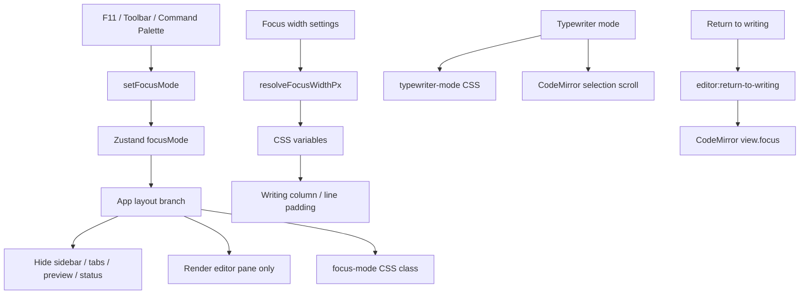

# No.1 Markdown Editor の Focus を解説する: F11 で書く面だけを残し、幅・行・スクロールを整える

## 先に結論

`No.1 Markdown Editor` の Focus は、ただ画面を広くするための fullscreen ではありません。

`F11` または toolbar の Focus ボタンを押すと、アプリは次のように切り替わります。

1. sidebar、tabs、status bar、preview を隠す
2. editor だけを中央の writing column に置く
3. gutter と行番号を隠す
4. active line 以外を薄くして、今書いている行に視線を寄せる
5. Focus 用の幅 preset / custom 幅を CSS variable として反映する
6. Typewriter mode と組み合わせると、カーソル行を画面中央付近に保つ

ここがかなり大事です。

Focus は `viewMode` の 1 つとして雑に扱っているのではなく、**通常レイアウトの上に重なる writing state** として作っています。

そのため、Source / WYSIWYG の編集体験はそのまま使いながら、周辺 UI だけを静かに消せます。

この記事では、この Focus の実装をコードで分解します。

## この記事で分かること

- `F11` と toolbar から Focus mode を切り替える仕組み
- Focus mode で sidebar、tabs、preview、status bar をどう隠しているのか
- Focus 用の writing column 幅を preset / custom で制御する方法
- CSS variable で CodeMirror の行 padding を変える設計
- active line だけを強調する CSS
- Typewriter mode でカーソル行を中央に寄せる実装
- Focus 設定を Zustand でどう保存しているのか
- editor に focus を戻す `editor:return-to-writing` event
- テストでこの UI の約束をどう守っているのか

## 対象読者

- Markdown editor に集中執筆モードを作りたい方
- CodeMirror を使って writing-focused UI を作っている方
- sidebar / preview / toolbar を持つ editor アプリを設計している方
- Focus mode と Typewriter mode を別々の責務として実装したい方
- 設定の永続化と一時的な UI state を分けたい方

## まず、ユーザー体験

通常状態では、`No.1 Markdown Editor` は sidebar、document tabs、editor、preview、status bar を持つ IDE 風の UI です。

これは整理、検索、比較、プレビュー確認には便利です。
しかし、長い文章を書いているときは、周辺 UI が少し邪魔になることがあります。

そこで Focus を有効にします。

| 操作 | 動き |
| --- | --- |
| `F11` | Focus mode の on / off |
| toolbar の Focus ボタン | Focus mode の on / off |
| Command Palette の `view.focus` | Focus mode の on / off |
| Typewriter mode | カーソル行を画面中央付近に保つ |
| Focus width | writing column の最大幅を調整する |

Focus mode に入ると、画面には editor だけが残ります。

ただし、完全に何も表示しないわけではありません。
右上には小さく `フォーカスモード · F11` という pill を出しています。

これは地味ですが重要です。

ユーザーが「今なぜ toolbar が消えているのか」「どう戻ればいいのか」を見失わないようにするためです。

## 全体像

ざっくり図にすると、こうなります。



ポイントは、Focus mode と Typewriter mode を同じものにしていないことです。

- Focus mode: 画面構造を静かにする
- Focus width: 書く面の幅を決める
- Typewriter mode: カーソル位置を読みやすい高さに保つ
- return-to-writing: sidebar などから editor へ focus を戻す

この分け方が実践的です。

## 1. Focus は `F11` で切り替える

グローバル shortcut は `App.tsx` で扱っています。

```tsx
useEffect(() => {
  const onKeyDown = (event: KeyboardEvent) => {
    if (event.key === 'F11') {
      event.preventDefault()
      const store = useEditorStore.getState()
      store.setFocusMode(!store.focusMode)
    }
  }

  window.addEventListener('keydown', onKeyDown)
  return () => window.removeEventListener('keydown', onKeyDown)
}, [])
```

やっていることはシンプルです。

1. `F11` を検出する
2. browser / shell 側の既定動作を止める
3. Zustand store の現在値を読む
4. `focusMode` を反転する

ここで `useEditorStore.getState()` を使っているのがポイントです。

React render 時点の closure に閉じた値ではなく、shortcut が押された瞬間の store state を使えます。

Focus は toolbar からも切り替えられます。

```tsx
<ToolbarBtn
  title={t('toolbar.focusMode')}
  onClick={() => setFocusMode(!focusMode)}
  active={focusMode}
  pressed={focusMode}
  variant="mode"
>
  <span data-toolbar-action="focus-mode" className="contents">
    <AppIcon name="focus" size={16} />
    <span className="text-xs font-medium">{t('viewMode.focus')}</span>
  </span>
</ToolbarBtn>
```

`pressed={focusMode}` を渡しているので、button としての pressed state も表現できます。

見た目だけの active ではなく、操作状態としても Focus が on であることを伝えられます。

## 2. Command Palette にも Focus command を置く

Focus は toolbar 専用機能ではありません。

Command Palette からも呼び出せるように、command registry に入れています。

```ts
{
  id: 'view.focus',
  label: t('commands.viewFocusMode'),
  icon: '🎯',
  category: 'view',
  shortcut: 'F11',
  action: () => store.setFocusMode(!store.focusMode),
}
```

これで UI の入口は 3 つになります。

- keyboard: `F11`
- toolbar: Focus button
- command palette: `view.focus`

editor アプリでは、頻繁に使う操作ほど入口を複数持たせたほうがよいです。

ただし、入口が増えても最終的には同じ `setFocusMode()` に流しています。

ここが大事です。

入口ごとに別々の state を持たないので、挙動がずれません。

## 3. Focus 用の値を App で CSS variable にする

Focus mode の見た目は CSS だけでは決まりません。

ユーザー設定から writing column の幅を計算し、それを CSS variable として root に渡しています。

```tsx
const focusColumnWidth = resolveFocusWidthPx(focusWidthMode, focusWidthCustomPx)
const focusColumnPadding = resolveFocusInlinePaddingPx(focusColumnWidth)

const appStyle = {
  background: 'transparent',
  '--focus-column-max-width': `${focusColumnWidth}px`,
  '--focus-column-inline-padding': `${focusColumnPadding}px`,
  zoom: `${zoom}%`,
} as CSSProperties
```

この設計の良いところは、React 側と CSS 側の責務が分かれていることです。

- React: 設定値から最終 px を解決する
- CSS: その px を使って layout と CodeMirror line padding を作る

つまり、CSS は store を知らなくてよい。
React も `.cm-line` の細かい selector を知らなくてよい。

この接続点が CSS variable です。

## 4. Focus mode は通常 viewMode とは別の boolean

store の初期値を見ると、Focus は `viewMode` ではなく `focusMode` として持っています。

```ts
focusMode: false,
setFocusMode: (focusMode) => set({ focusMode }),
focusWidthMode: 'comfortable',
setFocusWidthMode: (focusWidthMode) => set({ focusWidthMode }),
focusWidthCustomPx: FOCUS_WIDTH_PRESET_VALUES.comfortable,
setFocusWidthCustomPx: (focusWidthCustomPx) =>
  set({ focusWidthCustomPx: clampFocusWidthPx(focusWidthCustomPx) }),
typewriterMode: false,
setTypewriterMode: (typewriterMode) => set({ typewriterMode }),
```

この判断はかなり良いです。

`source` / `split` / `preview` は、文書を見る surface の切り替えです。
一方、Focus は周辺 UI を消して書くための状態です。

この 2 つを同じ enum に入れると、`preview mode の focus` や `wysiwyg の focus` のような表現が難しくなります。

だから `focusMode` は独立した boolean として扱っています。

## 5. Focus mode では sidebar を出さない

sidebar は次のように制御されています。

```tsx
const showSidebar = sidebarOpen && !focusMode
```

`sidebarOpen` が `true` でも、Focus mode の間は表示しません。

ここが大事です。

Focus に入ったときに `sidebarOpen` 自体を `false` にしてしまうと、Focus を抜けた後に元の sidebar 状態を失います。

この実装では、

```txt
sidebarOpen はユーザー設定として残す
Focus 中だけ showSidebar を false にする
```

という扱いです。

そのため、Focus を抜けると sidebar は元の状態に戻ります。

## 6. Root class で Focus と Typewriter を同時に表現する

root element には、Focus と Typewriter の class を別々に付けています。

```tsx
<div
  className={`flex flex-col h-full w-full overflow-hidden${focusMode ? ' focus-mode' : ''}${typewriterMode ? ' typewriter-mode' : ''}`}
  style={appStyle}
>
```

ここも重要です。

Focus mode と Typewriter mode は独立しています。

- Focus だけ on
- Typewriter だけ on
- 両方 on
- 両方 off

この 4 パターンを自然に表現できます。

CSS でも `.focus-mode` と `.typewriter-mode` を分けているので、後から調整しやすいです。

## 7. Focus mode では toolbar を小さな pill に変える

Focus mode の間は、通常 toolbar を出しません。

代わりに、右上に小さな状態表示だけを出しています。

```tsx
{focusMode ? (
  <div className="flex h-12 items-center justify-end px-1">
    <div
      className="text-xs px-3 py-1 rounded-full pointer-events-none select-none opacity-60"
      style={{
        background: 'color-mix(in srgb, var(--bg-secondary) 88%, transparent)',
        color: 'var(--text-muted)',
        border: '1px solid color-mix(in srgb, var(--border) 82%, transparent)',
      }}
    >
      {t('toolbar.focusMode')} · F11
    </div>
  </div>
) : (
  <div className="toolbar-scroll-shell">
    <Toolbar />
  </div>
)}
```

この pill は操作部品ではありません。

`pointer-events-none` にしているので、クリック対象ではなく状態表示として扱っています。

Focus mode で大事なのは、UI を完全に消しすぎないことです。

完全に何も出さないと、ユーザーは「戻り方」を忘れたときに困ります。
でも、大きな toolbar を残すと集中を邪魔します。

この実装は、その中間を狙っています。

## 8. Focus mode では tabs と status bar も隠す

document tabs は Focus mode では描画しません。

```tsx
{!focusMode && <DocumentTabs />}
```

status bar も同じです。

```tsx
{!focusMode && <StatusBar saving={saving} />}
```

ここも `display: none` ではなく、React の render branch で出し分けています。

Focus mode の画面に必要ない UI は、そもそも描画しない。
これにより、視覚的にも DOM 的にも Focus の画面が軽くなります。

## 9. Focus mode では editor pane だけを描画する

通常 layout では、editor と preview を viewMode に応じて並べます。

Focus mode では、その分岐を丸ごと変えます。

```tsx
{focusMode ? (
  <div className="flex-1 min-w-0 overflow-hidden flex items-start justify-center focus-mode-container h-full">
    <div className="focus-mode-column h-full w-full">
      {renderEditorPane()}
    </div>
  </div>
) : (
  <div className="flex flex-1 min-h-0 min-w-0">
    {showEditor && (
      <div
        className="min-h-0 flex-shrink-0 overflow-hidden"
        style={{ width: showPreview ? `${editorRatio * 100}%` : '100%' }}
      >
        {renderEditorPane()}
      </div>
    )}

    {showPreview && (
      <div className="flex-1 min-h-0 min-w-0 overflow-hidden">
        {renderPreviewPane()}
      </div>
    )}
  </div>
)}
```

この分岐で、Focus mode のときは preview を描画しません。

これは仕様として分かりやすいです。

Focus は「比較」や「確認」ではなく、「書く」ための mode です。
だから editor pane だけを残します。

ただし、`renderEditorPane()` は同じなので、Source / WYSIWYG の編集基盤は通常時と共有できます。

Focus 専用の editor を別に作っていないのが良いところです。

## 10. Focus width の preset は高解像度 display 向けに持つ

Focus 用の幅は `src/lib/focusWidth.ts` に集約されています。

```ts
export type FocusWidthMode = 'narrow' | 'comfortable' | 'wide' | 'custom'

export const FOCUS_WIDTH_PRESET_VALUES = {
  narrow: 1280,
  comfortable: 1600,
  wide: 1920,
} as const

export const FOCUS_WIDTH_CUSTOM_MIN = 840
export const FOCUS_WIDTH_CUSTOM_MAX = 2160
export const FOCUS_WIDTH_CUSTOM_STEP = 20
```

プリセットは 3 つです。

| preset | width |
| --- | ---: |
| narrow | `1280px` |
| comfortable | `1600px` |
| wide | `1920px` |

さらに custom は `840px` から `2160px` まで、`20px` step で調整できます。

ここではかなり広めの値を持っています。

Markdown editor は desktop app として使われることが多く、5K / 6K / ultrawide display でも「中央の狭い紙」になりすぎないほうがよいからです。

## 11. custom width は clamp して step に丸める

custom 幅はそのまま保存しません。

```ts
export function clampFocusWidthPx(px: number): number {
  const snapped = Math.round(px / FOCUS_WIDTH_CUSTOM_STEP) * FOCUS_WIDTH_CUSTOM_STEP
  return Math.min(FOCUS_WIDTH_CUSTOM_MAX, Math.max(FOCUS_WIDTH_CUSTOM_MIN, snapped))
}
```

やっていることは 2 つです。

1. `20px` step に丸める
2. `840px` から `2160px` の範囲に収める

この小さな補正は重要です。

range input や外部からの値で、中途半端な `973px` のような値が入っても、最終的には `980px` になります。

設定値は長く残るので、保存する値をきれいに保つことは UI 品質に効きます。

## 12. preset と custom の解決を 1 関数に寄せる

最終的な幅は `resolveFocusWidthPx()` で決めます。

```ts
export function resolveFocusWidthPx(mode: FocusWidthMode, customPx: number): number {
  switch (mode) {
    case 'narrow':
      return FOCUS_WIDTH_PRESET_VALUES.narrow
    case 'comfortable':
      return FOCUS_WIDTH_PRESET_VALUES.comfortable
    case 'wide':
      return FOCUS_WIDTH_PRESET_VALUES.wide
    case 'custom':
    default:
      return clampFocusWidthPx(customPx)
  }
}
```

`App.tsx` や `ThemePanel.tsx` が、それぞれ勝手に preset を解釈しないのが良いです。

幅の仕様は `focusWidth.ts` に閉じ込める。
UI はその結果を使うだけ。

この分離により、将来 preset 値を変えても影響範囲が小さくなります。

## 13. line padding は幅から自動で決める

Focus mode では、writing column の最大幅だけでなく、CodeMirror の行 padding も変えています。

```ts
export function resolveFocusInlinePaddingPx(widthPx: number): number {
  return Math.min(128, Math.max(56, Math.round(widthPx * 0.1)))
}
```

これは、

```txt
幅の 10% を padding にする
ただし最小 56px、最大 128px
```

という意味です。

幅が広くなるほど余白も少し増えます。
ただし広い display で余白が増えすぎないよう、`128px` で止めています。

これにより、narrow / comfortable / wide / custom のどれを選んでも、行の左右余白が極端になりにくくなります。

## 14. ThemePanel で Focus width を調整する

設定 panel では、現在の Focus width を表示し、slider と preset button で変更できます。

```tsx
const resolvedFocusWidthPx = resolveFocusWidthPx(focusWidthMode, focusWidthCustomPx)

const focusWidthPresets = [
  { mode: 'narrow', label: t('themePanel.focusWidthPresets.narrow'), value: FOCUS_WIDTH_PRESET_VALUES.narrow },
  { mode: 'comfortable', label: t('themePanel.focusWidthPresets.comfortable'), value: FOCUS_WIDTH_PRESET_VALUES.comfortable },
  { mode: 'wide', label: t('themePanel.focusWidthPresets.wide'), value: FOCUS_WIDTH_PRESET_VALUES.wide },
]
```

slider は `focusWidth.ts` の定数をそのまま使います。

```tsx
<input
  type="range"
  min={FOCUS_WIDTH_CUSTOM_MIN}
  max={FOCUS_WIDTH_CUSTOM_MAX}
  step={FOCUS_WIDTH_CUSTOM_STEP}
  value={resolvedFocusWidthPx}
  onChange={(event) => {
    applyFocusWidth(Number(event.target.value))
  }}
/>
```

この実装で良いのは、UI と仕様が同じ定数を見ていることです。

`min` / `max` / `step` を UI 側で再定義しないので、仕様のズレが起きにくいです。

## 15. slider の値が preset と一致したら preset mode に戻す

幅を適用する関数はこうです。

```tsx
function applyFocusWidth(nextWidth: number) {
  setFocusWidthCustomPx(nextWidth)

  const matchedPreset = focusWidthPresets.find(({ value }) => value === nextWidth)
  setFocusWidthMode(matchedPreset?.mode ?? 'custom')
}
```

ここも細かいですが良い設計です。

たとえば slider で `1600px` に合わせたとき、それは `custom 1600px` ではなく `comfortable` として扱えます。

これにより、UI 上の active preset 表示と内部 state が自然に一致します。

## 16. CSS は writing column を中央に置く

Focus mode の layout は CSS で作ります。

```css
.focus-mode-container {
  background: var(--editor-bg);
  animation: focusFadeIn 0.4s cubic-bezier(0.4, 0, 0.2, 1);
}

.focus-mode-column {
  max-width: var(--focus-column-max-width);
  margin: 0 auto;
  height: 100%;
}
```

`max-width` に React から渡した `--focus-column-max-width` を使っています。

これにより、wide display では中央にまとまり、狭い window では `w-full` の範囲で自然に縮みます。

`focusFadeIn` の animation も小さく効いています。

画面構造が切り替わる瞬間に、急に UI が消えるのではなく、少しだけ状態変化を柔らかくします。

## 17. CodeMirror の gutter を隠す

Focus mode では、CodeMirror の gutter を隠します。

```css
.focus-mode-container .cm-gutters {
  display: none !important;
}
```

行番号は編集時には便利です。
しかし、文章を書く mode では、常に必要な情報ではありません。

特に Markdown の本文を書くときは、行番号よりも文章の流れに集中したいことが多いです。

そのため、Focus mode では gutter を消して、エディターを writing surface に寄せています。

## 18. CodeMirror の行 padding を Focus 用に変える

Focus mode の行 padding は、通常 editor と別にしています。

```css
.focus-mode-container .cm-content {
  padding: 24px 0 var(--document-bottom-buffer) !important;
}

.focus-mode-container .cm-line {
  padding: 0 var(--focus-column-inline-padding) !important;
}
```

`cm-content` には上下の余白を持たせます。
左右の余白は `cm-line` に持たせます。

ここで `--focus-column-inline-padding` を使うことで、Focus width に応じた余白を作れます。

Markdown editor では、単に `max-width` を狭くするだけでは不十分です。

行の内側余白まで調整しないと、文字が端に寄りすぎたり、逆に余白が過剰になったりします。

## 19. active line 以外を薄くする

Focus mode では、active line を残して他の行を少し薄くしています。

```css
.focus-mode .focus-mode-container .cm-line:not(.cm-activeLine) {
  opacity: 0.35;
  transition: opacity 0.3s ease;
}

.focus-mode .focus-mode-container .cm-activeLine {
  opacity: 1 !important;
  background: transparent !important;
  transition: opacity 0.3s ease;
}
```

これは iA Writer 的な line focus に近い考え方です。

周囲の文脈は残す。
でも、今書いている行に視線を集める。

完全に他の行を消すと文脈を失います。
何も変えないと Focus mode の意味が弱くなります。

`opacity: 0.35` は、その中間です。

## 20. Typewriter mode は CSS と scroll 処理で作る

Typewriter mode は Focus mode と別機能ですが、組み合わせるとかなり効きます。

CSS では、content の上下に大きな余白を足しています。

```css
.typewriter-mode .cm-content {
  padding-top: 40vh !important;
  padding-bottom: 40vh !important;
}
```

これだけでも、文書の先頭や末尾で cursor 行を中央付近に置きやすくなります。

さらに CodeMirror 側で selection change に合わせて scroll します。

```tsx
useEffect(() => {
  if (!typewriterMode) return

  const view = viewRef.current
  if (!view) return

  const dom = view.scrollDOM
  const onSelectionChange = () => {
    const selection = view.state.selection.main.head
    const coords = view.coordsAtPos(selection)
    if (!coords) return

    const middle = dom.getBoundingClientRect().top + dom.clientHeight / 2
    dom.scrollTop += coords.top - middle
  }

  view.dom.addEventListener('keyup', onSelectionChange)
  view.dom.addEventListener('click', onSelectionChange)
  return () => {
    view.dom.removeEventListener('keyup', onSelectionChange)
    view.dom.removeEventListener('click', onSelectionChange)
  }
}, [typewriterMode])
```

やっていることは単純です。

1. 現在の cursor position を取得する
2. CodeMirror の座標に変換する
3. editor viewport の中央を計算する
4. cursor の top と中央の差分だけ `scrollTop` を動かす

Typewriter mode は「画面を静かにする」機能ではありません。
「書いている位置を一定に保つ」機能です。

だから Focus mode と別にしているのが自然です。

## 21. Focus width は保存するが、Focus mode 自体は保存しない

Zustand の `partialize` を見ると、Focus 関連の保存対象が分かります。

```ts
partialize: (s) => ({
  viewMode: s.viewMode,
  sidebarWidth: s.sidebarWidth,
  sidebarOpen: s.sidebarOpen,
  sidebarTab: s.sidebarTab,
  editorRatio: s.editorRatio,
  focusWidthMode: s.focusWidthMode,
  focusWidthCustomPx: s.focusWidthCustomPx,
  lineNumbers: s.lineNumbers,
  wordWrap: s.wordWrap,
  typewriterMode: s.typewriterMode,
  wysiwygMode: s.wysiwygMode,
})
```

ここで重要なのは、`focusMode` 自体は保存していないことです。

保存するものは、

- `focusWidthMode`
- `focusWidthCustomPx`
- `typewriterMode`

です。

つまり、ユーザーの執筆環境設定は保存します。
しかし、アプリを閉じた瞬間に Focus mode だったかどうかは保存しません。

これはかなり実用的です。

次回起動時に toolbar や sidebar が突然消えた状態で始まると、ユーザーは混乱しやすいからです。

## 22. i18n も Focus の一部

日本語 locale では、Focus width と Typewriter mode の文言を持っています。

```json
{
  "themePanel": {
    "focusWidth": "フォーカス幅",
    "focusWidthHint": "フォーカスモード専用です。プリセット幅は現代の高解像度ディスプレイ向けに引き上げてあり、さらに必要な場合だけカスタムを使います。",
    "focusWidthPresets": {
      "narrow": "集中",
      "comfortable": "快適",
      "wide": "ワイド読書",
      "custom": "カスタム"
    },
    "typewriterMode": "タイプライターモード"
  }
}
```

ここで良いのは、単に `narrow` / `comfortable` / `wide` を直訳していないことです。

Focus width は数値設定ですが、ユーザーにとっては「何 px か」より「どう使う幅か」のほうが大事です。

- 集中
- 快適
- ワイド読書
- カスタム

というラベルにすることで、設定の意味が伝わりやすくなります。

## 23. return-to-writing event で editor に focus を戻す

Focus という言葉は、画面 mode だけではありません。

このアプリでは、sidebar などから editor へ focus を戻すための event も用意しています。

```ts
export const EDITOR_RETURN_TO_WRITING_EVENT = 'editor:return-to-writing'

export function dispatchEditorReturnToWriting(): boolean {
  if (typeof document === 'undefined') return false
  document.dispatchEvent(new CustomEvent(EDITOR_RETURN_TO_WRITING_EVENT))
  return true
}
```

sidebar 側では、必要なときにこの event を投げます。

```ts
function returnToWriting(): boolean {
  setSidebarOpen(false)
  return dispatchEditorReturnToWriting()
}
```

そして `CodeMirrorEditor` 側が event を聞きます。

```tsx
useEffect(() => {
  const handleReturnToWriting = () => {
    const view = viewRef.current
    if (!view) return
    view.focus()
  }

  document.addEventListener(EDITOR_RETURN_TO_WRITING_EVENT, handleReturnToWriting)
  return () => {
    document.removeEventListener(EDITOR_RETURN_TO_WRITING_EVENT, handleReturnToWriting)
  }
}, [])
```

これで、sidebar から文書位置へ移動したあと、editor に focus を戻せます。

「Focus mode」と「editor focus」は別の話ですが、どちらも writing experience に直結します。

## 24. なぜ return-to-writing を document event にしているのか

`dispatchEditorReturnToWriting()` は、React props で editor の ref を直接渡していません。

代わりに document event を使っています。

この理由は、editor と sidebar の距離が遠いからです。

sidebar は document navigation や file operation を持ちます。
CodeMirror の `EditorView` は editor component の中に閉じています。

この 2 つを props で強く結びつけると、component の依存が重くなります。

document event にすると、

- sender は `editor:return-to-writing` を投げるだけ
- receiver は CodeMirror の `view.focus()` を実行するだけ
- event が不要になれば listener を外すだけ

という疎結合になります。

小さな event ですが、編集 UI ではこういう接続が効きます。

## 25. Focus mode のテスト

Focus width は `tests/focus-width.test.ts` で守っています。

```ts
test('resolveFocusWidthPx returns the expected preset widths', () => {
  assert.equal(resolveFocusWidthPx('narrow', 999), FOCUS_WIDTH_PRESET_VALUES.narrow)
  assert.equal(resolveFocusWidthPx('comfortable', 999), FOCUS_WIDTH_PRESET_VALUES.comfortable)
  assert.equal(resolveFocusWidthPx('wide', 999), FOCUS_WIDTH_PRESET_VALUES.wide)
})
```

custom width の clamp も確認しています。

```ts
test('resolveFocusWidthPx clamps custom widths into the supported range', () => {
  assert.equal(resolveFocusWidthPx('custom', FOCUS_WIDTH_CUSTOM_MIN - 200), FOCUS_WIDTH_CUSTOM_MIN)
  assert.equal(resolveFocusWidthPx('custom', FOCUS_WIDTH_CUSTOM_MAX + 200), FOCUS_WIDTH_CUSTOM_MAX)
  assert.equal(resolveFocusWidthPx('custom', 973), 980)
})
```

line padding の範囲もテストしています。

```ts
test('resolveFocusInlinePaddingPx scales with width but stays within readable bounds', () => {
  assert.equal(resolveFocusInlinePaddingPx(840), 84)
  assert.equal(resolveFocusInlinePaddingPx(1280), 128)
  assert.equal(resolveFocusInlinePaddingPx(1600), 128)
})
```

このテストの狙いは、見た目を pixel perfect に固定することではありません。

守っているのは、

- preset 幅が変わっていないこと
- custom 幅が範囲外に出ないこと
- step 丸めが効くこと
- line padding が読みやすい範囲に収まること

です。

## 26. CSS wiring もテストで守る

Focus mode の editor padding は `tests/editor-scroll-wiring.test.ts` でも確認されています。

```ts
assert.match(
  css,
  /\.focus-mode-container \.cm-content\s*\{[\s\S]*?padding:\s*24px 0 var\(--document-bottom-buffer\) !important;/
)
```

ここで守っているのは、Focus mode でも document bottom buffer を共有することです。

文末の行が viewport の下端に貼り付くと、長文編集ではかなり書きにくくなります。

通常 editor と Focus editor の両方で bottom buffer を持つことで、最後の段落も少し上に持ち上げて書けます。

## 27. return-to-writing もテストで守る

`editor:return-to-writing` の接続は `tests/editor-focus-wiring.test.ts` で守られています。

```ts
test('editor return-to-writing event is defined and CodeMirror listens for it', async () => {
  const [focusSource, editorSource] = await Promise.all([
    readFile(new URL('../src/lib/editorFocus.ts', import.meta.url), 'utf8'),
    readFile(new URL('../src/components/Editor/CodeMirrorEditor.tsx', import.meta.url), 'utf8'),
  ])

  assert.match(focusSource, /export const EDITOR_RETURN_TO_WRITING_EVENT = 'editor:return-to-writing'/)
  assert.match(focusSource, /document\.dispatchEvent\(new CustomEvent\(EDITOR_RETURN_TO_WRITING_EVENT\)\)/)

  assert.match(editorSource, /EDITOR_RETURN_TO_WRITING_EVENT/)
  assert.match(editorSource, /document\.addEventListener\(EDITOR_RETURN_TO_WRITING_EVENT, handleReturnToWriting\)/)
  assert.match(editorSource, /view\.focus\(\)/)
})
```

これは text-based な wiring test です。

E2E で sidebar を開いて、行へ飛んで、focus が戻ったかを全部見るより軽いです。

この機能で壊したくない約束は、

- event 名が存在する
- dispatch される
- CodeMirrorEditor が listen する
- 最終的に `view.focus()` する

なので、この粒度のテストが合っています。

## 28. Toolbar の位置もテストで守る

Focus button は toolbar の右側 utility control の中にあります。

その並び順も `tests/update-ui-wiring.test.ts` で確認されています。

```ts
const focusIndex = toolbar.indexOf('data-toolbar-action="focus-mode"')
const sourceIndex = toolbar.indexOf('data-view-mode={mode}')
const commandPaletteIndex = toolbar.indexOf('data-toolbar-action="command-palette"')

assert.notEqual(focusIndex, -1)
assert.notEqual(sourceIndex, -1)
assert.notEqual(commandPaletteIndex, -1)

assert.ok(focusIndex < sourceIndex)
assert.ok(sourceIndex < commandPaletteIndex)
```

UI の細かい並び順は、放っておくと少しずつ崩れます。

Focus は view mode 切り替えに近い操作なので、Source / Split / Preview の近くに置くのが自然です。

このように、「なぜその場所にあるか」がある UI は、軽い wiring test で守る価値があります。

## 実装の要点

### 1. Focus を viewMode に混ぜない

Focus は `source` / `split` / `preview` の仲間ではありません。

書くために周辺 UI を隠す state です。

だから `focusMode` boolean として別に持つほうが、Source / WYSIWYG の編集基盤をそのまま活かせます。

### 2. 設定値と一時状態を分ける

`focusWidthMode`、`focusWidthCustomPx`、`typewriterMode` は保存します。

でも `focusMode` 自体は保存しません。

これは、ユーザーの好みは覚えるが、次回起動時に突然 UI が隠れた状態にはしない、という判断です。

### 3. 幅の仕様は helper に寄せる

preset、custom clamp、padding 計算を `focusWidth.ts` に集めています。

React component がそれぞれ勝手に数値を解釈しないので、仕様変更に強くなります。

### 4. CSS variable で CodeMirror の見た目につなぐ

Focus width の値を CSS variable にして、`.focus-mode-column` と `.cm-line` に渡しています。

React と CodeMirror CSS の境界として、かなり扱いやすい形です。

### 5. Typewriter mode は別責務にする

Focus は画面を静かにする。
Typewriter は cursor 行を読みやすい高さに置く。

似ていますが責務は違います。

別々に実装することで、ユーザーは必要な組み合わせを選べます。

## この記事の要点を 3 行でまとめると

1. Focus mode は、sidebar / tabs / preview / status bar を隠し、同じ editor pane を中央の writing column として表示します。
2. Focus width は preset / custom / clamp / CSS variable で制御し、CodeMirror の行 padding まで含めて読みやすくしています。
3. Typewriter mode と return-to-writing event を分けて実装することで、集中表示、カーソル位置、editor focus をそれぞれ独立して扱えます。

## 参考実装

- App layout: `src/App.tsx`
- Focus width helper: `src/lib/focusWidth.ts`
- Editor focus event: `src/lib/editorFocus.ts`
- CodeMirror editor: `src/components/Editor/CodeMirrorEditor.tsx`
- Toolbar: `src/components/Toolbar/Toolbar.tsx`
- Theme panel: `src/components/ThemePanel/ThemePanel.tsx`
- Store: `src/store/editor.ts`
- Styles: `src/global.css`
- i18n: `src/i18n/locales/ja.json`, `src/i18n/locales/en.json`, `src/i18n/locales/zh.json`
- Tests: `tests/focus-width.test.ts`, `tests/editor-focus-wiring.test.ts`, `tests/editor-scroll-wiring.test.ts`, `tests/update-ui-wiring.test.ts`
