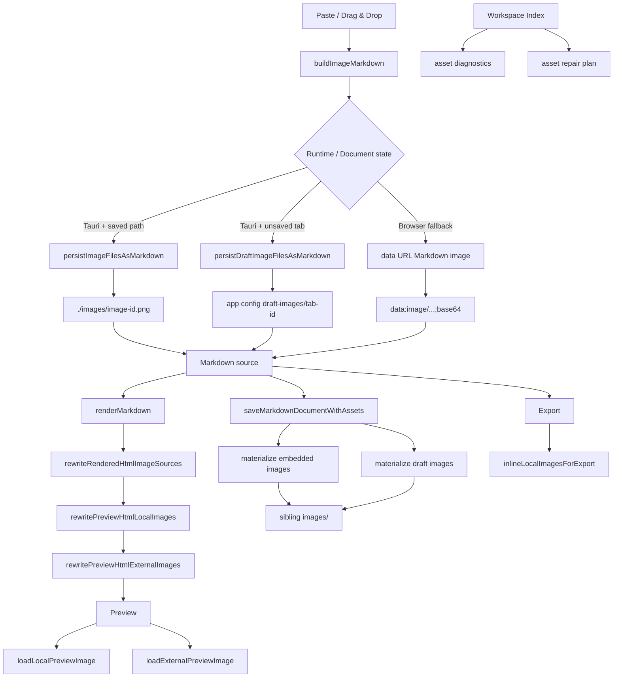

# No.1 Markdown Editor の Image Handling を解説する: Markdown source を壊さず画像を貼る、見る、保存する

## 先に結論

`No.1 Markdown Editor` の Image Handling は、画像 file を editor 内部の独自 object として抱え込む仕組みではありません。

ここがかなり大事です。

**Markdown source には Markdown image syntax を残し、画像 file の保存、Preview 用の解決、Export 用の inline 化、workspace 内の参照修復を別々の責務として扱っています。**

たとえば Markdown に次のような内容があるとします。

````md
# Product Note


````

Image Handling では、同じ画像でも操作によって扱いが変わります。

| 操作 | 画像の扱い |
| --- | --- |
| paste / drag & drop | Markdown image syntax を source に挿入する |
| saved document への paste | document の隣の `images/` に保存して相対 path にする |
| unsaved document への paste | app config の draft image directory に一時保存する |
| Web fallback | data URL の Markdown image にする |
| Preview local image | placeholder を置き、Tauri bridge で data URL に解決する |
| Preview remote image | safe なものは直接表示し、必要なものは click-to-load にする |
| HTML / PDF export | local image を解決できる場合は inline data URL にする |
| Preview copy / HTML paste | placeholder ではなく元の image source に戻す |
| workspace rename / move | asset reference を安全に書き換える |

つまり、この実装の基本方針はこうです。

```txt
Markdown source は image reference を持つ
画像 file は document の近く、または draft storage に置く
Preview は安全表示のために src を一時的に書き換える
Clipboard / paste では placeholder ではなく元 source を扱う
Export では持ち出しやすい HTML に近づける
workspace 操作では画像参照も一緒に追跡する
```

この記事では、この Image Handling 実装をコードで分解します。

## この記事で分かること

- paste / drag & drop した画像がどう Markdown source になるのか
- saved document と unsaved document で画像保存先を分ける理由
- Web fallback で data URL image を使う理由
- save 時に base64 image / draft image を `images/` に materialize する仕組み
- Preview が local image を placeholder から data URL に解決する方法
- remote image を direct load / bridge / click-to-load に分ける理由
- Windows absolute path / UNC path / Typora `typora-root-url` への対応
- WYSIWYG inline Markdown でも Windows local image を sanitizer 前に正規化する理由
- Export 時に local image を inline 化しつつ、失敗しても HTML を壊さない方法
- Preview copy / HTML paste で placeholder ではなく元 image source を使う方法
- workspace index が image asset、missing alt、remote asset warning を扱う方法
- folder rename / move 時に Markdown image reference を自動修復する方法
- テストで Image Handling の UX contract をどう守っているのか

## 対象読者

- Markdown editor の画像貼り付け / drag & drop を作りたい方
- Desktop / Browser の両方で local image preview を扱いたい方
- `img src`、relative path、data URL、file URL の扱いに悩んでいる方
- Preview と Export で画像の見え方を揃えたい方
- Typora / Obsidian / VS Code Markdown に近い asset workflow を作りたい方
- workspace 内の画像参照や missing asset repair まで考えたい方

## まず、ユーザー体験

ユーザーから見ると、Image Handling は特別な mode ではありません。

画像を clipboard から貼る。
画像 file を editor に drag & drop する。
Preview で画像を見る。
document を保存する。
HTML / PDF に export する。
folder を rename する。

この普通の workflow の中で、画像 reference が自然に保たれます。

たとえば、保存済みの `post.md` に `hero-image_v2.png` を貼ると、Markdown はこうなります。

```md

```

画像 file は `post.md` と同じ folder の `images/` に保存されます。

```txt
docs/
  post.md
  images/
    image-11.png
```

一方で、まだ保存していない document に画像を貼った場合は、すぐ隣の folder がありません。

そのため、まず app config の draft image directory に保存します。

```md

```

その後、document を `post.md` として保存したタイミングで、draft image は sibling `images/` に移されます。

```md

```

Markdown source は常に plain text のままです。

画像そのものを editor document に埋め込むのではなく、Markdown image reference と file system asset の関係を管理しています。

## 全体像

ざっくり図にすると、こうなります。



中心になる file は 1 つではありません。

- `CodeMirrorEditor.tsx`: paste / drag & drop の入口
- `documentPersistence.ts`: saved / draft image の保存と save 時の materialize
- `embeddedImages.ts`: data URL Markdown image を file にする
- `draftMarkdownImages.ts`: draft image reference を sibling `images/` にする
- `fileTypes.ts`: image extension、alt text、relative path
- `imageMarkdownInsertion.ts`: image Markdown の挿入 plan
- `previewLocalImages.ts`: local image placeholder / resolved source
- `previewLocalImage.ts`: Tauri local image bridge
- `previewExternalImages.ts`: remote image bridge / blocked placeholder
- `previewRemoteImage.ts`: Tauri remote image bridge
- `rehypeNormalizeImageSources.ts`: Windows / UNC path normalization
- `renderedImageSources.ts` / `imageRoots.ts`: Typora `typora-root-url`
- `wysiwygInlineMarkdown.ts`: WYSIWYG inline Markdown rendering と sanitizer 前の image source normalization
- `exportLocalImages.ts`: Export 用 local image inline
- `pasteHtml.ts`: HTML clipboard の image を Markdown image に戻す
- `previewClipboard.ts`: Preview selection copy
- `workspaceIndex/*`: asset reference / diagnostics / repair candidate
- `workspaceAssetRepair.ts`: folder move / rename 後の reference rewrite

Image Handling は「画像を表示する」だけではなく、document workflow 全体の機能です。

## 1. Markdown source は image reference を持つ

この editor では、画像を貼っても CodeMirror document に入るのは Markdown text です。

```md

```

画像 file の binary は別の場所に保存されます。

```txt
Markdown source:
  

Image binary:
  ./images/hero.png
```

この分離が重要です。

Markdown source は Git で diff でき、別の Markdown tool でも読めます。
画像 file は file system asset として扱えます。

独自 document model に画像 object を入れてしまうと、Markdown editor としての portability が落ちます。

## 2. Paste handler は image file を先に拾う

Source editor の paste handler は、clipboard item に image file があるかを見ます。

```ts
const imageFiles = Array.from(items)
  .filter((item) => item.type.startsWith('image/'))
  .map((item) => item.getAsFile())
  .filter((file): file is File => file !== null)
```

画像 file があれば、Markdown image text を作って挿入します。

```ts
const markdownText = await buildImageMarkdown(
  imageFiles,
  activeTab?.path ?? null,
  activeTab?.id ?? null
)
replaceSelectionWithImageMarkdown(activeView, markdownText)
```

ここで document に入るのは `File` object ではありません。

最終的には Markdown image syntax です。

## 3. Drag & drop も同じ path を使う

Drag & drop でも同じ `buildImageMarkdown()` を使います。

```ts
const imageFiles = Array.from(event.dataTransfer?.files ?? [])
  .filter((file) => file.type.startsWith('image/'))

const dropPos = view.posAtCoords({ x: event.clientX, y: event.clientY })
  ?? view.state.selection.main.from
```

drop 位置は CodeMirror の座標から document position に変換します。

```ts
insertImageMarkdown(view, markdownText, { from: dropPos, to: dropPos })
```

paste と drag & drop で別々の image persistence を持たないのがポイントです。

入口は違っても、document に入る Markdown image は同じ rule で作ります。

## 4. `buildImageMarkdown()` が保存先を決める

画像 file から Markdown image を作る判断は `buildImageMarkdown()` に集約されています。

```ts
async function buildImageMarkdown(
  files: File[],
  activeTabPath: string | null,
  activeTabId: string | null
): Promise<string> {
  if (isTauri) {
    const persistence = await getTauriFilePersistence()

    if (activeTabPath) {
      return persistImageFilesAsMarkdown(files, activeTabPath, persistence)
    }

    if (activeTabId) {
      return persistDraftImageFilesAsMarkdown(files, activeTabId, persistence)
    }
  }

  const snippets = await Promise.all(files.map((file) => fileToBase64Markdown(file)))
  return snippets.join('\n')
}
```

分岐は次の 3 つです。

```txt
Tauri + saved document:
  document の sibling images/ に保存する

Tauri + unsaved document:
  app config の draft-images/ に保存する

Browser:
  data URL Markdown image にする
```

Desktop と Browser では file system capability が違います。

その差を editor UI に漏らさず、Markdown image text の生成側で吸収しています。

## 5. 保存済み document では sibling `images/` に置く

保存済み document に画像を貼る場合、画像は document の隣の `images/` に保存します。

```ts
export async function persistImageFilesAsMarkdown(
  files: PersistableImageFile[],
  activeTabPath: string,
  persistence: Pick<FilePersistence, 'dirname' | 'join' | 'writeBinaryFile'>,
  options: PersistOptions = {}
): Promise<string> {
  const imageDir = await persistence.join(await persistence.dirname(activeTabPath), imageDirectory)
  // ...
}
```

file name は batch id と index から作ります。

```ts
const suffix = files.length > 1 ? `-${index + 1}` : ''
const fileName = `image-${batchId}${suffix}.${extension}`
```

返す Markdown は relative path です。

```ts
return `})`
```

たとえば test では、2 枚の画像を貼るとこうなります。

```md


```

画像 file は次の場所に保存されます。

```txt
/docs/images/image-11-1.png
/docs/images/image-11-2.webp
```

Markdown document と asset folder が近いので、folder ごと移動しやすい構造になります。

## 6. 未保存 document では draft image directory に置く

未保存 document には、まだ sibling `images/` を作る基準 path がありません。

そのため、Tauri desktop では app config directory の中に draft image を置きます。

```ts
const draftImageDir = await persistence.join(
  await persistence.appConfigDir(),
  draftImageDirectory,
  normalizeDraftImageScope(draftId)
)
```

Markdown には absolute path を bracketed destination として入れます。

```ts
return `)})`
```

space や parentheses を含む path でも Markdown destination が壊れないように、必要なら `<...>` で包みます。

```md

```

未保存 document でも画像を失わないための一時保存です。

## 7. Browser fallback は data URL にする

Browser では、desktop app のように任意の path へ binary file を保存できません。

そのため、fallback として data URL の Markdown image を作ります。

```ts
async function fileToBase64Markdown(file: File): Promise<string> {
  const altText = getImageAltText(file.name)
  return new Promise((resolve) => {
    const reader = new FileReader()
    reader.onload = (event) => resolve(``)
    reader.readAsDataURL(file)
  })
}
```

これは理想の storage ではありません。

大きい画像では Markdown source が重くなります。

ただし Web で確実に画像を保持する fallback としては現実的です。

後で desktop save path に入ると、base64 image は file に materialize できます。

## 8. extension / alt text / relative path は helper に寄せる

画像 file name の細かい処理は `fileTypes.ts` に寄せています。

```ts
const KNOWN_IMAGE_EXTENSIONS = new Set(['png', 'jpg', 'jpeg', 'gif', 'webp', 'svg', 'bmp', 'avif'])
```

`jpeg` は Markdown path 上では `jpg` に揃えます。

```ts
if (extension && KNOWN_IMAGE_EXTENSIONS.has(extension)) {
  return extension === 'jpeg' ? 'jpg' : extension
}
```

alt text は file name から作ります。

```ts
export function getImageAltText(fileName: string): string {
  const withoutExtension = fileName.replace(/\.[a-z0-9]+$/i, '')
  const normalized = withoutExtension.replace(/[_-]+/g, ' ').replace(/\s+/g, ' ').trim()
  return normalized.replace(/[\[\]]/g, '') || 'image'
}
```

たとえばこうです。

```txt
hero-image_v2.png  -> hero image v2
[cover]_draft.JPG  -> cover draft
.png               -> image
```

relative path も helper で作ります。

```ts
export function buildRelativeMarkdownImagePath(
  fileName: string,
  directory = DEFAULT_MARKDOWN_IMAGE_DIRECTORY
): string {
  const normalizedDirectory = directory.replace(/\\/g, '/').replace(/^\.?\//, '').replace(/\/+$/, '').trim()
  return normalizedDirectory ? `./${normalizedDirectory}/${fileName}` : `./${fileName}`
}
```

小さな helper ですが、Windows / macOS / Linux の path 差を UI code へ漏らさないために重要です。

## 9. 画像挿入は Markdown insertion rule を再利用する

画像 Markdown の挿入は、特別な layout engine を持ちません。

```ts
export function prepareImageMarkdownInsertion(
  markdownText: string,
  followingText = ''
): ImageMarkdownInsertionPlan {
  return prepareMarkdownInsertion(markdownText, followingText)
}
```

つまり、画像だけ独自の改行 rule を持たせません。

普通の Markdown insertion と同じように、後続 paragraph との spacing を整えます。

test でも、base64 image や persisted image Markdown がそのまま保たれることを確認しています。

```txt
画像 Markdown は壊さない
既存の trailing newline は尊重する
次の paragraph を押しつぶさない
```

画像貼り付けは毎日使う操作なので、こういう地味な改行 contract が UX に効きます。

## 10. save 時に embedded data image を file にする

Web fallback や pasted HTML 由来で、Markdown source に data URL image が入ることがあります。

```md

```

Desktop で document を保存するタイミングでは、これを sibling `images/` に materialize します。

```ts
let nextContent = await materializeEmbeddedMarkdownImages(markdown, {
  batchId,
  imageDirectory,
  persistImage: async (fileName, bytes) => {
    await persistence.writeBinaryFile(await persistence.join(imageDir, fileName), bytes)
  },
})
```

変換後の Markdown はこうです。

```md

```

binary はこう保存されます。

```txt
/docs/images/image-7.png
```

Markdown source を軽くし、普通の file asset として扱えるようにしています。

## 11. embedded image の title も保持する

`materializeEmbeddedMarkdownImages()` は、画像 destination だけを書き換えます。

Markdown image title は suffix として保持します。

```ts
const titleSuffix = match.groups?.title ?? ''
replacements.push({
  value: `}${titleSuffix})`,
})
```

たとえば次のような Markdown です。

```md

```

file 化しても title を落とさないことが重要です。

```md

```

画像処理は path の話に見えますが、Markdown の semantic metadata も一緒に守る必要があります。

## 12. save 時に draft image も sibling `images/` に移す

未保存 document に貼った画像は、まず draft image directory にあります。

document を保存したら、draft image を sibling `images/` にコピーして Markdown を書き換えます。

```ts
nextContent = await materializeDraftMarkdownImages(nextContent, {
  batchId: batchId + 1,
  imageDirectory,
  draftRoots: [draftImageRoot],
  persistImage: async (fileName, sourcePath) => {
    await persistence.copyFile(sourcePath, await persistence.join(imageDir, fileName))
  },
})
```

変換前はこうです。

```md

```

保存後はこうです。

```md

```

draft storage はあくまで一時置き場です。

最終的な document は、自分の近くに asset を持つ構造へ戻します。

## 13. `saveMarkdownDocumentWithAssets()` は document と asset を一緒に保存する

save path の最終入口は `saveMarkdownDocumentWithAssets()` です。

```ts
export async function saveMarkdownDocumentWithAssets(
  markdown: string,
  savePath: string,
  persistence: FilePersistence,
  options: PersistOptions = {}
): Promise<string> {
  // embedded images
  // draft images
  await persistence.writeTextFile(savePath, nextContent)
  return nextContent
}
```

ここでやることは 3 つです。

```txt
data URL image を file にする
draft image を document 隣の images/ に移す
書き換え後の Markdown を保存する
```

document save は text file だけの操作ではありません。

Markdown source と asset file の整合性を作る operation です。

## 14. Preview は Markdown を render してから image source を整える

Preview は Markdown source を render したあと、画像 source を preview 用に書き換えます。

```tsx
rewritePreviewHtmlExternalImages(
  rewritePreviewHtmlLocalImages(html, {
    documentPath,
    resolvedImages,
  }),
  copy,
  baseOrigin,
  options
)
```

ここでの書き換えは、Markdown source を変更するものではありません。

Preview DOM 用の一時的な変換です。

```txt
Markdown source:
  

Preview DOM:
  
```

Preview の都合を source に漏らさないことが大事です。

## 15. Typora `typora-root-url` に対応する

Typora 互換の document では、front matter に `typora-root-url` が入ることがあります。

```md
---
typora-root-url: https://assets.example.com/posts
---


```

render 後の image source は `rewriteRenderedHtmlImageSources()` で解決します。

```ts
const rootUrl = getFrontMatterValue(options.frontMatter, 'typora-root-url')
const resolvedSource = resolveTyporaRootUrlAsset(source, rootUrl)
```

`resolveTyporaRootUrlAsset()` は、root の種類ごとに解決方法を変えます。

```txt
file URL root:
  file system path として解決する

absolute path root:
  file system path として解決する

HTTP root:
  URL として解決する

external / data / blob / file / absolute source:
  そのまま残す
```

Typora から持ってきた Markdown の画像が Preview で壊れにくくなります。

## 16. Windows absolute path / UNC path は sanitizer 前に file URL 化する

Markdown image source には Windows path が入ることがあります。

```md


```

そのままだと HTML sanitizer や URL parser で扱いにくいです。

そのため、`rehypeNormalizeImageSources()` で `` の `src` を file URL に寄せます。

```ts
if (!WINDOWS_DRIVE_PATH_PATTERN.test(source) && !WINDOWS_UNC_PATH_PATTERN.test(source)) {
  return source
}

const normalizedPath = normalizePath(source)
return `file:///${encodeURI(normalizedPath)}`
```

UNC path の場合は `file://server/share/...` 形式にします。

```ts
if (normalizedPath.startsWith('//')) {
  return `file:${encodeURI(normalizedPath)}`
}
```

Windows support は Markdown editor では避けられません。

path を早い段階で正規化しておくことで、Preview / Export / Clipboard の後段処理が安定します。

この正規化は Preview renderer だけの話ではありません。

WYSIWYG の inline Markdown renderer でも、`rehypeSanitize` の前に同じ normalize を通す必要があります。

```ts
const inlineMarkdownProcessor = unified()
  .use(remarkParse)
  .use(remarkGfm, { singleTilde: false })
  .use(remarkMath)
  .use(remarkRehype, { allowDangerousHtml: true })
  .use(rehypeInlineRawHtmlFallback)
  .use(rehypeSubscriptMarkers)
  .use(rehypeSuperscriptMarkers)
  .use(rehypeHighlightMarkers)
  .use(rehypeNormalizeImageSources)
  .use(rehypeSanitize, sanitizeSchema)
```

順番が重要です。

```txt
rehypeNormalizeImageSources:
  C:/... を file:///C:/... に変換する

rehypeSanitize:
  許可された URL scheme / attribute だけを残す
```

`C:/...` のまま sanitizer に渡すと、`C:` が URL scheme のように見えて `src` が落ちることがあります。

その結果、WYSIWYG inline media では画像ではなく broken image と alt text だけが見えてしまいます。

先に `file:///C:/...` へ寄せることで、Preview と同じ local image hydration path に入れられます。

## 17. local image の判定は source と documentPath の両方を見る

Preview で local image を解決するには、まず local source かどうかを判断します。

```ts
export function isLocalPreviewImageSource(source: string, documentPath: string | null | undefined): boolean {
  const trimmed = source.trim()
  if (!trimmed) return false
  if (/^(https?:|data:|blob:|asset:)/i.test(trimmed)) return false
  if (/^https?:\/\/asset\.localhost\//i.test(trimmed)) return false
  if (trimmed.startsWith('//')) return false
  if (/^file:/i.test(trimmed)) return true
  if (/^[A-Za-z]:[\\/]/.test(trimmed) || trimmed.startsWith('\\\\')) return true
  if (trimmed.startsWith('/')) return true
  return Boolean(documentPath?.trim())
}
```

relative path は、documentPath があるときだけ local image として扱います。

```txt
./images/hero.png + documentPathあり:
  local image

./images/hero.png + documentPathなし:
  解決基準がないので local image として扱わない

C:\docs\hero.png:
  absolute local image

https://example.com/hero.png:
  remote image
```

relative image は「どの document から見た relative なのか」が必要です。

この情報なしに無理に解決すると、間違った画像を表示する可能性があります。

## 18. local image は placeholder から始める

local image がまだ解決されていない場合、Preview HTML では placeholder に置き換えます。

```ts
nextAttributes = upsertHtmlAttribute(nextAttributes, 'src', LOCAL_PREVIEW_PLACEHOLDER)
nextAttributes = upsertHtmlAttribute(nextAttributes, 'data-local-src', source)
nextAttributes = upsertHtmlAttribute(nextAttributes, 'data-local-image', 'pending')
nextAttributes = upsertHtmlAttribute(nextAttributes, 'data-local-placeholder', LOCAL_PREVIEW_PLACEHOLDER)
```

ここで `data-local-src` に元 source を残しているのが重要です。

```html

```

Preview 表示では placeholder を使っても、Clipboard や再解決では元 source を使えます。

## 19. local image は Tauri bridge で data URL に解決する

Tauri desktop では、local image を直接 browser DOM から読むのではなく native bridge 経由で data URL にします。

```ts
return await invoke<string>('fetch_local_image_data_url', {
  source: normalizeLocalImageSource(trimmedSource),
  documentPath: trimmedDocumentPath || null,
})
```

結果は cache します。

```ts
const cacheKey = `${trimmedDocumentPath}\n${trimmedSource}`
const cached = localPreviewImageCache.get(cacheKey)
if (cached) {
  return cached
}
```

失敗した promise は cache から消します。

```ts
void task.then((resolvedSource) => {
  if (resolvedSource === null) {
    localPreviewImageCache.delete(cacheKey)
  }
})
```

一度失敗した画像でも、file が後から作られたり path が直ったりする可能性があります。

失敗を永久 cache しないのは、そのためです。

## 20. local image 解決後は Preview HTML を再構築する

Preview component は pending local image を見つけ、非同期に読み込みます。

```ts
const pendingLocalImages = Array.from(
  preview.querySelectorAll<HTMLImageElement>('img[data-local-src][data-local-image="pending"]')
)
```

解決できたら `resolvedLocalImages` に入れます。

```ts
void loadLocalPreviewImage(localSource, documentPath)
  .then((resolvedSource) => {
    if (!resolvedSource) return
    setResolvedLocalImages((current) =>
      current[key] === resolvedSource ? current : { ...current, [key]: resolvedSource }
    )
  })
```

次の render では `rewritePreviewHtmlLocalImages()` が `src` を data URL に差し替え、`data-local-*` を外します。

```ts
nextAttributes = upsertHtmlAttribute(nextAttributes, 'src', resolvedSource)
nextAttributes = removeHtmlAttribute(nextAttributes, 'data-local-src')
nextAttributes = removeHtmlAttribute(nextAttributes, 'data-local-image')
```

DOM を直接いじり続けるのではなく、state と HTML rewrite の流れに戻しているのがポイントです。

## 21. remote image は direct load と bridge を分ける

remote image はすべて block するわけではありません。

`rewritePreviewHtmlExternalImages()` は、source と current origin から扱いを決めます。

```ts
if (!requiresExternalImageBridge(source, baseOrigin, options)) {
  // direct load
  return buildImageTag(nextAttributes, selfClosingSlash)
}
```

bridge が必要な場合は、blocked placeholder にします。

```ts
nextAttributes = appendClass(nextAttributes, PREVIEW_EXTERNAL_IMAGE_CLASS)
nextAttributes = upsertHtmlAttribute(nextAttributes, 'src', placeholder)
nextAttributes = upsertHtmlAttribute(nextAttributes, 'data-external-src', source)
nextAttributes = upsertHtmlAttribute(nextAttributes, 'data-external-image', 'blocked')
```

判断は次のような方針です。

```txt
same-origin:
  direct load

safe な https remote:
  基本は direct load

secure origin 上の http remote:
  mixed content を避けるため bridge

bridgeAllExternalImages:
  外部画像をすべて bridge
```

remote image は security / privacy / mixed content に関係します。

Markdown の画像だからといって、常に無条件で読み込むわけではありません。

## 22. remote image placeholder は keyboard でも操作できる

blocked remote image は、ただの絵ではありません。

click / keyboard activation を持つ interactive element として扱います。

```ts
nextAttributes = upsertHtmlAttribute(nextAttributes, 'tabindex', '0')
nextAttributes = upsertHtmlAttribute(nextAttributes, 'role', 'button')
nextAttributes = upsertHtmlAttribute(nextAttributes, 'aria-label', `${copy.clickLabel}: ${host}`)
nextAttributes = upsertHtmlAttribute(nextAttributes, 'referrerpolicy', 'no-referrer')
```

Preview 側では Enter / Space を拾います。

```ts
const externalImage = (event.target as HTMLElement | null)
  ?.closest('img[data-external-src]') as HTMLImageElement | null

if ((event.key === 'Enter' || event.key === ' ') && externalImage) {
  event.preventDefault()
  event.stopPropagation()
  activateExternalImage(externalImage)
}
```

画像表示の安全策は、accessibility を犠牲にしてはいけません。

mouse だけでなく keyboard でも読み込めるようにしています。

## 23. remote image bridge は loading / error state を持つ

remote image を activate すると、まず loading state に入ります。

```ts
image.dataset.externalImage = 'loading'
image.setAttribute('aria-busy', 'true')
```

読み込みに成功したら bridge 用 metadata を外します。

```ts
image.classList.remove('preview-external-image')
image.removeAttribute('data-external-src')
image.removeAttribute('data-external-host')
image.removeAttribute('data-external-image')
image.removeAttribute('tabindex')
image.removeAttribute('role')
image.removeAttribute('aria-label')
image.removeAttribute('aria-busy')
```

失敗したら blocked placeholder に戻します。

```ts
const resetToBlocked = () => {
  image.src = placeholderSource
  image.dataset.externalImage = 'blocked'
  image.removeAttribute('aria-busy')
}
```

remote image は network error が起きます。

失敗時に broken image icon だけを出すのではなく、元の blocked state に戻すほうが Preview として安定します。

## 24. Tauri では remote image も native bridge で読める

Desktop app では、remote image を Tauri command で data URL に変換できます。

```ts
return await invoke<string>('fetch_remote_image_data_url', { url: trimmedSource })
```

`loadExternalPreviewImage()` も cache を持ちます。

```ts
const cached = previewImageCache.get(trimmedSource)
if (cached) {
  return cached
}
```

失敗した場合は cache から消します。

```ts
void task.then((resolvedSource) => {
  if (resolvedSource === null) {
    previewImageCache.delete(trimmedSource)
  }
})
```

remote image の読み込みは network や server policy に左右されます。

cache は効かせつつ、失敗を固定しないようにしています。

## 25. direct external image に fallback metadata を付けられる

Tauri では、safe な https image を direct load しても、実際には環境や CSP で失敗することがあります。

そのため、direct external image に fallback metadata を付ける option があります。

```ts
nextAttributes = upsertHtmlAttribute(nextAttributes, 'data-external-fallback-src', source)
nextAttributes = upsertHtmlAttribute(nextAttributes, 'data-external-fallback-host', host)
```

Preview 側では image error を捕まえます。

```ts
if (!image.dataset.externalFallbackSrc) return
if (image.dataset.externalFallbackState === 'loading') return

activateExternalImageFallback(image)
```

direct load が失敗したときだけ、bridge に切り替えます。

最初から全部 bridge するより軽く、失敗時には回復できる設計です。

## 26. Preview image は lazy / async を基本にする

remote image rewrite では、共通 attribute として `loading="lazy"` と `decoding="async"` を入れます。

```ts
function ensureSharedImageAttributes(attributes: string): string {
  let nextAttributes = upsertHtmlAttribute(attributes, 'loading', 'lazy')
  nextAttributes = upsertHtmlAttribute(nextAttributes, 'decoding', 'async')
  return nextAttributes
}
```

Markdown document には画像が何十枚も入ることがあります。

Preview を開いた瞬間にすべての image decode を同期的に走らせると、scroll や typing に影響します。

画像は document content ですが、editor の操作感も守る必要があります。

## 27. WYSIWYG inline media も同じ image rewrite を使う

WYSIWYG mode でも、inline media の表示は Preview と同じ local / external image rewrite を使います。

その前段として、inline Markdown fragment の rendering でも `rehypeNormalizeImageSources` を通します。

```ts
.use(rehypeNormalizeImageSources)
.use(rehypeSanitize, sanitizeSchema)
```

これにより、次のような Windows absolute local image も、

```md

```

sanitizer 後には local image として扱える `file:///C:/...` の `src` になります。

```ts
const withLocalImages = rewritePreviewHtmlLocalImages(withResolvedRoots, {
  documentPath: context.documentPath,
})

return rewritePreviewHtmlExternalImages(
  withLocalImages,
  copy,
  context.baseOrigin,
  options
)
```

これにより、Preview で見える画像と WYSIWYG の inline media が大きくズレにくくなります。

WYSIWYG は source editor の上にある live preview layer なので、画像の安全表示も Preview と同じ contract を持つべきです。

## 28. Export では local image を inline data URL に近づける

HTML / PDF export では、local image が外へ持ち出されたときに切れやすいです。

そのため、Export は local image を解決できる場合だけ inline data URL にします。

```ts
const { inlineLocalImagesForExport } = await import('../lib/exportLocalImages')
bodyHtml = await inlineLocalImagesForExport(bodyHtml, { documentPath })
```

`inlineLocalImagesForExport()` は、local image だけを対象にします。

```ts
if (!isLocalPreviewImageSource(source, documentPath)) {
  return ''
}
```

同じ画像は 1 回だけ解決します。

```ts
const key = buildLocalPreviewImageKey(source, documentPath)
if (!localImages.has(key)) {
  localImages.set(key, source)
}
```

Export では self-contained に近づけることが大事です。

ただし、すべてを無理に変換するわけではありません。

## 29. Export で解決できない local image は元のまま残す

local image の解決に失敗した場合、Export は image tag を壊しません。

```ts
const resolvedSource = await resolveLocalImage(source, documentPath || null)
if (resolvedSource && resolvedSource !== source) {
  resolvedImages.set(key, resolvedSource)
}
```

解決できたものだけ `src` を差し替えます。

```ts
if (!resolvedSource) {
  return buildImageTag(rawAttributes, selfClosingSlash)
}

return buildImageTag(upsertHtmlAttribute(rawAttributes, 'src', resolvedSource), selfClosingSlash)
```

この方針は現実的です。

```txt
解決できた local image:
  data URL にして HTML export に含める

解決できない local image:
  元の src を残す
```

Export は「全部成功しないなら失敗」ではなく、「成功した部分を改善し、失敗した部分を壊さない」ほうが document tool として扱いやすいです。

## 30. Preview copy は placeholder ではなく元 source に戻す

Preview では local image や blocked remote image に placeholder `src` が入ることがあります。

そのまま copy すると、Markdown に placeholder data URL が入ってしまいます。

そこで HTML paste / Preview copy の変換では、まず preview metadata を見ます。

```ts
const previewSource =
  sanitizeUrl(attributes['data-local-src']) ||
  sanitizeUrl(attributes['data-external-src']) ||
  sanitizeUrl(attributes['data-external-fallback-src'])
```

これにより、Preview から次のような DOM を copy しても、

```html

```

Markdown はこう戻せます。

```md

```

Preview の安全表示を、clipboard result に混ぜないための処理です。

## 31. HTML paste の image は Markdown image に戻す

HTML clipboard に `` がある場合、paste converter は Markdown image に serialize します。

```ts
function serializeImage(node: ClipboardHtmlAstNode): string {
  const src = getImageSource(node.attributes)
  if (!src) return ''

  const alt = escapeMarkdownText(node.attributes?.alt?.trim() || 'img')
  const title = node.attributes?.title?.trim()
  const destination = formatMarkdownDestination(src)
  const titleSuffix = title ? ` "${title.replace(/\\/g, '\\\\').replace(/"/g, '\\"')}"` : ''
  return ``
}
```

ここでも document に入るのは HTML ではありません。

HTML clipboard の image を Markdown image syntax に戻します。

`src` に space や parentheses がある場合は `<...>` destination にします。

```ts
return /[\s()<>]/.test(trimmed) ? `<${trimmed.replace(/>/g, '%3E')}>` : trimmed
```

Markdown source として壊れにくい形にしてから挿入します。

## 32. Tracking pixel / placeholder は image source として優先しない

Web page の clipboard には、lazy loading 用の `src` や tracking pixel が入ることがあります。

そのため、`getImageSource()` は source の優先順位を持ちます。

```ts
if (previewSource) return previewSource
if (src && !looksLikePlaceholderImage(src)) return src
return lazySource || src
```

placeholder らしい `src` は避けます。

```ts
function looksLikePlaceholderImage(url: string): boolean {
  return (
    /^data:image\/gif;base64,R0lGODlhAQAB/i.test(url) ||
    /(?:spacer|blank|pixel)\.(?:gif|png|jpg|jpeg|webp)(?:$|[?#])/i.test(url)
  )
}
```

Clipboard HTML はきれいな semantic HTML とは限りません。

実際の Web page 由来の noise を吸収する必要があります。

## 33. dangerous URL は image source にしない

HTML paste の image source では、dangerous scheme を落とします。

```ts
function sanitizeUrl(value?: string): string {
  const trimmed = value?.trim() ?? ''
  if (!trimmed) return ''

  if (/^(?:javascript|vbscript):/i.test(trimmed)) return ''
  return trimmed
}
```

Markdown editor は user content を扱います。

画像に見える HTML でも、`javascript:` のような source を Markdown に戻すべきではありません。

Export / Preview / Clipboard の image handling は、見た目だけでなく安全性の機能でもあります。

## 34. workspace index は Markdown image と HTML image を両方読む

workspace 機能では、document 内の画像参照を index します。

Markdown image は `markdown-image` として抽出します。

```ts
assets.push({
  source,
  kind: 'markdown-image',
  local: isLocalTarget(source),
  line,
  altText,
  sourceStart,
  sourceEnd,
})
```

raw HTML の `` も `html-image` として抽出します。

```ts
assets.push({
  source,
  kind: 'html-image',
  local: isLocalTarget(source),
  line,
  altText,
  sourceStart,
  sourceEnd,
})
```

Markdown document では、画像は必ず `` だけで書かれるとは限りません。

HTML image も workspace asset として見ます。

## 35. attachment link も workspace asset として扱う

workspace index は image だけでなく、PDF や zip などの attachment link も見ます。

```ts
if (!source || !isWorkspaceAttachmentTarget(source)) return

assets.push({
  source,
  kind: 'markdown-attachment',
  local: isLocalTarget(source),
  line,
  altText: null,
})
```

`isLikelyWorkspaceAssetFileName()` は image と attachment の両方を見ます。

```ts
export function isLikelyWorkspaceAssetFileName(fileName: string): boolean {
  return isLikelyImageFileName(fileName) || isLikelyAttachmentFileName(fileName)
}
```

Image Handling と言っても、workspace asset workflow としては `images/` 以外の file も一緒に扱う必要があります。

## 36. missing alt は diagnostic にする

Markdown image の alt text は accessibility に関わります。

workspace diagnostics では、alt が空の image を警告します。

```ts
if (!isWorkspaceImageAssetKind(asset.kind)) return []
if ((asset.altText ?? '').trim().length > 0) return []

return [
  {
    kind: 'missing-image-alt' as const,
    message: `Image "${asset.source}" is missing alt text.`,
    line: asset.line,
    subject: asset.source,
  },
]
```

paste / drag & drop では file name から alt text を作ります。

それでも、手書きの `` は残り得ます。

だから editor 全体として missing alt を見つけられるようにしています。

## 37. remote asset は publish warning にできる

workspace diagnostics では、remote image / asset を publish warning として扱えます。

```txt
publish-remote-asset
```

remote image は、Preview では見えていても publish 先で切れることがあります。

また、privacy や network dependency の問題もあります。

Markdown editor が document publishing workflow を持つなら、remote asset はただの URL ではなく、注意すべき dependency です。

## 38. missing / orphaned asset を query できる

workspace query では、asset reference を解決し、missing asset や orphaned asset を見つけます。

```ts
export function getWorkspaceAssetReferences(...)
export function getWorkspaceMissingAssetReferences(...)
export function getWorkspaceOrphanedAssets(...)
```

これにより、次のような状態を UI で扱えます。

```txt
Markdown から参照されているが file がない:
  missing asset

workspace に file はあるがどこからも参照されていない:
  orphaned asset
```

画像の挿入だけでなく、長く使う workspace の保守まで含めて考えています。

## 39. repair candidate は file name と位置から候補を出す

画像 file を移動したり rename したりすると、Markdown reference が切れます。

workspace query は repair candidate を返せます。

```ts
export function getWorkspaceAssetRepairCandidates(
  snapshot,
  documentPath,
  missingAsset
): WorkspaceAssetRepairCandidate[] {
  // candidate scoring
}
```

候補は relative path と score を持ちます。

```txt
missing:
  ./images/hero.png

candidate:
  ./media/hero.png
```

自動修復する場合も、ユーザーに候補を見せる場合も、この index が土台になります。

## 40. folder rename / move では asset reference を propagation する

file tree で asset folder を rename / move したとき、Markdown reference も更新します。

```ts
const plan = buildWorkspaceAssetRepairPlan(snapshot, oldPath, newPath)
```

open tab の content と savedContent も書き換えます。

```ts
const nextSavedContent = rewriteWorkspaceAssetReferences(openTab.savedContent, entry.updates)
const nextContent = rewriteWorkspaceAssetReferences(openTab.content, entry.updates)
```

disk 上の document も書き換えます。

```ts
const nextDiskContent = rewriteWorkspaceAssetReferences(diskContent, entry.updates)
```

folder 操作は file system の操作ですが、Markdown editor では document reference の操作でもあります。

画像 folder を rename した瞬間に大量の broken image が出る UX は避けたいです。

## 41. asset repair は query / hash suffix と line ending を守る

asset repair では、単純な string replace だけでは足りません。

たとえば attachment link には query や hash が付きます。

```md
[Spec](./files/spec.pdf#page=2)
```

folder move 後も suffix は保持します。

```md
[Spec](./assets/files/spec.pdf#page=2)
```

test では CRLF も保持します。

```ts
const original = ['# Intro', '', ''].join('\r\n')
const next = rewriteWorkspaceAssetReferences(original, introPlan!.updates)
```

Windows user の document で line ending が勝手に変わると、Git diff が汚れます。

asset repair は path だけでなく、source formatting も守る必要があります。

## 42. source offsets を使って安全に書き換える

workspace index は asset source の `sourceStart` / `sourceEnd` を持ちます。

```ts
sourceStart: index + rawTargetIndex + sourceRange.start,
sourceEnd: index + rawTargetIndex + sourceRange.end,
```

repair 側では、この offset を使って reference だけを書き換えます。

```txt
Markdown:
  

rewrite target:
  ./images/hero.png の範囲だけ
```

同じ path が本文中に普通の text として出てくる場合でも、Markdown image destination の範囲だけを狙えます。

これは asset repair の安全性に直結します。

## 43. Preview の local / remote image metadata は Clipboard にも効く

Preview DOM に `data-local-src` や `data-external-src` を残す設計は、表示だけのためではありません。

Clipboard / paste converter でも使います。

```txt
Preview 表示:
  placeholder src を使う

Preview copy:
  data-local-src / data-external-src から元 source に戻す

HTML paste:
  placeholder や tracking pixel より metadata を優先する
```

1 つの metadata が複数の workflow を支えています。

こういう小さな contract を揃えることで、Preview、Clipboard、Paste の結果がズレにくくなります。

## 44. 画像の安全表示は UI copy と i18n も含む

remote image placeholder には、表示文言があります。

日本語 locale では次のような copy を持ちます。

```json
{
  "externalImageBlocked": "外部画像をブロックしました",
  "externalImageClickToLoad": "クリックすると元のホストから読み込みます"
}
```

画像が出ないとき、ユーザーは「壊れている」のか「安全のため block されている」のか分かりません。

だから placeholder は状態を説明し、click / keyboard で読み込めるようにしています。

Image Handling は file path と binary の処理だけでなく、ユーザーに状態を伝える UI でもあります。

## 45. local image 失敗は Preview 全体を壊さない

`loadLocalPreviewImage()` は、Tauri bridge が失敗しても `null` を返します。

```ts
try {
  return await invoke<string>('fetch_local_image_data_url', {
    source,
    documentPath,
  })
} catch {
  return null
}
```

Preview component 側も、解決できない場合は state を更新しません。

```ts
if (!resolvedSource) return
```

つまり、1 枚の local image が読めなくても Preview 全体は止まりません。

Markdown document には途中状態や壊れた path が普通に存在します。

Editor はその状態でも使えなければいけません。

## 46. テスト: pasted image の保存先を守る

`tests/document-persistence.test.ts` では、保存済み document への画像 paste が sibling `images/` に保存されることを確認しています。

```ts
assert.equal(
  markdown,
  [
    '',
    '',
  ].join('\n')
)
```

未保存 document の draft image も test しています。

```ts
assert.equal(
  markdown,
  ''
)
```

画像 paste の UX contract は、runtime と document state によって変わります。

その分岐を test で固定しています。

## 47. テスト: save 時の materialize を守る

`tests/embedded-images.test.ts` では、base64 Markdown image を file にする contract を守っています。

```ts
assert.equal(result, '')
```

`tests/document-persistence.test.ts` では、draft image が save 時に sibling `images/` へコピーされることを確認しています。

```ts
assert.deepEqual(copiedFiles, [[
  '/Users/test/Library/Application Support/com.no1.markdown-editor/draft-images/tab-1/image-17.png',
  '/docs/images/image-22.png',
]])
```

保存は editor の信頼性に直結します。

画像を貼ってから保存したら、次に開いても画像が残っている必要があります。

## 48. テスト: Preview local / remote image を守る

`tests/markdown-utils.test.ts` では、local image rewrite の挙動を確認しています。

```ts
assert.equal(isLocalPreviewImageSource('./images/hero.png', 'D:\\tmp\\draft.md'), true)
assert.equal(isLocalPreviewImageSource('./images/hero.png', null), false)
assert.equal(isLocalPreviewImageSource('https://example.com/hero.png', 'D:\\tmp\\draft.md'), false)
```

WYSIWYG inline Markdown でも、Windows absolute image path が sanitizer で落ちず、local image hydration に入ることを確認しています。

```ts
const html = renderInlineMarkdownFragment(
  ''
)

assert.match(html, /src="file:\/\/\/C:\/Users\/thinkpad\/AppData\/Roaming/)
```

さらに、Preview と同じ local image rewrite に渡したときに `data-local-image="pending"` になることも見ます。

```ts
const previewHtml = rewritePreviewHtmlLocalImages(html, { documentPath: null })

assert.match(previewHtml, /data-local-image="pending"/u)
```

remote image では、direct load、bridge、fallback metadata を test しています。

```txt
https remote image:
  secure origin では基本 direct load

http remote image:
  secure origin では bridge

Tauri fallback:
  direct load failure 後に bridge できる metadata を持つ
```

Preview image は環境差が出やすいので、細かく test する価値があります。

## 49. テスト: Export local image を守る

`tests/export-local-images.test.ts` では、Export 用 local image inline を確認しています。

```ts
assert.match(exportedHtml, /src="data:image\/png;base64,abc"/)
assert.match(exportedHtml, /src="https:\/\/example\.com\/remote\.png"/)
```

duplicate path は 1 回だけ resolve します。

```ts
assert.deepEqual(calls, ['./images/hero.png'])
```

解決できない local image は元のままです。

```ts
assert.match(exportedHtml, /src="file:\/\/\/C:\/docs\/hero\.png"/)
```

Export は外へ出す artifact なので、画像の扱いが壊れるとすぐにユーザーの document quality に影響します。

## 50. テスト: workspace asset repair を守る

`tests/workspace-index.test.ts` では、Markdown image / HTML image / missing alt を確認しています。

```txt
markdown-image
html-image
missing-image-alt
```

`tests/workspace-asset-repair.test.ts` では、folder move による reference rewrite を確認しています。

```ts
assert.deepEqual(
  plan.map((entry) => [entry.documentPath.replace(/\\/gu, '/'), entry.updates.map((update) => update.replacement)]),
  [
    ['notes/intro.md', ['./media/icons/logo.png', './media/hero.png']],
    ['notes/nested/chapter.md', ['../media/hero.png']],
  ]
)
```

query / hash suffix と CRLF も test しています。

Image Handling は 1 枚の画像表示だけでなく、workspace 全体の refactoring にも関係します。

## 実装の要点

### 1. Markdown source は image reference のまま保つ

画像を貼っても document に入るのは Markdown image syntax です。

binary は sibling `images/`、draft image directory、または fallback data URL として扱います。

### 2. saved / unsaved / browser で保存戦略を分ける

保存済み document なら sibling `images/`。
未保存 document なら app config の `draft-images/`。
Browser なら data URL fallback。

UI は同じ paste / drag & drop でも、runtime capability に合わせて保存先を変えます。

### 3. Preview は source を変えずに安全表示する

local image は placeholder から Tauri bridge で data URL に解決します。

remote image は direct load / click-to-load bridge / fallback metadata を使い分けます。

### 4. Export / Clipboard は Preview の一時 state を漏らさない

Export は local image を解決できる場合だけ inline 化します。

Preview copy / HTML paste は `data-local-src` や `data-external-src` を使い、placeholder ではなく元 source に戻します。

### 5. workspace asset として長期運用を支える

workspace index は Markdown image、HTML image、attachment を抽出します。

missing alt、remote asset warning、missing / orphaned asset、folder rename / move 後の reference repair まで扱います。

## この記事の要点を 3 行でまとめると

1. Image Handling は画像 binary を editor document に抱え込まず、Markdown image reference と file system asset の関係として管理しています。
2. Preview では local / remote image を安全に解決し、Export / Clipboard では placeholder ではなく元 source や inline data URL を用途ごとに使い分けています。
3. save 時の materialize、Typora root、Windows path、missing alt、workspace asset repair、tests まで含めることで、画像を長く壊さず使える Markdown workflow にしています。

## 参考実装

- Image paste / drag & drop wiring: `src/components/Editor/CodeMirrorEditor.tsx`
- Image persistence: `src/lib/documentPersistence.ts`
- Embedded data image materialize: `src/lib/embeddedImages.ts`
- Draft image materialize: `src/lib/draftMarkdownImages.ts`
- Image file helpers: `src/lib/fileTypes.ts`
- Image insertion helper: `src/lib/imageMarkdownInsertion.ts`
- Local preview image rewrite: `src/lib/previewLocalImages.ts`
- Local preview image bridge: `src/lib/previewLocalImage.ts`
- External preview image rewrite: `src/lib/previewExternalImages.ts`
- Remote preview image bridge: `src/lib/previewRemoteImage.ts`
- Windows / UNC image source normalization: `src/lib/rehypeNormalizeImageSources.ts`
- Typora root URL image resolution: `src/lib/renderedImageSources.ts`, `src/lib/imageRoots.ts`
- WYSIWYG inline Markdown image rendering: `src/components/Editor/wysiwygInlineMarkdown.ts`
- Export local image inline: `src/lib/exportLocalImages.ts`
- HTML paste image conversion: `src/lib/pasteHtml.ts`
- Preview copy helpers: `src/lib/previewClipboard.ts`
- Preview wiring: `src/components/Preview/MarkdownPreview.tsx`
- WYSIWYG image preview reuse: `src/components/Editor/wysiwyg.ts`
- Workspace asset index: `src/lib/workspaceIndex/analysis.ts`, `src/lib/workspaceIndex/queries.ts`, `src/lib/workspaceIndex/diagnostics.ts`
- Workspace asset repair: `src/lib/workspaceAssetRepair.ts`
- File tree propagation: `src/hooks/useFileTree.ts`
- Tests: `tests/document-persistence.test.ts`, `tests/embedded-images.test.ts`, `tests/file-types.test.ts`, `tests/image-markdown-insertion.test.ts`, `tests/preview-local-image.test.ts`, `tests/preview-remote-image.test.ts`, `tests/export-local-images.test.ts`, `tests/markdown-utils.test.ts`, `tests/wysiwyg-inline-markdown-wiring.test.ts`, `tests/preview-clipboard.test.ts`, `tests/workspace-index.test.ts`, `tests/workspace-index-queries.test.ts`, `tests/workspace-asset-repair.test.ts`, `tests/file-tree-asset-propagation.test.ts`
