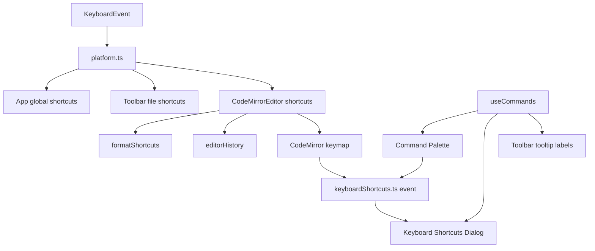

# No.1 Markdown Editor のキーボードショートカットを解説する: Command Registry と CodeMirror keymap をつなぐ

## 先に結論

`No.1 Markdown Editor` のキーボードショートカットは、1 つの巨大な `keydown` で全部を処理しているわけではありません。

実装は大きく 5 つに分かれています。

1. `platform.ts`: `Ctrl` / `Cmd` の違いを吸収する
2. `useCommands.ts`: コマンド名、カテゴリ、ショートカット表示、実行処理を集約する
3. `App.tsx` / `Toolbar.tsx`: アプリ全体のショートカットを受ける
4. `CodeMirror` extensions: エディター内部の編集ショートカットを受ける
5. `KeyboardShortcutsDialog`: 主要なショートカットを command registry と editor keymap から一覧化する

ここが大事です。

ショートカットは単なる `event.ctrlKey && event.key === 's'` の集まりではなく、**表示、実行、アクセシビリティ、クロスプラットフォーム、CodeMirror との競合回避まで含めた操作設計**として作っています。

この記事では、その実装をコードで分解します。

## この記事で分かること

- `Ctrl` / `Cmd` をどう共通化しているのか
- ショートカット表示と実行処理をどう揃えているのか
- Command Palette と Keyboard Shortcuts Dialog が同じ command registry を使う理由
- CodeMirror の default keymap と競合するショートカットをどう上書きしているのか
- Markdown 書式ショートカットをどう実装しているのか
- `Shift + Enter` の Markdown hard line break をどう扱っているのか
- AI Composer や検索パネルのショートカットをどうつないでいるのか
- テストでどこを守っているのか

## 対象読者

- React でデスクトップアプリ風のショートカットを作りたい方
- CodeMirror 6 の keymap とアプリ独自のショートカットを共存させたい方
- `Ctrl` / `Cmd` のクロスプラットフォーム対応をきれいにしたい方
- Command Palette とショートカットヘルプを同じデータから作りたい方
- Markdown editor のキーボード操作をプロダクト品質で作りたい方

## まず、ユーザーから見えるショートカット

代表的なショートカットはこうです。

| 操作 | Windows / Linux | macOS |
| --- | --- | --- |
| 新規ファイル | `Ctrl+N` | `⌘N` |
| ファイルを開く | `Ctrl+O` | `⌘O` |
| 保存 | `Ctrl+S` | `⌘S` |
| 名前を付けて保存 | `Ctrl+Shift+S` | `⌘⇧S` |
| 開いているファイルを切り替え | `Ctrl+P` | `⌘P` |
| Command Palette | `Ctrl+Shift+P` | `⌘⇧P` |
| AI Composer | `Ctrl+J` | `⌘J` |
| キーボードショートカット一覧 | `Ctrl+/` | `⌘/` |
| アクティブファイルを閉じる | `Ctrl+W` | `⌘W` |
| サイドバー表示切替 | `Ctrl+\` | `⌘\` |
| フォーカスモード | `F11` | `F11` |
| 拡大 / 縮小 / リセット | `Ctrl++` / `Ctrl+-` / `Ctrl+0` | `⌘+` / `⌘-` / `⌘0` |
| 太字 | `Ctrl+B` | `⌘B` |
| 斜体 | `Ctrl+I` | `⌘I` |
| 下線 | `Ctrl+U` | `⌘U` |
| 見出し切替 | `Ctrl+Shift+H` | `⌘⇧H` |
| コードブロック | `Ctrl+Shift+K` | `⌘⇧K` |
| Markdown hard line break | `Shift+Enter` | `Shift+Enter` |
| 次を検索 | `Ctrl+G` / `F3` | `⌘G` / `F3` |
| 前を検索 | `Ctrl+Shift+G` / `Shift+F3` | `⌘⇧G` / `⇧F3` |
| 行へ移動 | `Ctrl+Alt+G` | `⌘⌥G` |

ここで重要なのは、表示されるラベルも実際の判定も同じ helper を通していることです。

つまり、Windows で `Ctrl+S` と表示しているのに、macOS でも `Ctrl+S` を待ってしまう、というズレを避けています。

## 全体像

ざっくり図にすると、こうなります。



ポイントは、`Command` と `KeyboardEvent` を完全に同じ場所へ閉じ込めていないことです。

アプリ全体で受けるべき操作と、エディター内部で受けるべき操作は性質が違います。

なので、

- アプリ操作は `App.tsx` / `Toolbar.tsx`
- コマンド表示は `useCommands.ts`
- エディター編集は CodeMirror keymap と `CodeMirrorEditor.tsx`
- ショートカット一覧は `KeyboardShortcutsDialog`

に分けています。

## 1. `Ctrl` / `Cmd` を `platform.ts` に閉じ込める

まず土台は `src/lib/platform.ts` です。

```ts
export function isMacPlatform(): boolean {
  if (typeof navigator === 'undefined') return false

  return /mac/i.test(navigator.platform) || /mac/i.test(navigator.userAgent)
}

export function hasPrimaryModifier(event: PrimaryModifierEvent, mac = isMacPlatform()): boolean {
  return mac ? event.metaKey && !event.ctrlKey : event.ctrlKey && !event.metaKey
}
```

ここでは primary modifier を次のように定義しています。

| OS | primary modifier |
| --- | --- |
| macOS | `Meta`, つまり `Command` |
| Windows / Linux | `Control` |

ここで少し細かいのは、macOS では `metaKey && !ctrlKey`、Windows / Linux では `ctrlKey && !metaKey` にしていることです。

両方押されているような曖昧な入力を primary shortcut として扱わないためです。

ショートカット判定は `matchesPrimaryShortcut()` に寄せています。

```ts
export function matchesPrimaryShortcut(
  event: ShortcutEvent,
  options: {
    key?: string
    code?: string
    shift?: boolean
    alt?: boolean
  },
  mac = isMacPlatform()
): boolean {
  if (event.isComposing) return false
  if (!hasPrimaryModifier(event, mac)) return false
  if ((options.shift ?? false) !== event.shiftKey) return false
  if ((options.alt ?? false) !== event.altKey) return false

  if (options.code) {
    return event.code === options.code
  }

  if (options.key) {
    return event.key.toLowerCase() === options.key.toLowerCase()
  }

  return false
}
```

この関数で見ていることは 4 つです。

- IME 入力中なら無視する
- primary modifier が正しいか
- `Shift` / `Alt` の有無が期待通りか
- `key` または `code` が一致するか

`isComposing` を見ているのが大事です。

日本語や中国語の入力中に、ショートカットが誤爆するとエディターとしてはかなりストレスになります。

## 2. 表示用ラベルも同じ helper で作る

ショートカットは動くだけでは不十分です。

Toolbar、Command Palette、Keyboard Shortcuts Dialog に表示するラベルも OS に合わせる必要があります。

そのために `formatPrimaryShortcut()` を使います。

```ts
export function formatPrimaryShortcut(
  key: string,
  options: {
    alt?: boolean
    shift?: boolean
  } = {},
  mac = isMacPlatform()
): string {
  if (mac) {
    return `${getPrimaryModifierLabel(mac)}${options.alt ? '⌥' : ''}${options.shift ? '⇧' : ''}${key}`
  }

  return [getPrimaryModifierLabel(mac), options.alt ? 'Alt' : '', options.shift ? 'Shift' : '', key]
    .filter(Boolean)
    .join('+')
}
```

これにより、

```ts
formatPrimaryShortcut('S')
formatPrimaryShortcut('S', { shift: true })
formatPrimaryShortcut('P', { shift: true })
```

は OS に応じて次のようになります。

| 呼び出し | Windows / Linux | macOS |
| --- | --- | --- |
| `formatPrimaryShortcut('S')` | `Ctrl+S` | `⌘S` |
| `formatPrimaryShortcut('S', { shift: true })` | `Ctrl+Shift+S` | `⌘⇧S` |
| `formatPrimaryShortcut('P', { shift: true })` | `Ctrl+Shift+P` | `⌘⇧P` |

判定と表示を別々のロジックにしないことが重要です。

表示だけ macOS 対応していて、実際の keydown は `event.ctrlKey` を見ている、という状態を避けられます。

## 3. コマンドは `useCommands()` に集める

ショートカット一覧や Command Palette に出す操作は、`src/hooks/useCommands.ts` の `Command` として定義しています。

```ts
export interface Command {
  id: string
  label: string
  description?: string
  icon?: string
  category: 'file' | 'edit' | 'ai' | 'view' | 'theme' | 'export' | 'language' | 'help'
  shortcut?: string
  action: () => void
}
```

`Command` は、単なるメニュー項目ではありません。

ここに、

- 一意な `id`
- 表示名
- カテゴリ
- ショートカットラベル
- 実行処理

をまとめています。

たとえばファイル操作はこうです。

```ts
const newShortcut = formatPrimaryShortcut('N')
const openShortcut = formatPrimaryShortcut('O')
const saveShortcut = formatPrimaryShortcut('S')
const saveAsShortcut = formatPrimaryShortcut('S', { shift: true })
const closeFileShortcut = formatPrimaryShortcut('W')

{
  id: 'file.new',
  label: t('menu.newFile'),
  category: 'file',
  shortcut: newShortcut,
  action: newFile,
},
{
  id: 'file.save',
  label: t('menu.saveFile'),
  category: 'file',
  shortcut: saveShortcut,
  action: () => {
    void saveFile()
  },
},
{
  id: 'file.close',
  label: t('menu.closeFile'),
  category: 'file',
  shortcut: closeFileShortcut,
  action: () => {
    void closeActiveFile()
  },
}
```

この `shortcut` は表示用です。

実際の `keydown` 処理は別の場所で受けます。

ここを混ぜすぎないのがポイントです。

`useCommands()` は Command Palette と Keyboard Shortcuts Dialog の両方から使われます。
つまり、コマンド一覧に追加すれば、検索可能なコマンドとしても、ショートカットヘルプとしても同じ情報を使えます。

## 4. アプリ全体のショートカットは `App.tsx` で受ける

Command Palette、AI Composer、ショートカット一覧、ファイル切替などはアプリ全体の操作です。

そのため `src/App.tsx` で document の `keydown` を監視しています。

```tsx
useEffect(() => {
  const onKeyDown = (event: KeyboardEvent) => {
    if (matchesPrimaryShortcut(event, { key: 'p', shift: true })) {
      event.preventDefault()
      setPaletteMode('command')
    } else if (matchesPrimaryShortcut(event, { key: 'p' })) {
      event.preventDefault()
      setPaletteMode('file')
    } else if (matchesPrimaryShortcut(event, { key: 'j' })) {
      event.preventDefault()
      dispatchEditorAIOpen({ source: 'shortcut' })
    } else if (matchesPrimaryShortcut(event, { key: '/' })) {
      event.preventDefault()
      setKeyboardShortcutsOpen(true)
    } else if (matchesPrimaryShortcut(event, { key: 'w' })) {
      event.preventDefault()
      if (!event.repeat) void closeActiveFile()
    }

    if (event.key === 'F11') {
      event.preventDefault()
      const store = useEditorStore.getState()
      store.setFocusMode(!store.focusMode)
    }

    if (matchesPrimaryShortcut(event, { code: 'Backslash' })) {
      event.preventDefault()
      const store = useEditorStore.getState()
      store.setSidebarOpen(!store.sidebarOpen)
      return
    }

    if (event.altKey || !hasPrimaryModifier(event)) return

    const store = useEditorStore.getState()
    if (event.code === 'Equal' || event.key === '=' || event.key === '+') {
      event.preventDefault()
      store.setZoom(Math.min(300, store.zoom + 10))
    } else if (event.code === 'Minus' || event.key === '-') {
      event.preventDefault()
      store.setZoom(Math.max(50, store.zoom - 10))
    } else if (event.key === '0') {
      event.preventDefault()
      store.setZoom(100)
    }
  }

  document.addEventListener('keydown', onKeyDown)
  return () => document.removeEventListener('keydown', onKeyDown)
}, [closeActiveFile])
```

ここでは、アプリの「面」を切り替えるショートカットを扱っています。

- `Ctrl/Cmd + Shift + P`: Command Palette
- `Ctrl/Cmd + P`: 開いているファイルを切り替え
- `Ctrl/Cmd + J`: AI Composer
- `Ctrl/Cmd + /`: Keyboard Shortcuts Dialog
- `Ctrl/Cmd + W`: active file を閉じる
- `F11`: focus mode
- `Ctrl/Cmd + \`: sidebar
- `Ctrl/Cmd + + / - / 0`: zoom

`Ctrl/Cmd+W` では `event.repeat` を見ています。

```ts
if (!event.repeat) void closeActiveFile()
```

キーを押しっぱなしにしたとき、複数タブが連続で閉じてしまうのを防ぐためです。

## 5. ファイル操作は Toolbar 側でも受ける

新規、開く、保存、名前を付けて保存は Toolbar がユーザーに見える入口を持っています。

そのため Toolbar 側でも同じ `matchesPrimaryShortcut()` を使っています。

```tsx
useEffect(() => {
  const handler = (event: KeyboardEvent) => {
    if (matchesPrimaryShortcut(event, { key: 'n' })) {
      event.preventDefault()
      newFile()
    }
    if (matchesPrimaryShortcut(event, { key: 'o' })) {
      event.preventDefault()
      void openFile()
    }
    if (matchesPrimaryShortcut(event, { key: 's', shift: true })) {
      event.preventDefault()
      void saveFileAs()
    }
    if (matchesPrimaryShortcut(event, { key: 's' })) {
      event.preventDefault()
      void saveFile()
    }
  }

  document.addEventListener('keydown', handler)
  return () => document.removeEventListener('keydown', handler)
}, [newFile, openFile, saveFile, saveFileAs])
```

ここで使っている shortcut label も同じ helper から作られます。

```ts
const newShortcut = formatPrimaryShortcut('N')
const openShortcut = formatPrimaryShortcut('O')
const saveShortcut = formatPrimaryShortcut('S')
```

Toolbar の tooltip ではこう使います。

```tsx
<ToolbarBtn title={`${t('toolbar.save')} (${saveShortcut})`} onClick={() => void saveFile()}>
  <AppIcon name="save" size={16} />
</ToolbarBtn>
```

これで、ボタンの tooltip、Command Palette、Keyboard Shortcuts Dialog の表記が揃います。

## 6. Keyboard Shortcuts Dialog は手書きリストにしない

ショートカット一覧は `src/components/KeyboardShortcuts/KeyboardShortcutsDialog.tsx` にあります。

この dialog は、すべての項目を手で並べているわけではありません。

まず `useCommands()` から `shortcut` を持つ command だけを拾います。

```tsx
const commandItems = commands
  .map<ShortcutHelpItem | null>((command, index) => {
    if (!command.shortcut) return null
    if (command.id.startsWith('file.recent.')) return null

    return {
      id: command.id,
      label: command.label,
      shortcut: command.shortcut,
      category: command.category,
      order: index,
    }
  })
  .filter((item): item is ShortcutHelpItem => item !== null)
```

最近使ったファイルは毎回変わるので、ショートカット一覧からは除外しています。

さらに、CodeMirror 側の編集ショートカットのように command registry だけでは拾いづらいものは `extraItems` として追加します。

```tsx
const extraItems: ShortcutHelpItem[] = [
  {
    id: 'file.switchOpen',
    label: t('shortcuts.switchFile'),
    shortcut: formatPrimaryShortcut('P'),
    category: 'file',
    order: 4.5,
  },
  {
    id: 'view.commandPalette',
    label: t('toolbar.commandPalette'),
    shortcut: formatPrimaryShortcut('P', { shift: true }),
    category: 'view',
    order: -1,
  },
  {
    id: 'edit.findNextMatch',
    label: t('shortcuts.editor.findNextMatch'),
    shortcut: `${formatPrimaryShortcut('G')} / F3`,
    category: 'edit',
    order: 1000,
  },
]
```

ここが現実的です。

すべてを `Command` に無理やり入れるのではなく、Command Palette に出すべき command と、ヘルプとして見せたい editor 操作を分けています。

ただし、この dialog は CodeMirror keymap の全項目を完全に列挙するものではありません。

たとえば `Shift+Enter` の Markdown hard line break や、AI Composer 内部の `Ctrl/Cmd+Enter` は、それぞれ editor / composer の章で説明しています。
Keyboard Shortcuts Dialog は、ユーザーが普段確認したい主要な shortcut を command registry と `extraItems` からまとめる位置づけです。

最後にカテゴリ順で section を作ります。

```tsx
return CATEGORY_ORDER.map((category) => ({
  category,
  label: getShortcutCategoryLabel(category, t),
  icon: getShortcutCategoryIcon(category),
  items: items.filter((item) => item.category === category),
})).filter((section) => section.items.length > 0)
```

これで、一覧は次のように整理されます。

- ファイル
- Markdown と編集
- 表示
- AI
- ヘルプ
- エクスポート
- テーマ
- 言語

ショートカットヘルプは「長い表」になりがちですが、カテゴリごとに分けることで探しやすくしています。

## 7. Dialog 自体もキーボード操作に対応する

ショートカット一覧は、キーボードユーザーのための UI です。

なので dialog 自体も keyboard accessible である必要があります。

実際の JSX はこうです。

```tsx
<div
  ref={dialogRef}
  role="dialog"
  aria-modal="true"
  aria-labelledby="keyboard-shortcuts-title"
  aria-describedby="keyboard-shortcuts-description"
  data-keyboard-shortcuts-dialog="true"
  onKeyDown={onDialogKeyDown}
>
```

`Escape` で閉じます。

```tsx
const onDialogKeyDown = (event: ReactKeyboardEvent<HTMLDivElement>) => {
  if (event.key !== 'Escape') return

  event.preventDefault()
  onClose()
}
```

さらに `Tab` の focus trap もあります。

```tsx
useEffect(() => {
  const handler = (event: KeyboardEvent) => {
    if (event.key !== 'Tab') return

    const dialog = dialogRef.current
    if (!dialog) return

    const focusable = getFocusableElements(dialog)
    if (focusable.length === 0) return

    const first = focusable[0]
    const last = focusable[focusable.length - 1]
    if (event.shiftKey && document.activeElement === first) {
      event.preventDefault()
      last.focus()
    } else if (!event.shiftKey && document.activeElement === last) {
      event.preventDefault()
      first.focus()
    }
  }

  document.addEventListener('keydown', handler)
  return () => document.removeEventListener('keydown', handler)
}, [])
```

ショートカット一覧を開いたあと、`Tab` でアプリ背面へ抜けてしまわないようにしています。

このあたりは地味ですが、キーボード操作を説明する UI だからこそ重要です。

## 8. Dialog の表示位置は Source editor に合わせる

Keyboard Shortcuts Dialog は、ただ画面中央に出すだけではありません。

Source editor の表示領域に合わせて frame を計算します。

```ts
const KEYBOARD_SHORTCUTS_SOURCE_SURFACE_SELECTOR = '[data-source-editor-surface="true"], .cm-editor'
const KEYBOARD_SHORTCUTS_SOURCE_EDGE_GAP_PX = 16
```

実際の bounds 計算はこうです。

```ts
function resolveKeyboardShortcutsSourceFrameBounds(): KeyboardShortcutsFrameBounds {
  if (typeof window === 'undefined') return DEFAULT_KEYBOARD_SHORTCUTS_FRAME_BOUNDS

  const sourceSurface = getKeyboardShortcutsSourceSurface()
  if (!sourceSurface) return DEFAULT_KEYBOARD_SHORTCUTS_FRAME_BOUNDS

  const viewportHeight = window.innerHeight || document.documentElement.clientHeight
  if (!Number.isFinite(viewportHeight) || viewportHeight <= 0) {
    return DEFAULT_KEYBOARD_SHORTCUTS_FRAME_BOUNDS
  }

  const rect = sourceSurface.getBoundingClientRect()
  if (rect.width <= 0 || rect.height <= 0) {
    return DEFAULT_KEYBOARD_SHORTCUTS_FRAME_BOUNDS
  }

  const top = clampKeyboardShortcutsFrameInset(Math.round(rect.top), viewportHeight)
  const bottom = clampKeyboardShortcutsFrameInset(Math.round(viewportHeight - rect.bottom), viewportHeight)

  if (top + bottom >= viewportHeight) return DEFAULT_KEYBOARD_SHORTCUTS_FRAME_BOUNDS
  return { top, bottom }
}
```

そして `ResizeObserver` と `resize` / `orientationchange` で更新します。

```tsx
window.addEventListener('resize', scheduleFrameBoundsUpdate)
window.addEventListener('orientationchange', scheduleFrameBoundsUpdate)

const sourceSurface = getKeyboardShortcutsSourceSurface()
if (sourceSurface && typeof ResizeObserver === 'function') {
  resizeObserver = new ResizeObserver(scheduleFrameBoundsUpdate)
  resizeObserver.observe(sourceSurface)
}
```

これにより、サイドバーや split pane の状態が変わっても、dialog は Source editor の作業領域に収まります。

## 9. 複数の入口を custom event でつなぐ

Keyboard Shortcuts Dialog は、いくつかの場所から開けます。

- Toolbar のボタン
- Command Palette の `help.keyboardShortcuts`
- アプリ全体の `Ctrl/Cmd+/`
- CodeMirror editor 内の `Ctrl/Cmd+/`

このうち、Command Palette や CodeMirror から直接 React state を触るのはきれいではありません。

そこで `src/lib/keyboardShortcuts.ts` に custom event を置いています。

```ts
export const KEYBOARD_SHORTCUTS_OPEN_EVENT = 'app:keyboard-shortcuts-open'

export function getKeyboardShortcutsShortcutLabel(): string {
  return formatPrimaryShortcut('/')
}

export function dispatchKeyboardShortcutsOpen(): boolean {
  if (typeof document === 'undefined') return false

  return document.dispatchEvent(new CustomEvent(KEYBOARD_SHORTCUTS_OPEN_EVENT))
}
```

`App.tsx` はこの event を聞いて state を更新します。

```tsx
useEffect(() => {
  const openKeyboardShortcuts = () => setKeyboardShortcutsOpen(true)

  document.addEventListener(KEYBOARD_SHORTCUTS_OPEN_EVENT, openKeyboardShortcuts)
  return () => document.removeEventListener(KEYBOARD_SHORTCUTS_OPEN_EVENT, openKeyboardShortcuts)
}, [])
```

これで、React tree の外側に近い CodeMirror extension からでも、dialog を開けます。

## 10. CodeMirror の `Mod-/` 競合を上書きする

`Ctrl/Cmd+/` は Keyboard Shortcuts Dialog を開く操作です。

でも CodeMirror の default keymap には Markdown comment 系の shortcut が含まれます。

そこで `src/components/Editor/extensions.ts` では、まず競合する keymap を取り除きます。

```ts
export const CODEMIRROR_MARKDOWN_COMMENT_SHORTCUTS = new Set(['Mod-/', 'Alt-A'])

export function isCodeMirrorMarkdownCommentShortcut(binding: KeyBinding): boolean {
  return [binding.key, binding.mac, binding.win, binding.linux].some((key) =>
    key ? CODEMIRROR_MARKDOWN_COMMENT_SHORTCUTS.has(key) : false
  )
}

export const sourceEditorDefaultKeymap = defaultKeymap.filter(
  (binding) => !isCodeMirrorMarkdownCommentShortcut(binding)
)
```

そして `Prec.highest()` で `Mod-/` を最優先に登録します。

```ts
export function openKeyboardShortcutsFromEditor(): boolean {
  dispatchKeyboardShortcutsOpen()
  return true
}

Prec.highest(
  keymap.of([
    {
      key: 'Mod-/',
      run: openKeyboardShortcutsFromEditor,
      preventDefault: true,
    },
  ])
)
```

ここがかなり大事です。

アプリ全体の `Ctrl/Cmd+/` は `App.tsx` でも受けています。
しかし、editor focus 中は CodeMirror の keymap が先に処理することがあります。

だから CodeMirror 側にも同じ入口を用意して、`dispatchKeyboardShortcutsOpen()` に流しています。

これで、

- editor 外で `Ctrl/Cmd+/`
- editor 内で `Ctrl/Cmd+/`
- Command Palette から `Keyboard Shortcuts`

のすべてが同じ dialog に到達します。

## 11. Markdown 書式ショートカットは `formatShortcuts.ts` に分ける

太字、斜体、下線、見出し、コードブロックなどの Markdown 書式は `src/components/Editor/formatShortcuts.ts` にまとまっています。

```ts
const FORMAT_SHORTCUTS: Record<ShortcutFormatAction, FormatShortcutDefinition> = {
  bold: { code: 'KeyB', requiresShift: false, keyLabel: 'B' },
  italic: { code: 'KeyI', requiresShift: false, keyLabel: 'I' },
  underline: { code: 'KeyU', requiresShift: false, keyLabel: 'U' },
  strikethrough: { code: 'Digit5', requiresShift: true, keyLabel: '5' },
  heading: { code: 'KeyH', requiresShift: true, keyLabel: 'H' },
  code: { code: 'Backquote', requiresShift: false, keyLabel: '`' },
  codeblock: { code: 'KeyK', requiresShift: true, keyLabel: 'K' },
  link: { code: 'KeyL', requiresShift: true, keyLabel: 'L' },
  image: { code: 'KeyG', requiresShift: true, keyLabel: 'G' },
  ul: { code: 'KeyU', requiresShift: true, keyLabel: 'U' },
  ol: { code: 'KeyO', requiresShift: true, keyLabel: 'O' },
  task: { code: 'KeyC', requiresShift: true, keyLabel: 'C' },
}
```

ここで `event.key` ではなく `event.code` を見ています。

```ts
export function getFormatActionFromShortcut(
  event: ShortcutKeyboardEventLike,
  mac = isMacPlatform()
): ShortcutFormatAction | null {
  if (!hasPrimaryModifier(event, mac) || event.altKey || event.isComposing) {
    return null
  }

  for (const [action, shortcut] of FORMAT_SHORTCUT_ENTRIES) {
    if (event.code === shortcut.code && event.shiftKey === shortcut.requiresShift) {
      return action
    }
  }

  return null
}
```

`code` は物理キーに近い値です。

`Ctrl+Shift+5` を取り消し線にしたい場合、入力文字そのものより、どのキーを押したかを見たほうが安定します。

また `Alt` と `isComposing` は明示的に弾いています。
IME 入力や OS 側の文字入力と競合しないようにするためです。

表示ラベルも同じ registry から作ります。

```ts
export function getFormatShortcutLabel(action: ShortcutFormatAction, mac = isMacPlatform()): string {
  const shortcut = FORMAT_SHORTCUTS[action]
  if (mac) {
    return `⌘${shortcut.requiresShift ? '⇧' : ''}${shortcut.keyLabel}`
  }

  return ['Ctrl', shortcut.requiresShift ? 'Shift' : '', shortcut.keyLabel]
    .filter(Boolean)
    .join('+')
}
```

つまり、

- 判定: `getFormatActionFromShortcut()`
- 表示: `getFormatShortcutLabel()`

が同じ `FORMAT_SHORTCUTS` を見ます。

ここもズレを防ぐ設計です。

## 12. 実際の Markdown 挿入は `applyFormat()` に任せる

ショートカットで action が解決されたら、`CodeMirrorEditor` が `applyFormat()` を呼びます。

```tsx
useEffect(() => {
  const onFormatShortcut = (event: KeyboardEvent) => {
    const action = getFormatActionFromShortcut(event)
    if (!action) return

    const view = viewRef.current
    if (!view) return

    const target = event.target
    if (!(target instanceof Node) || !view.dom.contains(target)) return

    event.preventDefault()
    applyFormat(view, action)
  }

  document.addEventListener('keydown', onFormatShortcut, true)
  return () => document.removeEventListener('keydown', onFormatShortcut, true)
}, [])
```

`view.dom.contains(target)` を見ているのがポイントです。

書式ショートカットは、エディターの中で押されたときだけ効きます。

たとえば設定パネルの入力欄で `Ctrl+B` を押したときに、Markdown 本文を太字にしてはいけません。

`applyFormat()` は実際に Markdown を挿入します。

```ts
export function applyFormat(view: EditorView, action: FormatAction): void {
  switch (action) {
    case 'bold':          return wrapInline(view, '**', '**', 'bold text')
    case 'italic':        return wrapInline(view, '*', '*', 'italic text')
    case 'underline':     return wrapInline(view, '<u>', '</u>', 'underlined text')
    case 'strikethrough': return wrapInline(view, '~~', '~~', 'strikethrough')
    case 'highlight':     return wrapInline(view, '==', '==', 'highlighted text')
    case 'code':          return wrapInline(view, '`', '`', 'code')
    case 'heading': return cycleHeading(view)
    case 'link':      return insertLink(view)
    case 'image':     return insertImage(view)
    case 'ul':        return insertLinePrefix(view, '- ')
    case 'ol':        return insertOrderedList(view)
    case 'task':      return insertLinePrefix(view, '- [ ] ')
    case 'codeblock': return insertCodeBlock(view)
  }
}
```

Toolbar のボタンも Command Palette の command も、最終的には同じ `editor:format` / `applyFormat()` に流れます。

この設計にすると、

- Toolbar で押したとき
- Command Palette から実行したとき
- キーボードショートカットで押したとき

の挙動が揃います。

## 13. Source と WYSIWYG で同じショートカットが効く理由

このプロジェクトでは、WYSIWYG は完全に別の editor ではありません。

CodeMirror の extension として差し込まれています。

そのため、Markdown 書式ショートカットは Source mode と WYSIWYG mode で同じ `EditorView` に対して動きます。

```tsx
const wysiwygCompartmentRef = useRef(new Compartment())
const wysiwygMode = useEditorStore((state) => state.wysiwygMode)
const [wysiwygExtensions, setWysiwygExtensions] = useState<Extension[]>([])
```

WYSIWYG mode が有効なときだけ extension を読み込みます。

```tsx
useEffect(() => {
  if (!wysiwygMode) {
    setWysiwygExtensions([])
    return
  }

  let cancelled = false
  void import('./wysiwyg').then(({ wysiwygPlugin, wysiwygTheme, wysiwygTableDecorations }) => {
    if (!cancelled) setWysiwygExtensions([wysiwygTableDecorations, wysiwygPlugin, wysiwygTheme])
  })

  return () => {
    cancelled = true
  }
}, [wysiwygMode])
```

つまり、ショートカット実装を Source と WYSIWYG で 2 回作る必要がありません。

同じ `EditorView` に対して `applyFormat()` するだけです。

## 14. 検索ショートカットは「開く」と「移動」で分ける

検索パネルを開く操作は `CodeMirrorEditor.tsx` で受けています。

```tsx
useEffect(() => {
  const onKeyDown = (event: KeyboardEvent) => {
    if (matchesPrimaryShortcut(event, { key: 'f' })) {
      event.preventDefault()
      openSearchPanel(false)
      return
    }
    if (matchesPrimaryShortcut(event, { key: 'h' })) {
      event.preventDefault()
      openSearchPanel(true)
      return
    }
    if (event.key === 'Escape' && searchOpen) {
      event.preventDefault()
      setSearchOpen(false)
    }
  }

  document.addEventListener('keydown', onKeyDown)
  return () => document.removeEventListener('keydown', onKeyDown)
}, [openSearchPanel, searchOpen])
```

一方で、次の検索結果へ移動する、前の検索結果へ戻る、次の一致を選択する、といった editor 内操作は CodeMirror keymap に寄せています。

```ts
keymap.of([
  {
    key: 'F3',
    run: (view) => {
      runSearchCommand(view, search.findNext)
      return true
    },
    shift: (view) => {
      runSearchCommand(view, search.findPrevious)
      return true
    },
    scope: 'editor search-panel',
    preventDefault: true,
  },
  {
    key: 'Mod-g',
    run: (view) => {
      runSearchCommand(view, search.findNext)
      return true
    },
    shift: (view) => {
      runSearchCommand(view, search.findPrevious)
      return true
    },
    scope: 'editor search-panel',
    preventDefault: true,
  },
  { key: 'Mod-Shift-l', run: search.selectSelectionMatches },
  { key: 'Mod-Alt-g', run: search.gotoLine },
  { key: 'Mod-d', run: search.selectNextOccurrence, preventDefault: true },
])
```

ここも分担がはっきりしています。

- `Ctrl/Cmd+F` / `Ctrl/Cmd+H`: React 側で検索 UI を開く
- `F3` / `Ctrl/Cmd+G`: CodeMirror 側で検索結果を移動する
- `Ctrl/Cmd+Alt+G`: CodeMirror 側で行へ移動する

実際の表示は、`KeyboardShortcutsDialog` 側で次のように作っています。

| 操作 | Windows / Linux | macOS | CodeMirror keymap |
| --- | --- | --- | --- |
| 次を検索 | `Ctrl+G` / `F3` | `⌘G` / `F3` | `Mod-g` / `F3` |
| 前を検索 | `Ctrl+Shift+G` / `Shift+F3` | `⌘⇧G` / `⇧F3` | `Mod-g` の `shift` / `F3` の `shift` |
| 次の一致を選択 | `Ctrl+D` | `⌘D` | `Mod-d` |
| 行へ移動 | `Ctrl+Alt+G` | `⌘⌥G` | `Mod-Alt-g` |

つまり `Ctrl+Alt+G` は間違いではありません。

`KeyboardShortcutsDialog` では `formatPrimaryShortcut('G', { alt: true })` として表示し、CodeMirror 側では `Mod-Alt-g` を `search.gotoLine` に割り当てています。

検索結果の移動は CodeMirror の document state と selection に近いので、CodeMirror keymap に任せるほうが自然です。

## 15. Undo / Redo は platform ごとの違いを扱う

Undo / Redo は OS ごとの期待が少し違います。

`src/lib/editorHistory.ts` では専用 helper を持っています。

```ts
export function matchesEditorUndoShortcut(
  event: EditorHistoryShortcutKeyboardEventLike,
  mac = isMacPlatform()
): boolean {
  if (event.isComposing || event.altKey || event.shiftKey) return false
  if (!hasPrimaryHistoryModifier(event, mac)) return false

  return event.key.toLowerCase() === 'z'
}

export function matchesEditorRedoShortcut(
  event: EditorHistoryShortcutKeyboardEventLike,
  mac = isMacPlatform()
): boolean {
  if (event.isComposing || event.altKey) return false
  if (!hasPrimaryHistoryModifier(event, mac)) return false

  const key = event.key.toLowerCase()
  if (key === 'z') return event.shiftKey
  if (key === 'y') return !mac && !event.shiftKey
  return false
}
```

これにより、

| 操作 | Windows / Linux | macOS |
| --- | --- | --- |
| Undo | `Ctrl+Z` | `⌘Z` |
| Redo | `Ctrl+Y` / `Ctrl+Shift+Z` | `⌘⇧Z` |

を扱えます。

ラベルも専用 helper で作ります。

```ts
export function getEditorUndoShortcutLabel(mac = isMacPlatform()): string {
  return mac ? '⌘Z' : 'Ctrl+Z'
}

export function getEditorRedoShortcutLabel(mac = isMacPlatform()): string {
  return mac ? '⌘⇧Z' : 'Ctrl+Y'
}
```

`CodeMirrorEditor` 側の global handler は少し慎重です。

```tsx
const onGlobalHistoryShortcut = (event: KeyboardEvent) => {
  if (event.defaultPrevented) return

  const action = matchesEditorUndoShortcut(event)
    ? 'undo'
    : matchesEditorRedoShortcut(event)
      ? 'redo'
      : null
  if (!action) return

  const view = viewRef.current
  if (!view) return

  const target = event.target
  if (target instanceof Node && view.dom.contains(target)) return
  if (isTextInputLikeTarget(target)) return

  event.preventDefault()
  runHistoryAction(action)
}
```

エディター内で押された Undo / Redo は CodeMirror の `historyKeymap` に任せます。

この handler は、editor 外から Undo / Redo を押した場合にだけ editor history へ流すためのものです。
ただし text input の中なら無視します。

ここを雑にすると、検索欄や設定欄の Undo を editor の Undo が奪ってしまいます。

## 16. `Shift+Enter` は Markdown hard line break として扱う

Markdown editor では `Shift+Enter` も重要です。

このプロジェクトでは、通常の文章中では明示的な hard line break を挿入します。

```ts
export const MARKDOWN_HARD_LINE_BREAK = '<br />\n'
export const MARKDOWN_PLAIN_LINE_BREAK = '\n'
```

CodeMirror keymap ではこう登録しています。

```ts
keymap.of([
  {
    key: 'Shift-Enter',
    run: insertMarkdownHardLineBreak,
  },
  ...sourceEditorDefaultKeymap,
  ...historyKeymap,
  ...foldKeymap,
  indentWithTab,
])
```

実装は context aware です。

```ts
export function insertMarkdownHardLineBreak(
  view: Pick<EditorView, 'state' | 'dispatch'>
): boolean {
  const markdown = view.state.doc.toString()
  const literalBlocks = collectShiftEnterLiteralBlocks(markdown)

  view.dispatch({
    ...view.state.changeByRange((range) => {
      const line = view.state.doc.lineAt(range.from)
      const insert = isPositionInsideTextRanges(range.from, literalBlocks) ||
        shouldInsertPlainLineBreakInLine(view.state.doc, line, range.from - line.from)
        ? MARKDOWN_PLAIN_LINE_BREAK
        : MARKDOWN_HARD_LINE_BREAK

      return {
        changes: {
          from: range.from,
          to: range.to,
          insert,
        },
        range: EditorSelection.cursor(range.from + insert.length),
      }
    }),
    scrollIntoView: true,
    userEvent: 'input.type',
  })
  return true
}
```

文章中なら `<br />\n`。
ただし fenced code block、display math、inline code、inline math、footnote、heading、thematic break などでは plain newline に戻します。

これは Markdown editor としてかなり重要です。

`Shift+Enter` がどこでも `<br />` を入れてしまうと、コードブロックや数式の中が壊れます。

## 17. AI Composer もショートカットで動く

AI Composer は `Ctrl/Cmd+J` で開きます。

```tsx
if (matchesPrimaryShortcut(event, { key: 'j' })) {
  event.preventDefault()
  dispatchEditorAIOpen({ source: 'shortcut' })
}
```

Composer 内では、実行と反映にも shortcut があります。

```tsx
const runShortcutLabel = formatPrimaryShortcut('Enter')
const applyShortcutLabel = formatPrimaryShortcut('Enter', { shift: true })
```

keydown はこうです。

```tsx
useEffect(() => {
  const onKeyDown = (event: KeyboardEvent) => {
    if (trapAIComposerTabFocus(event, dialogRef.current)) return

    if (event.key === 'Escape') {
      event.preventDefault()
      void handleCloseComposer()
      return
    }

    if (matchesPrimaryShortcut(event, { key: 'enter', shift: true }) && canApplyDraft) {
      event.preventDefault()
      handleApply()
      return
    }

    if (matchesPrimaryShortcut(event, { key: 'enter' }) && canSubmit) {
      event.preventDefault()
      void handleSubmit()
    }
  }

  document.addEventListener('keydown', onKeyDown)
  return () => document.removeEventListener('keydown', onKeyDown)
}, [canApplyDraft, canSubmit, composer.outputTarget, composer.requestState, effectiveContext, effectivePrompt])
```

つまり AI Composer は、

- `Ctrl/Cmd+J`: 開く
- `Ctrl/Cmd+Enter`: 実行
- `Ctrl/Cmd+Shift+Enter`: 結果を反映
- `Escape`: 閉じる / 生成中ならキャンセル

という keyboard-first な操作になっています。

## 18. i18n もショートカットヘルプに入れる

ショートカット一覧の見出しやカテゴリは i18n に入っています。

日本語ではこうです。

```json
{
  "shortcuts": {
    "title": "キーボードショートカット",
    "open": "キーボードショートカット",
    "subtitle": "ファイル、編集、表示、AI のショートカットをまとめて確認できます。",
    "count": "{{count}} 件",
    "switchFile": "開いているファイルを切り替え",
    "editor": {
      "findNextMatch": "次を検索",
      "findPreviousMatch": "前を検索",
      "selectNextMatch": "次の一致を選択",
      "goToLine": "行へ移動"
    },
    "categories": {
      "file": "ファイル",
      "edit": "Markdown と編集",
      "view": "表示",
      "ai": "AI",
      "help": "ヘルプ"
    }
  }
}
```

このプロジェクトは日本語、英語、中国語をサポートしています。

なので shortcut label の `Ctrl+S` / `⌘S` は platform helper で作り、説明文やカテゴリ名は i18n から出します。

この分け方が自然です。

ショートカットそのものは OS 依存。
説明文は言語依存。
この 2 つを混ぜないようにしています。

## 19. テストで守っていること

この機能は複数のテストで守られています。

### Keyboard Shortcuts Dialog

`tests/keyboard-shortcuts-dialog.test.ts` では、dialog の入口と構造を確認しています。

```ts
test('keyboard shortcuts dialog is reachable from toolbar, command palette, and Ctrl/Cmd+slash', async () => {
  const [app, toolbar, commands, palette, shortcutsLib] = await Promise.all([
    readFile(new URL('../src/App.tsx', import.meta.url), 'utf8'),
    readFile(new URL('../src/components/Toolbar/Toolbar.tsx', import.meta.url), 'utf8'),
    readFile(new URL('../src/hooks/useCommands.ts', import.meta.url), 'utf8'),
    readFile(new URL('../src/components/CommandPalette/CommandPalette.tsx', import.meta.url), 'utf8'),
    readFile(new URL('../src/lib/keyboardShortcuts.ts', import.meta.url), 'utf8'),
  ])

  assert.match(shortcutsLib, /export const KEYBOARD_SHORTCUTS_OPEN_EVENT = 'app:keyboard-shortcuts-open'/)
  assert.match(app, /matchesPrimaryShortcut\(event, \{ key: '\/' \}\)/)
  assert.match(app, /document\.addEventListener\(KEYBOARD_SHORTCUTS_OPEN_EVENT, openKeyboardShortcuts\)/)
  assert.match(commands, /id: 'help\.keyboardShortcuts'[\s\S]*dispatchKeyboardShortcutsOpen\(\)/)
})
```

ここで守っているのは、単に dialog が存在することではありません。

- Toolbar から開ける
- Command Palette から開ける
- `Ctrl/Cmd+/` から開ける
- custom event 経由で開ける

という入口の契約です。

### CodeMirror の `Mod-/` 競合

同じテストで、CodeMirror の default keymap から comment shortcut を外していることも確認しています。

```ts
test('source editor Ctrl/Cmd+slash opens keyboard shortcuts instead of inserting markdown comments', async () => {
  const source = await readFile(new URL('../src/components/Editor/extensions.ts', import.meta.url), 'utf8')

  assert.match(source, /export const CODEMIRROR_MARKDOWN_COMMENT_SHORTCUTS = new Set\(\['Mod-\/', 'Alt-A'\]\)/)
  assert.match(source, /export const sourceEditorDefaultKeymap = defaultKeymap\.filter\(/)
  assert.match(source, /key: 'Mod-\/'/)
  assert.match(source, /run: openKeyboardShortcutsFromEditor/)
  assert.match(source, /preventDefault: true/)
})
```

これは重要です。

`Ctrl/Cmd+/` が editor focus 中だけ別の動きになる、という事故を防いでいます。

### Format shortcuts

`tests/format-shortcuts.test.ts` では、Markdown 書式ショートカットを確認しています。

```ts
test('Ctrl+Shift+U maps to unordered list without stealing underline', () => {
  const action = getFormatActionFromShortcut(createShortcutEvent({ ctrlKey: true, shiftKey: true, code: 'KeyU' }))

  assert.equal(action, 'ul')
})

test('format shortcuts only accept the platform primary modifier', () => {
  assert.equal(getFormatActionFromShortcut(createShortcutEvent({ ctrlKey: true, code: 'KeyB' }), false), 'bold')
  assert.equal(getFormatActionFromShortcut(createShortcutEvent({ metaKey: true, code: 'KeyB' }), false), null)
  assert.equal(getFormatActionFromShortcut(createShortcutEvent({ metaKey: true, code: 'KeyB' }), true), 'bold')
  assert.equal(getFormatActionFromShortcut(createShortcutEvent({ ctrlKey: true, code: 'KeyB' }), true), null)
})
```

`Ctrl+U` と `Ctrl+Shift+U` のような近い shortcut は、特にテストしておく価値があります。

下線と箇条書きリストが混ざると、ユーザーにとってかなり分かりにくいからです。

### Undo / Redo

`tests/editor-history-shortcuts.test.ts` では、OS ごとの Undo / Redo を守っています。

```ts
test('redo matches Typora-style desktop accelerators on each platform', () => {
  assert.equal(matchesEditorRedoShortcut(createShortcutEvent({ ctrlKey: true, key: 'y' }), false), true)
  assert.equal(matchesEditorRedoShortcut(createShortcutEvent({ ctrlKey: true, shiftKey: true, key: 'z' }), false), true)
  assert.equal(matchesEditorRedoShortcut(createShortcutEvent({ metaKey: true, shiftKey: true, key: 'z' }), true), true)
  assert.equal(matchesEditorRedoShortcut(createShortcutEvent({ metaKey: true, key: 'y' }), true), false)
})
```

Redo は特に OS 差が出やすいので、helper とテストに切り出しておくと安全です。

### Shift+Enter

`tests/editor-line-break-shortcut.test.ts` では、`Shift+Enter` が Markdown context に応じて変わることを確認しています。

```ts
test('editor core extensions wire Shift+Enter to the hard line break command', async () => {
  const source = await readFile(new URL('../src/components/Editor/extensions.ts', import.meta.url), 'utf8')

  assert.match(source, /key:\s*'Shift-Enter'/)
  assert.match(source, /run:\s*insertMarkdownHardLineBreak/)
})
```

さらに、コードブロック、数式、inline code、見出しなどでは plain newline に戻ることもテストされています。

## 実装の要点

### 1. `Ctrl` / `Cmd` 判定を毎回書かない

`event.ctrlKey || event.metaKey` を各所に書くと、macOS と Windows の挙動がすぐにズレます。

`matchesPrimaryShortcut()` と `formatPrimaryShortcut()` に寄せることで、判定と表示を揃えられます。

### 2. 表示用 command registry と実行用 keydown を分ける

`useCommands()` は Command Palette とヘルプ表示の source of truth です。

一方、実際の keydown は App、Toolbar、CodeMirror keymap など、責務に近い場所で処理しています。

全部を 1 ファイルに集めるより、操作の意味に合わせて分けるほうが保守しやすいです。

### 3. CodeMirror の keymap と競合する shortcut は明示的に予約する

`Ctrl/Cmd+/` のような shortcut は、ブラウザ、OS、CodeMirror、アプリが取り合う可能性があります。

この実装では default keymap から競合を外し、`Prec.highest()` でアプリ側の動作を優先しています。

### 4. Editor 内だけで効く shortcut は target を確認する

Markdown 書式ショートカットは `view.dom.contains(target)` を見ています。

これにより、設定パネルや検索欄の入力を editor 操作が奪わないようにしています。

### 5. ショートカットヘルプも accessibility の対象にする

Keyboard Shortcuts Dialog は `role="dialog"`、`aria-modal`、`Escape` close、`Tab` focus trap を持っています。

キーボード操作を説明する UI だからこそ、キーボードだけで扱える必要があります。

## この記事の要点を 3 行でまとめると

1. ショートカット判定と表示は `platform.ts` に寄せて、Windows / macOS / Linux の差を吸収しています。
2. Command Palette と Keyboard Shortcuts Dialog は `useCommands()` を共有し、CodeMirror 固有の操作だけ `extraItems` と keymap で補っています。
3. エディター内部の shortcut は CodeMirror keymap と `view.dom.contains(target)` で範囲を制御し、IME・検索欄・設定欄との競合を避けています。

## 参考実装

- Platform helper: `src/lib/platform.ts`
- Command registry: `src/hooks/useCommands.ts`
- Keyboard shortcuts event: `src/lib/keyboardShortcuts.ts`
- App shortcuts: `src/App.tsx`
- Toolbar shortcuts: `src/components/Toolbar/Toolbar.tsx`
- Keyboard Shortcuts Dialog: `src/components/KeyboardShortcuts/KeyboardShortcutsDialog.tsx`
- CodeMirror extensions: `src/components/Editor/extensions.ts`
- Editor shortcut wiring: `src/components/Editor/CodeMirrorEditor.tsx`
- Format shortcut registry: `src/components/Editor/formatShortcuts.ts`
- Format commands: `src/components/Editor/formatCommands.ts`
- Editor history shortcuts: `src/lib/editorHistory.ts`
- Tests: `tests/keyboard-shortcuts-dialog.test.ts`, `tests/format-shortcuts.test.ts`, `tests/editor-history-shortcuts.test.ts`, `tests/editor-line-break-shortcut.test.ts`, `tests/file-close-shortcut.test.ts`
