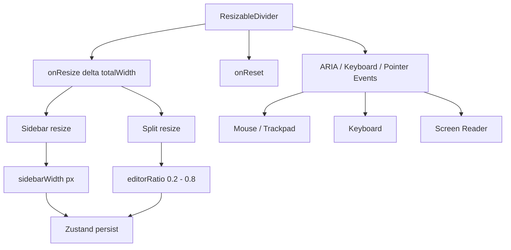

# No.1 Markdown Editor の 2 本のリサイズハンドルを解説する: Sidebar と Editor/Preview を同じ `ResizableDivider` で作る

## 先に結論

`No.1 Markdown Editor` の画面には、よく見ると 2 本の縦方向のリサイズハンドルがあります。

1. 左側のリサイズハンドル: サイドバー幅を調整する
2. 中央のリサイズハンドル: エディターとプレビューの比率を調整する

見た目は少し違いますが、実装はどちらも同じ `ResizableDivider` コンポーネントです。

ここがかなり大事です。

`ドラッグできる線` を 2 回作っているのではなく、**アクセシビリティ、Pointer Events、キーボード操作、リセット操作、見た目の状態管理を 1 つの部品に集約**しています。

そのうえで、アプリ側が

- サイドバーなら `px`
- エディター/プレビューなら `ratio`

として受け取るだけです。

この分け方がかなり実践的です。

## この記事で分かること

- スクリーンショットの 2 本のリサイズハンドルが何をしているのか
- ユーザーとしてどう操作するのか
- `ResizableDivider` の設計
- `PointerEvent` でドラッグをどう扱っているのか
- `Zustand` でレイアウト設定をどう永続化しているのか
- CSS で細い divider を「つかみやすい UI」にする方法
- テストでこの UI をどう守っているのか

## 対象読者

- React で resizable layout を作りたい方
- Markdown エディターや IDE 風 UI を作っている方
- `drag` だけでなく、キーボード操作や i18n まで含めて作りたい方
- UI 部品を小さく共通化する設計を読みたい方

## まず、2 本のリサイズハンドルの使い方

### 1. 左側: Sidebar resize handle

左側のリサイズハンドルは、アウトライン、ファイル、検索、履歴などを置く sidebar の幅を変えます。

使い方はシンプルです。

- 横にドラッグすると sidebar の幅が変わる
- `ArrowLeft` / `ArrowRight` でも幅を調整できる
- `Shift + ArrowLeft` / `Shift + ArrowRight` だと大きく調整できる
- ダブルクリック、または `Enter` / `Space` で既定幅に戻る

幅は無制限ではありません。

```ts
export const SIDEBAR_MIN_WIDTH = 260
export const SIDEBAR_MAX_WIDTH = 420
export const SIDEBAR_DEFAULT_WIDTH = 320

export function clampSidebarWidth(width: number): number {
  return Math.min(SIDEBAR_MAX_WIDTH, Math.max(SIDEBAR_MIN_WIDTH, Math.round(width)))
}
```

ここでは sidebar を `260px` から `420px` の間に制限しています。
初期値は `320px` にして、デスクトップアプリの最小ウィンドウ幅でも本文側を圧迫しすぎないようにしています。

ポイントは、ただ `Math.min` / `Math.max` しているだけではなく、`Math.round` で整数 px に丸めていることです。
小数 px のまま永続化すると、見た目に意味のない値が store に残り続けます。

こういう小さな掃除が、長く使うデスクトップアプリでは効きます。

## 2. 中央: Editor / Preview split resize handle

中央のリサイズハンドルは、分割表示時にエディターとプレビューの比率を変えます。

こちらは sidebar と違って `px` ではなく `ratio` で管理しています。

- 左へドラッグすると editor が狭く、preview が広くなる
- 右へドラッグすると editor が広く、preview が狭くなる
- 下限は editor `20%`
- 上限は editor `80%`
- ダブルクリック、または `Enter` / `Space` で `50:50` に戻る

実装はこうです。

```tsx
const handleSplitResize = useCallback(
  (delta: number, totalWidth: number) => {
    const currentRatio = useEditorStore.getState().editorRatio
    const nextRatio = Math.max(0.2, Math.min(0.8, currentRatio + delta / totalWidth))
    setEditorRatio(nextRatio)
  },
  [setEditorRatio]
)

const resetSplitResize = useCallback(() => {
  setEditorRatio(0.5)
}, [setEditorRatio])
```

`delta` は、前回の pointer 位置から今回の pointer 位置までの横移動量です。

ここで `delta / totalWidth` にしているのがポイントです。
たとえば画面幅が広いとき、`24px` の移動は小さな比率変化になります。逆に画面幅が狭いときは、同じ `24px` でも少し大きな変化になります。

つまり、**見た目の横幅に対して自然な比率変化**になります。

## 共通部品: `ResizableDivider`

2 本のリサイズハンドルの本体は `src/components/Layout/ResizableDivider.tsx` にあります。

まず props を見ると、このコンポーネントの責務が分かります。

```tsx
interface Props {
  onResize: (delta: number, totalWidth: number) => void
  onReset?: () => void
  ariaLabel: string
  ariaValueMin?: number
  ariaValueMax?: number
  ariaValueNow?: number
  ariaValueText?: string
  hint?: string
  variant?: 'sidebar' | 'pane'
}
```

ここで大事なのは、`ResizableDivider` 自体は「何を resize しているか」を知らないことです。

この部品が知っているのは、

- pointer がどれだけ動いたか
- container の幅はいくつか
- keyboard でどれだけ動かすか
- reset されたか
- ARIA と tooltip をどう出すか

だけです。

実際に sidebar の幅を変えるのか、editor の比率を変えるのかは、親コンポーネントが決めます。

この責務分離がきれいです。

## Sidebar 側の使い方

`App.tsx` では、sidebar の右隣に `ResizableDivider` を置いています。

```tsx
<ResizableDivider
  variant="sidebar"
  ariaLabel={t('layout.sidebarResizeHandle')}
  hint={t('layout.resizeHint')}
  ariaValueMin={SIDEBAR_MIN_WIDTH}
  ariaValueMax={SIDEBAR_MAX_WIDTH}
  ariaValueNow={resolvedSidebarWidth}
  ariaValueText={t('layout.sidebarResizeValue', { width: resolvedSidebarWidth })}
  onResize={handleSidebarResize}
  onReset={resetSidebarResize}
/>
```

`variant="sidebar"` によって、見た目と幅が sidebar 用になります。

処理本体はこの関数です。

```tsx
const handleSidebarResize = useCallback(
  (delta: number) => {
    const currentWidth = useEditorStore.getState().sidebarWidth
    const width = Math.max(SIDEBAR_MIN_WIDTH, Math.min(SIDEBAR_MAX_WIDTH, currentWidth + delta))
    setSidebarWidth(width)
  },
  [setSidebarWidth]
)

const resetSidebarResize = useCallback(() => {
  setSidebarWidth(SIDEBAR_DEFAULT_WIDTH)
}, [setSidebarWidth])
```

ここでは `delta` をそのまま px として足しています。

つまり、

```txt
次の sidebar 幅 = 現在の sidebar 幅 + 横方向の移動量
```

です。

sidebar は「何 px あるか」が直接 UX に効くので、`ratio` より `px` のほうが自然です。

## Split pane 側の使い方

editor と preview の間には、同じ `ResizableDivider` を `variant="pane"` として置いています。

```tsx
<ResizableDivider
  variant="pane"
  ariaLabel={t('layout.splitResizeHandle')}
  hint={t('layout.resizeHint')}
  ariaValueMin={20}
  ariaValueMax={80}
  ariaValueNow={splitEditorPercent}
  ariaValueText={t('layout.splitResizeValue', {
    editor: splitEditorPercent,
    preview: splitPreviewPercent,
  })}
  onResize={handleSplitResize}
  onReset={resetSplitResize}
/>
```

見た目は同じ divider ですが、こちらは `ariaValueNow` が px ではなく `%` です。

```tsx
const splitEditorPercent = Math.round(editorRatio * 100)
const splitPreviewPercent = 100 - splitEditorPercent
```

これで screen reader にも、

```txt
エディター 50%、プレビュー 50%
```

のような意味で伝えられます。

見た目だけのハンドルではなく、**状態を説明できる separator** になっています。

## Drag の実装

ドラッグ処理の中心は `handlePointerDown` です。

```tsx
const handlePointerDown = useCallback(
  (event: ReactPointerEvent<HTMLDivElement>) => {
    if (event.button !== 0) return
    cleanupDragRef.current?.()
    event.preventDefault()
    event.currentTarget.focus()
    event.currentTarget.setPointerCapture(event.pointerId)
    startX.current = event.clientX
    containerWidth.current = getContainerWidth()
    applyDragCursor()
    setDragging(true)

    const handlePointerMove = (moveEvent: PointerEvent) => {
      const delta = moveEvent.clientX - startX.current
      if (delta === 0) return
      startX.current = moveEvent.clientX
      onResize(delta, Math.max(containerWidth.current, 1))
    }

    const finishDrag = () => {
      setDragging(false)
      resetDragCursor()
      window.removeEventListener('pointermove', handlePointerMove)
      window.removeEventListener('pointerup', finishDrag)
      window.removeEventListener('pointercancel', finishDrag)
      cleanupDragRef.current = null
    }

    cleanupDragRef.current = finishDrag
    window.addEventListener('pointermove', handlePointerMove)
    window.addEventListener('pointerup', finishDrag)
    window.addEventListener('pointercancel', finishDrag)
  },
  [getContainerWidth, onResize]
)
```

この実装で良いところは 4 つあります。

1. 左クリックだけを処理する
2. drag 中は body の cursor と selection を固定する
3. pointermove を window に張る
4. pointerup / pointercancel で確実に片付ける

特に `window.addEventListener('pointermove', ...)` が重要です。
divider の細い領域から pointer が外れても、ドラッグを継続できます。

さらに `setPointerCapture(event.pointerId)` も呼んでいます。
これにより、pointer の所有を divider に寄せられるので、細い UI でも操作が安定します。

## Cursor と selection を制御する

drag 中は、body に対して cursor と selection を変更しています。

```tsx
function applyDragCursor() {
  document.body.style.cursor = 'col-resize'
  document.body.style.userSelect = 'none'
}

function resetDragCursor() {
  document.body.style.cursor = ''
  document.body.style.userSelect = ''
}
```

これを入れないと、ドラッグ中にテキスト選択が走ったり、pointer が少し外れた瞬間に cursor が戻ったりします。

Markdown editor では、画面の大部分がテキストです。
だからこそ、resize 中に本文が選択されないことはかなり大事です。

地味ですが、体感品質に直結します。

## Keyboard 操作

この divider は mouse / trackpad だけではありません。

```tsx
const KEYBOARD_STEP_PX = 24
const KEYBOARD_STEP_FAST_PX = 72

const handleKeyDown = useCallback(
  (event: ReactKeyboardEvent<HTMLDivElement>) => {
    if (event.key === 'Enter' || event.key === ' ') {
      if (!onReset) return
      event.preventDefault()
      onReset()
      return
    }

    const step = event.shiftKey ? KEYBOARD_STEP_FAST_PX : KEYBOARD_STEP_PX
    const totalWidth = Math.max(getContainerWidth(), 1)

    if (event.key === 'ArrowLeft') {
      event.preventDefault()
      onResize(-step, totalWidth)
    } else if (event.key === 'ArrowRight') {
      event.preventDefault()
      onResize(step, totalWidth)
    }
  },
  [getContainerWidth, onReset, onResize]
)
```

操作は次の通りです。

| 操作 | 動き |
| --- | --- |
| `ArrowLeft` | 左へ 24px 相当 |
| `ArrowRight` | 右へ 24px 相当 |
| `Shift + ArrowLeft` | 左へ 72px 相当 |
| `Shift + ArrowRight` | 右へ 72px 相当 |
| `Enter` / `Space` | reset |

ここで面白いのは、keyboard でも `onResize(delta, totalWidth)` を呼んでいることです。

つまり drag と keyboard が、最終的に同じ resize API に流れます。

この設計だと、

- sidebar は keyboard でも px で動く
- split pane は keyboard でも ratio に変換される

という挙動を自然に共有できます。

## ARIA: 見た目ではなく意味も separator にする

実際の JSX はこうです。

```tsx
return (
  <div
    ref={dividerRef}
    role="separator"
    aria-orientation="vertical"
    aria-label={ariaLabel}
    tabIndex={0}
    data-divider-variant={variant}
    data-dragging={dragging ? 'true' : 'false'}
    className={`panel-divider panel-divider--${variant}`}
    style={{ width: `${sizePx}px`, minWidth: `${sizePx}px` }}
    title={hint ? `${ariaLabel}. ${hint}` : ariaLabel}
    onPointerDown={handlePointerDown}
    onDoubleClick={handleDoubleClick}
    onKeyDown={handleKeyDown}
    {...separatorValueProps}
  >
    <span className="panel-divider__line" aria-hidden="true" />
    <span className="panel-divider__grip" aria-hidden="true">
      <span className="panel-divider__dot" />
      <span className="panel-divider__dot" />
      <span className="panel-divider__dot" />
    </span>
    {hint ? (
      <span className="panel-divider__hint" aria-hidden="true">
        {hint}
      </span>
    ) : null}
  </div>
)
```

`role="separator"` と `aria-orientation="vertical"` によって、これはただの decorative line ではなく、領域を分ける操作可能な separator になります。

さらに `tabIndex={0}` があるので、keyboard focus できます。

`aria-valuenow` などは、値がある場合だけ付与しています。

```tsx
const separatorValueProps =
  ariaValueNow === undefined
    ? {}
    : {
        'aria-valuemin': ariaValueMin,
        'aria-valuemax': ariaValueMax,
        'aria-valuenow': ariaValueNow,
        'aria-valuetext': ariaValueText,
      }
```

sidebar では `260 - 420px`、split pane では `20 - 80%`。
同じ divider でも、意味は親から渡せるようになっています。

## 状態管理: `Zustand` で layout を保存する

`No.1 Markdown Editor` では editor の設定を `Zustand` で管理しています。

layout に関係する state はここです。

```ts
interface EditorState {
  sidebarWidth: number
  setSidebarWidth: (w: number) => void
  sidebarOpen: boolean
  setSidebarOpen: (open: boolean) => void
  editorRatio: number
  setEditorRatio: (ratio: number) => void
}
```

初期値はこうです。

```ts
sidebarWidth: SIDEBAR_DEFAULT_WIDTH,
setSidebarWidth: (sidebarWidth) => set({ sidebarWidth: clampSidebarWidth(sidebarWidth) }),
sidebarOpen: true,
setSidebarOpen: (sidebarOpen) => set({ sidebarOpen }),
editorRatio: 0.5,
setEditorRatio: (editorRatio) => set({ editorRatio }),
```

そして `persist` の `partialize` で保存対象に入れています。

```ts
partialize: (s) => ({
  viewMode: s.viewMode,
  sidebarWidth: s.sidebarWidth,
  sidebarOpen: s.sidebarOpen,
  sidebarTab: s.sidebarTab,
  editorRatio: s.editorRatio,
})
```

これで、アプリを閉じても次回起動時に layout が戻ります。

Markdown editor ではここも大事です。
ユーザーは毎日同じ作業環境で書きたいからです。

## 永続化された値の補正

保存された値をそのまま信じないところも重要です。

```ts
merge: (persisted, current) => {
  const persistedState = persisted as Partial<EditorState> | undefined
  const mergedState = {
    ...current,
    ...persistedState,
  }

  return {
    ...mergedState,
    sidebarWidth: clampSidebarWidth(
      typeof persistedState?.sidebarWidth === 'number'
        ? persistedState.sidebarWidth
        : current.sidebarWidth
    ),
  }
}
```

古いバージョンで保存された値、手動で壊れた localStorage、将来の layout 変更。
そういうものがあっても、sidebarWidth は必ず許容範囲に戻します。

設定永続化は便利ですが、壊れた値まで永続化すると UX が壊れます。
だから `merge` で補正しているのはかなり良い設計です。

## CSS: 細いけれど、つかみやすくする

divider は UI としては細いです。

```ts
export const SIDEBAR_DIVIDER_SIZE_PX = 14
export const PANE_DIVIDER_SIZE_PX = 12
```

でも、細すぎると操作しづらくなります。

そこで CSS 側では、見える線、hover 領域、grip、hint を分けています。

```css
.panel-divider {
  position: relative;
  display: flex;
  align-items: center;
  justify-content: center;
  align-self: stretch;
  cursor: col-resize;
  color: color-mix(in srgb, var(--text-muted) 72%, transparent);
  background: transparent;
  touch-action: none;
  user-select: none;
  transition: color 0.18s ease;
}

.panel-divider__line {
  position: absolute;
  inset-block: 12px;
  left: 50%;
  width: 2px;
  border-radius: 999px;
  transform: translateX(-50%);
  background: color-mix(in srgb, var(--border) 92%, var(--text-muted) 8%);
}

.panel-divider__grip {
  position: relative;
  z-index: 1;
  display: flex;
  flex-direction: column;
  align-items: center;
  gap: 4px;
  padding: 8px 3px;
  border-radius: 999px;
}
```

見える線は `2px` ですが、実際の divider 幅は `12px` / `14px` あります。

つまり、

```txt
見た目は細い
でも pointer target はそこそこ広い
```

という設計です。

これが IDE 風 UI ではかなり大事です。
線を太くしすぎると画面がうるさい。
でも当たり判定まで細いと使いにくい。

この実装は、その中間を狙っています。

## Hover / Focus / Dragging の状態

状態表現は `hover`、`focus-visible`、`data-dragging='true'` で揃えています。

```css
.panel-divider:hover,
.panel-divider:focus-visible,
.panel-divider[data-dragging='true'] {
  color: var(--accent);
}

.panel-divider:hover .panel-divider__line,
.panel-divider:focus-visible .panel-divider__line,
.panel-divider[data-dragging='true'] .panel-divider__line {
  background: color-mix(in srgb, var(--accent) 58%, var(--border));
  box-shadow: 0 0 0 1px color-mix(in srgb, var(--accent) 12%, transparent);
}

.panel-divider:hover .panel-divider__grip,
.panel-divider:focus-visible .panel-divider__grip,
.panel-divider[data-dragging='true'] .panel-divider__grip {
  opacity: 1;
  transform: scale(1.02);
  border-color: color-mix(in srgb, var(--accent) 28%, var(--border));
  background: color-mix(in srgb, var(--accent) 10%, var(--bg-primary));
}
```

ここで `data-dragging` を使っているのが良いです。

drag 中は pointer が divider の上にいない場合もあります。
そのとき `:hover` だけだと見た目が戻ってしまいます。

`data-dragging='true'` を持たせることで、drag 中の active 表現を維持できます。

## i18n: 日本語・英語・中国語で説明する

このプロジェクトは日本語、英語、中国語をサポートしています。

日本語では次のように定義されています。

```json
{
  "layout": {
    "sidebarResizeHandle": "サイドバーのサイズ変更ハンドル",
    "splitResizeHandle": "エディターとプレビューのサイズ変更ハンドル",
    "resizeHint": "ドラッグで調整、矢印キーで移動、ダブルクリックで初期値に戻します。",
    "sidebarResizeValue": "サイドバー幅 {{width}} ピクセル",
    "splitResizeValue": "エディター {{editor}}%、プレビュー {{preview}}%"
  }
}
```

ここはかなり重要です。

tooltip だけでなく、ARIA の値にも翻訳文字列を使っています。

つまり UI の見た目だけを翻訳しているのではなく、支援技術に渡す説明も翻訳しています。

## テスト: divider の構造を守る

この UI は `tests/layout-divider.test.ts` で守られています。

```ts
test('layout uses the shared divider for both sidebar and split panes', async () => {
  const [app, divider] = await Promise.all([
    readFile(new URL('../src/App.tsx', import.meta.url), 'utf8'),
    readFile(new URL('../src/components/Layout/ResizableDivider.tsx', import.meta.url), 'utf8'),
  ])

  assert.match(app, /<ResizableDivider\s+variant="sidebar"/)
  assert.match(app, /<ResizableDivider\s+variant="pane"/)
  assert.match(app, /onReset=\{resetSidebarResize\}/)
  assert.match(app, /onReset=\{resetSplitResize\}/)
  assert.match(divider, /role="separator"/)
  assert.match(divider, /tabIndex=\{0\}/)
  assert.match(divider, /onDoubleClick=\{handleDoubleClick\}/)
  assert.match(divider, /onKeyDown=\{handleKeyDown\}/)
})
```

テストの狙いは、pixel perfect な見た目ではありません。

守っているのは次です。

- sidebar と split pane が共通 divider を使うこと
- reset 操作が両方にあること
- separator role があること
- keyboard focus できること
- double click と keyboard 操作が残っていること

UI のテストでは、すべてを E2E に寄せると重くなります。
このように「壊したくない設計上の約束」を軽いテキストテストで押さえるのは、かなり現実的です。

## 全体の設計を 1 枚で見る

ざっくり図にすると、こうなります。



やっていることは複雑そうに見えますが、分けると単純です。

- divider は入力を正規化する
- App は layout の意味に変換する
- Store は保存する
- CSS は操作感を作る
- i18n は説明を届ける
- tests は約束を守る

この分担です。

## この実装から学べること

### 1. UI 部品は「見た目」ではなく「操作の契約」で切る

`ResizableDivider` は見た目だけの共通化ではありません。

共通化しているのは、

- drag の開始
- move の差分計算
- cursor 制御
- cleanup
- keyboard 操作
- reset
- ARIA
- hint

です。

つまり「細い線」ではなく、**resize 操作の契約**を部品化しています。

これは再利用しやすいです。

### 2. `px` と `ratio` を親で分ける

sidebar は `px`。
editor / preview は `ratio`。

この判断は自然です。

sidebar はツール領域なので、絶対幅が体験に直結します。
一方、editor / preview は画面全体に対する割合のほうが、ウィンドウサイズ変更に強いです。

同じ resize UI でも、保存する単位は同じでなくてよいわけです。

### 3. Drag だけで終わらせない

divider は drag できれば一応動きます。

でもプロダクトとしては、それだけでは弱いです。

この実装では、

- keyboard で操作できる
- double click で戻せる
- tooltip がある
- ARIA value がある
- i18n がある
- drag 中の cursor と selection を制御する

まで入っています。

ここまでやると、単なる demo ではなく、毎日使える UI になります。

## この記事の要点を 3 行でまとめると

1. 2 本のリサイズハンドルは別実装ではなく、共通の `ResizableDivider` で作られています。
2. sidebar は `px`、editor / preview は `ratio` として保存することで、それぞれの UX に合った resize になります。
3. Pointer Events、keyboard、ARIA、i18n、CSS、tests まで含めて作ると、細い divider でもプロダクト品質になります。

## 参考実装

- Divider: `src/components/Layout/ResizableDivider.tsx`
- App layout: `src/App.tsx`
- Layout constants: `src/lib/layout.ts`
- Store: `src/store/editor.ts`
- Styles: `src/global.css`
- i18n: `src/i18n/locales/ja.json`, `src/i18n/locales/en.json`, `src/i18n/locales/zh.json`
- Tests: `tests/layout-divider.test.ts`

最高です。
