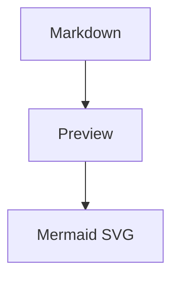
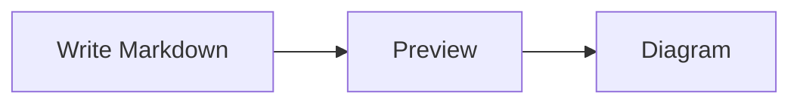
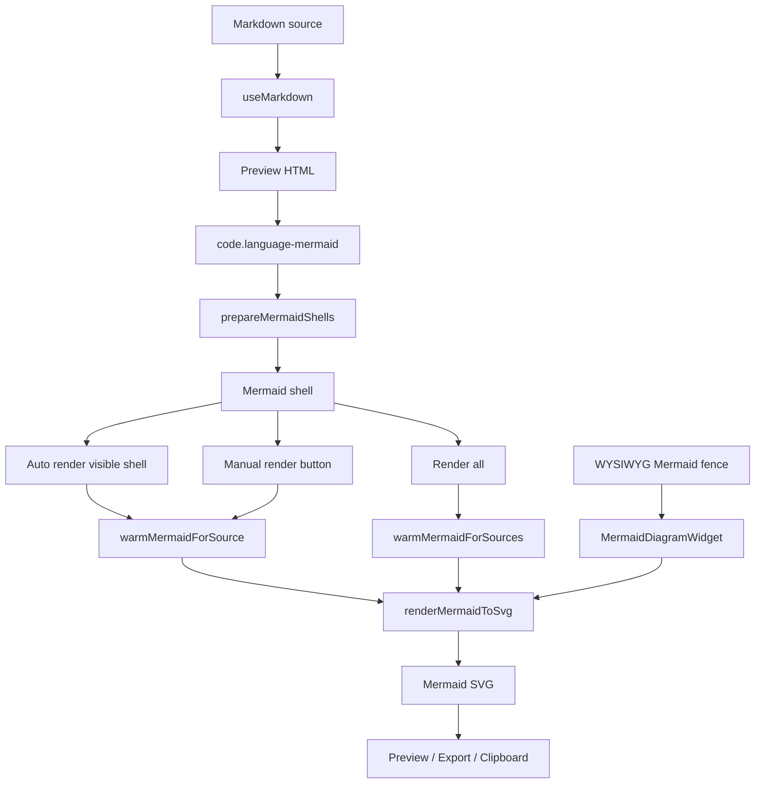

# No.1 Markdown Editor の Mermaid を解説する: Preview / WYSIWYG / Export で図を安全に描画する

## 先に結論

`No.1 Markdown Editor` の Mermaid 対応は、Markdown Preview に `mermaid.render()` をそのまま呼ぶだけの実装ではありません。

Markdown に次のような fenced code block があるとします。

````md

````

この block は、Preview ではすぐに重い描画処理へ進まず、まず `Mermaid 図` の shell UI に変換されます。

そのうえで、

1. 表示範囲に入った図を自動描画する
2. 必要なら `すべて描画` でまとめて描画する
3. hover / focus で Mermaid 本体や parser を先に warm する
4. 描画中は `aria-busy` と disabled state を共有する
5. 失敗したら元の Mermaid source とエラーを残す
6. WYSIWYG では inactive な Mermaid fence を diagram widget として表示する
7. HTML export / HTML copy では Mermaid を SVG にして含める

という流れになります。

ここがかなり大事です。

**Mermaid の描画品質だけでなく、初期表示性能、巨大 document、エラー時の復帰、アクセシビリティ、WYSIWYG の編集性、Vite の chunk 分割まで含めて設計**しています。

この記事では、この Mermaid 実装をコードで分解します。

## この記事で分かること

- Mermaid fenced code block が Preview でどう shell UI に変わるのか
- visible な図だけを auto-render する仕組み
- manual `Render All` を残している理由
- `data-mermaid-rendering` と `aria-busy` で描画中 state を共有する方法
- Mermaid 本体、parser、diagram chunk、logos icon pack をどう lazy load / warm しているのか
- Packet / Radar / Treemap など parser-backed diagram をどう扱うのか
- Mermaid 公式 docs 由来の placeholder 行をどう補正しているのか
- WYSIWYG で Mermaid fence を diagram widget にする方法
- HTML export / rich clipboard で Mermaid を SVG 化する流れ
- テストでこの UI と performance contract をどう守っているのか

## 対象読者

- Markdown editor に Mermaid Preview を入れたい方
- Mermaid の自動描画と手動描画を両立したい方
- React / Vite で Mermaid の bundle 分割に悩んでいる方
- WYSIWYG editor で code fence を diagram として見せたい方
- Preview、clipboard、export まで含めて diagram support を作りたい方

## まず、ユーザー体験

ユーザーは Markdown に Mermaid fence を書きます。

````md

````

Preview に移動すると、Mermaid block は普通の code block のままではなく、次のような diagram card になります。

- `Mermaid 図` という label
- `図を描画` button
- 元の Mermaid source
- 描画後の SVG surface
- エラーが出たときの status message

標準設定では、自動描画が有効です。

表示範囲に入った diagram は、少し待ってから自動的に SVG に変わります。

ただし、大きな文書で Mermaid 図が大量にある場合は、自動描画をオフにできます。
その場合でも Preview 上部の `すべて描画` からまとめて描画できます。

この「auto だけ」「manual だけ」ではなく、両方を持っているのが重要です。

| 状況 | 体験 |
| --- | --- |
| 普通の文書 | visible diagram を自動描画 |
| 大きな文書 | 自動描画を off にして手動描画 |
| 1 つだけ確認したい | card の `図を描画` |
| テーマ変更後 | 描画済み diagram を現在 theme で再描画 |
| エラー時 | source を残し、エラー message を表示 |

## 全体像

ざっくり図にすると、こうなります。



この実装の中心は `src/lib/mermaid.ts` です。

Preview component は「いつ描画するか」を決めます。
`mermaid.ts` は「どう描画するか」を担当します。
WYSIWYG は同じ `renderMermaidToSvg()` を使って diagram widget を作ります。

この分担が実践的です。

## 1. Markdown render 直後はまだ SVG にしない

Markdown renderer は `mermaid` fence を普通の code block として HTML にします。

```html
<pre><code class="language-mermaid">flowchart TD
  A --> B
</code></pre>
```

Preview 側で、この `code.language-mermaid` を探して shell に置き換えます。

```ts
export function prepareMermaidShells(
  root: ParentNode,
  labels: MermaidShellLabels,
  theme: MermaidTheme
): number {
  const blocks = Array.from(root.querySelectorAll('code.language-mermaid'))
  for (const block of blocks) {
    const source = block.textContent ?? ''
    const pre = block.parentElement
    if (!pre) continue
    pre.replaceWith(createMermaidShell(source, labels, getCachedMermaidSvg(source, theme)))
  }

  return blocks.length
}
```

ここで重要なのは、Markdown render のタイミングで Mermaid SVG を作らないことです。

Mermaid は重い処理です。
文書に図が 10 個、20 個ある場合、Preview を開いた瞬間に全部描画すると体感が悪くなります。

だから最初は shell を作るだけにしています。

## 2. Mermaid shell は source と状態を持つ

shell は `createMermaidShell()` で作ります。

```ts
function createMermaidShell(
  source: string,
  labels: MermaidShellLabels,
  renderedSvg?: string | null
): HTMLDivElement {
  const shell = document.createElement('div')
  shell.className = 'mermaid-shell'
  shell.dataset.mermaidSource = encodeMermaidSource(source)
  shell.dataset.mermaidRendered = renderedSvg ? 'true' : 'false'
  shell.dataset.mermaidRenderLabel = labels.render
  shell.dataset.mermaidRefreshLabel = labels.refresh
  shell.dataset.mermaidErrorLabel = labels.error
  shell.dataset.mermaidPacketPlaceholderError = labels.packetPlaceholderError
}
```

source は `data-mermaid-source` に入れます。

ただし raw text のままではなく、`encodeURIComponent()` で encode します。

```ts
function encodeMermaidSource(source: string): string {
  return encodeURIComponent(source)
}

function decodeMermaidSource(source: string): string {
  return decodeURIComponent(source)
}
```

Mermaid source には改行、記号、引用符が入ります。
それを dataset に安全に持たせるための小さな工夫です。

## 3. Shell の中身は card UI

shell の HTML はこうです。

```ts
shell.innerHTML = `
  <div class="mermaid-card">
    <div class="mermaid-card-header">
      <span class="mermaid-card-label"></span>
      <button type="button" class="mermaid-card-button" data-mermaid-action="render"></button>
    </div>
    <p class="mermaid-card-status" hidden></p>
    <pre class="mermaid-card-code"></pre>
    <div class="mermaid-render-surface" hidden></div>
  </div>
`
```

要素の責務は分かれています。

| Element | 役割 |
| --- | --- |
| `.mermaid-card-label` | `Mermaid 図` の label |
| `[data-mermaid-action="render"]` | 1 つの図を描画 / 再描画 |
| `.mermaid-card-status` | エラーや状態表示 |
| `.mermaid-card-code` | 元の Mermaid source |
| `.mermaid-render-surface` | SVG の描画先 |

描画前は source を見せます。
描画後は source を隠し、SVG surface を表示します。

この設計だと、失敗しても source が残ります。

Mermaid diagram は source を直せることが重要なので、エラー時に真っ白な領域だけになるのは避けています。

## 4. i18n label を shell に渡す

Preview 側では label を `useMemo()` で作っています。

```tsx
const mermaidLabels = useMemo(
  () => ({
    label: t('preview.mermaidLabel'),
    render: t('preview.renderDiagram'),
    refresh: t('preview.refreshDiagram'),
    error: t('preview.diagramError'),
    packetPlaceholderError: t('preview.packetPlaceholderError'),
  }),
  [i18n.language]
)
```

日本語ではこうです。

```json
{
  "preview": {
    "mermaidLabel": "Mermaid 図",
    "renderDiagram": "図を描画",
    "refreshDiagram": "図を再描画",
    "diagramError": "図を描画できませんでした",
    "packetPlaceholderError": "Packet 図では 0-15: \"Field\" や +8: \"Field\" のような数値ビット位置が必要です。"
  }
}
```

Mermaid の UI は単なる装飾ではありません。

button、status、error があるので、i18n 対応が必要です。

## 5. Preview HTML が変わったら shell を準備する

`MarkdownPreview` では、HTML が変わるたびに Mermaid shell を準備します。

```tsx
useEffect(() => {
  const preview = previewRef.current
  if (!preview) return

  prepareMermaidShells(preview, mermaidLabels, getMermaidTheme())
  updateMermaidShellLabels(preview, mermaidLabels)
  updatePendingMermaidCount(preview)
}, [previewHtml, mermaidLabels])
```

ここで 3 つの処理をしています。

1. `code.language-mermaid` を shell に置き換える
2. 現在の言語に合わせて shell label を更新する
3. 未描画 diagram の数を数える

Preview HTML は `dangerouslySetInnerHTML` で差し替わるので、React component として Mermaid card を持っているわけではありません。

そのため、HTML 挿入後に DOM を整える形にしています。

## 6. 未描画 diagram の数を持つ

Preview は未描画 Mermaid shell の数を state として持ちます。

```tsx
const [pendingMermaidCount, setPendingMermaidCount] = useState(0)

const updatePendingMermaidCount = (preview = previewRef.current) => {
  setPendingMermaidCount(preview ? countPendingMermaidShells(preview) : 0)
}
```

数える関数は単純です。

```ts
export function countPendingMermaidShells(root: ParentNode): number {
  return root.querySelectorAll('.mermaid-shell[data-mermaid-rendered="false"]').length
}
```

この count は Preview 上部の toolbar に使います。

未描画の図が残っているときだけ、`すべて描画` が出ます。

## 7. Auto-render は少し待ってから始める

Mermaid auto-render は即時には始めません。

```ts
const MERMAID_AUTO_RENDER_DELAY_MS = 650
```

実際の effect では timer を使います。

```tsx
const timer = window.setTimeout(startAutoRender, MERMAID_AUTO_RENDER_DELAY_MS)

return () => {
  cancelled = true
  window.clearTimeout(timer)
  observer?.disconnect()
}
```

この `650ms` が効きます。

ユーザーが高速に入力している間、毎回すぐ Mermaid render を始めると重くなります。
少し待つことで、Preview が落ち着いてから diagram を描画できます。

## 8. 表示範囲に入った Mermaid だけ描画する

auto-render は `IntersectionObserver` を使います。

```tsx
observer = new IntersectionObserver(
  (entries) => {
    for (const entry of entries) {
      if (!entry.isIntersecting) continue
      const shell = entry.target as HTMLElement
      observer?.unobserve(shell)
      renderVisibleShell(shell)
    }
  },
  { root: preview, rootMargin: MERMAID_AUTO_RENDER_ROOT_MARGIN, threshold: 0 }
)
```

root は browser window ではなく Preview pane です。

```ts
const MERMAID_AUTO_RENDER_ROOT_MARGIN = '240px 0px'
```

`240px` の margin を持たせているので、完全に見えてからではなく、近づいた段階で描画を始められます。

体感としては、スクロールしたときに diagram が少し早めに準備されます。

## 9. IntersectionObserver がない環境では全部描画する

fallback もあります。

```tsx
if (typeof IntersectionObserver === 'undefined') {
  pendingShells.forEach(renderVisibleShell)
  return
}
```

IntersectionObserver が使えない環境では、pending shell をすべて描画します。

これは progressive enhancement です。

使える環境では効率よく visible render。
使えない環境では機能を止めずに全部 render。

## 10. Auto-render は設定で off にできる

設定は store にあります。

```ts
previewAutoRenderMermaid: true,
setPreviewAutoRenderMermaid: (previewAutoRenderMermaid) => set({ previewAutoRenderMermaid }),
```

`partialize` にも入っています。

```ts
previewAutoRenderMermaid: s.previewAutoRenderMermaid,
```

merge では、古い保存 state に値がない場合に default on になります。

```ts
previewAutoRenderMermaid: persistedState?.previewAutoRenderMermaid !== false,
```

つまり、明示的に false を保存した場合だけ off です。

標準では Mermaid 図を自動描画します。

## 11. ThemePanel で auto-render を切り替える

設定 panel では toggle として出しています。

```tsx
<button
  type="button"
  aria-pressed={previewAutoRenderMermaid}
  onClick={() => setPreviewAutoRenderMermaid(!previewAutoRenderMermaid)}
  className="relative rounded-full transition-colors flex-shrink-0"
>
```

`aria-pressed` を持っているので、単なる見た目の switch ではありません。

日本語の説明はこうです。

```json
{
  "previewAutoRenderMermaid": "Mermaid 図を自動描画",
  "previewAutoRenderMermaidHint": "標準ではオンです。表示範囲に入った図を自動描画します。大きな文書で手動描画にしたい場合はオフにしてください。"
}
```

ここで「大きな文書で手動描画にしたい場合」を明示しているのが良いです。

設定の意味が、単なる on/off ではなく使いどころとして伝わります。

## 12. 手動 Render All も残す

未描画 diagram があると、Preview 上に toolbar を出します。

```tsx
{pendingMermaidCount > 0 && (
  <div className="preview-diagram-toolbar">
    <span className="preview-diagram-toolbar__text">
      {t('preview.diagramsPending', { count: pendingMermaidCount })}
    </span>
    <button
      type="button"
      className="preview-diagram-toolbar__button"
      onClick={renderAllDiagrams}
      disabled={renderingAll}
    >
      {renderingAll ? t('preview.renderingDiagrams') : t('preview.renderAllDiagrams')}
    </button>
  </div>
)}
```

`renderAllDiagrams()` はこうです。

```tsx
const renderAllDiagrams = () => {
  const preview = previewRef.current
  if (!preview || pendingMermaidCount === 0) return

  warmPendingMermaidSources(preview)
  const mermaidTheme = getMermaidTheme()
  setRenderingAll(true)
  void renderMermaidShells(preview, mermaidTheme).finally(() => {
    setRenderingAll(false)
    updatePendingMermaidCount(preview)
  })
}
```

auto-render があっても、manual fallback を残す。
これはかなり大事です。

大きな文書、低スペック環境、意図的に自動描画を止めたいユーザーに対応できます。

## 13. 描画中 state は automatic / manual で共有する

Mermaid shell の描画中 state は `setMermaidShellRendering()` に集約されています。

```ts
function setMermaidShellRendering(shell: HTMLElement, rendering: boolean): void {
  const button = shell.querySelector<HTMLButtonElement>('[data-mermaid-action="render"]')
  if (rendering) {
    shell.dataset.mermaidRendering = 'true'
    shell.setAttribute('aria-busy', 'true')
    if (button) button.disabled = true
    return
  }

  delete shell.dataset.mermaidRendering
  shell.removeAttribute('aria-busy')
  if (button) button.disabled = false
}
```

この関数は automatic render でも manual render でも使います。

そのため、同じ shell が二重に描画されにくくなります。

`renderMermaidShells()` 側でも skip しています。

```ts
if (shell.dataset.mermaidRendering === 'true') continue
```

UI の見た目だけでなく、処理の多重実行も防いでいます。

## 14. renderVisibleShell はキャンセル可能

Preview HTML が変わったり component が unmount されたりすると、古い render は不要になります。

auto-render では `cancelled` flag を持っています。

```tsx
let cancelled = false

void renderMermaidShells(preview, mermaidTheme, {
  targets: [shell],
  isCancelled: () => cancelled,
}).finally(() => {
  renderingShells.delete(shell)
  if (!cancelled) updatePendingMermaidCount(preview)
})
```

`renderMermaidShells()` も `isCancelled` を見ます。

```ts
if (options.isCancelled?.()) return false
```

非同期 render が走る UI では、この cancellation が重要です。

古い文書の diagram が、新しい Preview に遅れて反映されるような事故を避けられます。

## 15. hover / focus で Mermaid を warm する

ユーザーが render button に近づいた時点で、Mermaid の準備を始めます。

```tsx
const onWarmIntent = (event: Event) => {
  const target = event.target as HTMLElement | null
  if (!target?.closest('[data-mermaid-action="render"]')) return

  const shell = target.closest<HTMLElement>('.mermaid-shell')
  if (!shell) return
  warmMermaidShell(shell)
}

preview.addEventListener('pointerover', onWarmIntent)
preview.addEventListener('focusin', onWarmIntent)
```

mouse hover だけでなく `focusin` も見ています。

keyboard user が button に focus したときにも、同じように warm できます。

これは小さいですが、操作感に効きます。

## 16. Mermaid 本体は dynamic import する

Mermaid 本体は最初から import しません。

```ts
function loadMermaid() {
  mermaidPromise ??= import('mermaid').catch((error) => {
    mermaidPromise = null
    attemptDynamicImportRecovery(error)
    throw error
  })
  return mermaidPromise
}
```

Preview で Mermaid を使うまで読みません。

さらに import 失敗時には cache を消し、Vite preload recovery を試します。

Mermaid は大きい依存です。

Markdown editor の起動時に必ず必要なものではないので、lazy load が自然です。

## 17. Mermaid render は strict mode で行う

実際の SVG 描画は `renderMermaidToSvg()` です。

```ts
export async function renderMermaidToSvg(
  source: string,
  theme: MermaidTheme,
  idPrefix = 'mermaid'
): Promise<string> {
  const cachedSvg = getCachedMermaidSvg(source, theme)
  if (cachedSvg) return cachedSvg

  const mermaid = await loadConfiguredMermaid()
  await ensureMermaidDiagramSupport(mermaid, source)
  mermaid.initialize({ startOnLoad: false, theme, securityLevel: 'strict' })

  const { svg } = await mermaid.render(
    `${idPrefix}-${Date.now()}-${mermaidRenderSequence++}`,
    getRenderableMermaidSource(source)
  )
  cacheMermaidSvg(source, theme, svg)
  return svg
}
```

ポイントは 4 つあります。

1. cache があれば再利用する
2. Mermaid 本体と必要な diagram support を準備する
3. `startOnLoad: false` にする
4. `securityLevel: 'strict'` にする

Markdown editor では、ユーザーが書いた文書を Preview に出します。

そのため、Mermaid 側も安全寄りの設定にしておくのが妥当です。

## 18. SVG は source + theme で cache する

cache key は source と theme です。

```ts
function getMermaidCacheKey(source: string, theme: MermaidTheme): string {
  return `${theme}\u0000${source}`
}
```

cache entry は最大 48 件です。

```ts
const MAX_MERMAID_RENDER_CACHE_ENTRIES = 48
```

保存時には古い entry を削除します。

```ts
while (mermaidRenderCache.size > MAX_MERMAID_RENDER_CACHE_ENTRIES) {
  const oldestKey = mermaidRenderCache.keys().next().value
  if (!oldestKey) break
  mermaidRenderCache.delete(oldestKey)
}
```

同じ diagram を何度も描画し直さない。
でも無限に SVG を貯めない。

このバランスです。

## 19. テーマ変更時は描画済み diagram だけ再描画する

Preview では theme change も見ています。

```tsx
useEffect(() => {
  const preview = previewRef.current
  if (!preview || !hasRenderedMermaidShells(preview)) return

  let cancelled = false
  const mermaidTheme = getMermaidTheme()
  void renderMermaidShells(preview, mermaidTheme, {
    isCancelled: () => cancelled,
    renderedOnly: true,
  })

  return () => {
    cancelled = true
  }
}, [activeThemeId, previewHtml])
```

`renderedOnly: true` が重要です。

未描画 diagram までテーマ変更で勝手に描画しません。

すでに表示済みの diagram だけを、light / dark に合わせて再描画します。

## 20. diagram type を検出して必要なものだけ warm する

Mermaid には `flowchart` だけでなく、`packet`、`radar`、`treemap`、`architecture`、`gitGraph`、`wardley` などがあります。

この実装では、最初の有効行から diagram type を検出します。

```ts
function getMermaidDefinitionLine(source: string): string | null {
  for (const line of source.split(/\r?\n/u)) {
    const trimmed = line.trim()
    if (!trimmed || trimmed.startsWith('%%')) continue
    return trimmed
  }

  return null
}
```

directive や comment を飛ばすのがポイントです。

```ts
export function detectMermaidDiagramType(source: string): MermaidDetectedDiagramType | null {
  const definitionLine = getMermaidDefinitionLine(source)
  if (!definitionLine) return null

  for (const [diagramType, matcher] of mermaidDiagramTypeMatchers) {
    if (matcher.test(definitionLine)) {
      return diagramType
    }
  }

  return null
}
```

`flowchart` のように特別な warming が不要なものは `null` のままです。

## 21. parser-backed diagram は parser も warm する

`warmMermaidForSource()` では、diagram type に応じて必要なものを準備します。

```ts
export async function warmMermaidForSource(source: string): Promise<void> {
  const diagramType = detectMermaidDiagramType(source)
  const warmTasks: Promise<void>[] = [warmMermaid()]

  if (diagramType) {
    if (!isMermaidExternalDiagramType(diagramType)) {
      warmTasks.push(loadMermaidParser().then(({ warmMermaidParser }) => warmMermaidParser(diagramType)))
    }

    const diagramWarmer = mermaidDiagramWarmers[diagramType]
    if (diagramWarmer) {
      warmTasks.push(warmMermaidResource(getMermaidWarmResourceKey(diagramType), diagramWarmer))
    }
  }

  await Promise.all(warmTasks)
}
```

ここでやっていることは 3 つです。

1. Mermaid core を warm する
2. 必要なら parser を warm する
3. 必要なら diagram chunk を warm する

diagram ごとに必要な依存が違うので、全部まとめて読むのではなく、source を見て必要なものだけ準備します。

## 22. Mermaid parser は shim 経由で読む

parser は `src/lib/mermaidParser.ts` に分離されています。

```ts
const nodeMermaidParserSpecifier = '@mermaid-js/parser'

function loadMermaidParserCore(): Promise<MermaidParserCoreModule> {
  mermaidParserCorePromise ??= (
    typeof window === 'undefined'
      ? (import(nodeMermaidParserSpecifier) as unknown as Promise<MermaidParserCoreModule>)
      : import('@mermaid-js/parser-upstream') as Promise<MermaidParserCoreModule>
  ).catch((error) => {
    mermaidParserCorePromise = null
    throw error
  })
  return mermaidParserCorePromise
}
```

Vite 側では alias を持っています。

```ts
{ find: /^@mermaid-js\/parser$/, replacement: path.resolve(__dirname, './src/lib/mermaidParser.ts') },
{ find: /^@mermaid-js\/parser-upstream$/, replacement: '@mermaid-js/parser' },
```

これは chunk 分割と実行環境のための工夫です。

ブラウザでは upstream parser を alias 経由で読み、Node test では通常 package を読めるようにしています。

## 23. 公式 docs の placeholder 行を取り除く

Mermaid 公式 docs の例には、placeholder 行が含まれることがあります。

たとえば、

```txt
... More Fields ...
...
```

のような行です。

これは説明用であって、実際の Mermaid 文法としては不正な場合があります。

そのため、render 前に補正します。

```ts
export function getRenderableMermaidSource(source: string): string {
  const lines = source.split(/\r?\n/u)
  let removedPlaceholderLine = false

  const renderableLines = lines.filter((line) => {
    const isPlaceholderLine = mermaidPlaceholderLinePattern.test(line.trim())
    removedPlaceholderLine ||= isPlaceholderLine
    return !isPlaceholderLine
  })

  return removedPlaceholderLine ? renderableLines.join('\n') : source
}
```

ただし、実際の label として `"... More Fields ..."` が入っている場合は残します。

このあたりはかなり実務的です。

ユーザーは docs から例をコピーします。
そのとき、説明用 placeholder が原因で即エラーになるのは体験が悪いです。

## 24. Packet diagram には専用 error hint を出す

Packet diagram は、placeholder template をそのまま貼ると分かりにくい lexer error になりがちです。

そこで、専用の error message を返します。

```ts
export function getMermaidRenderErrorMessage(
  error: unknown,
  fallbackMessage: string,
  source: string,
  packetPlaceholderMessage?: string
): string {
  if (packetPlaceholderMessage && isPacketSyntaxTemplate(source)) {
    return `${fallbackMessage}: ${packetPlaceholderMessage}`
  }

  return getMermaidErrorMessage(error, fallbackMessage)
}
```

日本語ではこうです。

```txt
Packet 図では 0-15: "Field" や +8: "Field" のような数値ビット位置が必要です。
```

ただの parser error より、次に何を直せばいいかが分かります。

## 25. Architecture の logos icon pack は必要な分だけ読む

Mermaid の `architecture-beta` では `logos:aws` のような icon を使えます。

ただし、logos icon pack 全体は大きくなりやすいです。

この実装では、source から icon 名を抽出します。

```ts
export function extractMermaidLogosIconNames(source: string): string[] {
  const matches = source.matchAll(/\blogos:([a-z0-9]+(?:[._-][a-z0-9]+)*)/giu)
  const uniqueNames = new Set<string>()

  for (const match of matches) {
    uniqueNames.add(match[1].toLowerCase())
  }

  return Array.from(uniqueNames)
}
```

よく使う icon だけなら common pack を使います。

```ts
export function canUseMermaidCommonLogosIconPack(source: string): boolean {
  const iconNames = extractMermaidLogosIconNames(source)
  return iconNames.length > 0 && iconNames.every((name) => COMMON_MERMAID_LOGOS_ICON_NAMES.has(name))
}
```

common pack で足りない場合だけ full pack に進みます。

## 26. logos pack は JS module ではなく JSON asset として読む

icon pack は URL を import して、`fetch()` で JSON として読みます。

```ts
function loadMermaidLogosIconPackUrl() {
  mermaidLogosIconPackUrlPromise ??= import('@iconify-json/logos/icons.json?url')
    .then((module) => module.default)
    .catch((error) => {
      mermaidLogosIconPackUrlPromise = null
      attemptDynamicImportRecovery(error)
      throw error
    })

  return mermaidLogosIconPackUrlPromise
}
```

実際の登録はこうです。

```ts
mermaid.registerIconPacks([
  {
    name: 'logos',
    icons,
  },
])
```

ここでも方針は同じです。

必要になるまで読まない。
必要な場合も、できるだけ小さい path を選ぶ。

## 27. ZenUML は eager warm path に入れない

ZenUML は外部 diagram plugin として扱います。

```ts
async function ensureMermaidExternalDiagramRegistered(
  mermaid: MermaidModule['default'],
  diagramType: MermaidExternalDiagramType,
  eagerLoad = false
): Promise<void> {
  if (diagramType !== 'zenuml') return
  const zenuml = await loadMermaidZenumlPlugin()
  await mermaid.registerExternalDiagrams([zenuml], { lazyLoad: !eagerLoad })
}
```

`mermaidDiagramWarmers` でも、ZenUML は lazy registration にしています。

```ts
zenuml: async () => {
  const mermaid = await loadConfiguredMermaid()
  await ensureMermaidExternalDiagramRegistered(mermaid, 'zenuml')
}
```

ZenUML の runtime payload は大きいので、標準の eager path に入れない判断です。

使うときだけ読む。

これも Mermaid support の性能面でかなり重要です。

## 28. Vite で Mermaid chunk を分ける

Vite config でも Mermaid は特別扱いしています。

```ts
const OPTIONAL_PREVIEW_CHUNK_PATTERN =
  /\/assets\/(?:MarkdownPreview|markdown(?:[A-Za-z]+)?|vendor-markdown(?:-(?:math|html))?|vendor-mermaid(?:-[^"]+)?|mermaid|.*katex[^"]*|.*rehype-katex[^"]*|.*zenuml[^"]*)/
```

optional preview chunk は preload から外します。

```ts
transformIndexHtml(html) {
  return html.replace(/\n\s*<link rel="modulepreload" crossorigin href="([^"]+)">/g, (match, href) =>
    OPTIONAL_PREVIEW_CHUNK_PATTERN.test(href) || OPTIONAL_EDITOR_CHUNK_PATTERN.test(href) ? '' : match
  )
}
```

Mermaid は Preview を使うまで必要ありません。

初期 HTML で Mermaid 関連 chunk を preload しないことで、起動時の負荷を抑えます。

## 29. Mermaid parser runtime は循環 chunk を避ける

Vite config には parser runtime の chunk 分割もあります。

```ts
const isMermaidParserRuntimeDependency =
  normalizedId.includes('/node_modules/langium/') ||
  normalizedId.includes('/node_modules/chevrotain/')

if (isMermaidParserRuntimeDependency) {
  return 'vendor-mermaid-parser-runtime'
}
```

`langium` と `chevrotain` を別々の chunk にしないのがポイントです。

parser runtime の循環依存が chunk graph で問題になりやすいので、同じ chunk に寄せています。

これは見た目の機能ではありませんが、Mermaid を安定して lazy load するための実装です。

## 30. WYSIWYG では Mermaid fence を diagram widget にする

WYSIWYG では、inactive な Mermaid fence を diagram widget に置き換えます。

```ts
export function isRenderableWysiwygMermaidCodeBlock(fencedCodeBlock: FencedCodeBlock): boolean {
  return fencedCodeBlock.closingLineFrom !== null && fencedCodeBlock.language?.toLowerCase() === 'mermaid'
}
```

selection が Mermaid fence の外にあるときは、opening line に widget を出し、残りの行を隠します。

```ts
if (lineFrom === fencedCodeBlock.openingLineFrom) {
  queueLineDecoration(decorations, lineFrom, {
    class: 'cm-wysiwyg-mermaid-anchor-line',
  })
  queueDecoration(
    decorations,
    lineFrom,
    lineTo,
    Decoration.replace({ widget: new MermaidDiagramWidget(content.source, content.editAnchor) })
  )
  return true
}

queueLineDecoration(decorations, lineFrom, {
  class: 'cm-wysiwyg-mermaid-hidden-line',
})
queueDecoration(decorations, lineFrom, lineTo, Decoration.replace({}))
```

これにより、WYSIWYG では Mermaid block が diagram として読めます。

ただし、編集したいときは source に戻れます。

## 31. selection が fence に入ったら source を見せる

Mermaid widget は、selection が fence の外にあるときだけ出ます。

```ts
function selectionTouchesFencedCodeBlock(
  view: WysiwygDecorationView,
  fencedCodeBlock: FencedCodeBlock
): boolean {
  const { ranges } = view.state.selection
  return ranges.some((range) => range.from <= fencedCodeBlock.to && range.to >= fencedCodeBlock.from)
}
```

selection が Mermaid fence に触れたら、widget を出さず、元の fenced code block を編集できるようにします。

これは WYSIWYG でかなり大事です。

図として見えることと、Markdown source を編集できることを両立しています。

## 32. WYSIWYG widget も同じ renderMermaidToSvg を使う

WYSIWYG の widget も `renderMermaidToSvg()` を使います。

```ts
async function renderWysiwygMermaidDiagram(
  wrapper: HTMLElement,
  source: string,
  theme: MermaidTheme
): Promise<void> {
  const mermaidModule = await import('../../lib/mermaid.ts')
  const svg = await mermaidModule.renderMermaidToSvg(source, theme, 'mermaid-wysiwyg')
  surface.innerHTML = svg
}
```

Preview 専用の Mermaid renderer を別に作っていません。

これにより、

- cache
- theme
- parser warming
- logos icon pack
- error formatting

などの実装を共有できます。

## 33. WYSIWYG widget は theme 変更にも追従する

WYSIWYG widget は `MutationObserver` で document の class を見ています。

```ts
const observer = new MutationObserver(() => {
  const nextTheme = resolveMermaidTheme(wrapper.ownerDocument)
  if (nextTheme === currentTheme) return
  currentTheme = nextTheme
  void renderWysiwygMermaidDiagram(wrapper, this.source, currentTheme)
})

observer.observe(wrapper.ownerDocument.documentElement, {
  attributes: true,
  attributeFilter: ['class'],
})
```

dark / light theme が切り替わると、diagram も再描画されます。

Preview と同じく、Mermaid の theme は SVG 生成時に効くので、CSS だけでは完全には切り替えられません。

だから再描画が必要です。

## 34. HTML export / rich clipboard でも Mermaid を SVG にする

Export では、rendered HTML に Mermaid code block が含まれる場合に SVG 化します。

```ts
let bodyHtml = await renderMarkdown(markdown)
if (bodyHtml.includes('language-mermaid')) {
  const { renderMermaidInHtml } = await import('../lib/mermaid')
  bodyHtml = await renderMermaidInHtml(bodyHtml, mermaidTheme)
}
```

Clipboard HTML でも同じ helper を使います。

```ts
let bodyHtml = await renderMarkdown(markdown)
if (bodyHtml.includes('language-mermaid')) {
  const { renderMermaidInHtml } = await import('./mermaid.ts')
  bodyHtml = await renderMermaidInHtml(bodyHtml, mermaidTheme)
}
```

`renderMermaidInHtml()` は `code.language-mermaid` を探して、SVG container に置き換えます。

```ts
export async function renderMermaidInHtml(html: string, theme: MermaidTheme): Promise<string> {
  if (!html.includes('language-mermaid')) return html

  const template = document.createElement('template')
  template.innerHTML = html

  const blocks = Array.from(template.content.querySelectorAll('code.language-mermaid'))
  for (const [index, block] of blocks.entries()) {
    const source = block.textContent ?? ''
    const pre = block.parentElement
    if (!pre) continue

    const svg = await renderMermaidToSvg(source, theme, `mermaid-export-${index}`)
    const container = document.createElement('div')
    container.className = 'mermaid'
    container.innerHTML = svg
    pre.replaceWith(container)
  }

  return template.innerHTML
}
```

これで、HTML export や HTML copy の中にも diagram が入ります。

## 35. Preview copy は Markdown-safe にする

一方で、Preview の選択範囲を通常 copy するときは Markdown-safe payload を使っています。

```ts
const markdownText = convertPreviewSelectionHtmlToMarkdown(fragment.html, fragment.plainText)
const payload = buildMarkdownSafeClipboardPayload(markdownText)
```

ここでは Mermaid SVG を無理に rich HTML として持ち出すより、Markdown として安全に戻すことを優先しています。

Export / Copy Rich HTML は rich HTML。
HTML ソース文字列が必要な場合は Copy HTML Source を使います。
Preview selection copy は Markdown-safe。

この違いも実用的です。

## 36. CSS は shell / card / surface を分ける

Preview の Mermaid CSS は、shell、card、source、surface を分けています。

```css
.markdown-preview .mermaid-shell {
  margin: 1.5em 0;
}

.markdown-preview .mermaid-card {
  border: 1px solid var(--border);
  border-radius: 12px;
  background: color-mix(in srgb, var(--bg-secondary) 74%, transparent);
  overflow: hidden;
}

.markdown-preview .mermaid-card-header {
  display: flex;
  align-items: center;
  justify-content: space-between;
  gap: 12px;
  padding: 12px 14px;
  border-bottom: 1px solid var(--border);
}
```

source 部分は普通の code block 風ですが、card の中に収めています。

```css
.markdown-preview .mermaid-card-code {
  margin: 0;
  border: none;
  border-radius: 0;
  background: transparent;
  padding: 14px 16px 16px;
  box-shadow: none;
}
```

描画 surface は横 overflow に対応し、中央寄せです。

```css
.markdown-preview .mermaid-render-surface {
  padding: 16px;
  overflow-x: auto;
  text-align: center;
}

.markdown-preview .mermaid-render-surface svg {
  display: inline-block;
  max-width: 100%;
  height: auto;
}
```

Mermaid diagram は横に広がりやすいので、`overflow-x: auto` は必須です。

## 37. pending toolbar は浮かせる

未描画 diagram があるときの toolbar は Preview の右上に浮きます。

```css
.preview-diagram-toolbar {
  position: absolute;
  top: 12px;
  right: 16px;
  z-index: 5;
  display: flex;
  align-items: center;
  gap: 12px;
  padding: 10px 14px;
  border-radius: 999px;
  background: color-mix(in srgb, var(--bg-primary) 88%, transparent);
  border: 1px solid color-mix(in srgb, var(--border) 70%, transparent);
  box-shadow: var(--shadow-sm);
  backdrop-filter: blur(14px);
}
```

これは page content の一部ではなく、Preview 操作の一時 toolbar です。

だから文書 layout の中に押し込まず、Preview surface の上に出しています。

## 38. テスト: auto-render の構造を守る

`tests/preview-mermaid-auto-render.test.ts` では、auto-render の構造を守っています。

```ts
assert.match(source, /const MERMAID_AUTO_RENDER_DELAY_MS = 650/u)
assert.match(source, /const MERMAID_AUTO_RENDER_ROOT_MARGIN = '240px 0px'/u)
assert.match(source, /new IntersectionObserver\(/u)
assert.match(source, /root: preview, rootMargin: MERMAID_AUTO_RENDER_ROOT_MARGIN, threshold: 0/u)
assert.match(source, /warmMermaidShell\(shell\)/u)
```

テストの狙いは、見た目の pixel perfect ではありません。

守っているのは、

- auto-render が設定で止められること
- delay があること
- visible shell だけ render すること
- warm してから render すること
- manual render all が残っていること

です。

## 39. テスト: rendering state を共有する

同じテストで描画中 state も見ています。

```ts
assert.match(mermaidSource, /function setMermaidShellRendering\(shell: HTMLElement, rendering: boolean\): void/u)
assert.match(mermaidSource, /shell\.dataset\.mermaidRendering = 'true'/u)
assert.match(mermaidSource, /shell\.setAttribute\('aria-busy', 'true'\)/u)
assert.match(mermaidSource, /if \(shell\.dataset\.mermaidRendering === 'true'\) continue/u)
```

automatic と manual が別々に state を持つと、二重 render や button state のズレが起きやすくなります。

そこで、共通の shell state をテストで守っています。

## 40. テスト: Mermaid utility の細部を守る

`tests/mermaid-utils.test.ts` では、diagram type detection や error message を確認しています。

```ts
assert.equal(detectMermaidDiagramType('packet\n 0-15: "Version"'), 'packet')
assert.equal(detectMermaidDiagramType('radar-beta\n axis Speed'), 'radar')
assert.equal(detectMermaidDiagramType('treemap-beta\n "Section 1"'), 'treemap')
assert.equal(detectMermaidDiagramType('zenuml\n title Demo'), 'zenuml')
```

placeholder 行の除去もテストしています。

```ts
assert.equal(
  getRenderableMermaidSource(source),
  [
    'radar-beta',
    'axis A, B, C, D, E',
    'curve c1{1,2,3,4,5}',
    'curve c2{5,4,3,2,1}',
    'ticks 5',
  ].join('\n')
)
```

ユーザーが docs から example を貼る現実を、テストで守っています。

## 41. テスト: parser shim と chunk 方針を守る

`tests/vite-config-mermaid.test.ts` では、Vite と parser shim の約束を守っています。

```ts
assert.match(viteConfigSource, /find:\s*\/\^@mermaid-js\\\/parser\$\//u)
assert.match(viteConfigSource, /find:\s*\/\^@mermaid-js\\\/parser-upstream\$\//u)
assert.match(viteConfigSource, /include:\s*\['mermaid', '@mermaid-js\/parser-upstream', 'langium'\]/u)
```

logos icon pack の読み込み方も守っています。

```ts
assert.match(mermaidSource, /import\('@iconify-json\/logos\/icons\.json\?url'\)/u)
assert.match(mermaidSource, /const response = await fetch\(iconSetUrl\)/u)
assert.doesNotMatch(mermaidSource, /import\('@iconify-json\/logos'\)\s*\.then/u)
```

Mermaid は重い機能なので、こうした performance contract のテストが重要です。

## 42. テスト: WYSIWYG の Mermaid widget を守る

`tests/wysiwyg-code-blocks.test.ts` では、inactive Mermaid fence が widget になることを確認しています。

```ts
assert.equal(widget?.constructor?.name, 'MermaidDiagramWidget')
assert.equal(
  entries.find((entry) => entry.spec.attributes?.class?.includes('cm-wysiwyg-mermaid-anchor-line'))?.from,
  block.openingLineFrom
)
```

selection が fence に入ったときは、widget を出さないことも確認しています。

```ts
const mermaidEntries = entries.filter(
  (entry) => entry.spec.widget || entry.spec.attributes?.class?.includes('cm-wysiwyg-mermaid')
)

assert.deepEqual(mermaidEntries, [])
```

これは WYSIWYG の編集性を守るテストです。

図として見えるだけでなく、必要なときに source を編集できることを保証しています。

## 実装の要点

### 1. Mermaid を Markdown render と同時に描画しない

まず shell にする。
必要になった diagram だけ描画する。

この分け方で、大きな文書でも Preview の初期表示を軽くできます。

### 2. Auto-render と manual render を両方持つ

標準では visible diagram を自動描画します。

でも、大きな文書や低スペック環境では manual control が必要です。

だから `previewAutoRenderMermaid` と `Render All` の両方を持っています。

### 3. Mermaid の依存は source を見て warm する

Mermaid core、parser、diagram chunk、logos icon pack、ZenUML plugin。
全部を最初から読むのではなく、source に応じて必要なものだけ準備します。

### 4. WYSIWYG は diagram と source 編集を両立する

inactive な Mermaid fence は diagram widget。
selection が中に入ったら source。

この切り替えで、読みやすさと編集しやすさを両立しています。

### 5. Export / Clipboard でも同じ renderer を使う

Preview だけでなく、HTML export と rich clipboard でも `renderMermaidInHtml()` を通します。

これにより、アプリ外へ持ち出した HTML にも SVG diagram を含められます。

## この記事の要点を 3 行でまとめると

1. Mermaid fence はまず Preview shell に変換し、visible auto-render / manual render / Render All で必要なときに SVG 化します。
2. Mermaid core、parser、diagram chunk、logos icon pack、ZenUML は source に応じて lazy load / warm し、初期表示の重さを抑えています。
3. WYSIWYG、Preview、HTML export、rich clipboard が同じ Mermaid rendering helper を共有することで、図の表示品質と編集性を両立しています。

## 参考実装

- Mermaid helper: `src/lib/mermaid.ts`
- Mermaid parser shim: `src/lib/mermaidParser.ts`
- Preview: `src/components/Preview/MarkdownPreview.tsx`
- WYSIWYG Mermaid widget: `src/components/Editor/wysiwygCodeBlock.ts`
- Theme panel: `src/components/ThemePanel/ThemePanel.tsx`
- Store: `src/store/editor.ts`
- Export: `src/hooks/useExport.ts`
- Clipboard HTML: `src/lib/clipboardHtml.ts`
- Styles: `src/global.css`
- Vite chunks: `vite.config.ts`
- i18n: `src/i18n/locales/ja.json`, `src/i18n/locales/en.json`, `src/i18n/locales/zh.json`
- Tests: `tests/preview-mermaid-auto-render.test.ts`, `tests/mermaid-utils.test.ts`, `tests/mermaid-parser.test.ts`, `tests/vite-config-mermaid.test.ts`, `tests/wysiwyg-code-blocks.test.ts`, `tests/editor-markdown-code-languages.test.ts`, `tests/export-copy-html-wiring.test.ts`
