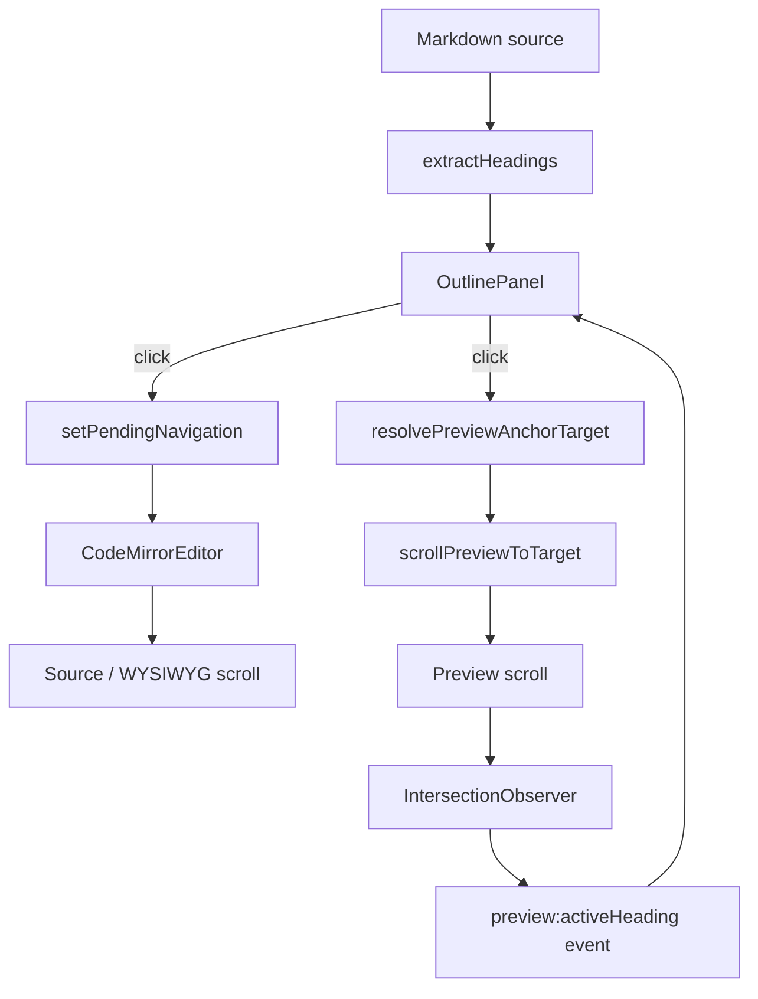

# No.1 Markdown Editor のアウトライン同期ナビゲーションを解説する: 見出しクリックで Source/WYSIWYG と Preview を同時に動かす

## 先に結論

`No.1 Markdown Editor` では、左サイドバーのアウトライン見出しをクリックすると、次の 2 つが同時に起きます。

1. `Source / WYSIWYG` 側の CodeMirror エディターが、その見出しの行へ移動する
2. `Preview` 側のレンダリング済み HTML が、同じ見出しへスクロールする

さらに Preview をスクロールしたときは、現在見えている見出しがサイドバーのアウトラインに反映されます。

つまり、これは単なる「リンククリック」ではありません。

**Markdown source の行番号、Preview HTML の heading id、CodeMirror の scroll effect、Preview の scrollspy をつないだ双方向のナビゲーション設計**です。

この記事では、この実装をコードで分解します。

## この記事で分かること

- アウトラインの見出しクリックで何が起きているのか
- Source と WYSIWYG が同じ仕組みで移動できる理由
- Preview 側を DOM の heading id で移動させる方法
- Markdown の見出し id を Source と Preview で一致させる設計
- Preview のスクロール状態をアウトラインの active 表示に戻す仕組み
- この UI を守るテストの考え方

## 対象読者

- Markdown editor のアウトライン機能を作りたい方
- CodeMirror と Preview を同期させたい方
- React で editor / preview / sidebar を分けて実装している方
- 見出しナビゲーションを「それっぽい」ではなく、壊れにくく作りたい方

## まず、ユーザー体験

画面左のアウトラインには、Markdown の見出しが階層表示されます。

たとえば次の Markdown があるとします。

```md
# 一级标题
## 二级标题
### 三级标题
#### 四级标题
##### 五级标题
###### 六级标题
```

アウトラインでは、これが `H1` から `H6` までの見出しとして並びます。

ユーザーが `三级标题` をクリックすると、

- Source / WYSIWYG 側は、その見出し行へカーソル移動する
- Preview 側は、レンダリング後の `<h3>` へスクロールする
- 対象見出しが一瞬 highlight される
- アウトラインの active 表示も更新される

という流れになります。

ここで大事なのは、Source と Preview では移動の基準が違うことです。

| Surface | 移動の基準 |
| --- | --- |
| Source / WYSIWYG | Markdown source の `line / column` |
| Preview | HTML heading の `id` |
| Outline active | Preview 上で見えている heading id |

この 3 つをつなぐのが今回の実装です。

## 全体像

先に全体の流れです。



ポイントは、アウトラインクリックが 1 本の処理ではなく、**editor route** と **preview route** に分かれていることです。

この分け方がかなり実践的です。

## 1. Markdown から outline headings を作る

アウトラインの元データは `src/lib/outline.ts` の `extractHeadings()` で作っています。

```ts
export interface OutlineHeading {
  level: number
  text: string
  id: string
  line: number
}
```

ここで持つ情報は 4 つです。

- `level`: `h1` から `h6`
- `text`: 表示する見出し文字列
- `id`: Preview の heading id と対応する anchor
- `line`: Source / WYSIWYG 側で移動する行番号

実装の中心はこの部分です。

```ts
export function extractHeadings(markdown: string): OutlineHeading[] {
  const lines = markdown.split(/\r?\n/)
  const headings: OutlineHeading[] = []
  const headingIds = createHeadingIdState()
  let inFrontMatter = false
  let frontMatterHandled = false
  let fenceMarker: string | null = null

  for (let index = 0; index < lines.length; index++) {
    const line = lines[index]

    if (!frontMatterHandled && index === 0 && line.trim() === '---') {
      inFrontMatter = true
      frontMatterHandled = true
      continue
    }

    if (inFrontMatter) {
      if (line.trim() === '---') inFrontMatter = false
      continue
    }

    const fenceMatch = line.match(/^\s{0,3}(`{3,}|~{3,})/)
    if (fenceMatch) {
      const marker = fenceMatch[1][0]
      if (fenceMarker === null) {
        fenceMarker = marker
        continue
      }
      if (fenceMarker === marker) {
        fenceMarker = null
        continue
      }
    }

    if (fenceMarker) continue

    const atxMatch = line.match(/^\s{0,3}(#{1,6})[ \t]+(.+?)(?:[ \t]+#+[ \t]*)?$/)
    if (atxMatch) {
      pushHeading(headings, headingIds, atxMatch[1].length, atxMatch[2], index + 1)
      continue
    }
  }

  return headings
}
```

この実装で重要なのは、単純に `#` から始まる行を拾っているだけではないことです。

- front matter は無視する
- fenced code block の中は無視する
- ATX heading を拾う
- setext heading も拾う
- 行番号は 1-origin で持つ

Markdown editor では、コードブロック中の `# Not a heading` をアウトラインに出すとかなり邪魔です。
なので fenced code block を追跡しているのは大事です。

## 2. heading id を Source と Preview で一致させる

アウトラインで一番壊れやすいのは、実は `id` です。

Source 側の `extractHeadings()` が作る id と、Preview 側の HTML heading id がズレると、クリックしても Preview の正しい場所へ飛べません。

このプロジェクトでは、id 生成を `src/lib/headingIds.ts` に寄せています。

```ts
export function slugifyHeading(text: string): string {
  const slug = text
    .trim()
    .normalize('NFKD')
    .replace(LATIN_DIACRITIC_PATTERN, '$1')
    .normalize('NFC')
    .toLowerCase()
    .replace(NON_ALPHANUMERIC_PATTERN, '-')
    .replace(EDGE_SEPARATOR_PATTERN, '')

  return slug || 'section'
}

export function claimHeadingId(text: string, state: HeadingIdState): string {
  const baseId = slugifyHeading(text)
  let count = state.counts.get(baseId) ?? 0
  let candidate = formatHeadingId(baseId, count)

  while (state.reserved.has(candidate)) {
    count += 1
    candidate = formatHeadingId(baseId, count)
  }

  state.counts.set(baseId, count + 1)
  state.reserved.add(candidate)
  return candidate
}
```

`claimHeadingId()` は重複も処理します。

たとえば同じ `# Intro` が複数ある場合は、

```txt
intro
intro-1
intro-2
```

になります。

アウトライン側も Preview 側も同じ `claimHeadingId()` を使うので、id が揃います。

## 3. Preview 側にも同じ id を付ける

Preview HTML では `rehypeHeadingIds()` が heading id を付与します。

```ts
export function rehypeHeadingIds() {
  return (tree: HastNode) => {
    const state = createHeadingIdState()

    walk(tree, (node) => {
      if (!isElement(node) || !HEADING_TAGS.has(node.tagName)) return

      const properties = node.properties ?? (node.properties = {})
      const existingId = readStringProperty(properties.id)?.trim()
      if (existingId) {
        reserveHeadingId(existingId, state)
        return
      }

      properties.id = claimHeadingId(getNodeText(node), state)
    })
  }
}
```

ここも良い設計です。

既に HTML 側に `id` がある場合は、それを尊重して `reserveHeadingId()` します。
なければ `claimHeadingId()` で自動生成します。

つまり、

- Markdown heading から自然に id を作る
- 既存 id は壊さない
- 重複 id は避ける

という方針です。

アウトラインと Preview が同じ id 規則を共有しているので、次のステップで安全に DOM target を探せます。

## 4. OutlinePanel は「editor route」と「preview route」を同時に走らせる

クリック処理の中心は `src/components/Sidebar/OutlinePanel.tsx` です。

```tsx
onClick={() => {
  setActiveId(heading.id)

  if (activeTab && viewMode !== 'preview') {
    setPendingNavigation({
      tabId: activeTab.id,
      line: heading.line,
      column: 1,
      align: 'start',
    })
  }

  const preview = document.querySelector('.markdown-preview')
  const previewElement = preview instanceof HTMLElement ? preview : null
  const element = previewElement && heading.id
    ? resolvePreviewAnchorTarget(previewElement, heading.id)
    : null
  if (previewElement && element) {
    scrollPreviewToTarget(previewElement, element, { behavior: 'auto' })
    flashPreviewTarget(element)
  }
}}
```

この短いコードに、実は 3 つの責務が入っています。

1. アウトラインの active 表示を先に更新する
2. Source / WYSIWYG 側へ `pendingNavigation` を渡す
3. Preview 側の heading DOM を探してスクロールする

ここで大事なのは、Source / WYSIWYG と Preview を同じ方法で動かしていないことです。

Source / WYSIWYG は CodeMirror の document position へ移動します。
Preview は HTML DOM element へ移動します。

この違いを無理に隠さず、route を分けています。

## 5. Source / WYSIWYG 側は `pendingNavigation` で動く

Source / WYSIWYG 側は、直接 DOM を探してスクロールしません。

代わりに store に `pendingNavigation` を入れます。

```ts
export interface PendingNavigation {
  tabId: string
  line: number
  column?: number
  align?: 'nearest' | 'start' | 'end' | 'center'
}
```

クリック時に入れている値はこうです。

```ts
setPendingNavigation({
  tabId: activeTab.id,
  line: heading.line,
  column: 1,
  align: 'start',
})
```

`tabId` を入れているのが重要です。

タブをまたいだ状態で古い navigation が残っていても、違う文書に誤って飛ばないようにできます。

## 6. CodeMirrorEditor が pendingNavigation を消費する

`CodeMirrorEditor` 側では、`pendingNavigation` を監視しています。

```tsx
useEffect(() => {
  if (!pendingNavigation || pendingNavigation.tabId !== activeTab?.id) return

  const view = viewRef.current
  if (!view) return

  const lineNumber = Math.max(1, Math.min(pendingNavigation.line, view.state.doc.lines))
  const line = view.state.doc.line(lineNumber)
  const column = Math.max(1, pendingNavigation.column ?? 1)
  const anchor = Math.min(line.to, line.from + column - 1)
  const align = pendingNavigation.align ?? 'center'

  view.dispatch({
    selection: { anchor },
    effects: createEditorNavigationScrollEffect(anchor, { align }),
  })
  scheduleEditorNavigationScroll(view, anchor, { align })
  view.focus()
  setPendingNavigation(null)
}, [activeTab?.id, pendingNavigation, setPendingNavigation])
```

やっていることはかなり堅実です。

- navigation がなければ何もしない
- `tabId` が違えば何もしない
- line は document の範囲内に clamp する
- column から CodeMirror の `anchor` を計算する
- selection を移動する
- scroll effect を投げる
- editor に focus を戻す
- 処理後に `pendingNavigation` を clear する

`line / column` を直接 scrollTop に変換していないのがポイントです。

CodeMirror の document は、折り返し、WYSIWYG decoration、行高、フォントサイズなどで見た目の座標が変わります。
なので、座標計算は CodeMirror の `scrollIntoView` effect に任せています。

## 7. WYSIWYG でも同じ navigation が効く理由

ここで疑問が出ます。

> Source と WYSIWYG は別の画面なのに、なぜ同じ pendingNavigation で動くのか？

理由は、WYSIWYG が別 editor ではなく、CodeMirror 上の extension として差し込まれているからです。

```tsx
const wysiwygCompartmentRef = useRef(new Compartment())
const wysiwygMode = useEditorStore((state) => state.wysiwygMode)
const [wysiwygExtensions, setWysiwygExtensions] = useState<Extension[]>([])
```

WYSIWYG mode が有効なときだけ、extension を読み込みます。

```tsx
useEffect(() => {
  if (!wysiwygMode) {
    setWysiwygExtensions([])
    return
  }

  let cancelled = false
  void import('./wysiwyg').then(({ wysiwygPlugin, wysiwygTheme, wysiwygTableDecorations }) => {
    if (!cancelled) setWysiwygExtensions([wysiwygTableDecorations, wysiwygPlugin, wysiwygTheme])
  })

  return () => {
    cancelled = true
  }
}, [wysiwygMode])
```

そして CodeMirror の extension list に入ります。

```tsx
wysiwygCompartmentRef.current.of(wysiwygExtensions)
```

つまり、Source と WYSIWYG は同じ `EditorView` を共有しています。
だから `pendingNavigation -> selection anchor -> scroll effect` という移動処理も共有できます。

これはかなり良い設計です。

WYSIWYG 専用の navigation を別に作らなくて済みます。

## 8. Outline jump は CodeMirror の scroll effect で行う

エディターのスクロール処理は `src/lib/editorScroll.ts` に分離されています。

```ts
export function createEditorNavigationScrollEffect(
  anchor: number,
  options: EditorNavigationScrollOptions = {}
): StateEffect<unknown> {
  const align = options.align ?? 'center'
  const margin = resolveEditorNavigationMargin(align, options.margin)

  return EditorView.scrollIntoView(anchor, {
    y: align,
    yMargin: margin,
  })
}
```

アウトラインクリックでは `align: 'start'` を使っています。

```ts
const align = pendingNavigation.align ?? 'center'
```

`start` の margin は次の値です。

```ts
export const EDITOR_NAVIGATION_START_MARGIN_PX = 20
```

これで、見出しが画面の一番上に貼り付くのではなく、少し余白を持って表示されます。

## 9. 二重 requestAnimationFrame で動的 layout に追従する

さらに `scheduleEditorNavigationScroll()` がもう一度 scroll effect を投げます。

```ts
export function scheduleEditorNavigationScroll(
  view: EditorView,
  anchor: number,
  options: EditorNavigationScrollOptions = {}
): void {
  const align = options.align ?? 'center'
  const margin = resolveEditorNavigationMargin(align, options.margin)

  requestAnimationFrame(() => {
    requestAnimationFrame(() => {
      if (!view.dom.isConnected) return

      const safeAnchor = clamp(anchor, 0, view.state.doc.length)
      view.dispatch({
        effects: createEditorNavigationScrollEffect(safeAnchor, { align, margin }),
      })
    })
  })
}
```

これはかなり実務的です。

CodeMirror は decoration や WYSIWYG 表示によって、レンダリング後に行の高さが変わることがあります。
最初の scroll effect だけだと、まだ layout が安定していないタイミングで位置決めしてしまうことがあります。

そこで double `requestAnimationFrame` 後に、CodeMirror の scroll effect を再 dispatch します。

直接 `scrollTop` をいじらず、最後まで CodeMirror に任せているのがポイントです。

## 10. Preview 側は DOM heading を探す

Preview 側は CodeMirror ではありません。
レンダリング済み HTML の中から target heading を探します。

```tsx
const preview = document.querySelector('.markdown-preview')
const previewElement = preview instanceof HTMLElement ? preview : null
const element = previewElement && heading.id
  ? resolvePreviewAnchorTarget(previewElement, heading.id)
  : null
```

実際の target 解決は `resolvePreviewAnchorTarget()` です。

```ts
export function resolvePreviewAnchorTarget(preview: HTMLElement, rawTargetId: string): HTMLElement | null {
  const targetId = rawTargetId.trim().replace(/^#/u, '')
  if (!targetId) return null

  const ownerDocument = preview.ownerDocument
  const candidateIds = [targetId]
  const slugCandidate = slugifyHeading(targetId)
  if (slugCandidate && !candidateIds.includes(slugCandidate)) {
    candidateIds.push(slugCandidate)
  }

  for (const candidateId of candidateIds) {
    const element = ownerDocument.getElementById(candidateId)
    if (element instanceof HTMLElement && preview.contains(element)) {
      return element
    }
  }

  for (const candidateId of candidateIds) {
    const namedElements = ownerDocument.getElementsByName(candidateId)
    for (const element of namedElements) {
      if (element instanceof HTMLElement && preview.contains(element)) {
        return element
      }
    }
  }

  return null
}
```

ここでは候補を少し広く見ています。

- そのままの id
- slug 化した id
- `getElementById`
- `getElementsByName`

さらに `preview.contains(element)` を確認しています。

これがないと、ページ内の別の DOM に同じ id があった場合に、Preview の外へ飛ぶ可能性があります。
Preview shell の中だけを target にするのが安全です。

## 11. Preview の scrollTop は helper で計算する

Preview の移動は `scrollPreviewToTarget()` が担当します。

```ts
export function scrollPreviewToTarget(
  preview: HTMLElement,
  target: HTMLElement,
  options: PreviewScrollToTargetOptions = {}
) {
  const previewRect = preview.getBoundingClientRect()
  const coordinateScale =
    preview.clientHeight > 0
      ? previewRect.height / preview.clientHeight
      : 1
  const top = resolvePreviewNavigationScrollTop({
    previewTop: previewRect.top,
    previewHeight: preview.clientHeight,
    previewScrollHeight: preview.scrollHeight,
    previewScrollTop: preview.scrollTop,
    targetTop: target.getBoundingClientRect().top,
    coordinateScale,
  })

  const behavior = prefersReducedMotion() ? 'auto' : (options.behavior ?? 'smooth')
  if (typeof preview.scrollTo === 'function') {
    preview.scrollTo({
      top,
      behavior,
    })
    return
  }

  preview.scrollTop = top
}
```

ここで注目したいのは `coordinateScale` です。

アプリ全体に zoom がかかっている場合、`getBoundingClientRect()` の座標と `clientHeight` の比率がズレます。
その差を `coordinateScale` で補正しています。

このあたりは、デスクトップ editor では地味に効きます。

## 12. scroll position は clamp する

実際の scrollTop 計算は `resolvePreviewNavigationScrollTop()` です。

```ts
export function resolvePreviewNavigationScrollTop({
  previewTop,
  previewHeight,
  previewScrollHeight,
  previewScrollTop,
  targetTop,
  coordinateScale = 1,
  topOffset = PREVIEW_NAVIGATION_TOP_OFFSET_PX,
}: PreviewNavigationScrollTopInput) {
  const maxScrollTop = Math.max(0, previewScrollHeight - previewHeight)
  const normalizedScale =
    Number.isFinite(coordinateScale) && coordinateScale > 0
      ? coordinateScale
      : 1
  const nextScrollTop = previewScrollTop + (targetTop - previewTop) / normalizedScale - topOffset
  return clamp(nextScrollTop, 0, maxScrollTop)
}
```

これで target が上すぎても下すぎても、scrollTop は有効範囲に収まります。

`topOffset` は `16px` です。

```ts
const PREVIEW_NAVIGATION_TOP_OFFSET_PX = 16
```

Preview 側も、見出しを viewport の端に貼り付けず、少し余白を持たせています。

## 13. target heading を flash する

Preview 側では、移動後に target を一瞬 highlight します。

```ts
export function flashPreviewTarget(target: HTMLElement) {
  if (typeof target.animate !== 'function') return

  target.animate(
    [
      { background: 'color-mix(in srgb, var(--accent) 20%, transparent)' },
      { background: 'transparent' },
    ],
    { duration: PREVIEW_TARGET_FLASH_DURATION_MS }
  )
}
```

この小さな feedback は重要です。

スクロール先が長い文書の途中だと、ユーザーは「今どこに飛んだのか」を見失いやすいからです。

アウトラインクリックは navigation なので、位置変化だけでなく「ここです」という視覚 feedback があるほうが自然です。

## 14. Preview scrollspy でアウトラインの active を戻す

ここまでで、アウトラインクリックから Source / Preview へ移動する流れはできました。

でも、それだけでは一方向です。

Preview を直接スクロールしたときに、アウトラインの active 表示も追従してほしいです。

このために `MarkdownPreview` は `IntersectionObserver` を使っています。

```tsx
useEffect(() => {
  const preview = previewRef.current
  if (!preview) return

  const headings = Array.from(preview.querySelectorAll<HTMLElement>('h1,h2,h3,h4,h5,h6'))
  if (headings.length === 0) return

  const orderedHeadingIds = headings
    .map((heading) => heading.id)
    .filter((id) => id.length > 0)
  const visibleHeadingIds = new Set<string>()
  const observer = new IntersectionObserver(
    (entries) => {
      updateVisibleHeadingIds(
        visibleHeadingIds,
        entries.map((entry) => ({
          id: (entry.target as HTMLElement).id,
          isIntersecting: entry.isIntersecting,
        }))
      )

      const id = resolveActiveHeadingId(orderedHeadingIds, visibleHeadingIds)
      if (!id) return
      document.dispatchEvent(new CustomEvent('preview:activeHeading', { detail: id }))
    },
    { root: preview, rootMargin: '0px 0px -60% 0px', threshold: 0 }
  )

  headings.forEach((heading) => observer.observe(heading))
  return () => observer.disconnect()
}, [previewHtml])
```

Preview の scroll root を `root: preview` にしているのが大事です。

ブラウザ window ではなく、Preview pane の中で何が見えているかを見ます。

そして active heading が変わったら、document event を投げます。

```ts
document.dispatchEvent(new CustomEvent('preview:activeHeading', { detail: id }))
```

## 15. OutlinePanel は activeHeading event を聞く

`OutlinePanel` 側では、この event を受けて active id を更新します。

```tsx
useEffect(() => {
  const handler = (event: Event) => {
    setActiveId((event as CustomEvent<string>).detail)
  }

  document.addEventListener('preview:activeHeading', handler)
  return () => document.removeEventListener('preview:activeHeading', handler)
}, [])
```

これで Preview をスクロールしても、アウトラインの active 表示が追従します。

つまり流れはこうです。

```txt
Preview scroll
  -> IntersectionObserver
  -> resolveActiveHeadingId
  -> preview:activeHeading
  -> OutlinePanel setActiveId
```

これで「クリックで動く」だけでなく、「今どこを読んでいるか」もアウトラインに戻せます。

## 16. active heading の選び方

Preview 上で複数の見出しが同時に見えることがあります。

そのときは `resolveActiveHeadingId()` で、文書順に見て最初に visible な heading を選びます。

```ts
export function resolveActiveHeadingId(
  orderedHeadingIds: readonly string[],
  visibleHeadingIds: ReadonlySet<string>
) {
  for (const id of orderedHeadingIds) {
    if (visibleHeadingIds.has(id)) return id
  }

  return ''
}
```

これはシンプルですが、挙動が安定します。

「次の heading が少し見えた瞬間に active が切り替わる」より、現在読んでいる前の heading を優先したほうが自然な場合が多いです。

この挙動は `preview-scrollspy.test.ts` でも押さえています。

## 17. テストで守っていること

この機能は複数のテストに分かれて守られています。

### outline parsing

`tests/outline.test.ts` では、見出し抽出と id 生成を確認しています。

```ts
test('extractHeadings returns stable deduplicated ids', () => {
  const markdown = [
    '# Intro',
    '## Intro',
    '### Intro',
    '# Café',
    '# こんにちは 世界',
  ].join('\n')

  const headings = extractHeadings(markdown)

  assert.deepEqual(headings, [
    { level: 1, text: 'Intro', id: 'intro', line: 1 },
    { level: 2, text: 'Intro', id: 'intro-1', line: 2 },
    { level: 3, text: 'Intro', id: 'intro-2', line: 3 },
    { level: 1, text: 'Café', id: 'cafe', line: 4 },
    { level: 1, text: 'こんにちは 世界', id: 'こんにちは-世界', line: 5 },
  ])
})
```

日本語 heading もここで守っています。

### editor navigation

`tests/editor-scroll.test.ts` では、outline jump が top alignment になることを確認しています。

```ts
test('createEditorNavigationScrollEffect aligns outline jumps to the top with source context', () => {
  const effect = createEditorNavigationScrollEffect(42, { align: 'start' })
  const target = effect.value as {
    range: {
      from: number
      to: number
    }
    y: string
    yMargin: number
  }

  assert.equal(target.range.from, 42)
  assert.equal(target.range.to, 42)
  assert.equal(target.y, 'start')
  assert.equal(target.yMargin, 20)
})
```

### preview navigation

`tests/preview-navigation.test.ts` では、OutlinePanel が共通の Preview navigation helper を使っていることを確認しています。

```ts
test('OutlinePanel reuses the shared preview navigation helper for heading jumps', async () => {
  const source = await readFile(new URL('../src/components/Sidebar/OutlinePanel.tsx', import.meta.url), 'utf8')

  assert.match(source, /resolvePreviewAnchorTarget\(previewElement, heading\.id\)/)
  assert.match(source, /scrollPreviewToTarget\(previewElement, element, \{ behavior: 'auto' \}\)/)
  assert.match(source, /flashPreviewTarget\(element\)/)
})
```

### scrollspy

`tests/preview-scrollspy.test.ts` では、複数 heading が見えているときの active heading 決定を確認しています。

```ts
test('scrollspy keeps the earlier visible heading active when the next heading enters view', () => {
  const orderedHeadingIds = ['section-4-1', 'section-4-2', 'section-4-3']
  const visibleHeadingIds = new Set<string>()

  updateVisibleHeadingIds(visibleHeadingIds, [{ id: 'section-4-2', isIntersecting: true }])
  assert.equal(resolveActiveHeadingId(orderedHeadingIds, visibleHeadingIds), 'section-4-2')

  updateVisibleHeadingIds(visibleHeadingIds, [{ id: 'section-4-3', isIntersecting: true }])
  assert.equal(resolveActiveHeadingId(orderedHeadingIds, visibleHeadingIds), 'section-4-2')
})
```

UI の見た目だけをテストするのではなく、**navigation の契約**をテストしているのがポイントです。

## 実装の要点

この機能の設計で大事なのは、次の 5 点です。

### 1. Source と Preview の移動方法を分ける

Source / WYSIWYG は `line / column`。
Preview は `heading id`。

この違いを無理に抽象化しすぎないほうが、実装は分かりやすくなります。

### 2. id 生成を共通化する

アウトラインと Preview で別々に slug を作ると、必ずどこかでズレます。

`claimHeadingId()` を共有することで、同じ heading から同じ id を作れます。

### 3. CodeMirror には CodeMirror の scroll effect を使う

直接 `scrollTop` を触らず、`EditorView.scrollIntoView()` を使います。

WYSIWYG decoration や行高の変化を考えると、このほうが壊れにくいです。

### 4. Preview は scroll root を明示する

Preview の scrollspy は `root: preview` です。

window ではなく、Preview pane の中で visible heading を判定します。

### 5. ナビゲーション後に feedback を出す

Preview 側の `flashPreviewTarget()` は小さいですが、実用上かなり効きます。

ユーザーが長い文書のどこに飛んだのかを一瞬で確認できます。

## この記事の要点を 3 行でまとめると

1. アウトラインクリックは、Source/WYSIWYG へは `pendingNavigation`、Preview へは heading `id` で移動します。
2. Source と WYSIWYG は同じ CodeMirror `EditorView` を共有しているので、同じ navigation 実装で動きます。
3. Preview scrollspy が `preview:activeHeading` を返すことで、アウトラインの active 表示も同期できます。

## 参考実装

- Outline UI: `src/components/Sidebar/OutlinePanel.tsx`
- Heading extraction: `src/lib/outline.ts`
- Heading id generation: `src/lib/headingIds.ts`
- Preview heading ids: `src/lib/rehypeHeadingIds.ts`
- Editor navigation: `src/components/Editor/CodeMirrorEditor.tsx`
- Editor scroll helpers: `src/lib/editorScroll.ts`
- Preview navigation: `src/lib/previewNavigation.ts`
- Preview scrollspy: `src/lib/previewScrollSpy.ts`
- Preview UI: `src/components/Preview/MarkdownPreview.tsx`
- Tests: `tests/outline.test.ts`, `tests/editor-scroll.test.ts`, `tests/editor-scroll-wiring.test.ts`, `tests/preview-navigation.test.ts`, `tests/preview-scrollspy.test.ts`

最高です。
