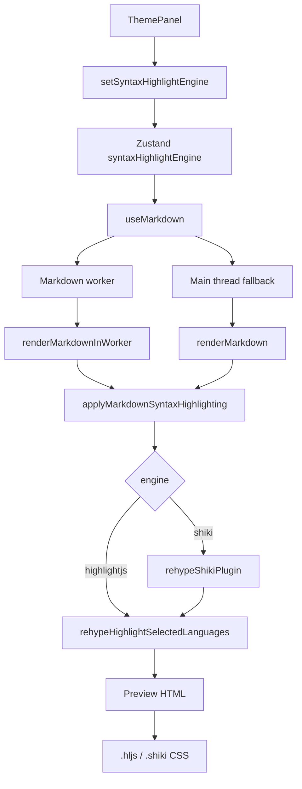

# No.1 Markdown Editor の Syntax Highlighter を解説する: Highlight.js と Shiki を切り替え、Preview のコードブロックを軽く美しくする

## 先に結論

`No.1 Markdown Editor` の Syntax Highlighter は、Markdown Preview に出る fenced code block をきれいに表示するための仕組みです。

設定では次の 2 つを切り替えられます。

1. `Highlight.js`: 軽く、速く、普段使い向け
2. `Shiki`: VS Code に近い高品質な token color 向け

ここがかなり大事です。

この実装は、単に `rehype-highlight` や `@shikijs/rehype` をそのまま入れているだけではありません。

**Markdown render worker、Zustand の設定、rehype pipeline、curated language set、dynamic import、Shiki fallback、CSS の light / dark theme、テストでの bundle 制約**まで含めて作っています。

さらに、Source editor の CodeMirror syntax highlight とは別レイヤーです。

Source 側は CodeMirror / Lezer が担当します。
Preview 側は Markdown render pipeline の `Highlight.js` / `Shiki` が担当します。

この記事では、この分担をコードで分解します。

## この記事で分かること

- Syntax Highlighter 設定が何を切り替えているのか
- Source editor と Preview の syntax highlight が別物である理由
- `Highlight.js` を default にしている理由
- `Shiki` を dynamic import している理由
- curated language set で bundle を抑える設計
- `Shiki` で対応できない language を `Highlight.js` に fallback する仕組み
- Markdown worker と main thread fallback の流れ
- Preview の `.hljs` / `.shiki` CSS をどう切り替えているのか
- テストで syntax highlighting の約束をどう守っているのか

## 対象読者

- Markdown Preview の code block highlight を作りたい方
- React / Vite / worker 構成で Markdown renderer を組んでいる方
- `highlight.js` と `Shiki` の使い分けを設計したい方
- Preview 品質と初期表示性能の両方を取りたい方
- Markdown editor の bundle 分割や lazy load を考えたい方

## まず、ユーザー体験

ユーザーから見ると、Syntax Highlighter は設定 panel の中にあります。

| Engine | 体験 |
| --- | --- |
| `Highlight.js` | 軽い。多くの code block を素早く表示したいとき向け |
| `Shiki` | VS Code に近い token color。見た目を重視したいとき向け |

たとえば Markdown に次のような code fence があるとします。

````md
```ts
const answer = 42
console.log(answer)
```
````

Preview では、この `ts` を見て TypeScript として highlight します。

`Highlight.js` engine の場合は、`hljs-keyword` や `hljs-number` のような class を持つ HTML になります。

`Shiki` engine の場合は、`class="shiki"` を持つ HTML になり、token ごとに Shiki の theme variable が付きます。

ただし、ここで重要なのは「Shiki を選んだらすべて Shiki で処理する」わけではないことです。

Shiki に bundled していない language は、後段の `Highlight.js` に fallback します。

たとえば `cpp` は Shiki の curated set には入れていません。
その場合は `Highlight.js` 側で処理します。

## 全体像

ざっくり図にすると、こうなります。



ポイントは、`applyMarkdownSyntaxHighlighting()` を中心にしていることです。

Markdown renderer が main thread でも worker でも、math / raw HTML ありでもなしでも、最終的には同じ syntax highlight helper を通ります。

この分け方が実践的です。

## 1. Store では engine だけを保存する

Syntax Highlighter の設定は Zustand store にあります。

```ts
export type SyntaxHighlightEngine = 'highlightjs' | 'shiki'
```

初期値は `highlightjs` です。

```ts
syntaxHighlightEngine: 'highlightjs',
setSyntaxHighlightEngine: (syntaxHighlightEngine) => set({ syntaxHighlightEngine }),
```

この初期値はかなり現実的です。

`Shiki` は見た目が良い一方で、language grammar や theme の読み込みが重くなりやすいです。
一方、`Highlight.js` は軽量で、Preview を頻繁に再描画する editor では default に向いています。

つまり、

```txt
default は軽くする
見た目を重視するユーザーは Shiki を選べる
```

という設計です。

## 2. 設定は persist される

`syntaxHighlightEngine` は `partialize` の保存対象に入っています。

```ts
partialize: (s) => ({
  viewMode: s.viewMode,
  sidebarWidth: s.sidebarWidth,
  sidebarOpen: s.sidebarOpen,
  editorRatio: s.editorRatio,
  syntaxHighlightEngine: s.syntaxHighlightEngine,
  previewLineBreakMode: s.previewLineBreakMode,
  previewAutoRenderMermaid: s.previewAutoRenderMermaid,
})
```

ユーザーが `Shiki` を選んだ場合、次回起動時もその設定を使えます。

merge では fallback も持っています。

```ts
syntaxHighlightEngine: persistedState?.syntaxHighlightEngine ?? 'highlightjs',
```

保存済み state に値がない古い環境でも、`highlightjs` に戻せます。

## 3. ThemePanel で Highlight.js / Shiki を切り替える

設定 panel では、2 つの button を並べています。

```tsx
<div className="flex gap-2">
  {(['highlightjs', 'shiki'] as const).map((engine) => (
    <button
      key={engine}
      type="button"
      onClick={() => setSyntaxHighlightEngine(engine)}
      className="flex-1 text-[11px] px-2 py-1.5 rounded transition-all hover-scale"
      style={{
        background: syntaxHighlightEngine === engine ? 'var(--accent)' : 'var(--bg-tertiary)',
        color: syntaxHighlightEngine === engine ? 'white' : 'var(--text-muted)',
      }}
    >
      {engine === 'highlightjs' ? 'Highlight.js' : 'Shiki'}
    </button>
  ))}
</div>
```

ここで `as const` を使っているのが良いです。

button の `engine` はただの string ではなく、`'highlightjs' | 'shiki'` として扱えます。

store の型と UI の値が一致するので、typo に強くなります。

## 4. useMarkdown は engine 変更でも再 render する

Preview HTML は `useMarkdown()` で作っています。

```ts
export function useMarkdown(markdown: string) {
  const syntaxHighlightEngine = useEditorStore((s) => s.syntaxHighlightEngine)
  const [html, setHtml] = useState('')
  const latestMarkdownRef = useRef(markdown)
  const latestEngineRef = useRef(syntaxHighlightEngine)

  useEffect(() => {
    latestMarkdownRef.current = markdown
    latestEngineRef.current = syntaxHighlightEngine
  }, [markdown, syntaxHighlightEngine])
}
```

ここで `syntaxHighlightEngine` を hook の dependency にしているので、engine を切り替えると Preview が再 render されます。

Markdown 本文が変わっていなくても、highlight engine が変われば HTML は変わります。

だから `markdown` だけでなく `syntaxHighlightEngine` も render input として扱っています。

## 5. Worker にも engine を渡す

Preview rendering は worker が使える環境では worker に投げます。

```ts
workerRef.current.postMessage({ id: requestId, markdown, syntaxHighlightEngine })
```

message の型も engine を持っています。

```ts
export interface MarkdownRenderRequest {
  id: number
  markdown: string
  syntaxHighlightEngine?: 'highlightjs' | 'shiki'
}
```

これにより、main thread で選ばれた設定が worker 側の renderer にも伝わります。

設定 UI は main thread にある。
Markdown render は worker で走る。

この 2 つの間を、message payload の `syntaxHighlightEngine` でつないでいます。

## 6. Worker が使えないときは main thread fallback

worker が使えない場合や worker が落ちた場合は、main thread で render します。

```ts
async function renderMarkdownOnMainThread(
  markdown: string,
  syntaxHighlightEngine?: 'highlightjs' | 'shiki'
): Promise<string> {
  const { renderMarkdown } = await import('../lib/markdown')
  return renderMarkdown(markdown, syntaxHighlightEngine)
}
```

worker から fallback するときも、最新の engine を使います。

```ts
const fallbackHtml = await renderMarkdownOnMainThread(
  latestMarkdownRef.current,
  latestEngineRef.current
)
```

ここが大事です。

worker が失敗したからといって、engine が default に戻るわけではありません。
ユーザーが選んだ `Highlight.js` / `Shiki` の設定を保ったまま fallback します。

## 7. Markdown worker は renderer core を lazy load する

worker entry は、最初から renderer core を静的 import していません。

```ts
let markdownRendererPromise: Promise<typeof import('../lib/markdownWorker')> | null = null

async function loadMarkdownRenderer() {
  markdownRendererPromise ??= import('../lib/markdownWorker').catch((error) => {
    markdownRendererPromise = null
    throw error
  })

  return markdownRendererPromise
}
```

最初の request が来たときに `markdownWorker` を読み込みます。

これは cold path の負荷を下げるためです。

Markdown preview を開かないユーザー、あるいは起動直後にまだ preview を必要としていない状態では、renderer の重い依存を急いで読む必要がありません。

## 8. renderMarkdownInWorker は math / raw HTML を先に分岐する

worker 側の renderer は、Markdown の内容を見て render pipeline を分けます。

```ts
export async function renderMarkdownInWorker(
  markdown: string,
  syntaxHighlightEngine: MarkdownSyntaxHighlightEngine = 'highlightjs'
): Promise<string> {
  const frontMatter = stripFrontMatter(markdown)
  const hasMath = containsLikelyMath(frontMatter.body)
  const hasRawHtml = containsLikelyRawHtml(frontMatter.body)

  if (hasMath && hasRawHtml) {
    const { renderMarkdownWithMathAndHtml } = await mathHtmlRendererPromise
    return renderMarkdownWithMathAndHtml(markdown, syntaxHighlightEngine)
  }

  if (hasMath) {
    const { renderMarkdownWithMath } = await mathRendererPromise
    return renderMarkdownWithMath(markdown, syntaxHighlightEngine)
  }

  if (hasRawHtml) {
    const { renderMarkdownWithHtmlInWorker } = await htmlRendererPromise
    return renderMarkdownWithHtmlInWorker(markdown, syntaxHighlightEngine)
  }
}
```

math や raw HTML がある場合は、専用 renderer に分岐します。

でも、どの分岐でも `syntaxHighlightEngine` を渡し続けます。

つまり、

```txt
Math があっても code block は highlight する
Raw HTML があっても code block は highlight する
Worker でも main thread でも同じ engine を使う
```

という設計です。

## 9. processor は engine ごとに cache する

Markdown renderer は unified processor を作ります。

```ts
const processors: Partial<Record<MarkdownSyntaxHighlightEngine, Promise<any>>> = {}

async function getProcessor(engine: MarkdownSyntaxHighlightEngine) {
  if (processors[engine]) return processors[engine]

  processors[engine] = (async () => {
    let processor: any = unified()
      .use(remarkParse)
      .use(remarkGfm, { singleTilde: false })
      .use(remarkRehype)
      .use(rehypeSubscriptMarkers)
      .use(rehypeSuperscriptMarkers)
      .use(rehypeHighlightMarkers)
      .use(rehypeNormalizeImageSources)
      .use(rehypeSanitize, sanitizeSchema)

    processor = await applyMarkdownSyntaxHighlighting(processor, engine)

    return processor
      .use(rehypeHeadingIds)
      .use(rehypeStringify)
  })().catch((error) => {
    delete processors[engine]
    throw error
  })

  return processors[engine]
}
```

`highlightjs` と `shiki` では使う rehype plugin が違います。

だから processor cache も engine ごとに分けています。

さらに、初期化に失敗した場合は cache を消します。

```ts
delete processors[engine]
throw error
```

壊れた Promise を cache に残さないためです。

## 10. Syntax highlight の入口は 1 つ

実際に syntax highlight を差し込むのは `applyMarkdownSyntaxHighlighting()` です。

```ts
export async function applyMarkdownSyntaxHighlighting(
  processor: any,
  engine: MarkdownSyntaxHighlightEngine
) {
  const rehypeHighlightSelectedLanguages = await loadRehypeHighlightJsPlugin()

  if (engine !== 'shiki') {
    return processor.use(rehypeHighlightSelectedLanguages)
  }

  const rehypeShikiPlugin = await loadRehypeShikiPlugin()
  return processor
    .use(rehypeShikiPlugin)
    .use(rehypeHighlightSelectedLanguages)
}
```

ここで大事なのは、`Shiki` の場合も最後に `Highlight.js` を通していることです。

順番はこうです。

```txt
Shiki engine:
  rehypeShikiPlugin
  -> rehypeHighlightSelectedLanguages

Highlight.js engine:
  rehypeHighlightSelectedLanguages
```

この順番によって、Shiki が処理できた code block は Shiki のまま残ります。
Shiki が処理しなかった code block は、後段の Highlight.js が拾えます。

## 11. Highlight.js は curated registry で使う

`src/lib/markdownHighlightJs.ts` では、`createLowlight()` に使う language を明示しています。

```ts
const lowlight = createLowlight({
  bash,
  c,
  cpp,
  css,
  diff,
  dockerfile,
  go,
  ini,
  java,
  javascript,
  json,
  markdown,
  php,
  plaintext,
  python,
  rust,
  shell,
  sql,
  typescript,
  xml,
  yaml,
})
```

`highlight.js` の全 language を入れるのではありません。

Markdown editor でよく使う language を選び、bundle を抑えています。

これは desktop editor でも重要です。

Preview は頻繁に開かれます。
初回 render のためだけに、使わない language grammar を大量に持ち込むのは避けたいです。

## 12. language alias を明示する

language alias も登録しています。

```ts
lowlight.registerAlias({
  cjs: 'javascript',
  docker: 'dockerfile',
  html: 'xml',
  js: 'javascript',
  json5: 'json',
  jsonc: 'json',
  md: 'markdown',
  mermaid: 'plaintext',
  mjs: 'javascript',
  py: 'python',
  rs: 'rust',
  sh: 'shell',
  ts: 'typescript',
  tsx: 'typescript',
  txt: 'plaintext',
  yml: 'yaml',
  zenuml: 'plaintext',
})
```

ユーザーは code fence に必ず正式名を書くわけではありません。

よくある書き方は、

````md
```js
console.log('hello')
```
````

や、

````md
```py
print('hello')
```
````

です。

alias を持つことで、こうした自然な fence info string を正しく処理できます。

`mermaid` と `zenuml` を `plaintext` にしている点も重要です。

Mermaid / ZenUML は diagram renderer が担当する領域です。
syntax highlighter が中途半端に token color を付けるより、plain text として安全に扱います。

## 13. `no-highlight` を尊重する

code block の class から language を読む部分はこうです。

```ts
function getCodeBlockLanguage(node: { properties: { className?: unknown } }): false | string | undefined {
  const className = node.properties.className
  if (!Array.isArray(className)) return

  let language: string | undefined

  for (const entry of className) {
    const value = String(entry)

    if (value === 'no-highlight' || value === 'nohighlight') {
      return false
    }

    if (!language && value.startsWith('lang-')) {
      language = value.slice(5)
    }

    if (!language && value.startsWith('language-')) {
      language = value.slice(9)
    }
  }

  return language
}
```

`no-highlight` / `nohighlight` がある場合は、明示的に highlight しません。

これは大事です。

ログ、プロンプト、特殊な DSL、または token color を付けると逆に読みにくくなる block があります。

ユーザーが「ここは highlight しない」と指定できる余地を残しています。

## 14. Highlight.js は Shiki 済み code block を触らない

Shiki fallback のために Highlight.js を後段に置くと、1 つ問題が出ます。

Shiki がすでに処理した code block を、Highlight.js が再処理してはいけません。

そのため、次の判定を入れています。

```ts
function isShikiRenderedCode(node, parent): boolean {
  const classNames = [
    ...(Array.isArray(node.properties.className) ? node.properties.className : []),
    ...(Array.isArray(parent.properties.className) ? parent.properties.className : []),
  ].map(String)

  return classNames.includes('shiki')
}
```

そして visitor 側で skip します。

```ts
if (isShikiRenderedCode(node, parent)) return
```

これで、Shiki の結果を壊さず、Shiki が拾わなかった block だけを Highlight.js に fallback できます。

## 15. Highlight.js は失敗しても render を止めない

Highlight.js の処理は `try / catch` で囲んでいます。

```ts
try {
  result = lowlight.highlight(language, text, { prefix: 'hljs-' })
} catch {
  return
}
```

未知の language や失敗する grammar があっても、Markdown render 全体を止めません。

Code block が plain に戻るだけです。

Markdown editor ではここが重要です。

ユーザーの文書に 1 つ不明な code fence があるだけで、Preview 全体が壊れるのはよくありません。

## 16. Shiki は core entry から必要なものだけ読む

Shiki 側は、重くなりやすいのでかなり慎重に読み込んでいます。

```ts
const [
  { default: rehypeShikiFromHighlighter },
  { createBundledHighlighter },
  { createJavaScriptRegexEngine },
] = await Promise.all([
  import('@shikijs/rehype/core'),
  import('shiki/core'),
  import('shiki/engine/javascript'),
])
```

ここで `@shikijs/rehype` の通常 entry ではなく、`@shikijs/rehype/core` を使っています。

また、`shiki/langs` や `shiki/themes` を丸ごと import しません。

必要な language と theme だけを、後述の curated set から読み込みます。

## 17. Shiki の language set も curated

Shiki の bundled languages は明示的に選んでいます。

```ts
const SHIKI_BUNDLED_LANGUAGES = {
  astro: shikiLangAstro,
  bash: shikiLangBash,
  c: shikiLangC,
  css: shikiLangCss,
  diff: shikiLangDiff,
  docker: shikiLangDocker,
  dockerfile: shikiLangDocker,
  go: shikiLangGo,
  html: shikiLangHtml,
  javascript: shikiLangJavaScript,
  json: shikiLangJson,
  markdown: shikiLangMarkdown,
  php: shikiLangPhp,
  python: shikiLangPython,
  rust: shikiLangRust,
  shellscript: shikiLangShellscript,
  sql: shikiLangSql,
  ts: shikiLangTypeScript,
  tsx: shikiLangTsx,
  vue: shikiLangVue,
  yaml: shikiLangYaml,
}
```

実際のコードでは alias も含めて、`js`、`mjs`、`jsonc`、`py`、`rs`、`sh`、`zsh`、`yml` なども登録しています。

重要なのは、「何でも入れる」ではなく「よく使うものを入れる」ことです。

たとえば `cpp` は Shiki の curated set には入っていません。
そのため、`cpp` は Highlight.js fallback で処理されます。

この判断により、Shiki の品質を使いつつ、bundle の膨張を抑えています。

## 18. Shiki theme は GitHub light / dark だけに絞る

Shiki theme も 2 つだけです。

```ts
const SHIKI_BUNDLED_THEMES = {
  'github-light': () => import('@shikijs/themes/github-light'),
  'github-dark': () => import('@shikijs/themes/github-dark'),
} as const
```

Preview は light / dark theme の両方に対応する必要があります。

だから `github-light` と `github-dark` を持ちます。

ただし、テーマを大量に bundle しません。

ここでも方針は同じです。

```txt
見た目に必要な品質は取る
でも cold path の依存は増やしすぎない
```

## 19. Shiki は JavaScript regex engine を使う

highlighter はこう作っています。

```ts
const createHighlighter = createBundledHighlighter({
  langs: SHIKI_BUNDLED_LANGUAGES,
  themes: SHIKI_BUNDLED_THEMES,
  engine: () => createJavaScriptRegexEngine(),
})
```

ここでは Oniguruma WASM runtime を使っていません。

コメントにも理由があります。

```ts
// Markdown preview highlighting values smaller payload over edge-case
// regex fidelity, so avoid the optional Oniguruma wasm runtime here.
```

Preview の syntax highlighting では、すべての edge case を VS Code と完全一致させるより、payload を小さく保つ判断をしています。

Markdown editor は毎日の writing tool です。

起動や preview 表示が重くなるより、十分に良い highlight を軽く出せるほうが実用的です。

## 20. Shiki option は fallback 前提で組む

Shiki の rehype option はこうです。

```ts
const SHIKI_REHYPE_OPTIONS = {
  themes: { light: 'github-light', dark: 'github-dark' },
  defaultLanguage: 'text',
  lazy: true,
  onError() {
    // Let unsupported explicit languages fall through to the subsequent
    // Highlight.js pass instead of eagerly bundling every Shiki grammar.
  },
} as const
```

ここで大事なのは 3 つです。

1. `themes` は light / dark の dual theme
2. `defaultLanguage` は `text`
3. `onError()` で unsupported language を落とさない

Shiki が対応できない language があっても、そこで render を壊しません。

後段の Highlight.js に任せます。

## 21. dynamic import 失敗時は recovery を試す

dynamic import は失敗することがあります。

特に Vite build 後の chunk が更新された直後、古い HTML が古い asset path を参照している場合などです。

そのため、import error 時には recovery helper を呼びます。

```ts
rehypeHighlightJsPluginPromise ??= import('./markdownHighlightJs.ts')
  .then((module) => module.default)
  .catch((error) => {
    rehypeHighlightJsPluginPromise = null
    attemptDynamicImportRecovery(error)
    throw error
  })
```

Shiki 側も同じ考え方です。

```ts
})().catch((error) => {
  rehypeShikiPluginPromise = null
  attemptDynamicImportRecovery(error)
  throw error
})
```

失敗した Promise を残さず、必要なら再読み込みの回復処理に進めます。

## 22. Preview CSS は `.hljs` と `.shiki` の両方を持つ

Highlight.js の token は `.hljs-*` class で色を付けます。

```css
.markdown-preview .hljs-keyword,
.markdown-preview .hljs-selector-tag {
  color: #7C3AED;
}

.markdown-preview .hljs-string,
.markdown-preview .hljs-meta .hljs-string {
  color: #0369A1;
}

.markdown-preview .hljs-comment,
.markdown-preview .hljs-quote {
  color: #6B7280;
  font-style: italic;
}
```

dark theme では別の色を指定しています。

```css
.dark .markdown-preview .hljs-keyword,
.dark .markdown-preview .hljs-selector-tag {
  color: #CBA6F7;
}
```

つまり、Highlight.js の token class は app 側の theme に合わせて CSS で調整しています。

## 23. Shiki は CSS variable で light / dark を切り替える

Shiki 側は、Shiki が出す CSS variable を使います。

```css
.markdown-preview .shiki,
.markdown-preview .shiki span {
  color: var(--shiki-light);
  font-style: var(--shiki-light-font-style);
  font-weight: var(--shiki-light-font-weight);
  text-decoration: var(--shiki-light-text-decoration);
}

.dark .markdown-preview .shiki,
.dark .markdown-preview .shiki span {
  color: var(--shiki-dark);
  font-style: var(--shiki-dark-font-style);
  font-weight: var(--shiki-dark-font-weight);
  text-decoration: var(--shiki-dark-text-decoration);
}
```

これで同じ HTML を light / dark 両方で使えます。

app theme が dark になれば `.dark` class の CSS が効き、Shiki の dark token color が表示されます。

## 24. Export HTML には highlight.js の色を inline する

Preview だけでなく、standalone HTML export でも code block は読みやすくする必要があります。

`buildStandaloneHtml()` では、highlight.js token の基本色を HTML 側に含めています。

```css
.hljs { color: inherit; background: transparent; }
.hljs-comment, .hljs-quote { color: #94a3b8; font-style: italic; }
.hljs-keyword, .hljs-selector-tag, .hljs-literal, .hljs-name, .hljs-tag { color: #f97316; }
.hljs-string, .hljs-attr, .hljs-template-tag, .hljs-template-variable { color: #4ade80; }
.hljs-number, .hljs-symbol, .hljs-bullet, .hljs-variable, .hljs-variable.constant_ { color: #38bdf8; }
```

アプリ内 CSS に依存しないので、export した HTML を外で開いても code block の色が残ります。

## 25. Source editor の syntax highlight は別レイヤー

ここまで説明した Syntax Highlighter は、主に Preview の code block rendering です。

Source editor 側は CodeMirror の syntax highlighting を使っています。

```ts
export const markdownHighlight = [
  syntaxHighlighting(defaultHighlightStyle, { fallback: true }),
  syntaxHighlighting(markdownUnderlineOverride),
]
```

さらに fenced code block の language は CodeMirror 側でも解決しています。

```ts
export function resolveMarkdownCodeLanguage(info: string): LanguageDescription | null {
  const normalizedInfo = normalizeMarkdownCodeLanguageInfo(info)
  if (!normalizedInfo) return null

  const commonLanguage =
    LanguageDescription.matchLanguageName(commonMarkdownCodeLanguages, normalizedInfo, false) ??
    LanguageDescription.matchLanguageName(commonMarkdownCodeLanguages, normalizedInfo)
  if (commonLanguage) return commonLanguage

  let fallbackLanguage = fallbackMarkdownCodeLanguages.get(normalizedInfo)
  if (!fallbackLanguage) {
    fallbackLanguage = createFallbackMarkdownCodeLanguageDescription(normalizedInfo)
    fallbackMarkdownCodeLanguages.set(normalizedInfo, fallbackLanguage)
  }
  return fallbackLanguage
}
```

つまり、Source と Preview で担当が違います。

| Surface | 担当 |
| --- | --- |
| Source editor | CodeMirror / Lezer / language support |
| Preview code block | Highlight.js / Shiki / rehype pipeline |

この分離は重要です。

Source editor は編集操作、cursor、selection、incremental parsing と深く結びついています。
Preview は HTML rendering、sanitize、math、raw HTML、export と結びついています。

同じ「syntax highlight」でも、同じ実装に寄せないほうが安全です。

## 26. Source 側の Mermaid / ZenUML は plain text にする

Source editor の fenced code language 解決でも、Mermaid / ZenUML は plain text として扱っています。

```ts
const plainTextMarkdownCodeLanguage = LanguageDescription.of({
  name: 'Plain Text',
  alias: ['text', 'txt', 'plaintext', 'plain', 'mermaid', 'zenuml'],
  support: legacy(plainTextParser),
})
```

この判断も Preview 側と方向性が揃っています。

Mermaid / ZenUML は「code syntax highlight」ではなく「diagram rendering」の文脈で扱うべきです。

Source editor では plain text として安定して編集できる。
Preview では diagram renderer が必要に応じて描画する。

このほうが機能の責務が分かりやすいです。

## 27. Vite chunk も分ける

syntax highlighting の依存は Vite の manual chunk でも分けています。

```ts
const isMarkdownHighlightDependency =
  normalizedId.includes('/node_modules/lowlight/') ||
  normalizedId.includes('/node_modules/highlight.js/') ||
  normalizedId.includes('/node_modules/hast-util-to-text/')

if (isMarkdownHighlightDependency) {
  return 'vendor-markdown-highlight'
}
```

これは bundle 監視としてかなり重要です。

Markdown base renderer、raw HTML、math、syntax highlighting、Mermaid などを全部 1 chunk にすると、Preview の optional path が重くなります。

`vendor-markdown-highlight` として分けておけば、何が重くなったのか追いやすくなります。

## 28. テスト: Shiki を lazy load していることを守る

`tests/markdown-highlighter-wiring.test.ts` では、Shiki の読み込み方をテストしています。

```ts
test('Markdown syntax highlighting loads Shiki on demand through the core rehype entry and a custom bundled highlighter', () => {
  assert.match(syntaxHighlightSource, /import\('@shikijs\/rehype\/core'\)/u)
  assert.match(syntaxHighlightSource, /import\('shiki\/core'\)/u)
  assert.match(syntaxHighlightSource, /import\('shiki\/engine\/javascript'\)/u)
  assert.match(syntaxHighlightSource, /createBundledHighlighter\(/u)
  assert.match(syntaxHighlightSource, /createJavaScriptRegexEngine\(\)/u)
  assert.match(syntaxHighlightSource, /lazy:\s*true/u)
  assert.match(syntaxHighlightSource, /defaultLanguage:\s*'text'/u)
  assert.match(syntaxHighlightSource, /onError\(\)/u)
})
```

さらに、重い import をしていないことも確認しています。

```ts
assert.doesNotMatch(syntaxHighlightSource, /import\('shiki\/langs'\)/u)
assert.doesNotMatch(syntaxHighlightSource, /import\('shiki\/wasm'\)/u)
assert.doesNotMatch(syntaxHighlightSource, /import\('shiki\/engine\/oniguruma'\)/u)
```

このテストの狙いは、見た目ではありません。

守っているのは performance contract です。

## 29. テスト: language set と theme set を守る

Shiki の bundled language / theme もテストしています。

```ts
test('Markdown syntax highlighting only bundles the GitHub light and dark Shiki themes plus a curated language set', () => {
  assert.match(syntaxHighlightSource, /const SHIKI_BUNDLED_LANGUAGES = \{/u)
  assert.match(syntaxHighlightSource, /javascript: shikiLangJavaScript/u)
  assert.match(syntaxHighlightSource, /typescript: shikiLangTypeScript/u)
  assert.match(syntaxHighlightSource, /python: shikiLangPython/u)
  assert.match(syntaxHighlightSource, /shellscript: shikiLangShellscript/u)
  assert.match(syntaxHighlightSource, /dockerfile: shikiLangDocker/u)
  assert.doesNotMatch(syntaxHighlightSource, /cpp: /u)

  assert.match(syntaxHighlightSource, /'github-light': \(\) => import\('@shikijs\/themes\/github-light'\)/u)
  assert.match(syntaxHighlightSource, /'github-dark': \(\) => import\('@shikijs\/themes\/github-dark'\)/u)
})
```

`cpp` が入っていないことまで確認しているのがポイントです。

これは「入れ忘れ」ではなく、fallback 設計の一部です。

Shiki に全部入れるのではなく、Shiki と Highlight.js の組み合わせで coverage を取ります。

## 30. テスト: Highlight.js は curated lowlight registry を使う

Highlight.js 側も、default common bundle を使っていないことをテストしています。

```ts
test('Markdown highlight.js fallback uses a curated lowlight registry instead of the default common bundle', () => {
  assert.match(highlightJsSource, /createLowlight\(\{/u)
  assert.match(highlightJsSource, /import cpp from 'highlight\.js\/lib\/languages\/cpp'/u)
  assert.match(highlightJsSource, /import bash from 'highlight\.js\/lib\/languages\/bash'/u)
  assert.match(highlightJsSource, /import javascript from 'highlight\.js\/lib\/languages\/javascript'/u)
  assert.match(highlightJsSource, /lowlight\.registerAlias\(\{/u)
  assert.match(highlightJsSource, /tsx: 'typescript'/u)
  assert.match(highlightJsSource, /docker: 'dockerfile'/u)
  assert.match(highlightJsSource, /mermaid: 'plaintext'/u)
  assert.doesNotMatch(highlightJsSource, /from 'rehype-highlight'/u)
})
```

`rehype-highlight` をそのまま使っていないことも確認しています。

理由は、必要な language を自分たちで選びたいからです。

## 31. テスト: 実際に render できることを守る

`tests/markdown-utils.test.ts` では、実際の render 結果も確認しています。

```ts
test('renderMarkdown can load Shiki on demand for fenced code blocks', async () => {
  const html = await renderMarkdown('```ts\nconst answer = 42\n```', 'shiki')

  assert.match(html, /class="shiki/)
  assert.match(html, /answer/)
})
```

Shiki にない language は Highlight.js に fallback します。

```ts
test('renderMarkdown falls back to highlight.js for fenced languages outside the curated Shiki bundle', async () => {
  const html = await renderMarkdown('```cpp\nint main() { return 0; }\n```', 'shiki')

  assert.match(html, /class="hljs/)
  assert.match(html, /language-cpp/)
  assert.doesNotMatch(html, /class="shiki/)
})
```

worker 側でも同じことを確認しています。

```ts
test('renderMarkdownInWorker can load Shiki on demand for fenced code blocks', async () => {
  const html = await renderMarkdownInWorker('```js\nconsole.log("worker")\n```', 'shiki')

  assert.match(html, /class="shiki/)
  assert.match(html, /console/)
})
```

これで main thread と worker の両方で、同じ highlight contract を守れます。

## 32. テスト: worker routing でも engine を渡す

`tests/markdown-worker-routing.test.ts` では、`useMarkdown()` が worker に engine を渡していることを確認しています。

```ts
assert.match(
  source,
  /workerRef\.current\.postMessage\(\{ id: requestId, markdown, syntaxHighlightEngine \}\)/u
)
```

このテストがないと、UI で `Shiki` を選んでも worker 側に伝わらない、という壊れ方が起きえます。

設定 UI と renderer が別スレッドに分かれているからこそ、この wiring test は重要です。

## 実装の要点

### 1. Source と Preview の highlight を分ける

Source editor は CodeMirror。
Preview は Markdown render pipeline。

同じ syntax highlight でも、責務が違います。

無理に共通化しないほうが壊れにくいです。

### 2. default は軽い Highlight.js にする

Markdown Preview は頻繁に更新されます。

default は軽く、必要なユーザーだけ Shiki を選べる形が現実的です。

### 3. Shiki は curated set で使う

Shiki は強力ですが、全 language / theme を入れると重くなります。

よく使う language と GitHub light / dark theme に絞ることで、品質と payload のバランスを取っています。

### 4. Shiki の後ろに Highlight.js fallback を置く

Shiki が処理した block はそのまま。
Shiki が処理できない block は Highlight.js。

この二段構えで、見た目と coverage の両方を取りにいけます。

### 5. Performance contract をテストする

この機能のテストは「色が何色か」だけではありません。

lazy load、bundle しない import、curated language set、worker への engine 伝播まで見ています。

Syntax Highlighter は見た目の機能ですが、実装上は performance feature でもあります。

## この記事の要点を 3 行でまとめると

1. Preview の Syntax Highlighter は `Highlight.js` と `Shiki` を切り替えられ、設定は Zustand から worker / main renderer に渡されます。
2. `Shiki` は core entry、curated language set、GitHub light / dark theme、JavaScript regex engine で軽く読み込みます。
3. `Shiki` の後段に `Highlight.js` fallback を置くことで、品質と language coverage の両方を現実的に両立しています。

## 参考実装

- Syntax highlight helper: `src/lib/markdownSyntaxHighlight.ts`
- Highlight.js fallback: `src/lib/markdownHighlightJs.ts`
- Markdown renderer: `src/lib/markdown.ts`
- Worker renderer: `src/lib/markdownWorker.ts`
- Worker message: `src/workers/markdownMessages.ts`
- Worker entry: `src/workers/markdown.worker.ts`
- Preview hook: `src/hooks/useMarkdown.ts`
- Theme panel: `src/components/ThemePanel/ThemePanel.tsx`
- Store: `src/store/editor.ts`
- Source editor highlight: `src/components/Editor/extensions.ts`
- Source code fence languages: `src/components/Editor/markdownCodeLanguages.ts`
- Styles: `src/global.css`
- Vite chunks: `vite.config.ts`
- Tests: `tests/markdown-highlighter-wiring.test.ts`, `tests/markdown-utils.test.ts`, `tests/markdown-worker-routing.test.ts`, `tests/vite-config-markdown-chunks.test.ts`, `tests/editor-markdown-code-languages.test.ts`
