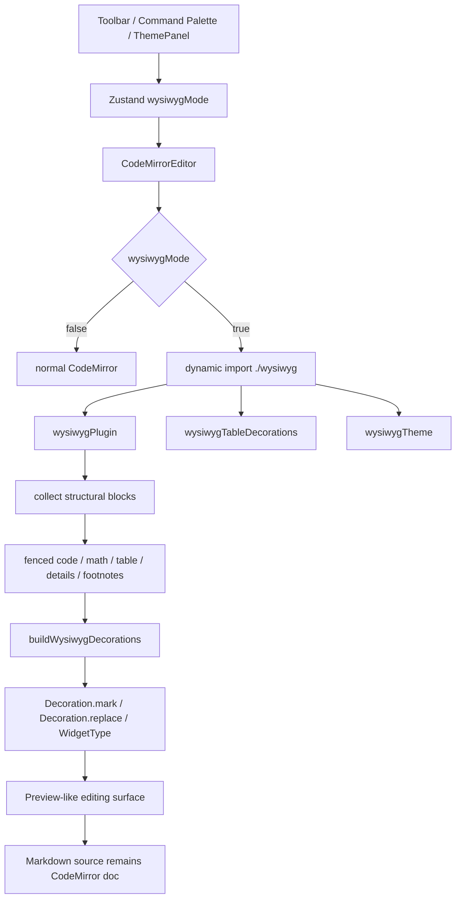

# No.1 Markdown Editor の WYSIWYG を解説する: Markdown source を壊さず Preview に近い編集体験を作る

## 先に結論

`No.1 Markdown Editor` の WYSIWYG は、Markdown を別の rich text document に変換して編集する仕組みではありません。

ここがかなり大事です。

**Markdown source は CodeMirror の document としてそのまま残し、見た目だけを `Decoration` と `WidgetType` で Preview に近づけています。**

たとえば Markdown に次のような内容があるとします。

````md
# Title

This is **bold** and [link](https://example.com).

- [x] Done
- [ ] Next

| Name | Score |
| --- | ---: |
| Alice | 98 |
````

WYSIWYG mode では、cursor が離れている行の Markdown marker は隠れます。

- `# Title` は heading の見た目になる
- `**bold**` は `bold` だけが太字になる
- `[link](...)` は link text だけが見える
- `- [x]` は checkbox widget になる
- table は Markdown pipe text ではなく table grid になる

ただし、cursor がその行や block に入ると、source を編集できる状態に戻ります。

つまり、この実装の基本方針はこうです。

```txt
Markdown source は壊さない
cursor が離れたところだけ Preview 風にする
編集するときは raw Markdown に戻す
複雑な block は widget と inline editor で扱う
```

この記事では、この WYSIWYG 実装をコードで分解します。

## この記事で分かること

- WYSIWYG mode が何を切り替えているのか
- なぜ `contenteditable` ではなく CodeMirror Decoration を使っているのか
- cursor line では source を出し、それ以外では marker を隠す仕組み
- headings / emphasis / link / inline code / hard break の live preview
- task list checkbox を Markdown source に反映する方法
- fenced code block と Mermaid block の扱い
- table を grid として表示しながら cell を編集する仕組み
- math block / inline math を KaTeX widget にする方法
- details / footnote / inline media を Preview に近づける方法
- Preview と WYSIWYG の typography token を共有する理由
- gutter line number、spellcheck、invisible characters まで含めた細部
- テストで WYSIWYG の UX contract をどう守っているのか

## 対象読者

- Markdown editor の WYSIWYG / live preview を作りたい方
- CodeMirror 6 の `Decoration` / `WidgetType` を実用レベルで使いたい方
- Typora / Obsidian に近い編集体験を React で作りたい方
- Markdown source と rich editing の整合性に悩んでいる方
- table、math、Mermaid、footnote まで含めて WYSIWYG を設計したい方

## まず、ユーザー体験

ユーザーから見ると、WYSIWYG は toolbar の `ライブ` button で切り替えます。

Source editor はそのまま CodeMirror です。

でも、WYSIWYG を有効にすると、Markdown の表示が次のように変わります。

| Markdown | cursor が離れているとき | cursor が入ったとき |
| --- | --- | --- |
| `# Heading` | heading の見た目 | `# ` を含む source |
| `**bold**` | `bold` が太字 | `**bold**` |
| `[text](url)` | link text | raw link syntax |
| `- [x] task` | checkbox + task text | `- [x] task` |
| fenced code | code block chrome | raw fence |
| Mermaid fence | diagram widget | raw Mermaid source |
| table | table grid | active cell editor |
| `$$...$$` | KaTeX block | raw math block |

ここで重要なのは、「全部を常に rich text にする」わけではないことです。

Markdown は plain text format です。
ユーザーは最終的に Markdown source を信頼して編集します。

そのため、WYSIWYG mode でも source は見失わないようにしています。

## 全体像

ざっくり図にすると、こうなります。



中心は `src/components/Editor/wysiwyg.ts` です。

ただし、WYSIWYG は 1 ファイルだけで完結していません。

- `wysiwyg.ts`: main plugin、widgets、event handling、theme
- `wysiwygCodeBlock.ts`: fenced code / Mermaid block
- `wysiwygTable.ts`: table cell navigation、encode / decode、structural edits
- `wysiwygMathBlock.ts`: inactive math block detection
- `wysiwygInlineMarkdown.ts`: inline fragment rendering
- `wysiwygInlineMedia.ts`: image / link / linked media range detection
- `wysiwygDetails.ts`: `<details>` block rendering
- `wysiwygFootnote.ts`: footnote widgets and numbering

この分割により、WYSIWYG 全体は大きい機能でも、それぞれの責務を保てます。

## 1. Store では WYSIWYG mode だけを保存する

WYSIWYG の設定は Zustand store にあります。

```ts
wysiwygMode: boolean
setWysiwygMode: (v: boolean) => void
```

初期値は `false` です。

```ts
wysiwygMode: false,
setWysiwygMode: (wysiwygMode) => set({ wysiwygMode }),
```

ここでは WYSIWYG の細かい内部状態を保存していません。

保存するのは「WYSIWYG mode が有効かどうか」だけです。

この判断は現実的です。

CodeMirror の decoration state や table active cell のような状態は document / selection から再計算できます。
それらを persist すると、古い document position と衝突しやすくなります。

## 2. 設定は persist される

`wysiwygMode` は `partialize` の保存対象に入っています。

```ts
partialize: (s) => ({
  theme: s.theme,
  language: s.language,
  viewMode: s.viewMode,
  sidebarWidth: s.sidebarWidth,
  sidebarOpen: s.sidebarOpen,
  editorRatio: s.editorRatio,
  lineNumbers: s.lineNumbers,
  wordWrap: s.wordWrap,
  showInvisibleCharacters: s.showInvisibleCharacters,
  spellcheckMode: s.spellcheckMode,
  fontSize: s.fontSize,
  typewriterMode: s.typewriterMode,
  wysiwygMode: s.wysiwygMode,
})
```

つまり、ユーザーが WYSIWYG を有効にした場合、次回起動時もその mode で開けます。

一方で、table の active cell や Mermaid の render token のような一時状態は保存しません。

```txt
ユーザー設定として残すもの:
  wysiwygMode

document / selection から再計算するもの:
  decorations
  widgets
  active table cell
  hidden gutter lines
```

この切り分けが重要です。

## 3. Toolbar から WYSIWYG を切り替える

toolbar には WYSIWYG button があります。

```tsx
<ToolbarBtn
  title={wysiwygMode ? t('commands.disableWysiwyg') : t('commands.enableWysiwyg')}
  onClick={() => setWysiwygMode(!wysiwygMode)}
  active={wysiwygMode}
  pressed={wysiwygMode}
  variant="mode"
>
  <AppIcon name="wysiwyg" size={16} />
  <span className="text-xs font-medium">{t('toolbar.wysiwyg')}</span>
</ToolbarBtn>
```

`active` と `pressed` を渡しているので、見た目だけでなく toggle button としての状態も持てます。

WYSIWYG は view mode とは別です。

`source` / `split` / `preview` は画面 layout の mode。
`wysiwygMode` は Source editor の中の表示 mode。

この 2 つを分けているのがポイントです。

## 4. Command Palette からも切り替えられる

command registry には `view.wysiwyg` があります。

```ts
{
  id: 'view.wysiwyg',
  label: store.wysiwygMode ? t('commands.disableWysiwyg') : t('commands.enableWysiwyg'),
  icon: '✨',
  category: 'view',
  action: () => store.setWysiwygMode(!store.wysiwygMode),
}
```

toolbar だけでなく command palette からも切り替えられるようにしています。

Markdown editor は keyboard-first な tool です。
よく使う表示系の操作は command palette にも出すほうが自然です。

## 5. CodeMirrorEditor は WYSIWYG を lazy load する

`CodeMirrorEditor` は、WYSIWYG が無効なときに `wysiwyg.ts` を読みません。

```tsx
useEffect(() => {
  if (!wysiwygMode) {
    setWysiwygExtensions([])
    return
  }

  let cancelled = false
  void import('./wysiwyg').then(({ wysiwygPlugin, wysiwygTheme, wysiwygTableDecorations }) => {
    if (!cancelled) setWysiwygExtensions([wysiwygTableDecorations, wysiwygPlugin, wysiwygTheme])
  })

  return () => {
    cancelled = true
  }
}, [wysiwygMode])
```

ここが大事です。

WYSIWYG は大きい機能です。

KaTeX、table widget、inline media rendering、details rendering、footnote widget など、多くの依存と処理を持ちます。

だから Source editor の初期表示 path には入れず、WYSIWYG が必要になったときだけ読みます。

## 6. CodeMirror compartment に後から差し込む

CodeMirror 側では WYSIWYG 用の compartment を持っています。

```tsx
const wysiwygCompartmentRef = useRef(new Compartment())
```

初期 extension list には、現在の WYSIWYG extensions を入れます。

```tsx
wysiwygCompartmentRef.current.of(wysiwygExtensions)
```

そして WYSIWYG extensions が変わったら reconfigure します。

```tsx
useEffect(() => {
  reconfigure(wysiwygCompartmentRef.current, wysiwygExtensions)
}, [reconfigure, wysiwygExtensions])
```

これにより、EditorView を作り直さずに WYSIWYG extension を追加 / 削除できます。

`contenteditable` な別 editor に切り替えるのではなく、同じ CodeMirror document の上に live preview layer を重ねています。

## 7. WYSIWYG は `ViewPlugin` で動く

main plugin は `ViewPlugin.fromClass()` で作られています。

```ts
export const wysiwygPlugin = ViewPlugin.fromClass(
  WysiwygPluginValue,
  {
    decorations: (v) => v.decorations,
    eventHandlers: {
      mousedown(event, view) {
        // widget activation
      },
      click(event, view) {
        // checkbox / math / table / details
      },
      keydown(event, view) {
        // keyboard activation
      },
      paste(event, view) {
        return handleDocumentClipboardTablePaste(event, view)
      },
    },
  }
)
```

`WysiwygPluginValue` は、現在の document から decorations を作ります。

```ts
class WysiwygPluginValue {
  decorations: DecorationSet
  fencedCodeBlocks: FencedCodeBlock[]
  mathBlocks: MathBlock[]
  tables: MarkdownTableBlock[]
  detailsBlocks: WysiwygDetailsBlock[]
  footnoteIndices: Map<string, number>
  activeTableCell: ActiveWysiwygTableCell | null
}
```

つまり、WYSIWYG の見た目は document state から再構築されます。

React state で Markdown の別表現を持つのではありません。

## 8. 構造 block を先に集める

WYSIWYG の decoration を作る前に、Markdown の構造 block を集めます。

```ts
function collectWysiwygStructuralBlocks(markdown: string): WysiwygStructuralBlocks {
  const allFencedCodeBlocks = collectFencedCodeBlocks(markdown)
  const allMathBlocks = collectMathBlocks(markdown, allFencedCodeBlocks)
  const detailsBlocks = collectWysiwygDetailsBlocks(markdown, [
    ...allFencedCodeBlocks,
    ...allMathBlocks,
  ])
  const ignoredTableRanges = [
    ...allFencedCodeBlocks,
    ...allMathBlocks,
    ...detailsBlocks,
  ].sort((left, right) => left.from - right.from || left.to - right.to)

  return {
    fencedCodeBlocks: allFencedCodeBlocks.filter((block) => !rangeIntersectsAnyRange(block, detailsBlocks)),
    mathBlocks: allMathBlocks.filter((block) => !rangeIntersectsAnyRange(block, detailsBlocks)),
    tables: collectMarkdownTableBlocks(markdown, ignoredTableRanges),
    detailsBlocks,
  }
}
```

ここでは table をいきなり正規表現で探していません。

まず fenced code、math block、details block を検出し、それらを table detection の除外範囲にします。

たとえば code block の中に pipe があっても、それを Markdown table として扱ってはいけません。

この「先に除外範囲を作る」設計が WYSIWYG ではかなり大事です。

## 9. 表示範囲だけを処理する

`buildWysiwygDecorations()` は `view.visibleRanges` を使います。

```ts
for (const { from, to } of view.visibleRanges) {
  let pos = from
  while (pos <= to) {
    const line = doc.lineAt(pos)
    // line decorations
    pos = line.to + 1
  }
}
```

大きな Markdown document で、すべての行に対して毎回 inline decoration を作ると重くなります。

CodeMirror は viewport を持っているので、基本的には visible range に対して decoration を作ります。

WYSIWYG は見た目の機能ですが、実装上は performance feature でもあります。

## 10. cursor line では raw Markdown を見せる

WYSIWYG の基本ルールは、cursor がある行では source を見せることです。

```ts
function cursorIsOnLine(view: WysiwygDecorationView, lineFrom: number, lineTo: number): boolean {
  const { ranges } = view.state.selection
  return ranges.some((r) => r.from >= lineFrom && r.from <= lineTo)
}
```

heading の処理を見ると分かりやすいです。

```ts
const headingMatch = text.match(/^(#{1,6})\s/)
if (headingMatch) {
  const level = headingMatch[1].length
  const prefixLen = headingMatch[0].length

  if (!onLine) {
    queueDecoration(
      decorations,
      lineFrom,
      lineFrom + prefixLen,
      Decoration.replace({})
    )
  }

  queueDecoration(
    decorations,
    lineFrom,
    lineTo,
    Decoration.mark({ class: `cm-wysiwyg-h${level}` })
  )
}
```

cursor がない行では `# ` を `Decoration.replace({})` で隠します。

でも cursor がその行に入ると、`# ` は隠しません。

これにより、見た目は Preview に近く、編集時は Markdown source として扱えます。

## 11. inline marker も同じ方針で隠す

inline Markdown も基本は同じです。

```ts
if (!onLine) {
  processInlineMath(decorations, text, lineFrom)
  processInline(decorations, text, lineFrom, line.number < doc.lines, footnoteIndices, documentContext)
}
```

cursor line では inline decoration をかけません。

そのため、`**bold**` の行に cursor があると、raw marker を編集できます。

cursor が離れると、marker を隠して content に style を当てます。

```ts
queueDecoration(decorations, fullStart, fullStart + openMarkerLen, Decoration.replace({}))
queueDecoration(
  decorations,
  fullStart + openMarkerLen,
  fullEnd - closeMarkerLen,
  Decoration.mark({ class: cls })
)
queueDecoration(decorations, fullEnd - closeMarkerLen, fullEnd, Decoration.replace({}))
```

この pattern は bold、italic、highlight、subscript、superscript、strikethrough などで使われます。

## 12. inline code と math は除外範囲として扱う

inline decoration では、単純に正規表現を全部に当てると壊れます。

たとえば次の Markdown を考えます。

````md
Use `**not bold**` literally.
````

code span の中の `**not bold**` を太字にしてはいけません。

そのため、まず inline code や inline math の範囲を集めます。

```ts
const inlineCodeRanges = collectInlineCodeRanges(text)
const inlineLiteralExcludedRanges = [
  ...inlineCodeRanges,
  ...findInlineMathRanges(text).map((range) => ({ from: range.from, to: range.to })),
].sort((left, right) => left.from - right.from || left.to - right.to)
```

そして emphasis や highlight の処理では、除外範囲を見ます。

```ts
if (
  options.excludedRanges &&
  (
    findContainingTextRange(openMarkerStart, options.excludedRanges) ||
    findContainingTextRange(closeMarkerStart, options.excludedRanges)
  )
) {
  continue
}
```

Markdown の WYSIWYG は、見た目を変えるだけではありません。

「どこを変えてはいけないか」を正しく扱う必要があります。

## 13. inline media は remark AST で検出する

image や link の検出は、正規表現だけに寄せていません。

`wysiwygInlineMedia.ts` では remark parser を使います。

```ts
const inlineMediaAstParser = unified()
  .use(remarkParse)
  .use(remarkGfm, { singleTilde: false })
  .use(remarkMath)
```

ただし、すべての行を parser に流すわけではありません。

```ts
const INLINE_MEDIA_CANDIDATE_PATTERN =
  /!?\[|<(?:https?:|mailto:|tel:|[^<>\s@]+@)|(?:https?:\/\/|mailto:|tel:|www\.)|(?:^|[\s(<])[\w.+-]+@[\w.-]+\.[A-Za-z]{2,}/iu

export function collectInlineMediaRanges(text: string, options: CollectInlineMediaRangesOptions = {}): InlineMediaRanges {
  if (!INLINE_MEDIA_CANDIDATE_PATTERN.test(text)) {
    return { renderedFragments: [], links: [] }
  }
}
```

まず cheap な candidate pattern で候補を絞り、必要な行だけ AST parsing します。

これは WYSIWYG の performance と正確性のバランスです。

## 14. inline fragment は Markdown renderer を小さく使う

image や linked media は、inline fragment widget として描画します。

```ts
class InlineRenderedFragmentWidget extends WidgetType {
  toDOM() {
    const el = document.createElement('span')
    syncInlineRenderedFragmentDom(el, this.markdown, this.editAnchor, this.kind, this.context)
    return el
  }

  updateDOM(dom: HTMLElement) {
    syncInlineRenderedFragmentDom(dom, this.markdown, this.editAnchor, this.kind, this.context)
    return true
  }
}
```

`renderInlineMarkdownFragment()` は unified pipeline を使います。

```ts
const inlineMarkdownProcessor = unified()
  .use(remarkParse)
  .use(remarkGfm, { singleTilde: false })
  .use(remarkMath)
  .use(remarkRehype, { allowDangerousHtml: true })
  .use(rehypeInlineRawHtmlFallback)
  .use(rehypeSubscriptMarkers)
  .use(rehypeSuperscriptMarkers)
  .use(rehypeHighlightMarkers)
  .use(rehypeSanitize, sanitizeSchema)
  .use(rehypeKatex)
  .use(rehypeStringify)
```

ここでも sanitize を通しています。

WYSIWYG は editor 内の表示ですが、Markdown content はユーザー入力です。
HTML fragment を作るなら、Preview と同じ安全性を意識する必要があります。

## 15. task list は checkbox widget にする

task list は `CheckboxWidget` で表示します。

```ts
class CheckboxWidget extends WidgetType {
  toDOM() {
    const el = document.createElement('span')
    el.className = `cm-wysiwyg-checkbox ${this.checked ? 'is-checked' : ''}`
    el.dataset.checkboxFrom = String(this.from)
    el.setAttribute('role', 'checkbox')
    el.setAttribute('aria-checked', String(this.checked))
    el.setAttribute('aria-keyshortcuts', 'Enter Space')
    el.tabIndex = 0
    return el
  }
}
```

`role="checkbox"` と `aria-checked` を持たせているので、ただの decorative span ではありません。

keyboard 操作もあります。

```ts
function isPlainTaskCheckboxToggleKey(event: KeyboardEvent): boolean {
  return (
    !event.altKey &&
    !event.ctrlKey &&
    !event.metaKey &&
    !event.shiftKey &&
    (event.key === ' ' || event.key === 'Enter')
  )
}
```

Space / Enter で checkbox を toggle できます。

## 16. checkbox toggle は Markdown source を書き換える

checkbox の見た目だけを変えるのではありません。

```ts
function toggleTaskCheckbox(view: EditorView, target: EventTarget | null): boolean {
  const checkbox = (target as HTMLElement | null)?.closest<HTMLElement>('.cm-wysiwyg-checkbox')
  if (!checkbox) return false

  const checkboxFrom = Number(checkbox.dataset.checkboxFrom)
  if (!Number.isFinite(checkboxFrom)) return false

  const line = view.state.doc.lineAt(checkboxFrom)
  const change = getTaskCheckboxChange(line.text, line.from)
  if (!change) return false

  checkbox.classList.toggle('is-checked')
  view.dispatch({ changes: change })
  view.focus()
  return true
}
```

最終的には CodeMirror document に `changes` を dispatch します。

つまり、checkbox widget をクリックすると、Markdown source の `- [ ]` と `- [x]` が切り替わります。

WYSIWYG の UI は document の真実ではありません。
真実は常に Markdown source です。

## 17. list marker は depth に応じて描画する

unordered list は、depth に応じて bullet を変えます。

```ts
function resolveUnorderedListMarkerKind(depth: number): 'disc' | 'circle' | 'square' {
  if (depth <= 0) return 'disc'
  if (depth === 1) return 'circle'
  return 'square'
}
```

ordered list も widget にします。

```ts
class OrderedListMarkerWidget extends WidgetType {
  toDOM() {
    const el = document.createElement('span')
    el.className = 'cm-wysiwyg-ordered-number'
    el.setAttribute('aria-hidden', 'true')
    el.textContent = normalizeOrderedListMarker(this.marker)
    return el
  }
}
```

ただし、cursor line では raw marker を見せます。

このあたりは Obsidian-style の live preview に近い考え方です。

```txt
cursor がない行:
  marker を widget に置き換える

cursor がある行:
  raw marker をそのまま編集する
```

## 18. fenced code block は chrome を付ける

通常の fenced code block は、inactive なときに code block chrome として表示します。

```ts
function decorateInactiveFencedCodeBlockLine(
  decorations: WysiwygCodeBlockDecorationSpec[],
  lineFrom: number,
  lineTo: number,
  fencedCodeBlock: FencedCodeBlock
): void {
  if (lineFrom === fencedCodeBlock.openingLineFrom) {
    queueLineDecoration(decorations, lineFrom, {
      class: 'cm-wysiwyg-codeblock-meta-line',
      'data-code-language-label': formatCodeBlockLanguageLabel(fencedCodeBlock.language),
    })
    queueDecoration(decorations, lineFrom, lineTo, Decoration.replace({}))
    return
  }
}
```

opening fence は隠し、line decoration に language label を持たせます。

```ts
function formatCodeBlockLanguageLabel(language: string | null): string {
  return language ? `Code (${language})` : 'Code'
}
```

このため、WYSIWYG では raw fence が常に見えるのではなく、code block として読みやすくなります。

## 19. selection が fenced block に入ったら source に戻す

code block の source を編集したいときは、selection が block に入れば decoration を外します。

```ts
function selectionTouchesFencedCodeBlock(
  view: WysiwygDecorationView,
  fencedCodeBlock: FencedCodeBlock
): boolean {
  const { ranges } = view.state.selection
  return ranges.some((range) => range.from <= fencedCodeBlock.to && range.to >= fencedCodeBlock.from)
}
```

実際の collector でも、この判定を使っています。

```ts
if (fencedCodeBlock && lineFrom >= fencedCodeBlock.from && lineFrom <= fencedCodeBlock.to) {
  if (!selectionTouchesFencedCodeBlock(view, fencedCodeBlock)) {
    if (!decorateInactiveMermaidFencedCodeBlockLine(decorations, doc, lineFrom, lineTo, fencedCodeBlock)) {
      decorateInactiveFencedCodeBlockLine(decorations, lineFrom, lineTo, fencedCodeBlock)
    }
  }
}
```

WYSIWYG は「source を隠す機能」ではなく、「source から離れている間だけ読みやすくする機能」です。

## 20. Mermaid fence は diagram widget にする

Mermaid fence は通常 code block とは別扱いです。

```ts
export function isRenderableWysiwygMermaidCodeBlock(fencedCodeBlock: FencedCodeBlock): boolean {
  return fencedCodeBlock.closingLineFrom !== null && fencedCodeBlock.language?.toLowerCase() === 'mermaid'
}
```

inactive な Mermaid block は `MermaidDiagramWidget` になります。

```ts
if (lineFrom === fencedCodeBlock.openingLineFrom) {
  queueLineDecoration(decorations, lineFrom, {
    class: 'cm-wysiwyg-mermaid-anchor-line',
  })
  queueDecoration(
    decorations,
    lineFrom,
    lineTo,
    Decoration.replace({ widget: new MermaidDiagramWidget(content.source, content.editAnchor) })
  )
  return true
}
```

残りの Mermaid source lines は隠します。

```ts
queueLineDecoration(decorations, lineFrom, {
  class: 'cm-wysiwyg-mermaid-hidden-line',
})
queueDecoration(decorations, lineFrom, lineTo, Decoration.replace({}))
```

これにより、WYSIWYG では Mermaid block が diagram として読めます。

ただし、selection が Mermaid fence に入ると raw source に戻ります。

## 21. Mermaid widget は同じ renderer を使う

Mermaid widget は Preview 専用 renderer を別に持ちません。

```ts
async function renderWysiwygMermaidDiagram(
  wrapper: HTMLElement,
  source: string,
  theme: MermaidTheme
): Promise<void> {
  const mermaidModule = await import('../../lib/mermaid.ts')
  const svg = await mermaidModule.renderMermaidToSvg(source, theme, 'mermaid-wysiwyg')
  surface.innerHTML = svg
}
```

これにより、Preview で作った Mermaid の設計を WYSIWYG でも共有できます。

- cache
- parser warming
- logos icon pack
- error formatting
- theme

同じ機能を別々に実装すると、Preview と WYSIWYG の結果がズレます。

ここでは renderer を共有することで、表示品質を揃えています。

## 22. Mermaid は theme 変更にも追従する

Mermaid の SVG は theme によって生成結果が変わります。

そのため、WYSIWYG widget は document の class を `MutationObserver` で見ています。

```ts
if (typeof MutationObserver !== 'undefined') {
  const observer = new MutationObserver(() => {
    const nextTheme = resolveMermaidTheme(wrapper.ownerDocument)
    if (nextTheme === currentTheme) return
    currentTheme = nextTheme
    void renderWysiwygMermaidDiagram(wrapper, this.source, currentTheme)
  })
  observer.observe(wrapper.ownerDocument.documentElement, {
    attributes: true,
    attributeFilter: ['class'],
  })
  mermaidThemeObservers.set(wrapper, observer)
}
```

dark / light theme が切り替わったら、SVG を再描画します。

CSS だけで token color を完全に切り替えるのではなく、Mermaid renderer に theme を渡して作り直す方針です。

## 23. math block は KaTeX widget にする

block math は `BlockMathWidget` になります。

```ts
class BlockMathWidget extends WidgetType {
  toDOM() {
    const el = document.createElement('div')
    el.className = 'cm-wysiwyg-math-block'
    el.dataset.mathEditAnchor = String(this.editAnchor)
    el.setAttribute('aria-label', 'Edit math block')
    el.setAttribute('aria-keyshortcuts', 'Enter Space')
    el.setAttribute('role', 'button')
    el.tabIndex = 0

    const surface = document.createElement('div')
    surface.className = 'cm-wysiwyg-math-block__surface'

    const rendered = document.createElement('div')
    rendered.className = 'cm-wysiwyg-math-block__rendered'
    katex.render(this.latex, rendered, { throwOnError: false, displayMode: true })

    surface.appendChild(rendered)
    el.appendChild(surface)
    return el
  }
}
```

inline math も同じように widget です。

```ts
class InlineMathWidget extends WidgetType {
  toDOM() {
    const el = document.createElement('span')
    el.className = 'cm-wysiwyg-math-inline'
    el.dataset.mathEditAnchor = String(this.editAnchor)
    katex.render(this.latex, el, { throwOnError: false, displayMode: false })
    return el
  }
}
```

どちらも `editAnchor` を持っています。

click / Enter / Space でその位置に selection を戻せます。

## 24. inactive math block だけを描画する

math block の collector はとても明快です。

```ts
export function collectInactiveWysiwygMathBlocks(
  view: WysiwygDecorationView,
  mathBlocks: readonly MathBlock[]
): MathBlock[] {
  return mathBlocks.filter((mathBlock) =>
    intersectsVisibleRanges(view, mathBlock) && !selectionTouchesMathBlock(view, mathBlock)
  )
}
```

条件は 2 つです。

1. visible range と交差している
2. selection が math block に触れていない

このルールにより、見えている math block だけを KaTeX で描画し、編集時は raw source に戻せます。

## 25. table は WYSIWYG の中でも特別扱い

table は code block や math block と違います。

selection が table の中に入っても、table grid を完全には消しません。

代わりに、active cell だけ inline editor にします。

```ts
class TableWidget extends WidgetType {
  constructor(
    table: MarkdownTableBlock,
    activeCell: ActiveWysiwygTableCell | null,
    spellcheckConfig: WysiwygSpellcheckConfig
  ) {
    super()
    this.table = table
    this.activeCell = activeCell
    this.spellcheckConfig = spellcheckConfig
  }

  toDOM() {
    const wrapper = document.createElement('div')
    syncTableWidgetDom(wrapper, this.table, this.activeCell, this.spellcheckConfig)
    return wrapper
  }
}
```

Markdown table は source のまま編集しにくい代表です。

だから WYSIWYG では、table だけは「source に戻す」より「grid を保ったまま cell を編集する」方向に寄せています。

## 26. table decoration は StateField で分ける

table decoration は main `ViewPlugin` だけではなく、専用の `StateField` を持ちます。

```ts
const wysiwygTableDecorationField = StateField.define<WysiwygTableDecorationState>({
  create(state) {
    return buildWysiwygTableDecorationState(state)
  },
  update(value, transaction) {
    if (!transaction.docChanged && transaction.newSelection.eq(transaction.startState.selection)) {
      return value
    }

    return buildWysiwygTableDecorationState(transaction.state)
  },
  provide: (field) =>
    EditorView.decorations.from(field, (value) => value.decorations),
})
```

export はこうです。

```ts
export const wysiwygTableDecorations = [wysiwygTableDecorationField, wysiwygGutterClassField]
```

table は active cell、native textarea、toolbar、gutter hiding などを持つため、独立した decoration state として扱っています。

## 27. table cell は textarea で編集する

active cell には `<textarea>` を置きます。

```ts
if (!(input instanceof HTMLTextAreaElement) || !input.classList.contains('cm-wysiwyg-table__input')) {
  input = document.createElement('textarea')
  input.className = 'cm-wysiwyg-table__input'
}
```

table cell の text は Markdown source とは少し違います。

たとえば pipe は escape が必要です。

```ts
export function decodeMarkdownTableCellText(text: string): string {
  // left \| right -> left | right
}

export function encodeMarkdownTableCellText(value: string): string {
  // left | right -> left \| right
}
```

`<br />` も textarea では newline として扱います。

```ts
if (char === '\n') {
  output += MARKDOWN_TABLE_CELL_LINE_BREAK_MARKUP
  continue
}
```

見た目は table cell ですが、保存されるのは Markdown table source です。

## 28. table navigation は resolver に集約する

table の key handling は複雑です。

- `Tab`
- `Shift+Tab`
- `Enter`
- `Ctrl+Enter`
- `Shift+Enter`
- `ArrowUp`
- `ArrowDown`
- `Backspace`
- `Delete`
- `Escape`

これらを DOM event handler に直書きせず、`resolveTableKeyAction()` に寄せています。

```ts
export function resolveTableKeyAction(
  table: MarkdownTableBlock,
  location: MarkdownTableCellLocation,
  command: WysiwygTableKeyCommand
): WysiwygTableKeyAction | null {
  switch (command) {
    case 'tab': {
      const nextLocation = resolveAdjacentTableCellLocation(table, location, 'next')
      if (nextLocation) {
        return { kind: 'focus-cell', location: nextLocation, selectionBehavior: 'preserve' }
      }

      const plan = resolveTableBodyRowInsertionPlan(table, location)
      return plan ? { kind: 'insert-body-row-below', plan } : null
    }
    case 'shift-enter':
      return { kind: 'insert-inline-break', insertText: '<br />' }
    case 'escape':
      return { kind: 'exit-table', direction: 'after' }
  }
}
```

ここがかなり実践的です。

event handler は「どの key が押されたか」を command に変換します。
table module は「その command が table のどの操作になるか」を決めます。

この分離により、navigation のテストが書きやすくなります。

## 29. table toolbar は SVG icon button で作る

table cell が active になると toolbar が出ます。

```ts
const TABLE_TOOLBAR_BUTTONS: readonly TableToolbarButtonSpec[] = [
  { actionId: 'insert-row-above', labelKey: 'wysiwygTable.insertRowAbove', icon: 'insertRowAbove', action: { kind: 'insert-row', position: 'above' } },
  { actionId: 'insert-column-right', labelKey: 'wysiwygTable.insertColumnRight', icon: 'insertColumnRight', action: { kind: 'insert-column', side: 'right' } },
  { actionId: 'delete-row', labelKey: 'wysiwygTable.deleteRow', icon: 'deleteRow', action: { kind: 'delete-row' } },
  { actionId: 'align-center', labelKey: 'wysiwygTable.alignCenter', icon: 'alignCenter', action: { kind: 'set-alignment', alignment: 'center' }, alignment: 'center' },
]
```

button には `aria-label` と、alignment の場合は `aria-pressed` を付けます。

```ts
button.title = label
button.setAttribute('aria-label', label)

if (spec.alignment !== undefined) {
  button.setAttribute('aria-pressed', String(activeColumnAlignment === spec.alignment))
} else {
  button.removeAttribute('aria-pressed')
}
```

table toolbar は装飾ではなく編集 UI なので、keyboard / assistive technology でも状態が分かるようにしています。

## 30. table structural edit は Markdown table 全体を書き換える

行追加、列追加、列削除、alignment 変更は、table draft を作って serialize します。

```ts
function serializeTableDraft(draft: TableDraft): string {
  const headerLine = `| ${draft.header.map((text) => text.length === 0 ? '' : text).join(' | ')} |`
  const separatorLine = `| ${draft.alignments.map(serializeAlignmentMarker).join(' | ')} |`
  const bodyLines = draft.rows.map((row) => `| ${row.map((text) => text.length === 0 ? '' : text).join(' | ')} |`)
  return [headerLine, separatorLine, ...bodyLines].join('\n')
}
```

実際の dispatch はこうです。

```ts
view.dispatch({
  changes: { from: plan.from, to: plan.to, insert: plan.insert },
  selection: { anchor: plan.from + plan.insert.length },
  userEvent: 'input',
  scrollIntoView: true,
})
```

table UI で操作しても、最終的には Markdown table source が更新されます。

## 31. table paste は Markdown table に変換する

WYSIWYG mode では、clipboard の table も扱います。

```ts
function handleDocumentClipboardTablePaste(event: ClipboardEvent, view: EditorView): boolean {
  const clipboard = event.clipboardData
  if (!clipboard) return false

  const markdownTable = convertClipboardToMarkdownTable({
    text: clipboard.getData('text/plain'),
    html: clipboard.getData('text/html'),
  })
  if (!markdownTable) return false

  event.preventDefault()
  view.dispatch({
    changes: { from: selection.from, to: selection.to, insert },
    selection: { anchor: selection.from + insert.length },
    userEvent: 'input.paste',
    scrollIntoView: true,
  })
  return true
}
```

Excel や HTML table から貼り付けても、document に入るのは Markdown table です。

ここでも source of truth は Markdown です。

## 32. details block は widget として表示する

`<details>` block も WYSIWYG で扱います。

```ts
export interface WysiwygDetailsBlock extends TextRange {
  openingLineFrom: number
  openingLineTo: number
  closingLineFrom: number
  closingLineTo: number
  open: boolean
  summaryMarkdown: string
  bodyMarkdown: string
  editAnchor: number
}
```

inactive な details block は `DetailsWidget` になります。

```ts
queueDecoration(
  decorations,
  openingLine.from,
  openingLine.to,
  Decoration.replace({ widget: new DetailsWidget(detailsBlock, documentContext) })
)
```

body は Markdown として render します。

```ts
export function renderWysiwygDetailsMarkdown(markdown: string): string {
  const source = String(markdown ?? '').trim()
  if (!source) return ''
  try {
    return String(detailsBodyProcessor.processSync(source)).trim()
  } catch {
    return `<pre><code>${escapeHtml(source)}</code></pre>`
  }
}
```

失敗した場合は fallback として escaped code を出します。

WYSIWYG の widget は壊れても editor 全体を止めないようにしています。

## 33. footnote は番号付き widget にする

inline footnote reference は widget になります。

```ts
export class InlineFootnoteWidget extends WidgetType {
  toDOM() {
    const el = document.createElement('sup')
    el.className = 'cm-wysiwyg-footnote-ref'
    el.dataset.footnoteKind = 'ref'
    el.dataset.footnoteLabel = this.label
    el.dataset.footnoteEditAnchor = String(this.editAnchor)
    el.setAttribute('aria-label', `Edit footnote reference ${this.displayIndex}`)
    el.setAttribute('aria-keyshortcuts', 'Enter Space')
    el.setAttribute('role', 'button')
    el.tabIndex = 0
    el.textContent = String(this.displayIndex)
    return el
  }
}
```

footnote index は document 内の inline reference から作ります。

```ts
export function collectFootnoteIndices(text: string): Map<string, number> {
  const inlineRanges = findInlineFootnoteRanges(text)
  const map = new Map<string, number>()
  let nextIndex = 1

  for (const range of inlineRanges) {
    if (!map.has(range.label)) {
      map.set(range.label, nextIndex++)
    }
  }

  return map
}
```

Preview と同じように番号で読める一方、Enter / Space で source に戻って編集できます。

## 34. blockquote は line decoration で表現する

blockquote は、line decoration と mark decoration の組み合わせです。

```ts
const blockquoteLine = blockquoteLines.get(line.number)
if (blockquoteLine) {
  const blockquoteLineClass = onLine
    ? 'cm-wysiwyg-blockquote-line cm-wysiwyg-blockquote-line-active'
    : 'cm-wysiwyg-blockquote-line'
  queueDecoration(
    decorations,
    lineFrom,
    lineFrom,
    Decoration.line({
      attributes: {
        class: blockquoteLineClass,
        style: `--cm-wysiwyg-blockquote-depth: ${blockquoteLine.depth};`,
      },
    })
  )
}
```

depth は CSS variable に渡します。

```ts
style: `--cm-wysiwyg-blockquote-depth: ${blockquoteLine.depth};`
```

CSS 側ではその depth を使って quote line の位置や padding を調整します。

## 35. horizontal rule は widget にする

thematic break は `HrWidget` です。

```ts
class HrWidget extends WidgetType {
  toDOM() {
    const el = document.createElement('div')
    el.className = 'cm-wysiwyg-hr'
    const rule = document.createElement('div')
    rule.className = 'cm-wysiwyg-hr__rule'
    el.appendChild(rule)
    return el
  }
  ignoreEvent() { return true }
}
```

inactive な行では Markdown source の `---` を隠し、horizontal rule として表示します。

```ts
if (isThematicBreakLine(text)) {
  if (!onLine) {
    queueDecoration(
      decorations,
      lineFrom,
      lineTo,
      Decoration.replace({ widget: new HrWidget(), block: false })
    )
  }
}
```

cursor が入れば `---` をそのまま編集できます。

## 36. gutter line number も WYSIWYG に合わせる

WYSIWYG では、source line を隠すことがあります。

そのとき gutter の line number だけ残ると不自然です。

そのため、gutter line class も別途作っています。

```ts
class HiddenGutterMarker extends GutterMarker {
  elementClass = 'cm-wysiwyg-gutter-hidden'
}

class ReservedHiddenGutterMarker extends GutterMarker {
  elementClass = 'cm-wysiwyg-gutter-hidden-reserved'
}
```

`buildWysiwygGutterClasses()` では、隠した block lines に marker を付けます。

```ts
function buildWysiwygGutterClasses(state: CodeMirrorState): RangeSet<GutterMarker> {
  const markdown = state.doc.toString()
  const { fencedCodeBlocks, mathBlocks, tables, detailsBlocks } = collectWysiwygStructuralBlocks(markdown)
  const markers = new Map<number, GutterMarker>()
  // hidden source lines -> gutter marker
}
```

fenced code の closing fence では、height を消さずに line number だけ隠す reserved marker も使います。

これは layout の跳ねを防ぐための細部です。

## 37. invisible characters は active line だけにする

WYSIWYG mode では、invisible character marker も出し方を変えます。

```tsx
buildInvisibleCharacterExtensions(showInvisibleCharacters, { activeLineOnly: wysiwygMode })
```

通常 source mode では、Tab や trailing spaces を広く見せても良いです。

でも WYSIWYG mode では、全行に marker を出すと live preview の読みやすさが落ちます。

そのため、WYSIWYG では active line だけに絞ります。

```txt
Source mode:
  invisible characters を全体に出せる

WYSIWYG mode:
  active line の編集補助として出す
```

これは小さいですが、編集体験に効く判断です。

## 38. table input でも spellcheck を共有する

WYSIWYG table cell は native textarea なので、spellcheck / lang の設定を別途同期します。

```ts
const spellcheckConfig = resolveDocumentSpellcheckConfig(
  detectDocumentLanguage(markdown),
  useEditorStore.getState().spellcheckMode
)
```

textarea にはその設定を反映します。

```ts
input.spellcheck = spellcheckConfig.spellcheck
if (spellcheckConfig.lang) {
  input.setAttribute('lang', spellcheckConfig.lang)
} else {
  input.removeAttribute('lang')
}
```

Source editor 本体だけでなく、WYSIWYG の inline editor でも言語設定を揃えています。

この project は日本語、英語、中国語をサポートするので、spellcheck の扱いも UI の一部です。

## 39. widget activation は click と keyboard の両方を持つ

math、Mermaid、footnote、details、inline media は、click だけでなく keyboard でも source に戻れます。

```ts
function activateMermaidTarget(view: EditorView, target: EventTarget | null): boolean {
  const mermaidTarget = (target as HTMLElement | null)?.closest<HTMLElement>('.cm-wysiwyg-mermaid')
  if (!mermaidTarget) return false

  const editAnchor = Number(mermaidTarget.dataset.mermaidEditAnchor)
  if (!Number.isFinite(editAnchor)) return false

  view.dispatch({
    selection: { anchor: editAnchor },
    userEvent: 'select.pointer',
    scrollIntoView: true,
  })
  view.focus()
  return true
}
```

keyboard handler 側では Enter / Space を見ます。

```ts
const mermaidTarget = (event.target as HTMLElement | null)?.closest('.cm-wysiwyg-mermaid')
if (mermaidTarget) {
  if (!isPlainMermaidWidgetActivationKey(event)) return false
  if (!activateMermaidTarget(view, event.target)) return false
  event.preventDefault()
  return true
}
```

WYSIWYG widget は「見るだけの preview」ではありません。

source に戻って編集するための入口も持っています。

## 40. table input の undo / redo は editor history に渡す

table cell は textarea ですが、undo / redo は editor 全体の history と揃える必要があります。

```ts
function matchesWysiwygUndoShortcut(event: KeyboardEvent, mac = isMacPlatform()): boolean {
  if (event.isComposing || event.altKey || event.shiftKey) return false
  if (!hasPrimaryHistoryModifier(event, mac)) return false
  return event.key.toLowerCase() === 'z'
}
```

handler では custom event を dispatch します。

```ts
function dispatchWysiwygHistory(action: 'undo' | 'redo'): boolean {
  if (typeof document === 'undefined') return false
  document.dispatchEvent(new CustomEvent('editor:history', { detail: { action } }))
  return true
}
```

native textarea の中で閉じた undo stack にしないための工夫です。

table cell を編集していても、editor 全体として自然に undo / redo できる必要があります。

## 41. Preview と WYSIWYG は typography token を共有する

WYSIWYG theme では Preview と同じ CSS variable を使います。

```ts
const PREVIEW_FONT_FAMILY = 'var(--font-preview, Inter, system-ui, sans-serif)'
const MONO_FONT_FAMILY = 'var(--font-mono, JetBrains Mono, Cascadia Code, Fira Code, Consolas, monospace)'
const PROSE_LINE_HEIGHT = 'var(--md-prose-line-height, 1.8)'
const HEADING_LINE_HEIGHT = 'var(--md-heading-line-height, 1.3)'
const PROSE_BLOCK_INSET = 'var(--md-block-shell-inset, 32px)'
const CODE_BLOCK_RADIUS = 'var(--md-code-block-radius, 10px)'
```

Preview 側の CSS も同じ token を使います。

```css
.markdown-preview {
  font-family: var(--font-preview, Inter, system-ui, sans-serif);
  line-height: var(--md-prose-line-height, 1.8);
}

.markdown-preview pre {
  border-radius: var(--md-code-block-radius, 10px);
  padding: var(--md-code-block-padding-block, 16px) var(--md-code-block-padding-inline, 16px);
}
```

WYSIWYG と Preview が別々の typography を持つと、ユーザーは同じ Markdown を見ている感覚を失います。

だから token を共有します。

## 42. WYSIWYG theme は CodeMirror baseTheme として注入する

WYSIWYG の style は `EditorView.baseTheme()` で定義されています。

```ts
export const wysiwygTheme = EditorView.baseTheme({
  '.cm-content': {
    fontFamily: PREVIEW_FONT_FAMILY,
    lineHeight: PROSE_LINE_HEIGHT,
  },
  '.cm-wysiwyg-h1': {
    fontSize: 'var(--md-heading-1-size, 2em)',
    fontWeight: '700',
    lineHeight: HEADING_LINE_HEIGHT,
    color: 'var(--text-primary) !important',
    fontFamily: PREVIEW_FONT_FAMILY,
  },
})
```

WYSIWYG は DOM を直接大量に style するのではなく、CodeMirror の theme extension として入れます。

これにより、CodeMirror の lifecycle と一緒に mount / unmount できます。

## 43. decoration build は失敗しても editor を止めない

WYSIWYG decoration は複雑です。

そのため、build に失敗しても editor 全体を壊さないようにしています。

```ts
function safeBuildDecorations(
  view: WysiwygDecorationView,
  fencedCodeBlocks: readonly FencedCodeBlock[],
  mathBlocks: readonly MathBlock[],
  tables: readonly MarkdownTableBlock[],
  detailsBlocks: readonly WysiwygDetailsBlock[],
  footnoteIndices: Map<string, number>
): DecorationSet {
  try {
    return buildWysiwygDecorations(view, fencedCodeBlocks, mathBlocks, tables, detailsBlocks, footnoteIndices)
  } catch {
    return Decoration.none
  }
}
```

Markdown editor では、ユーザーがどんな途中状態の Markdown でも入力します。

WYSIWYG decoration が一時的に失敗しても、source editor としては使えるべきです。

## 44. なぜ `contenteditable` にしないのか

この実装は `contenteditable` で Markdown を直接編集する方式ではありません。

理由は明確です。

```txt
contenteditable:
  見た目の DOM が source of truth になりやすい
  Markdown source への round-trip が難しい
  selection と IME と undo が複雑になる

CodeMirror Decoration:
  Markdown source は CodeMirror doc に残る
  見た目だけを decoration / widget で変えられる
  selection、history、IME、keymap は CodeMirror に寄せられる
```

Markdown editor では、source の安定性が最優先です。

だから rich text document を持つのではなく、Markdown source の上に Preview-like layer を重ねています。

## 45. テスト: code block / Mermaid の切り替えを守る

`tests/wysiwyg-code-blocks.test.ts` では、inactive code block が chrome になることを確認しています。

```ts
const metaLine = entries.find((entry) => entry.spec.attributes?.class?.includes('cm-wysiwyg-codeblock-meta-line'))
const bodyLine = entries.find((entry) => entry.spec.attributes?.class?.includes('cm-wysiwyg-codeblock-line'))
const closeLine = entries.find((entry) => entry.spec.attributes?.class?.includes('cm-wysiwyg-codeblock-close-line'))

assert.equal(metaLine?.spec.attributes?.['data-code-language-label'], 'Code (ts)')
```

selection が code block に入った場合は、code block decoration が消えることも確認しています。

```ts
const codeBlockEntries = entries.filter((entry) => entry.spec.attributes?.class?.includes('cm-wysiwyg-codeblock'))
assert.deepEqual(codeBlockEntries, [])
```

Mermaid も同じです。

```ts
assert.equal(widget?.constructor?.name, 'MermaidDiagramWidget')
```

見た目ではなく、「active なら source、inactive なら widget」という契約をテストしています。

## 46. テスト: table の編集性を守る

`tests/wysiwyg-tables.test.ts` では、table helper を細かくテストしています。

```ts
assert.equal(decodeMarkdownTableCellText('left \\| right'), 'left | right')
assert.equal(encodeMarkdownTableCellText('left | right'), 'left \\| right')
```

`<br />` と newline の round-trip も確認しています。

```ts
assert.equal(decodeMarkdownTableCellText('line one<br />line two'), 'line one\nline two')
assert.equal(encodeMarkdownTableCellText('line one\nline two'), 'line one<br />line two')
```

navigation もテストしています。

```ts
assert.deepEqual(resolveTableKeyAction(table, { section: 'body', rowIndex: 0, columnIndex: 1 }, 'shift-enter'), {
  kind: 'insert-inline-break',
  insertText: '<br />',
})
```

table は WYSIWYG の中でも壊れやすい機能なので、UI wiring だけでなく model helper までテストしています。

## 47. テスト: Preview と WYSIWYG の見た目を揃える

`tests/wysiwyg-preview-typography.test.ts` では、Preview と WYSIWYG が同じ typography token を使うことを確認しています。

```ts
assert.match(css, /--font-preview:\s*'Inter', system-ui, sans-serif;/u)
assert.match(css, /--md-prose-line-height:\s*1\.8;/u)
assert.match(source, /const PREVIEW_FONT_FAMILY = 'var\(--font-preview, Inter, system-ui, sans-serif\)'/u)
assert.match(source, /const PROSE_LINE_HEIGHT = 'var\(--md-prose-line-height, 1\.8\)'/u)
```

WYSIWYG と Preview が別の見た目になる regression は、機能バグではなく体験バグです。

だからテストで守っています。

## 48. テスト: task list の checkbox と list marker を守る

`tests/wysiwyg-task-lists.test.ts` では、checkbox widget の accessibility と list marker を確認しています。

```ts
assert.ok(source.includes("el.setAttribute('role', 'checkbox')"))
assert.ok(source.includes("el.setAttribute('aria-checked', String(this.checked))"))
assert.ok(source.includes("el.setAttribute('aria-keyshortcuts', 'Enter Space')"))
```

list marker の depth も見ています。

```ts
assert.ok(source.includes("if (depth <= 0) return 'disc'"))
assert.ok(source.includes("if (depth === 1) return 'circle'"))
assert.ok(source.includes("return 'square'"))
```

WYSIWYG の checkbox は小さな UI ですが、毎日触る interaction なので、ここをテストで守る価値があります。

## 49. テスト: inline Markdown rendering を守る

`tests/wysiwyg-inline-markdown.test.ts` では、inline fragment の rendering を確認しています。

```ts
const html = renderInlineMarkdownFragment('**Bold** and [link](https://example.com) plus $E=mc^2$')

assert.match(html, /<strong>Bold<\/strong>/)
assert.match(html, /<a href="https:\/\/example\.com">link<\/a>/)
assert.match(html, /class="katex"/)
```

dangerous inline HTML を落とすことも確認しています。

```ts
const html = renderInlineMarkdownFragment('Safe <span>inline</span><script>bad()</script> text')

assert.match(html, /Safe inline text/u)
assert.doesNotMatch(html, /<script/i)
assert.doesNotMatch(html, /bad\(\)/)
```

WYSIWYG 内部の小さな renderer でも sanitize contract を守っています。

## 50. 実装の要点

### 1. Markdown source を唯一の真実にする

WYSIWYG は rich text document ではありません。

CodeMirror document に Markdown source を残し、見た目だけを decoration / widget で変えます。

### 2. cursor が触れたら source に戻す

heading、inline marker、code block、math block、Mermaid block は、cursor や selection が触れたら raw source を見せます。

これにより、Markdown の編集性を失いません。

### 3. 複雑な block は widget にする

table、math、Mermaid、details、footnote、inline media は widget として表示します。

ただし widget は source に戻るための `editAnchor` を持ちます。

### 4. table は grid を保ったまま cell を編集する

Markdown table は raw source のままだと編集しにくいです。

そこで active cell に textarea を置き、encode / decode で Markdown table source と同期します。

### 5. Preview と typography token を共有する

WYSIWYG と Preview が同じ document に見えるように、font、line-height、heading、code block、list marker などの token を共有します。

## この記事の要点を 3 行でまとめると

1. WYSIWYG は `contenteditable` ではなく、CodeMirror の `Decoration` / `WidgetType` で Markdown source の上に live preview layer を作っています。
2. cursor が離れた場所だけ marker を隠し、selection が入った block は source に戻すことで、読みやすさと編集性を両立しています。
3. table、math、Mermaid、details、footnote、inline media、gutter、typography、tests まで含めて作ることで、Preview に近い実用的な Markdown editing surface になります。

## 参考実装

- WYSIWYG main plugin: `src/components/Editor/wysiwyg.ts`
- CodeMirror wiring: `src/components/Editor/CodeMirrorEditor.tsx`
- Store: `src/store/editor.ts`
- Toolbar: `src/components/Toolbar/Toolbar.tsx`
- Command registry: `src/hooks/useCommands.ts`
- Fenced code / Mermaid widgets: `src/components/Editor/wysiwygCodeBlock.ts`
- Table WYSIWYG helpers: `src/components/Editor/wysiwygTable.ts`
- Math block helpers: `src/components/Editor/wysiwygMathBlock.ts`
- Inline markdown renderer: `src/components/Editor/wysiwygInlineMarkdown.ts`
- Inline media ranges: `src/components/Editor/wysiwygInlineMedia.ts`
- Details block: `src/components/Editor/wysiwygDetails.ts`
- Footnote widgets: `src/components/Editor/wysiwygFootnote.ts`
- Styles / Preview typography tokens: `src/global.css`
- Tests: `tests/wysiwyg-code-blocks.test.ts`, `tests/wysiwyg-tables.test.ts`, `tests/wysiwyg-task-lists.test.ts`, `tests/wysiwyg-inline-markdown.test.ts`, `tests/wysiwyg-preview-typography.test.ts`, `tests/wysiwyg-math-blocks.test.ts`, `tests/wysiwyg-line-breaks.test.ts`, `tests/wysiwyg-details.test.ts`, `tests/wysiwyg-footnote.test.ts`, `tests/wysiwyg-gutter-lines.test.ts`
